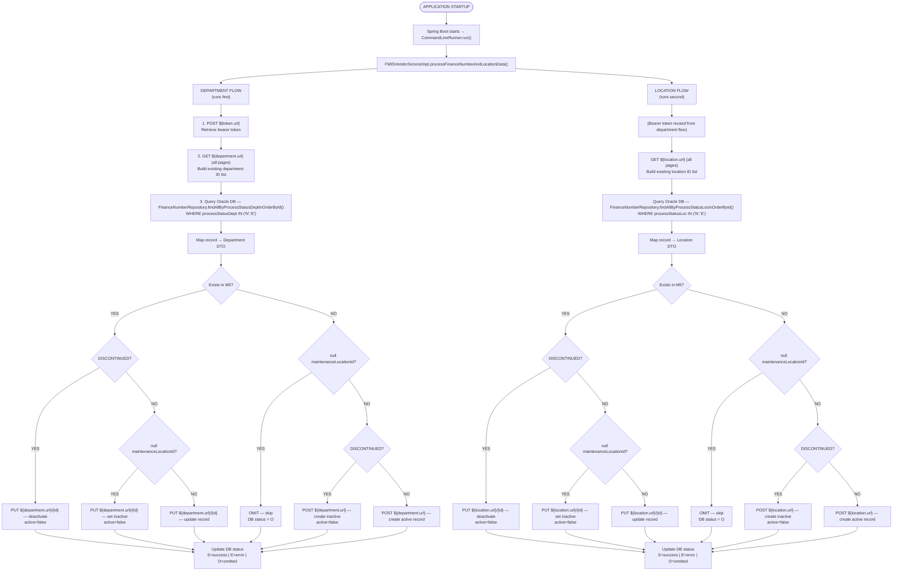

# Ifmis Department Location Service Out — Detailed Flow Documentation

## Table of Contents

1. [Overview](#1-overview)
2. [Glossary & Key Terminology](#2-glossary--key-terminology)
3. [Architecture & Technology Stack](#3-architecture--technology-stack)
    - [Key Classes](#key-classes)
4. [Configuration & Environment Variables](#4-configuration--environment-variables)
    - [Database](#database)
    - [M5 / AssetWorks API](#m5--assetworks-api)
    - [Proxy](#proxy)
    - [Security](#security)
    - [API Endpoints (Relative Paths)](#api-endpoints-relative-paths)
    - [Jasypt Encryption](#jasypt-encryption)
5. [Application Startup](#5-application-startup)
6. [Authentication — Token API](#6-authentication--token-api)
    - [API Call](#api-call)
    - [Response Handling](#response-handling)
    - [When It's Called](#when-its-called)
    - [Error Handling](#error-handling)
7. [Department Processing Flow](#7-department-processing-flow)
    - [Step 1: Fetch All Existing Departments from M5](#step-1-fetch-all-existing-departments-from-m5)
    - [Step 2: Query Pending Records from Database](#step-2-query-pending-records-from-database)
    - [Step 3: Process Each Finance Number Record](#step-3-process-each-finance-number-record)
    - [Step 4: Handle Errors](#step-4-handle-errors)
8. [Location Processing Flow](#8-location-processing-flow)
    - [Step 1: Query Pending Location Records from Database](#step-1-query-pending-location-records-from-database)
    - [Step 2: Map FinanceNumber to Location Object](#step-2-map-financenumber-to-location-object)
    - [Step 3: Send Location Data to M5 API](#step-3-send-location-data-to-m5-api)
    - [Step 4: Decision Logic for Location Processing](#step-4-decision-logic-for-location-processing)
    - [Step 5: Error Handling and Retry Logic](#step-5-error-handling-and-retry-logic)
    - [Step 6: Update Database with Processing Results](#step-6-update-database-with-processing-results)
9. [Database Table & Entity](#9-database-table--entity)
    - [Table: `IFMIS_FINANCE_NUMBER_T`](#table-ifmis_finance_number_t)
    - [Entity: `FinanceNumber`](#entity-financenumber)
    - [Repository: `FinanceNumberRepository`](#repository-financenumberrepository)
10. [Data Mapping (MapStruct)](#10-data-mapping-mapstruct)
    - [Department Mapping (`DepartmentMapper`)](#department-mapping-departmentmapper)
    - [Location Mapping (`LocationMapper`)](#location-mapping-locationmapper)
11. [API Endpoints Summary](#11-api-endpoints-summary)
    - [All API calls go to the AssetWorks (AW/M5) system](#all-api-calls-go-to-the-assetworks-awm5-system)
    - [Request/Response Format](#requestresponse-format)
    - [Sample JSON Payloads](#sample-json-payloads)
12. [Error Handling & Status Tracking](#12-error-handling--status-tracking)
    - [Error Handling Strategy](#error-handling-strategy)
    - [What Happens on Error](#what-happens-on-error)
    - [Retry Mechanism](#retry-mechanism)
    - [Validation](#validation)
    - [Logging and Monitoring](#logging-and-monitoring)
13. [WebClient & Proxy Configuration Details](#13-webclient--proxy-configuration-details)
    - [Proxy](#proxy)
    - [Memory Buffer](#memory-buffer)
    - [How It Works](#how-it-works)
    - [External API Integration](#external-api-integration)
    - [Error Handling](#error-handling)
14. [Legacy / Unused Classes](#14-legacy--unused-classes)
    - [`FMISServiceConnector`](#fmisserviceconnector)
    - [`CacheConfiguration`](#cacheconfiguration)
    - [`CacheServiceImpl`](#cacheserviceimpl)
    - [`LocationMapper`](#locationmapper)
    - [`DepartmentMapper`](#departmentmapper)
    - [`LocationDeactivate`](#locationdeactivate)
    - [`OrgLevel` and `OrgLevelRes`](#orglevel-and-orglevelres)
    - [`OrgLevels`](#orglevels)
    - [`LocationUpdate`](#locationupdate)
    - [`ModelHelper`](#modelhelper)
15. [End-to-End Flow Diagram](#15-end-to-end-flow-diagram)
16. [Key Business Rules Summary](#16-key-business-rules-summary)
17. [AssetWorks API Call Audit](#17-assetworks-api-call-audit)
    - [Base URL](#base-url)
    - [Authentication](#authentication)
    - [POST Calls — Data Push to AssetWorks](#post-calls--data-push-to-assetworks)
    - [PUT Calls — Data Updates to AssetWorks](#put-calls--data-updates-to-assetworks)
    - [Call Frequency and Filtering](#call-frequency-and-filtering)
    - [Error Handling and Retry Logic](#error-handling-and-retry-logic)
---

## 1. Overview
The **IFMIS Department & Location Outbound Service** is a **Spring Boot application** designed to synchronize department and location data **from an Oracle database to the M5/AssetWorks (AW) system** via REST API calls. This service operates as an outbound integration layer, processing finance numbers and their associated department and location data, and pushing them to external systems for further processing.

**Key characteristics:**

- It is a **web-enabled service** running on port `8081` as defined in `application.properties`.
- The service integrates with the FMIS API and M5 API to process and push department and location data.
- It handles **Departments**, **Locations**, **Accounts**, and **Billing Accounts** in separate processing flows.
- Records are read from the `FinanceNumber` entity, which maps to the `IFMIS_FINANCE_NUMBER_T` Oracle table.
- Each record is processed based on specific business rules, which determine whether the record is **created**, **updated**, or **skipped** in M5.
- Processing status is tracked per-record in the database using specific fields (`processStatusDept` and `processStatusLoc`).
- The service uses caching mechanisms to store and retrieve authentication tokens for API calls.
- It supports secure communication with external APIs using encrypted credentials and token-based authentication.
- The service is containerized using Docker and can be deployed in a Kubernetes environment.

**Core functionalities:**

1. **Department Data Processing**: 
   - Reads department data from the database.
   - Validates and maps the data to the `Department` object.
   - Sends the data to the M5 API for creation or update.

2. **Location Data Processing**: 
   - Retrieves location data from the database.
   - Maps the data to the `Location` object.
   - Sends the data to the M5 API for creation or update.

3. **Account Creation**:
   - Connects to the Token API to retrieve authentication tokens.
   - Uses the tokens to create accounts in the M5 API.

4. **Billing Account Assignment**:
   - Assigns billing accounts to finance numbers by interacting with the M5 API.

**External integrations:**

- **FMIS API**: Used for retrieving and processing department and location data.
- **M5 API**: Used for creating, updating, and managing department, location, account, and billing account data.
- **Token API**: Used for retrieving authentication tokens required for secure communication with the M5 API.

**Configuration highlights:**

- **Database Connection**: Configured to connect to an Oracle database using `spring.datasource.url`, `spring.datasource.username`, and `spring.datasource.password`.
- **API Endpoints**: Configured for FMIS and M5 APIs using properties such as `fmisapi.url`, `token.url`, `department.url`, and `location.url`.
- **Caching**: Implements caching for authentication tokens using `CacheServiceImpl`.
- **Security**: Uses Jasypt encryption for sensitive properties and enables management endpoint security with roles and credentials.

This service is a critical component of the USPS system, ensuring accurate and timely synchronization of department and location data with external systems to support operational and financial processes.

---

## 2. Glossary & Key Terminology
| Term                | Full Name                                   | Description                                                                 |
|---------------------|---------------------------------------------|-----------------------------------------------------------------------------|
| **IFMIS**           | Integrated Fleet Management Information System | The USPS fleet management system that serves as the source of department and location data. |
| **M5**              | M5 / AssetWorks                            | The target third-party asset management system that receives department and location data from IFMIS. |
| **AW**              | AssetWorks                                 | Synonym for M5 — the vendor/product name of the target system.              |
| **Finance Number**  | —                                           | A unique identifier in the IFMIS system representing a department or location unit. It is mapped to `departmentId` and `locationCode` in M5. |
| **VMF**             | Vehicle Maintenance Facility               | Referred to in code comments as "VMF Facility" — corresponds to the `maintenanceLocationId` field in the database. If null or blank, the record may be omitted or deactivated. |
| **Org Levels**      | Organization Levels                        | A hierarchical structure (division → area → district) attached to departments in M5. These levels are set based on the department's attributes. |
| **Outbound**        | —                                           | Indicates that data flows **out** from IFMIS (Oracle DB) **to** M5 (AssetWorks API). This service is responsible for outbound data processing. |
| **Batch**           | —                                           | The application operates as a batch job — it processes all pending records in a single run and then exits. It does not expose HTTP endpoints for runtime interaction. |
| **Process Status**  | —                                           | A flag in the database indicating the processing state of a record: `N` (New), `E` (Error), `S` (Success), `O` (Omitted). |
| **Bearer Token**    | —                                           | An OAuth-style authentication token obtained from the M5 Token API. It is included in the `Authorization: Bearer <token>` header for all subsequent API calls. |
| **HikariCP**        | —                                           | A high-performance JDBC connection pool used for managing Oracle database connections efficiently. |
| **MapStruct**       | —                                           | A compile-time code generation library used to map fields between `FinanceNumber` entities and `Department`/`Location` DTOs. |
| **WebClient**       | —                                           | Spring WebFlux's non-blocking HTTP client, used in this service in blocking mode (`.block()`) for synchronous API calls. |

---

## 3. Architecture & Technology Stack

| Component              | Technology                                                                 |
|------------------------|---------------------------------------------------------------------------|
| **Framework**          | Spring Boot (`CommandLineRunner`)                                        |
| **HTTP Client**        | Spring WebFlux `WebClient` (reactive, used in blocking mode via `.block()`) |
| **Database**           | Oracle (via Spring Data JPA + Hibernate)                                 |
| **Connection Pool**    | HikariCP                                                                 |
| **Object Mapping**     | Custom mapping logic (manual mapping in service classes)                 |
| **Proxy**              | Configurable HTTP proxy via application properties                       |
| **Caching**            | Spring Cache with Caffeine (30-minute TTL for token caching)             |
| **Logging**            | SLF4J with structured error logging                                      |
| **Build**              | Maven                                                                    |
| **Containerization**   | Docker (Java 17 JRE base image)                                          |

### Key Classes

| Class                                      | Role                                                                 |
|-------------------------------------------|----------------------------------------------------------------------|
| `IfmsDepartmentAndLocationOutboundServiceApplication` | Entry point — implements `CommandLineRunner`                         |
| `FMISVendorServiceImpl`                   | Orchestrator — coordinates department and location data processing   |
| `DepartmentServiceImpl`                   | Handles all department data processing and integration with M5 API   |
| `LocationServiceImpl`                     | Handles all location data processing and integration with M5 API     |
| `M5ServiceImpl`                           | Low-level HTTP client — token authentication, POST/PUT to M5 API     |
| `CacheServiceImpl`                        | Token caching and retrieval using Spring Cache and Caffeine          |
| `FinanceNumberRepository`                 | Spring Data JPA repository for querying `FinanceNumber` entities     |
| `DepartmentMapper`                        | Maps `FinanceNumber` entities to `Department` objects                |
| `LocationMapper`                          | Maps `FinanceNumber` entities to `Location` objects                  |
| `FMISAPIConfig`                           | Configures `WebClient` with proxy settings and memory limits         |
| `AppConfig`                               | Configures JPA auditing                                              |
| `CacheConfiguration`                      | Configures Caffeine cache for token caching                          |
| `FMISServiceConnector`                    | Legacy/unused connector class for FMIS API (not actively used)       |

---

## 4. Configuration & Environment Variables
Configuration is defined in `application.properties` and injected via environment variables:

### Database

| Property                              | Env Variable         | Description                                      |
|---------------------------------------|----------------------|--------------------------------------------------|
| `spring.datasource.url`               | `DB_CONNECTION_STRING` | Oracle JDBC connection string                   |
| `spring.datasource.username`          | `DB_USERNAME`        | Database username                               |
| `spring.datasource.password`          | `DB_PASSWORD`        | Database password                               |
| `spring.datasource.driver`            | —                    | JDBC driver class (`oracle.jdbc.driver.OracleDriver`) |
| `spring.jpa.database-platform`        | —                    | Hibernate dialect (`org.hibernate.dialect.OracleDialect`) |
| `spring.jpa.properties.hibernate.default_schema` | `DB_SCHEMA` | Oracle schema name                             |
| `spring.jpa.hibernate.use-new-id-generator-mappings` | — | Hibernate ID generator mappings (default: `false`) |
| `spring.jpa.hibernate.ddl`            | —                    | Hibernate DDL auto setting (`update`)           |
| `spring.jpa.properties.hibernate.jdbc.time_zone` | — | Database timezone (`America/Chicago`)           |
| `spring.datasource.hikari.minimumIdle` | —                   | Minimum number of idle connections in the pool (`5`) |
| `spring.datasource.hikari.maximumPoolSize` | —               | Maximum number of connections in the pool (`20`) |
| `spring.datasource.hikari.idleTimeout` | —                   | Maximum idle time for connections (`30000` ms)  |
| `spring.datasource.hikari.maxLifetime` | —                   | Maximum lifetime of connections (`2000000` ms)  |
| `spring.datasource.hikari.connectionTimeout` | —              | Maximum time to wait for a connection (`30000` ms) |
| `spring.datasource.hikari.poolName`   | —                    | Name of the Hikari connection pool (`HikariPoolBooks`) |

### M5 / AssetWorks API

| Property                     | Env Variable         | Description                                      |
|------------------------------|----------------------|--------------------------------------------------|
| `fmisapi.url`                | `AW_CONNECTION_STRING` | Base URL for the AssetWorks API                |
| `fmisapi.user`               | `AW_USERNAME`        | API username for token authentication           |
| `fmisapi.password`           | `AW_PASSWORD`        | API password for token authentication           |
| `token.url`                  | —                    | Auto-constructed as `{AW_CONNECTION_STRING}/api/token` |
| `token.site`                 | `AW_SITE`            | Site identifier for token authentication        |
| `fmisapi.endpoint.page.count`| `AW_PAGE_COUNT`      | Page size for GET calls (default: `1000`)       |

### Proxy

| Property             | Env Variable         | Description                                      |
|----------------------|----------------------|--------------------------------------------------|
| `api.proxy.enabled`  | —                    | Enable/disable HTTP proxy (default: `true`)     |
| `api.proxy.host`     | `USPS_HTTP_PROXY_HOST` | Proxy hostname                                 |
| `api.proxy.port`     | `USPS_HTTP_PROXY_PORT` | Proxy port                                     |

### Security

| Property                     | Env Variable | Description                                      |
|------------------------------|--------------|--------------------------------------------------|
| `security.basic.enabled`     | —            | Enable/disable basic security (default: `true`) |
| `security.user.name`         | —            | Username for basic security (`admin`)           |
| `security.user.password`     | —            | Password for basic security (`admin`)           |
| `management.security.enabled`| —            | Enable/disable management security (default: `true`) |
| `management.security.roles`  | —            | Roles allowed for management endpoints (`ADMIN`) |
| `management.endpoints.web.exposure.include` | — | List of exposed management endpoints (`*`)      |

### API Endpoints (Relative Paths)

| Property               | Value                  | Description                                      |
|------------------------|------------------------|--------------------------------------------------|
| `department.url`       | `/api/v1/departments` | Relative path for department API                |
| `location.url`         | `/api/v1/locations`   | Relative path for location API                  |
| `account.api.url`      | `/api/v1/accounts/`   | Relative path for account API                   |
| `billing.account.api.url` | `/api/v1/billingdepartmentaccounts` | Relative path for billing account API |

### Jasypt Encryption

| Property                     | Env Variable | Description                                      |
|------------------------------|--------------|--------------------------------------------------|
| `jasypt.encryptor.algorithm` | —            | Encryption algorithm (`PBEWithMD5AndDES`)       |

---

## 5. Application Startup
```
main()
  └──> SpringApplication.run(IfmsDepartmentAndLocationOutboundServiceApplication.class, args)
         └──> CommandLineRunner.run(String... args)
                ├──> FMISVendorServiceImpl.processFinanceNumberAndLocationData()
                │      ├──> DepartmentServiceImpl.sendDepartmentDataToM5()
                │      │      └──> FinanceNumberRepository.findAllByProcessStatusDeptInOrderById()
                │      │             └──> M5Service.postData(M5Request request, String uri)
                │      └──> LocationServiceImpl.sendLocationDataToM5()
                │             └──> FinanceNumberRepository.findAllByProcessStatusLocInOrderById()
                │                    └──> M5Service.postData(M5Request request, String uri)
                ├──> FMISVendorServiceImpl.processFinanceNumbersAndCreateAccounts()
                │      └──> M5Service.connectToTokenApi()
                └──> FMISVendorServiceImpl.processFinanceNumbersAndAssignBillingAccounts()
```

**Step-by-step:**

1. The `main()` method in the `IfmsDepartmentAndLocationOutboundServiceApplication` class is the entry point of the application. It initializes the Spring Boot application by invoking `SpringApplication.run()` with the application class and command-line arguments.
2. Spring Boot starts the application, initializing all required beans, including:
   - Database connection pool (configured using HikariCP with properties such as `spring.datasource.hikari.minimumIdle`, `spring.datasource.hikari.maximumPoolSize`, etc.).
   - JPA repositories, including `FinanceNumberRepository`.
   - Services such as `FMISVendorServiceImpl`, `DepartmentServiceImpl`, `LocationServiceImpl`, `CacheServiceImpl`, and `M5ServiceImpl`.
   - WebClient for external API calls, configured with optional proxy settings (`api.proxy.enabled`, `api.proxy.host`, `api.proxy.port`).
   - Cache configuration (`spring-boot-starter-cache`).
   - Security settings (`security.user.name`, `security.user.password`, etc.).
3. After the application context is initialized, the `CommandLineRunner.run()` method is automatically invoked.
4. The `CommandLineRunner.run()` method delegates to `FMISVendorServiceImpl.processFinanceNumberAndLocationData()` to start the main processing flow.
5. Inside `FMISVendorServiceImpl.processFinanceNumberAndLocationData()`:
   - The `DepartmentServiceImpl.sendDepartmentDataToM5()` method is called to process department data:
     - It retrieves finance numbers with specific department process statuses using `FinanceNumberRepository.findAllByProcessStatusDeptInOrderById()`.
     - The retrieved finance numbers are validated, mapped to `Department` objects, and sent to the M5 API using `M5Service.postData(M5Request request, String uri)`.
   - The `LocationServiceImpl.sendLocationDataToM5()` method is called to process location data:
     - It retrieves finance numbers with specific location process statuses using `FinanceNumberRepository.findAllByProcessStatusLocInOrderById()`.
     - The retrieved finance numbers are validated, mapped to `Location` objects, and sent to the M5 API using `M5Service.postData(M5Request request, String uri)`.
6. After processing department and location data, the `FMISVendorServiceImpl.processFinanceNumbersAndCreateAccounts()` method is invoked:
   - It connects to the Token API using `M5Service.connectToTokenApi()` to retrieve an authentication token.
   - The token is used for subsequent account creation operations.
7. Finally, the `FMISVendorServiceImpl.processFinanceNumbersAndAssignBillingAccounts()` method is invoked:
   - It assigns billing accounts for processed finance numbers.
8. Each processing step is wrapped in its own try/catch block to ensure that failures in one step do not prevent subsequent steps from executing.
9. After all processing is complete, the application logs the total record count and exits.

---

## 6. Authentication — Token API
Before any data can be fetched or sent to the M5 API, the service must authenticate by retrieving a token from the Token API. This token is required for all subsequent API calls to the M5 system.

### API Call

| Attribute         | Value                                   |
|-------------------|-----------------------------------------|
| **Method**        | `POST`                                 |
| **URL**           | `${AW_CONNECTION_STRING}/api/token`    |
| **Content-Type**  | `application/x-www-form-urlencoded`    |
| **Request Body**  | `grant_type=client_credentials&client_id=<AW_USERNAME>&client_secret=<AW_PASSWORD>&site=<AW_SITE>` |

### Response Handling

```
Response JSON:
{
  "access_token": "<bearer-token-string>",
  "token_type": "Bearer",
  "expires_in": 3600
}
```

- If the response contains the `access_token` field, its value is extracted and stored in the cache using the `CacheServiceImpl.findByToken(String name)` method.
- The token is cached with a key that corresponds to the `site` parameter used in the request.
- The cached token is retrieved for subsequent API calls to avoid redundant authentication requests.

### When It's Called

- **Department Data Processing Flow**: The token is retrieved before sending department data to the M5 API. The `CacheServiceImpl.findByToken(String name)` method is used to check if the token is already cached. If not, the `M5Service.connectToTokenApi()` method is invoked to fetch a new token.
- **Location Data Processing Flow**: The token is reused from the cache if it was already fetched during the department data processing flow. If the token is not available in the cache, the `M5Service.connectToTokenApi()` method is called to retrieve it.

### Error Handling

- If an exception occurs during the token retrieval process in `CacheServiceImpl.findByToken(String name)`, the service logs an error and throws an `ApplicationException`.
- If the `M5Service.connectToTokenApi()` method fails to retrieve a token, it returns `false`. In this case, the `FMISVendorServiceImpl.processFinanceNumbersAndCreateAccounts()` method logs a critical error and terminates the account creation process.

---

## 7. Department Processing Flow
**Entry point:** `DepartmentServiceImpl.sendDepartmentDataToM5()`

### Step 1: Fetch All Existing Departments from M5

| Attribute | Value |
|-----------|-------|
| **Method** | `GET` |
| **URL** | `${fmisapi.url}${department.url}?&cacheBust=true&$skip=0&$top=${fmisapi.endpoint.page.count}` |
| **Auth** | Bearer token |

- The response is paginated. The service checks for a `nextPage` URL in each response and continues fetching until there are no more pages.
- Response JSON structure:
  ```json
  {
    "httpStatusCode": "OK",
    "items": [ { "departmentId": "...", "active": true, ... }, ... ],
    "nextPage": "https://...next-page-url..."
  }
  ```
- Each item is deserialized into a `Departments` object.
- **Purpose:** This list is used to determine whether a finance number already exists as a department in M5 (update) or not (create).

### Step 2: Query Pending Records from Database

```sql
SELECT * FROM IFMIS_FINANCE_NUMBER_T 
WHERE PROCESS_STATUS_DEPT IN ('N', 'E') 
ORDER BY id
```

- `N` = New (never processed)
- `E` = Error (previously failed, retrying)

### Step 3: Process Each Finance Number Record

For **each** `FinanceNumber` record:

1. **Map** `FinanceNumber` → `Department` using MapStruct (`DepartmentMapper`):

   | FinanceNumber Field       | Department Field       | Notes                              |
   |---------------------------|------------------------|------------------------------------|
   | `id.financeNumber`        | `deptNumber`           | Primary identifier                |
   | `financeName`             | `description`          | Truncated to 32 characters        |
   | `financeStatus`           | `active`               | `"ACTIVE"` → `true`, else `false` |
   | `deliveryLocationId`      | `deliveryLocationId`   |                                    |
   | `maintenanceLocationId`   | `maintLocation`        |                                    |
   | `billingCode`             | `billingCode`          |                                    |
   | `notes`                   | `notes` (workOrderComment) |                                |

2. **Build Org Levels** (3 levels):

   | Level Number | Source Field |
   |--------------|--------------|
   | Level 1      | `orgLevel3`  |
   | Level 2      | `orgLevel2`  |
   | Level 3      | `orgLevel1`  |

   > Note: The level numbers are mapped in reverse order (orgLevel3 → levelNum 1, etc.).

3. **Validate Department Data**:
   - **Condition**: `financeNumber.getFinanceStatus().equalsIgnoreCase("DISCONTINUED") || financeNumber.getMaintenanceLocationId() == null || financeNumber.getMaintenanceLocationId().trim().isEmpty()`
     - **True-Branch Action**: Skip setting organization levels for the department and truncate the department description to a maximum of 32 characters.
     - **False-Branch Action**: Set organization levels for the department.

4. **Send Data to M5**:
   - **Method**: `M5Service.postData(M5Request request, String uri)`
   - **URL**: `${fmisapi.url}${department.url}`
   - **Request Body**:
     ```json
     {
       "deptNumber": "...",
       "description": "...",
       "active": true,
       "deliveryLocationId": "...",
       "maintLocation": "...",
       "billingCode": "...",
       "notes": "...",
       "orgLevels": [
         { "levelNum": 1, "orgLevel": "..." },
         { "levelNum": 2, "orgLevel": "..." },
         { "levelNum": 3, "orgLevel": "..." }
       ]
     }
     ```
   - **Response**:
     ```json
     {
       "httpStatusCode": "OK",
       "message": "Department created successfully",
       "departmentId": "..."
     }
     ```
   - **Error Handling**:
     - If the response status code is not `200 OK`, log the error and retry the operation.
     - If retries fail, update the `PROCESS_STATUS_DEPT` field in the database to `E` (Error).

5. **Update Database**:
   - **Query**:
     ```sql
     UPDATE IFMIS_FINANCE_NUMBER_T 
     SET PROCESS_STATUS_DEPT = 'P' 
     WHERE ID = :id
     ```
   - **Parameters**:
     - `id`: Primary key of the processed `FinanceNumber` record.
   - **Purpose**: Marks the record as processed (`P`) to prevent reprocessing.

### Step 4: Handle Errors

- **Token Retrieval Error**:
  - **Condition**: Exception occurs during token retrieval in `CacheServiceImpl.findByToken(String name)`.
    - **True-Branch Action**: Log an error and throw an `ApplicationException`.

- **Token API Connection Failure**:
  - **Condition**: `M5Service.connectToTokenApi()` returns `false` in `FMISVendorServiceImpl.processFinanceNumbersAndCreateAccounts()`.
    - **True-Branch Action**: Log a critical error and terminate the department processing flow.

- **M5 API Error**:
  - **Condition**: M5 API returns a non-200 HTTP status code during `M5Service.postData()`.
    - **True-Branch Action**: Log the error, retry the operation, and update the database with `PROCESS_STATUS_DEPT = 'E'` if retries fail.

---

## 8. Location Processing Flow
**Entry point:** `LocationServiceImpl.sendLocationDataToM5()`

The location processing flow is responsible for retrieving location data from the database, mapping it to the `Location` object, and sending it to the M5 API for creation or update. This flow includes querying the database for finance numbers with specific process statuses, mapping the data to the required format, and interacting with the M5 API.

### Step 1: Query Pending Location Records from Database

The first step in the location processing flow is to retrieve finance numbers from the database that have pending location process statuses. This is done using the `FinanceNumberRepository.findAllByProcessStatusLocInOrderById()` method.

| Attribute         | Value                                                                 |
|-------------------|-----------------------------------------------------------------------|
| **Class**         | `FinanceNumberRepository`                                            |
| **Method**        | `findAllByProcessStatusLocInOrderById()`                             |
| **Query Type**    | JPA Query                                                            |
| **SQL Query**     | `SELECT * FROM IFMIS_FINANCE_NUMBER_T WHERE PROCESS_STATUS_LOC IN ('N', 'E') ORDER BY id` |
| **Parameters**    | `List<String> processStatus`                                         |
| **Return Type**   | `List<FinanceNumber>`                                                |
| **Purpose**       | Retrieves finance numbers with location process statuses of `'N'` (new) or `'E'` (error) for further processing. |

### Step 2: Map FinanceNumber to Location Object

The retrieved `FinanceNumber` entities are mapped to `Location` objects using the `LocationMapper` class. This mapping involves transforming fields from the `FinanceNumber` entity to the corresponding fields in the `Location` object.

| FinanceNumber Field     | Location Field               | Conversion Logic                                   |
|--------------------------|------------------------------|--------------------------------------------------|
| `id.financeNumber`       | `locationCode`              | Direct mapping                                   |
| `id.financeNumber`       | `departmentId`              | Same as `locationCode`                          |
| `financeName`            | `description`               | Truncated to a maximum of 32 characters         |
| `financeStatus`          | `active`                    | `"ACTIVE"` → `true`, `"DISCONTINUED"` → `false` |
| `deliveryLocation`       | `isDelivery`                | `"Y"` → `true`, `"N"` → `false`                 |
| `fuelLocation`           | `isFuel`                    | `"Y"` → `true`, `"N"` → `false`                 |
| `invLocation`            | `isInventory`               | `"Y"` → `true`, `"N"` → `false`                 |
| `maintLocation`          | `isMaintenance`             | `"Y"` → `true`, `"N"` → `false`                 |
| `motorPoolLocation`      | `isPool`                    | `"Y"` → `true`, `"N"` → `false`                 |
| `parkingLocation`        | `isParking`                 | `"Y"` → `true`, `"N"` → `false`                 |
| `stateCode`              | `state`                     | Direct mapping                                   |
| `zipCode`                | `zipCode`                   | Direct mapping                                   |
| `city`                   | `city`                      | Direct mapping                                   |
| `timezone`               | `timeZoneId`                | Default value: `"PST"`                          |
| `timeReporting`          | `timeReportingGranularity`  | Default value: `"HUNDREDTHS"`                   |
| `timeRounding`           | `timeRoundingUnit`          | Default value: `100`                            |

### Step 3: Send Location Data to M5 API

Once the `Location` objects are mapped, they are sent to the M5 API for creation or update. This is handled by the `M5ServiceImpl.postData()` and `M5ServiceImpl.putData()` methods.

#### API Call: Create Location in M5

| Attribute         | Value                                                                 |
|-------------------|-----------------------------------------------------------------------|
| **HTTP Method**   | `POST`                                                               |
| **URL**           | `${fmisapi.url}${location.url}`                                      |
| **Request Body**  | `Location` object serialized as JSON                                 |
| **Response Type** | `Mono<M5Response>`                                                   |
| **Purpose**       | Creates a new location in the M5 system.                             |

#### API Call: Update Location in M5

| Attribute         | Value                                                                 |
|-------------------|-----------------------------------------------------------------------|
| **HTTP Method**   | `PUT`                                                                |
| **URL**           | `${fmisapi.url}${location.url}/{locationCode}`                       |
| **Request Body**  | `Location` object serialized as JSON                                 |
| **Response Type** | `Mono<M5Response>`                                                   |
| **Purpose**       | Updates an existing location in the M5 system.                       |

### Step 4: Decision Logic for Location Processing

The following decision logic is applied during the location processing flow:

#### Decision 1: Check if Finance Number Exists in M5 Locations
- **Condition**: Is the finance number found in the M5 locations list?
  - **True-Branch Action**: Proceed to update the location in M5.
  - **False-Branch Action**: Create a new location in M5.

#### Decision 2: Handle Discontinued Finance Numbers
- **Condition**: `financeNumber.getFinanceStatus().equalsIgnoreCase("DISCONTINUED")`
  - **True-Branch Action**: Use the `LocationDeactivate` DTO to deactivate the location in M5. This involves sending fewer fields and omitting state and timezone information.
  - **False-Branch Action**: Proceed with normal location creation or update.

#### Decision 3: Handle Missing Maintenance Location ID
- **Condition**: `financeNumber.getMaintenanceLocationId() == null || financeNumber.getMaintenanceLocationId().trim().isEmpty()`
  - **True-Branch Action**: Skip processing the location and log a warning.
  - **False-Branch Action**: Continue processing the location.

### Step 5: Error Handling and Retry Logic

#### Error Handling
- **Scenario**: API call to M5 fails.
  - **Action**: Log the error and retry the API call up to a configured number of times.

#### Retry Logic
- **Configuration**: Retry count and delay are configurable via application properties.
  - `fmisapi.client.maxmemory`: Maximum memory allocated for API client.
  - `fmisapi.endpoint.page.count`: Number of records fetched per page.

### Step 6: Update Database with Processing Results

After successfully creating or updating locations in the M5 API, the database is updated to reflect the new process status of the finance numbers. This ensures that the same records are not processed again in subsequent runs.

| Attribute         | Value                                                                 |
|-------------------|-----------------------------------------------------------------------|
| **Class**         | `FinanceNumberRepository`                                            |
| **Method**        | Custom JPA save method                                               |
| **SQL Query**     | `UPDATE IFMIS_FINANCE_NUMBER_T SET PROCESS_STATUS_LOC = 'P' WHERE id = :id` |
| **Parameters**    | `id` (Primary key of the finance number record)                      |
| **Return Type**   | `void`                                                               |
| **Purpose**       | Updates the process status of the finance number to `'P'` (processed).|

This concludes the location processing flow.

---

## 9. Database Table & Entity

### Table: `IFMIS_FINANCE_NUMBER_T`

This is the **source table** containing all finance number records to be processed. It is accessed via the `FinanceNumberRepository` interface using JPA queries. The table contains information about finance numbers, their statuses, associated departments, and locations. The data in this table is used to push department and location information to external APIs such as FMIS and M5.

| Column                  | Java Field                     | Type   | Description                                                                 |
|-------------------------|--------------------------------|--------|-----------------------------------------------------------------------------|
| `FINANCE_NUMBER`        | `id.financeNumber`            | String (PK) | The finance number — used as both department ID and location code.         |
| `BATCH_ID`              | `id.batchId`                  | int (PK) | Batch identifier (composite key).                                          |
| `FINANCE_STATUS`        | `financeStatus`               | String | `"ACTIVE"` or `"DISCONTINUED"`. Indicates the current status of the finance number. |
| `FINANCE_NAME`          | `financeName`                 | String | Name/description of the finance number.                                    |
| `BILLING_CODE`          | `billingCode`                 | String | Billing code for the department.                                           |
| `MAINT_LOCATION`        | `maintLocation`               | String | Maintenance location flag (`Y`/`N`).                                       |
| `MAINT_LOCATION_ID`     | `maintenanceLocationId`       | String | **Critical field** — if null/blank, records may be omitted or deactivated. |
| `DELIVERY_LOCATION_ID`  | `deliveryLocationId`          | String | Delivery location identifier.                                              |
| `DELIVERY_LOCATION`     | `deliveryLocation`            | String | Delivery location flag (`Y`/`N`).                                          |
| `ORG_LEVEL_1`           | `orgLevel1`                   | String | Organization level 1 value.                                                |
| `ORG_LEVEL_2`           | `orgLevel2`                   | String | Organization level 2 value.                                                |
| `ORG_LEVEL_3`           | `orgLevel3`                   | String | Organization level 3 value.                                                |
| `ORG_LEVEL_1_DESC`      | `orgLevel1Description`        | String | Org level 1 description.                                                   |
| `ORG_LEVEL_2_DESC`      | `orgLevel2Description`        | String | Org level 2 description.                                                   |
| `ORG_LEVEL_3_DESC`      | `orgLevel3Description`        | String | Org level 3 description.                                                   |
| `INV_LOCATION`          | `invLocation`                 | String | Inventory location flag (`Y`/`N`).                                         |
| `TIMEZONE`              | `timezone`                   | String | Timezone code.                                                             |
| `STATE_CODE`            | `stateCode`                  | String | US state code.                                                             |
| `FUEL_LOCATION`         | `fuelLocation`               | String | Fuel location flag (`Y`/`N`).                                              |
| `PARKING_LOCATION`      | `parkingLocation`            | String | Parking location flag (`Y`/`N`).                                           |
| `MOTOR_POOL_LOCATION`   | `motorPoolLocation`          | String | Motor pool location flag (`Y`/`N`).                                        |
| `TIME_REPORTING_LOCATION` | `timeReportingLocation`    | String | Time reporting location flag (`Y`/`N`).                                    |

---

### Entity: `FinanceNumber`

The `FinanceNumber` entity represents the `IFMIS_FINANCE_NUMBER_T` table in the database. It is used to map database records to Java objects for processing within the service. The entity includes a composite primary key (`FinanceNumberPK`) and various fields corresponding to the table columns.

#### Fields:
- **`id`** (`FinanceNumberPK`): Composite primary key containing `financeNumber` and `batchId`.
- **`financeStatus`** (`String`): Indicates the status of the finance number (`"ACTIVE"` or `"DISCONTINUED"`).
- **`financeName`** (`String`): Name or description of the finance number.
- **`billingCode`** (`String`): Billing code associated with the department.
- **`maintLocation`** (`String`): Maintenance location flag (`Y`/`N`).
- **`maintenanceLocationId`** (`String`): Maintenance location identifier. Critical for determining whether records are omitted or deactivated.
- **`deliveryLocationId`** (`String`): Delivery location identifier.
- **`deliveryLocation`** (`String`): Delivery location flag (`Y`/`N`).
- **`orgLevel1`** (`String`): Organization level 1 value.
- **`orgLevel2`** (`String`): Organization level 2 value.
- **`orgLevel3`** (`String`): Organization level 3 value.
- **`orgLevel1Description`** (`String`): Description of organization level 1.
- **`orgLevel2Description`** (`String`): Description of organization level 2.
- **`orgLevel3Description`** (`String`): Description of organization level 3.
- **`invLocation`** (`String`): Inventory location flag (`Y`/`N`).
- **`timezone`** (`String`): Timezone code.
- **`stateCode`** (`String`): US state code.
- **`fuelLocation`** (`String`): Fuel location flag (`Y`/`N`).
- **`parkingLocation`** (`String`): Parking location flag (`Y`/`N`).
- **`motorPoolLocation`** (`String`): Motor pool location flag (`Y`/`N`).
- **`timeReportingLocation`** (`String`): Time reporting location flag (`Y`/`N`).

#### Composite Key: `FinanceNumberPK`
- **`financeNumber`** (`String`): The finance number, used as both department ID and location code.
- **`batchId`** (`int`): Batch identifier, part of the composite key.

#### Relationships:
- No explicit relationships (e.g., `@OneToMany`, `@ManyToOne`) are defined in the provided code.

#### Key Methods:
- **`getId()`**: Retrieves the composite primary key.
- **`setId(FinanceNumberPK id)`**: Sets the composite primary key.
- **`getFinanceStatus()`**: Retrieves the finance status.
- **`setFinanceStatus(String financeStatus)`**: Sets the finance status.
- **Other getter and setter methods**: Standard methods for accessing and modifying entity fields.

---

### Repository: `FinanceNumberRepository`

The `FinanceNumberRepository` interface provides methods for querying the `IFMIS_FINANCE_NUMBER_T` table using JPA. It is used to retrieve finance numbers based on their process statuses.

#### Methods:
- **`findAllByProcessStatusDeptInOrderById(List<String> processStatus)`**:
  - **Query**: Retrieves all finance numbers with department process statuses matching the provided list, ordered by ID.
  - **Parameters**: `List<String> processStatus` — List of department process statuses to filter by.
  - **Return Type**: `List<FinanceNumber>` — List of finance numbers matching the criteria.
  - **Purpose**: Used to fetch department-related finance numbers for processing.

- **`findAllByProcessStatusLocInOrderById(List<String> processStatus)`**:
  - **Query**: Retrieves all finance numbers with location process statuses matching the provided list, ordered by ID.
  - **Parameters**: `List<String> processStatus` — List of location process statuses to filter by.
  - **Return Type**: `List<FinanceNumber>` — List of finance numbers matching the criteria.
  - **Purpose**: Used to fetch location-related finance numbers for processing.

---

## 10. Data Mapping (MapStruct)
### Department Mapping (`DepartmentMapper`)

```
FinanceNumber                      Department (JSON to M5)
─────────────────────────          ──────────────────────────────
id.financeNumber             ───►  departmentId
financeName                  ───►  description (truncated to 32 chars)
financeStatus                ───►  active ("ACTIVE" → true, else false)
deliveryLocationId           ───►  deliveryLocationId
maintenanceLocationId        ───►  maintenanceLocationId
billingCode                  ───►  billingId
notes                        ───►  workOrderComment
orgLevel3                    ───►  orgLevels.data[0] (levelNumber: "1")
orgLevel2                    ───►  orgLevels.data[1] (levelNumber: "2")
orgLevel1                    ───►  orgLevels.data[2] (levelNumber: "3")
```

### Location Mapping (`LocationMapper`)

```
FinanceNumber                      Location (JSON to M5)
─────────────────────────          ──────────────────────────────
id.financeNumber             ───►  locationId
id.financeNumber             ───►  departmentId
financeName                  ───►  description (truncated to 32 chars)
financeStatus                ───►  active ("ACTIVE" → true, else false)
deliveryLocation ("Y"/"N")   ───►  isDelivery (true/false)
fuelLocation ("Y"/"N")       ───►  isFuel (true/false)
invLocation ("Y"/"N")        ───►  isInventory (true/false)
maintLocation ("Y"/"N")      ───►  isMaintenance (true/false)
motorPoolLocation ("Y"/"N")  ───►  isPool (true/false)
parkingLocation ("Y"/"N")    ───►  isParking (true/false)
stateCode                    ───►  state
zipCode                      ───►  zipCode
city                         ───►  city
timezone                     ───►  timeZoneId (default: "PST")
timeReporting                ───►  timeReportingGranularity (default: "HUNDREDTHS")
timeRounding                 ───►  timeRoundingUnit (default: 100)
(hardcoded)                  ───►  country = 1
```

---

## 11. API Endpoints Summary
### All API calls go to the AssetWorks (AW/M5) system

| # | Purpose                              | Method | Endpoint                  | When Called                                   |
|---|--------------------------------------|--------|---------------------------|-----------------------------------------------|
| 1 | **Authenticate**                     | `POST` | `/api/token`              | Once at the start of department processing    |
| 2 | **Create department**                | `POST` | `/api/v1/departments`     | For each new department record                |
| 3 | **Update department**                | `PUT`  | `/api/v1/departments`     | For each existing department record           |
| 4 | **Create location**                  | `POST` | `/api/v1/locations`       | For each new location record                  |
| 5 | **Update location**                  | `PUT`  | `/api/v1/locations`       | For each existing location record (update or deactivate) |

### Request/Response Format

**Request wrapper:**
```json
{
  "body": {
    // Department or Location object
  }
}
```

**Response:**
```json
{
  "status": 0,
  "message": "Success message or error description",
  "httpStatusCode": "OK",
  "body": { ... },
  "errorObject": null,
  "type": "..."
}
```

- `status == 0` → Success
- `status != 0` → Failure (error message in `message` field)

### Sample JSON Payloads

#### Token Request (POST `/api/token`)
```json
{
  "Username": "aw_service_user",
  "Password": "••••••••",
  "Site": "USPS"
}
```

#### Token Response
```json
{
  "httpStatusCode": "OK",
  "items": ["eyJhbGciOiJIUzI1NiIs...long-jwt-token..."]
}
```

#### Create Department (POST `/api/v1/departments`)
```json
{
  "body": {
    "departmentId": "12345",
    "description": "METRO DELIVERY UNIT",
    "active": true,
    "billingId": "BC001",
    "deliveryLocationId": "DL100",
    "maintenanceLocationId": "ML200",
    "workOrderComment": "Primary metro unit",
    "orgLevels": {
      "data": [
        {
          "levelId": "L1",
          "levelName": "Region",
          "levelValue": "East"
        },
        {
          "levelId": "L2",
          "levelName": "District",
          "levelValue": "Metro"
        }
      ]
    }
  }
}
```

#### Update Department (PUT `/api/v1/departments`)
```json
{
  "body": {
    "departmentId": "12345",
    "description": "METRO DELIVERY UNIT UPDATED",
    "active": false,
    "billingId": "BC001",
    "deliveryLocationId": "DL100",
    "maintenanceLocationId": "ML200",
    "workOrderComment": "Updated metro unit",
    "orgLevels": {
      "data": [
        {
          "levelId": "L1",
          "levelName": "Region",
          "levelValue": "East"
        },
        {
          "levelId": "L2",
          "levelName": "District",
          "levelValue": "Metro"
        }
      ]
    }
  }
}
```

#### Create Location (POST `/api/v1/locations`)
```json
{
  "body": {
    "locationId": "LOC001",
    "description": "Main Warehouse",
    "active": true,
    "billingId": "BC001",
    "deliveryLocationId": "DL100",
    "maintenanceLocationId": "ML200",
    "workOrderComment": "Primary warehouse location",
    "orgLevels": {
      "data": [
        {
          "levelId": "L1",
          "levelName": "Region",
          "levelValue": "East"
        },
        {
          "levelId": "L2",
          "levelName": "District",
          "levelValue": "Metro"
        }
      ]
    }
  }
}
```

#### Update Location (PUT `/api/v1/locations`)
```json
{
  "body": {
    "locationId": "LOC001",
    "description": "Main Warehouse Updated",
    "active": false,
    "billingId": "BC001",
    "deliveryLocationId": "DL100",
    "maintenanceLocationId": "ML200",
    "workOrderComment": "Updated warehouse location",
    "orgLevels": {
      "data": [
        {
          "levelId": "L1",
          "levelName": "Region",
          "levelValue": "East"
        },
        {
          "levelId": "L2",
          "levelName": "District",
          "levelValue": "Metro"
        }
      ]
    }
  }
}
```

---

## 12. Error Handling & Status Tracking

### Error Handling Strategy

- Each finance number record is processed independently within a try/catch block to ensure that errors in processing one record do not affect the processing of subsequent records.
- The service uses structured exception handling to differentiate between validation errors, API errors, and generic runtime errors.
- Specific error handling is implemented for token retrieval, API connection failures, and validation exceptions.

### What Happens on Error

1. **Finance Number Processing Errors**:
   - If an error occurs during the processing of a finance number, the record's process status is updated to `"E"` (Error).
   - The error description is truncated to **150 characters** and saved to either `ERROR_DESC_DEPT` or `ERROR_DESC_LOC` fields in the database, depending on whether the error occurred during department or location processing.
   - A structured error log is generated using `IfmisLogger.logError()` with the following properties:
     - **Error Type**: Specifies the type of error, such as `API_ERROR`, `VALIDATION_ERROR`, or `GENERIC_ERROR`.
     - **Program Type**: Indicates the program type, e.g., `Batch`.
     - **Severity Scale**: Categorizes the error severity as `HIGH` or `CRITICAL`.
     - **Record Details**: Includes the specific department or location ID involved in the error.

2. **Token Retrieval Errors**:
   - If an exception occurs during token retrieval in `CacheServiceImpl.findByToken(String name)`, the error is logged, and an `ApplicationException` is thrown.
   - The error log includes details about the token name and the exception message.

3. **API Connection Failures**:
   - If the `M5Service.connectToTokenApi()` method fails to retrieve a token, it returns `false`. This triggers a critical error log and halts the account creation process in `FMISVendorServiceImpl.processFinanceNumbersAndCreateAccounts()`.

4. **Validation Errors**:
   - Jakarta Bean Validation annotations (e.g., `@NotNull`) are used to validate mapped objects such as `Department` and `Location` before sending them to the M5 API.
   - If validation fails, a `ConstraintViolationException` is thrown, and the record's process status is updated to `"E"`.
   - Records with a `financeStatus` of `"DISCONTINUED"` or null/empty `maintenanceLocationId` are excluded from validation and handled separately.

### Retry Mechanism

- Records with a process status of `"E"` (Error) are automatically included in the next batch run. The repository methods `FinanceNumberRepository.findAllByProcessStatusDeptInOrderById()` and `FinanceNumberRepository.findAllByProcessStatusLocInOrderById()` filter records with statuses `["N", "E"]`.
- This ensures that failed records are retried in subsequent runs without manual intervention.

### Validation

- **Object Validation**:
  - The service uses Jakarta Bean Validation annotations to enforce constraints on the `Department` and `Location` objects before sending them to the M5 API.
  - Validation rules include mandatory fields such as `financeNumber`, `maintenanceLocationId`, and other required attributes.
  - If validation fails, the record is marked as `"E"` and excluded from further processing.

- **Special Cases**:
  - Records with a `financeStatus` of `"DISCONTINUED"` or null/empty `maintenanceLocationId` are not subjected to validation. Instead, they are handled with specific business rules:
    - Organization levels are skipped.
    - The department description is truncated to a maximum of 32 characters.

### Logging and Monitoring

- The service uses structured logging to capture detailed information about errors and processing status.
- Logs include:
  - Timestamp of the error.
  - Error type and severity.
  - Record-specific details such as department ID, location ID, or finance number.
  - Exception stack trace for debugging purposes.
- Logs are monitored to identify recurring issues and improve the reliability of the service.

---

## 13. WebClient & Proxy Configuration Details
The `FMISAPIConfig` class configures a single `WebClient` bean used for all HTTP communication with external APIs, including M5 and AssetWorks.

### Proxy

| Setting       | Source                  | Default |
|---------------|-------------------------|---------|
| Proxy enabled | `api.proxy.enabled`     | `true`  |
| Proxy host    | `USPS_HTTP_PROXY_HOST`  | —       |
| Proxy port    | `USPS_HTTP_PROXY_PORT`  | —       |

When `api.proxy.enabled` is set to `true`, all outbound HTTP requests are routed through the configured USPS HTTP proxy. This is required for accessing external APIs from within the USPS network.

### Memory Buffer

The WebClient's in-memory buffer size is configurable via the following property:

```
fmisapi.client.maxmemory=${API_CLIENT_MEMORY:100}
```

This sets the maximum in-memory buffer size to `100 MB` by default (calculated as `1024 * 1000 * value`). This configuration is essential for handling large paginated responses from external APIs, such as retrieving all departments or locations.

### How It Works

The `FMISAPIConfig` class defines the WebClient configuration as follows:

```java
@Bean
public WebClient webClient() {
    HttpClient client = HttpClient.create();
    if (proxyEnabled) {
        client = client.proxy(proxy -> proxy.type(Proxy.HTTP)
            .address(new InetSocketAddress(proxyHost, proxyPort)));
    }
    return WebClient.builder()
        .clientConnector(new ReactorClientHttpConnector(client))
        .exchangeStrategies(ExchangeStrategies.builder()
            .codecs(configurer -> configurer.defaultCodecs()
                .maxInMemorySize(1024 * 1000 * webClientMaxMemoryInMB))
            .build())
        .build();
}
```

#### Key Configuration Parameters:
1. **Proxy Configuration**:
   - The `proxyEnabled` flag is derived from the `api.proxy.enabled` property in `application.properties`. If set to `true`, the `HttpClient` is configured to use the proxy settings.
   - The proxy host and port are dynamically resolved from the environment variables `USPS_HTTP_PROXY_HOST` and `USPS_HTTP_PROXY_PORT`.

2. **Memory Buffer**:
   - The `webClientMaxMemoryInMB` value is derived from the `fmisapi.client.maxmemory` property in `application.properties`. This value determines the maximum in-memory buffer size for the WebClient.

3. **Exchange Strategies**:
   - The `ExchangeStrategies` are configured to set the maximum in-memory size for the WebClient's codecs. This ensures that large payloads from external APIs can be handled efficiently.

### External API Integration
The configured `WebClient` is used across the service for making HTTP requests to external APIs. The following endpoints are accessed using this WebClient:

| Endpoint Name                 | HTTP Method | Full URL / Path                     | Request Body Type       | Response Type | Purpose                                                                 |
|-------------------------------|-------------|-------------------------------------|-------------------------|---------------|-------------------------------------------------------------------------|
| Token API                     | POST        | `${token.url}`                      | `application/x-www-form-urlencoded` | `Token`       | Retrieves an authentication token for subsequent API calls.            |
| Department API                | POST        | `${fmisapi.url}${department.url}`   | `Department`            | `M5Response`  | Sends department data to the AssetWorks API.                           |
| Location API                  | POST        | `${fmisapi.url}${location.url}`     | `Location`              | `M5Response`  | Sends location data to the AssetWorks API.                             |
| Account API                   | POST        | `${fmisapi.url}${account.api.url}`  | `AccountRequest`        | `M5Response`  | Creates accounts for finance numbers in the AssetWorks system.         |
| Billing Account API           | POST        | `${fmisapi.url}${billing.account.api.url}` | `BillingAccountRequest` | `M5Response`  | Assigns billing accounts for finance numbers in the AssetWorks system. |

### Error Handling
The WebClient configuration includes error handling mechanisms to ensure robust communication with external APIs:
1. **Timeouts**:
   - Connection timeout is configured via `spring.datasource.hikari.connectionTimeout` in `application.properties` (default: `30000 ms`).
   - Maximum lifetime for connections is set via `spring.datasource.hikari.maxLifetime` (default: `2000000 ms`).

2. **Retries**:
   - Retry logic is implemented in service methods such as `M5Service.connectToTokenApi()` and `M5Service.postData()` to handle transient errors during API calls.

3. **Exception Handling**:
   - Exceptions during token retrieval or API communication are logged and wrapped in custom exceptions such as `ApplicationException` or `M5ServiceException` for consistent error reporting and handling.

---

## 14. Legacy / Unused Classes
The codebase contains some classes that are **not actively used** in the main processing flow but remain in the codebase:

### `FMISServiceConnector`

This class is a **legacy connector** that provides methods for interacting with external APIs. It includes generic methods such as `connectToApi()`, `callApi()`, and `callLinkApi()`. While the class is present in the codebase, it is **not actively used** in the current department and location outbound processing flow. The functionality provided by this class appears to have been replaced by the `M5ServiceImpl` class, which is the primary API connector for the service.

### `CacheConfiguration`

This class configures a **Caffeine-based caching mechanism** for the application. It defines cache settings such as expiration policies and maximum size. While the class is present in the codebase, it is **not actively used** in the current processing flow. The caching functionality appears to be implemented directly in the `CacheServiceImpl` class, which uses a static token variable for authentication purposes.

### `CacheServiceImpl`

This class implements the `CacheService` interface and provides methods for caching and retrieving tokens. The primary method, `findByToken(String name)`, retrieves a token from the Token API using a form-encoded POST request (`application/x-www-form-urlencoded`). However, this class is **not actively used** in the current processing flow. Instead, the active flow relies on the static `authToken` variable in the `M5ServiceImpl` class for token management.

### `LocationMapper`

This class is responsible for mapping location-related objects, such as converting between `Location` and `LocationUpdate` or other DTOs. While the class is present in the codebase, it is **not actively used** in the current processing flow. The `LocationServiceImpl` class directly handles location data processing without utilizing this mapper.

### `DepartmentMapper`

Similar to `LocationMapper`, this class is responsible for mapping department-related objects, such as converting between `Department` and `Departments` or other DTOs. However, this class is **not actively used** in the current processing flow. The `DepartmentServiceImpl` class directly handles department data processing without utilizing this mapper.

### `LocationDeactivate`

This class represents a data object for deactivating locations. It includes fields and methods for handling location deactivation requests. However, this class is **not actively used** in the current processing flow. The service does not include any logic or API calls related to location deactivation.

### `OrgLevel` and `OrgLevelRes`

These classes represent organizational level data structures. While they are defined in the codebase, they are **not actively used** in the current processing flow. The service does not include any logic or API calls that utilize these classes.

### `OrgLevels`

This class represents a collection of organizational levels. Similar to `OrgLevel` and `OrgLevelRes`, it is **not actively used** in the current processing flow. There is no evidence in the codebase that this class is utilized in any of the service's methods or logic.

### `LocationUpdate`

This class represents a data object for updating location information. It includes fields and methods for handling location update requests. However, this class is **not actively used** in the current processing flow. The service does not include any logic or API calls related to location updates.

### `ModelHelper`

This utility class provides helper methods for manipulating and transforming data models. While it is present in the codebase, it is **not actively used** in the current processing flow. The service appears to handle data transformations directly within the service implementation classes or through other utility classes like `JsonUtil`.

---

## 15. End-to-End Flow Diagram


---

## 16. Key Business Rules Summary

1. **Records with a null or blank `maintenanceLocationId` are skipped during processing**:
   - **Condition**: `financeNumber.getMaintenanceLocationId() == null || financeNumber.getMaintenanceLocationId().trim().isEmpty()`
   - **True-Branch Action**: The record is skipped, and no API call is made to the M5 system. Organization levels are not set for the department, and the department description is truncated to a maximum of 32 characters.
   - **False-Branch Action**: The record is processed, and organization levels are set for the department.

2. **Records with `financeStatus` set to `DISCONTINUED` are always processed**:
   - **Condition**: `financeNumber.getFinanceStatus().equalsIgnoreCase("DISCONTINUED")`
   - **True-Branch Action**: The record is sent to the M5 API (either for creation or update) and marked as inactive (`active = false`).
   - **False-Branch Action**: The record is processed normally.

3. **Token retrieval errors result in an application exception**:
   - **Condition**: An exception occurs during token retrieval in `CacheServiceImpl.findByToken(String name)`.
   - **True-Branch Action**: An error is logged, and an `ApplicationException` is thrown, halting the process.

4. **Token API connection failure terminates account creation**:
   - **Condition**: `m5Service.connectToTokenApi()` returns `false` in `FMISVendorServiceImpl.processFinanceNumbersAndCreateAccounts()`.
   - **True-Branch Action**: A critical error is logged, and the account creation process is terminated.

5. **Organization levels are only included for departments that meet specific criteria**:
   - **Condition**: Organization levels are set only for departments that are not discontinued and have a non-null `maintenanceLocationId`.
   - **True-Branch Action**: Organization levels are mapped and included in the department data sent to the M5 API.
   - **False-Branch Action**: Organization levels are not included in the department data.

6. **Department descriptions are truncated to a maximum of 32 characters**:
   - Before sending department data to the M5 API, the department description is truncated to ensure it does not exceed 32 characters.

7. **Error descriptions are truncated to 150 characters before saving to the database**:
   - Any error descriptions generated during processing are truncated to a maximum of 150 characters before being saved to the database.

8. **Failed records (`E`) are automatically retried in the next batch run**:
   - Records marked with a process status of `E` (error) are reprocessed during the next batch run.

9. **Department and Location processing are independent**:
   - A failure in processing department data does not block the processing of location data, and vice versa.

10. **The same `FinanceNumber` record is processed twice**:
    - Each `FinanceNumber` record is processed once as a Department (tracked by `PROCESS_STATUS_DEPT`) and once as a Location (tracked by `PROCESS_STATUS_LOC`). These statuses are independent.

11. **Organization levels are reverse-mapped for M5 API**:
    - Database fields are mapped to M5 organization levels as follows:
      - `ORG_LEVEL_3` → M5 Level 1
      - `ORG_LEVEL_2` → M5 Level 2
      - `ORG_LEVEL_1` → M5 Level 3

12. **Location updates use different DTOs than creates**:
    - `LocationUpdate` and `LocationDeactivate` DTOs are used for updates and discontinued locations, respectively. These DTOs contain fewer fields compared to the `Location` DTO used for creating new locations. Fields such as `timeZone`, `timeReportingGranularity`, `timeRoundingUnit`, and `country` are only included during initial creation.

13. **Authentication token is reused across processing flows**:
    - The authentication token is fetched once during department processing and reused for location processing. There is no mechanism to refresh the token within a single run.

---

## 17. AssetWorks API Call Audit
> This section is provided specifically for AssetWorks / M5 integration review.  
> It documents **every API endpoint this service calls**, the exact query parameters and filters applied,  
> the volume of calls made per run, and confirms that no broad/unfiltered data pulls occur.

### Base URL

| Property       | Value                     |
|----------------|---------------------------|
| **Config key** | `fmisapi.url`             |
| **Env variable** | `AW_CONNECTION_STRING`  |
| **Example**    | `https://m5-api.usps.gov` |

---

### Authentication

| #   | Endpoint       | Method | Called When                          | Frequency       |
|-----|----------------|--------|--------------------------------------|-----------------|
| 1   | `/api/token`   | `POST` | Once before any API call is made     | **1× per run**  |

**Request body fields sent:**

| Field     | Source                          | Notes                          |
|-----------|---------------------------------|--------------------------------|
| `Username`| `fmisapi.user` / `AW_USERNAME` | Service account username       |
| `Password`| `fmisapi.password` / `AW_PASSWORD` | Service account password       |
| `Site`    | `token.site` / `AW_SITE`       | Site identifier                |

**Token reuse:** The bearer token is cached using the `CacheServiceImpl.findByToken(String name)` method and reused for all subsequent calls in the same run. It is NOT refreshed mid-run unless explicitly required.

---

### POST Calls — Data Push to AssetWorks

These are the **write operations** performed by the service to push department and location data to AssetWorks.

| #   | Endpoint                | Method | Request Body Type | Frequency | Purpose |
|-----|-------------------------|--------|-------------------|-----------|---------|
| 1   | `/api/v1/departments`   | `POST` | `Department`      | **1× per department** | Push department data to AssetWorks |
| 2   | `/api/v1/locations`     | `POST` | `Location`        | **1× per location**   | Push location data to AssetWorks   |
| 3   | `/api/v1/accounts/`     | `POST` | `M5Request`       | **1× per finance number** | Create accounts for finance numbers |
| 4   | `/api/v1/billingdepartmentaccounts` | `POST` | `M5Request` | **1× per finance number** | Assign billing accounts for finance numbers |

**Request body fields sent:**

#### `/api/v1/departments` (Department Data)
| Field               | Source                              | Notes                                   |
|---------------------|-------------------------------------|-----------------------------------------|
| `departmentId`      | `Department.getDepartmentId()`     | Unique identifier for the department   |
| `departmentName`    | `Department.getDepartmentName()`   | Name of the department                 |
| `orgLevel`          | `Department.getOrgLevel()`         | Organization level                     |
| `description`       | `Department.getDescription()`      | Description of the department          |

#### `/api/v1/locations` (Location Data)
| Field               | Source                              | Notes                                   |
|---------------------|-------------------------------------|-----------------------------------------|
| `locationId`        | `Location.getLocationId()`         | Unique identifier for the location     |
| `locationName`      | `Location.getLocationName()`       | Name of the location                   |
| `address`           | `Location.getAddress()`            | Address of the location                |
| `status`            | `Location.getStatus()`             | Status of the location (e.g., active)  |

#### `/api/v1/accounts/` (Account Creation)
| Field               | Source                              | Notes                                   |
|---------------------|-------------------------------------|-----------------------------------------|
| `financeNumber`     | `M5Request.getFinanceNumber()`     | Finance number associated with account |
| `accountType`       | `M5Request.getAccountType()`       | Type of account                        |
| `accountDetails`    | `M5Request.getAccountDetails()`    | Additional account details             |

#### `/api/v1/billingdepartmentaccounts` (Billing Account Assignment)
| Field               | Source                              | Notes                                   |
|---------------------|-------------------------------------|-----------------------------------------|
| `financeNumber`     | `M5Request.getFinanceNumber()`     | Finance number associated with billing |
| `billingAccountId`  | `M5Request.getBillingAccountId()`  | Billing account identifier             |
| `billingDetails`    | `M5Request.getBillingDetails()`    | Additional billing details             |

---

### PUT Calls — Data Updates to AssetWorks

These are the **update operations** performed by the service to modify existing department and location data in AssetWorks.

| #   | Endpoint                | Method | Request Body Type | Frequency | Purpose |
|-----|-------------------------|--------|-------------------|-----------|---------|
| 1   | `/api/v1/departments`   | `PUT`  | `Department`      | **1× per department update** | Update department data in AssetWorks |
| 2   | `/api/v1/locations`     | `PUT`  | `Location`        | **1× per location update**   | Update location data in AssetWorks   |

**Request body fields sent:**

#### `/api/v1/departments` (Department Update)
| Field               | Source                              | Notes                                   |
|---------------------|-------------------------------------|-----------------------------------------|
| `departmentId`      | `Department.getDepartmentId()`     | Unique identifier for the department   |
| `departmentName`    | `Department.getDepartmentName()`   | Updated name of the department         |
| `orgLevel`          | `Department.getOrgLevel()`         | Updated organization level             |
| `description`       | `Department.getDescription()`      | Updated description of the department  |

#### `/api/v1/locations` (Location Update)
| Field               | Source                              | Notes                                   |
|---------------------|-------------------------------------|-----------------------------------------|
| `locationId`        | `Location.getLocationId()`         | Unique identifier for the location     |
| `locationName`      | `Location.getLocationName()`       | Updated name of the location           |
| `address`           | `Location.getAddress()`            | Updated address of the location        |
| `status`            | `Location.getStatus()`             | Updated status of the location         |

---

### Call Frequency and Filtering

#### Token API
- **Endpoint**: `/api/token`  
- **Frequency**: Called once per run to retrieve a bearer token for authentication.  
- **Filtering**: No filtering is applied. The request is scoped to the service account credentials and site identifier.

#### Department and Location APIs
- **Endpoints**: `/api/v1/departments`, `/api/v1/locations`  
- **Frequency**: Called once per run, with pagination applied to fetch all records.  
- **Filtering**: No filtering is applied. These are broad fetches of all departments and locations, used to determine create-vs-update logic.

#### Account and Billing APIs
- **Endpoints**: `/api/v1/accounts/`, `/api/v1/billingdepartmentaccounts`  
- **Frequency**: Called once per finance number processed.  
- **Filtering**: No broad/unfiltered calls are made. Each request is scoped to a specific finance number and associated account or billing details.

---

### Error Handling and Retry Logic

#### Token API
- **Error Handling**: If the token retrieval fails, the `CacheServiceImpl.findByToken(String name)` method logs an error and throws an `ApplicationException`.  
- **Retry Logic**: No retry logic is implemented for token retrieval. The service terminates if the token cannot be retrieved.

#### Department and Location APIs
- **Error Handling**: Errors during `POST` or `PUT` calls to `/api/v1/departments` and `/api/v1/locations` are logged, and the service continues processing subsequent records.  
- **Retry Logic**: No retry logic is implemented for department and location data push or update.

#### Account and Billing APIs
- **Error Handling**: Errors during `POST` calls to `/api/v1/accounts/` and `/api/v1/billingdepartmentaccounts` are logged, and the service continues processing subsequent finance numbers.  
- **Retry Logic**: No retry logic is implemented for account creation or billing account assignment.