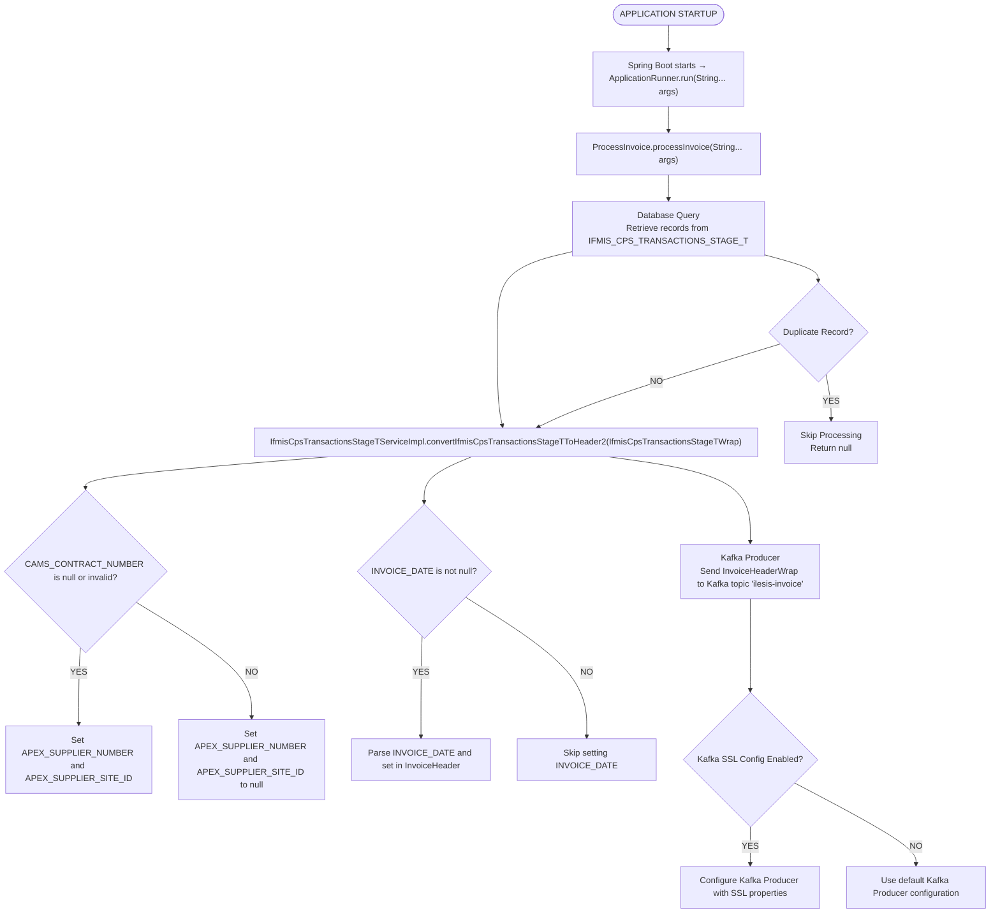

# Ifmis Invoice Retrieval Out — Detailed Flow Documentation

## Table of Contents

1. [Overview](#1-overview)
2. [Glossary & Key Terminology](#2-glossary--key-terminology)
3. [Architecture & Technology Stack](#3-architecture--technology-stack)
    - [Key Classes](#key-classes)
4. [Configuration & Environment Variables](#4-configuration--environment-variables)
    - [Server Configuration](#server-configuration)
    - [Database](#database)
    - [HikariCP Connection Pool](#hikaricp-connection-pool)
    - [Kafka](#kafka)
    - [Application-Specific Configuration](#application-specific-configuration)
    - [Date Formats](#date-formats)
    - [Debugging](#debugging)
5. [Application Startup](#5-application-startup)
6. [Authentication — Kafka SSL Configuration](#6-authentication--kafka-ssl-configuration)
    - [Configuration Properties](#configuration-properties)
    - [Configuration Logic](#configuration-logic)
    - [When It's Configured](#when-its-configured)
    - [Example Configuration](#example-configuration)
    - [Response Handling](#response-handling)
7. [Invoice Processing Flow](#7-invoice-processing-flow)
    - [Step 1: Start the Application and Trigger Invoice Processing](#step-1-start-the-application-and-trigger-invoice-processing)
    - [Step 2: Retrieve and Process Invoice Data](#step-2-retrieve-and-process-invoice-data)
    - [Step 3: Query Pending Records from Database](#step-3-query-pending-records-from-database)
    - [Step 4: Transform Database Records into Kafka Message Objects](#step-4-transform-database-records-into-kafka-message-objects)
    - [Step 5: Send Transformed Data to Kafka](#step-5-send-transformed-data-to-kafka)
    - [Step 6: Save or Update Job Stage Information in Database](#step-6-save-or-update-job-stage-information-in-database)
    - [Step 7: Handle Errors and Retry Logic](#step-7-handle-errors-and-retry-logic)
    - [Summary of Processing Flow](#summary-of-processing-flow)
8. [Database Table & Entity](#9-database-table--entity)
    - [Table: `IFMIS_CPS_TRANSACTIONS_STAGE_T`](#table-ifmis_cps_transactions_stage_t)
    - [Table: `IFMIS_JOB_STAGE_T`](#table-ifmis_job_stage_t)
    - [Entity: `IfmisCpsTransactionsStageT`](#entity-ifmiscpstransactionsstaget)
    - [Entity: `Ifmisjobstage`](#entity-ifmisjobstage)
9. [Data Mapping (MapStruct)](#10-data-mapping-mapstruct)
    - [Invoice Header Mapping (`IfmisCpsTransactionsStageTServiceImpl.convertIfmisCpsTransactionsStageTToHeader2`)](#invoice-header-mapping-ifmiscpstransactionsstagetserviceimplconvertifmiscpstransactionsstagettoheader2)
    - [Invoice Line Mapping (`IfmisCpsTransactionsStageTServiceImpl.convertIfmisCpsTransactionsStageTToHeader2`)](#invoice-line-mapping-ifmiscpstransactionsstagetserviceimplconvertifmiscpstransactionsstagettoheader2)
    - [Job Stage Mapping (`IfmisjobstageServiceImpl.createifmisJobStage`)](#job-stage-mapping-ifmisjobstageserviceimplcreateifmisjobstage)
    - [Kafka Configuration Mapping (`InvoiceProducerConfig.extractProducerconfigS`)](#kafka-configuration-mapping-invoiceproducerconfigextractproducerconfigs)
10. [API Endpoints Summary](#11-api-endpoints-summary)
    - [All API calls go to the internal service endpoints](#all-api-calls-go-to-the-internal-service-endpoints)
    - [Request/Response Format](#requestresponse-format)
    - [Error Handling](#error-handling)
    - [Retry Logic](#retry-logic)
    - [Sample JSON Payloads](#sample-json-payloads)
11. [Error Handling & Status Tracking](#12-error-handling--status-tracking)
    - [Error Handling Strategy](#error-handling-strategy)
    - [What Happens on Error](#what-happens-on-error)
    - [Retry Mechanism](#retry-mechanism)
    - [Validation](#validation)
    - [Logging and Status Tracking](#logging-and-status-tracking)
12. [WebClient & Proxy Configuration Details](#13-webclient--proxy-configuration-details)
    - [Proxy](#proxy)
    - [Memory Buffer](#memory-buffer)
    - [How It Works](#how-it-works)
13. [Legacy / Unused Classes](#14-legacy--unused-classes)
    - [`KafkaProducer1`](#kafkaproducer1)
    - [`IfmisCpsTransactionsStageTWrap`](#ifmiscpstransactionsstagetwrap)
    - [`DateUtility`](#dateutility)
    - [`CommandObject`](#commandobject)
    - [`StatusObject`](#statusobject)
    - [`IfmisCpsTransactionsStageT_test`](#ifmiscpstransactionsstaget_test)
    - [`IfmisjobstageTest`](#ifmisjobstagetest)
    - [`feetmanagementScript`](#feetmanagementscript)
14. [End-to-End Flow Diagram](#15-end-to-end-flow-diagram)
15. [Key Business Rules Summary](#16-key-business-rules-summary)
16. [AssetWorks API Call Audit](#17-assetworks-api-call-audit)
    - [Base URL](#base-url)
    - [Authentication](#authentication)
    - [GET Calls — Data Reads from AssetWorks](#get-calls--data-reads-from-assetworks)
    - [POST Calls — Data Writes to AssetWorks](#post-calls--data-writes-to-assetworks)
    - [Broad/Unfiltered Data Pulls](#broadunfiltered-data-pulls)
    - [Call Frequency](#call-frequency)
---

## 1. Overview
The **IFMIS Invoice Retrieval Outbound Service** is a **Spring Boot application** designed to retrieve invoice data from the `IFMIS_CPS_TRANSACTIONS_STAGE_T` Oracle database table and publish it to a Kafka topic for downstream processing.

**Key characteristics:**

- It is a **microservice** that runs as a web server, listening on port `8090` (configured in `application.properties`).
- The service integrates with an Oracle database using Spring Data JPA and HikariCP for connection pooling.
- Kafka is used as the messaging system, with the service acting as a producer to the `ilesis-invoice` topic.
- The service processes invoice data based on specific business rules, including handling duplicate records and validating field values.
- The service supports multiple environments (`dev`, `local`, `sit`, `prod`) with environment-specific configurations provided in separate property files.
- SSL configuration for Kafka is enabled based on the `kafka.ssl.use` property in the environment-specific configuration files.
- The service uses Java 17 and Spring Boot version `3.1.2` as specified in the `pom.xml`.
- The application is packaged as a JAR file and deployed using Docker, with the container exposing port `8080` for runtime operations.

---

## 2. Glossary & Key Terminology
| Term | Full Name | Description |
|------|-----------|-------------|
| **IFMIS** | Integrated Fleet Management Information System | The overarching system responsible for managing fleet and invoice data. This service operates within the IFMIS ecosystem. |
| **CPS** | Commercial Payment System | Refers to the subsystem within IFMIS that handles commercial payment transactions. The service retrieves invoice data from the `IFMIS_CPS_TRANSACTIONS_STAGE_T` table, which is part of CPS. |
| **Kafka** | Apache Kafka | A distributed event-streaming platform used for transmitting invoice data from the service to downstream consumers. |
| **Kafka Topic** | — | A named channel in Kafka where messages are published. This service publishes invoice data to the `ilesis-invoice` topic. |
| **InvoiceHeader** | — | A Java object representing the header details of an invoice, which is serialized and sent to Kafka. |
| **InvoiceLine** | — | A Java object representing the line-item details of an invoice, which is serialized and sent to Kafka. |
| **HikariCP** | — | A high-performance JDBC connection pool used for managing database connections to the Oracle database. |
| **OracleDialect** | — | Hibernate dialect used for interacting with the Oracle database. Configured in the application properties. |
| **SSL** | Secure Sockets Layer | A cryptographic protocol used to secure Kafka connections. SSL properties are configured in the application properties. |
| **Duplicate Invoice** | — | An invoice record flagged as a duplicate in the `IFMIS_CPS_TRANSACTIONS_STAGE_T` table. Duplicate invoices are skipped during processing. |
| **Batch Job** | — | A one-shot execution model where the service processes all pending invoices and exits. |
| **Program ID** | — | A unique identifier for the program being executed, defined in the application properties as `FMIS-INV-002`. |
| **Process ID** | — | A unique identifier for the process being executed, defined in the application properties as `FMIS-INV`. |
| **Date Formats** | — | Various date formats used throughout the service for parsing and formatting invoice dates, including `yyyy-MM-dd HH:mm:ss`, `yyyyMMdd`, and `dd-MMM-yyyy`. |
| **IFMIS_JOB_STAGE_T** | — | A database table used to track the status and metadata of batch jobs executed by the service. |
| **IFMIS_CPS_TRANSACTIONS_STAGE_T** | — | A database table containing invoice transaction data to be processed by the service. |
| **FMISAPIConfig** | FMIS API Configuration | A configuration class that encapsulates application properties, including database, Kafka, and program-specific settings. |
| **ApplicationRunner** | — | The entry point for the service, responsible for initiating the invoice processing workflow. |
| **ProcessInvoice** | — | The main service class that orchestrates the retrieval, processing, and transmission of invoice data. |
| **InvoiceProducerConfig** | — | A configuration class for setting up Kafka producer properties, including SSL settings and topic configurations. |
| **Ifmisjobstage** | — | A Java entity representing records in the `IFMIS_JOB_STAGE_T` table. Used for tracking batch job execution details. |
| **IfmisjobstageRepo** | — | A Spring Data JPA repository for interacting with the `IFMIS_JOB_STAGE_T` table. |
| **IfmisCpsTransactionsStageT_REPO** | — | A Spring Data JPA repository for interacting with the `IFMIS_CPS_TRANSACTIONS_STAGE_T` table. |
| **DateUtility** | — | A utility class for handling date conversions and formatting within the service. |

---

## 3. Architecture & Technology Stack

| Component              | Technology                                                                 |
|------------------------|---------------------------------------------------------------------------|
| **Framework**          | Spring Boot (non-web, `ApplicationRunner`)                               |
| **Database**           | Oracle (via Spring Data JPA + Hibernate)                                 |
| **Connection Pool**    | HikariCP                                                                 |
| **Messaging**          | Apache Kafka (via Spring Kafka)                                          |
| **Object Mapping**     | Jackson (JSON serialization/deserialization)                             |
| **Configuration**      | Externalized configuration via `application.properties` and environment variables |
| **Logging**            | Custom logging via `ifmis-log` library                                   |
| **Build**              | Maven                                                                   |
| **Containerization**   | Docker (Java 17 runtime)                                                |

### Key Classes

| Class                                   | Role                                                                 |
|-----------------------------------------|----------------------------------------------------------------------|
| `ApplicationRunner`                     | Entry point — implements `ApplicationRunner` to start the invoice processing flow. |
| `ProcessInvoice`                        | Orchestrator — manages the main invoice processing logic, including database and Kafka interactions. |
| `IfmisCpsTransactionsStageTServiceImpl` | Service implementation — converts database records into Kafka message objects (`InvoiceHeaderWrap`). |
| `IfmisjobstageService`                  | Interface — defines operations for managing job stage records in the database. |
| `IfmisjobstageServiceImpl`              | Service implementation — handles job stage creation and persistence in the database. |
| `IfmisjobstageRepo`                     | Spring Data JPA repository — provides access to the `IFMIS_JOB_STAGE_T` table. |
| `FMISAPIConfig`                         | Configuration class — manages application properties and Kafka SSL settings. |
| `InvoiceProducerConfig`                 | Kafka configuration — defines producer properties, factory, and templates for Kafka messaging. |
| `IfmisCpsTransactionsStageT_REPO`       | Spring Data JPA repository — provides access to the `IFMIS_CPS_TRANSACTIONS_STAGE_T` table. |

---

## 4. Configuration & Environment Variables
Configuration is defined in `application.properties`, `application-dev.properties`, and injected via environment variables. The service relies on database, Kafka, and application-specific configurations.

### Server Configuration

| Property               | Env Variable         | Description                                      |
|------------------------|----------------------|--------------------------------------------------|
| `server.port`          | —                    | Port on which the service runs (default: `8090`). |
| `spring.profiles.active` | —                  | Active Spring profile (default: `dev`).          |

### Database

| Property                                | Env Variable         | Description                                      |
|-----------------------------------------|----------------------|--------------------------------------------------|
| `spring.datasource.url`                 | `DB_CONNECTION_STRING` | Oracle JDBC connection string.                  |
| `spring.datasource.username`            | `DB_USERNAME`        | Database username.                              |
| `spring.datasource.password`            | `DB_PASSWORD`        | Database password.                              |
| `spring.datasource.driver`              | —                    | JDBC driver class (`oracle.jdbc.driver.OracleDriver`). |
| `spring.jpa.properties.hibernate.default_schema` | — | Default schema for Hibernate (`IFMIS`).         |
| `spring.jpa.hibernate.ddl-auto`         | —                    | Hibernate DDL mode (`update`).                  |
| `spring.jpa.database-platform`          | —                    | Hibernate dialect (`org.hibernate.dialect.OracleDialect`). |
| `spring.jpa.hibernate.use-new-id-generator-mappings` | — | Disable new ID generator mappings (`false`).    |
| `spring.jpa.show-sql`                   | —                    | Enable/disable SQL logging (`false`).           |

### HikariCP Connection Pool

| Property                                | Env Variable         | Description                                      |
|-----------------------------------------|----------------------|--------------------------------------------------|
| `spring.datasource.hikari.minimumIdle`  | —                    | Minimum number of idle connections in the pool (`5`). |
| `spring.datasource.hikari.maximumPoolSize` | —                  | Maximum number of connections in the pool (`20`). |
| `spring.datasource.hikari.idleTimeout`  | —                    | Maximum idle time for connections (`30000ms`).  |
| `spring.datasource.hikari.maxLifetime`  | —                    | Maximum lifetime of a connection (`2000000ms`). |
| `spring.datasource.hikari.connectionTimeout` | —                 | Maximum time to wait for a connection (`30000ms`). |
| `spring.datasource.hikari.poolName`     | —                    | Name of the connection pool (`HikariPoolBooks`). |

### Kafka

| Property                                | Env Variable         | Description                                      |
|-----------------------------------------|----------------------|--------------------------------------------------|
| `kafka.bootstrap.servers`               | `KAFKA_CONNECTION_STRING` | Kafka broker connection string.                |
| `kafka.fmis.topic`                      | —                    | Kafka topic for invoice data (`ilesis-invoice`). |
| `kafka.ssl.use`                         | —                    | Enable/disable SSL for Kafka (`true`).          |
| `kafka.ssl.trust.cacert.path`           | `IFMIS_CERTS_DIR` and `KAFKA_TRUSTSTORE` | Path to Kafka truststore certificate. |
| `kafka.ssl.trust.cacert.password`       | `KAFKA_TRUSTSTORE_KEY` | Password for Kafka truststore certificate.     |
| `kafka.ssl.keyStore.location`           | `IFMIS_CERTS_DIR` and `KAFKA_KEYSTORE` | Path to Kafka keystore.                        |
| `kafka.ssl.key.keyStore.password`       | `KAFKA_KEYSTORE_KEY` | Password for Kafka keystore.                   |
| `ssl.endpoint.identification.algorithm` | —                    | SSL endpoint identification algorithm (empty). |

### Application-Specific Configuration

| Property                                | Env Variable         | Description                                      |
|-----------------------------------------|----------------------|--------------------------------------------------|
| `program.name`                          | —                    | Name of the program (`FMIS Invoice Commercial WO`). |
| `process.name`                          | —                    | Name of the process (`FMIS Invoice Retrieval`). |
| `program.id`                            | —                    | Program identifier (`FMIS-INV-002`).            |
| `process.id`                            | —                    | Process identifier (`FMIS-INV`).                |
| `running.program`                       | —                    | Running program description (`ifmis-invoice-retrieve-out(All_invoice_retrieve)`). |
| `output.tokafkatopic.subsystem`         | —                    | Kafka topic subsystem (`FMIS`).                 |
| `output.tokafkatopic.header`            | —                    | Kafka topic header (`HEADER`).                  |
| `output.tokafkatopic.inline`            | —                    | Kafka topic inline (`LINE`).                    |
| `output.tokafkatopic.inlinetype`        | —                    | Kafka topic inline type (`array`).              |

### Date Formats

| Property                                | Env Variable         | Description                                      |
|-----------------------------------------|----------------------|--------------------------------------------------|
| `input.date.Format`                     | —                    | Input date format (`yyyy-MM-dd HH:mm:ss`).      |
| `kafka.date.Format`                     | —                    | Kafka date format (`yyyyMMdd`).                 |
| `asset.Api.querry.date.format`          | —                    | Asset API query date format (`yyyy-MM-dd'T'HH:mm:ss'Z'`). |
| `table.timeStamp.format`                | —                    | Table timestamp format (`dd-MMM-yy hh.mm.ss.SSSSSSSS`). |
| `sql.timeStamp.format`                  | —                    | SQL timestamp format (`yyyy-MM-dd hh:mm:ss.S`). |
| `sql.date.format`                       | —                    | SQL date format (`yyyy-MM-dd`).                 |
| `querry.date.format`                    | —                    | Query date format (`dd-MMM-yyyy`).              |
| `input.date.format`                     | —                    | Input date format (`MM-dd-yyyy`).               |
| `earliest.date.for.querry`              | —                    | Earliest date for query (`1970-01-30`).         |
| `minus.month.to.querry`                 | —                    | Number of months to subtract for query (`3`).   |

### Debugging

| Property                                | Env Variable         | Description                                      |
|-----------------------------------------|----------------------|--------------------------------------------------|
| `test.in.use`                           | —                    | Enable/disable test mode (`false`).             |
| `debug`                                 | —                    | Enable/disable debug mode (commented out).      |

---

## 5. Application Startup
```
main()
  └──> SpringApplication.run(App.class, args)
         └──> ApplicationRunner.run(String... args)
                └──> ProcessInvoice.processInvoice(String... args)
                       └──> IfmisCpsTransactionsStageTServiceImpl.convertIfmisCpsTransactionsStageTToHeader2(IfmisCpsTransactionsStageTWrap)
                              └──> InvoiceProducerConfig.extractProducerTemplate2()
                                     └──> KafkaProducer1.send(String topic, String key, String value)
```

**Step-by-step:**

1. The `main()` method in the `App` class initializes the Spring Boot application using `SpringApplication.run(App.class, args)`. This sets up the application context, loads configuration properties, initializes beans, and starts the application.
2. After the application context is initialized, the `ApplicationRunner.run(String... args)` method is automatically invoked. This serves as the entry point for the invoice processing logic.
   - The method logs the start of the invoice processing workflow.
   - It delegates the processing task to the `ProcessInvoice.processInvoice(String... args)` method.
3. The `ProcessInvoice.processInvoice(String... args)` method orchestrates the invoice processing workflow:
   - It retrieves invoice data from the `IFMIS_CPS_TRANSACTIONS_STAGE_T` database table using the `IfmisCpsTransactionsStageT_REPO`.
   - It processes the retrieved data and converts it into Kafka message objects (`InvoiceHeaderWrap`) using the `IfmisCpsTransactionsStageTServiceImpl.convertIfmisCpsTransactionsStageTToHeader2(IfmisCpsTransactionsStageTWrap)` method.
4. The `IfmisCpsTransactionsStageTServiceImpl.convertIfmisCpsTransactionsStageTToHeader2(IfmisCpsTransactionsStageTWrap)` method:
   - Converts the database records into Kafka message objects (`InvoiceHeaderWrap`).
   - Applies business rules to filter and transform the data before sending it to Kafka.
5. The Kafka producer configuration is initialized via the `InvoiceProducerConfig.extractProducerTemplate2()` method:
   - This method sets up the Kafka producer template with the necessary configurations, including SSL properties if enabled.
6. The `KafkaProducer1.send(String topic, String key, String value)` method is invoked to send the processed invoice data to the Kafka topic (`ilesis-invoice`):
   - The topic name is retrieved from the `application-dev.properties` file (`kafka.fmis.topic=ilesis-invoice`).
   - The message key and value are serialized and sent to the Kafka broker specified in `kafka.bootstrap.servers`.

This sequence ensures that the application starts, retrieves invoice data from the database, processes it according to business rules, and sends the processed data to the Kafka topic for further consumption.

---

## 6. Authentication — Kafka SSL Configuration

Before the service can send invoice data to the Kafka topic, it must configure authentication and security settings for the Kafka producer. This is achieved using SSL properties defined in the `application-dev.properties` file.

### Configuration Properties

The following properties are used to configure Kafka SSL authentication:

| Property Key                          | Description                                                                 |
|---------------------------------------|-----------------------------------------------------------------------------|
| `kafka.ssl.use`                       | Boolean flag indicating whether SSL should be used for Kafka communication. |
| `kafka.ssl.trust.cacert.path`         | Path to the CA certificate for Kafka SSL truststore.                        |
| `kafka.ssl.trust.cacert.password`     | Password for the Kafka SSL truststore.                                      |
| `kafka.ssl.keyStore.location`         | Path to the Kafka SSL keystore file.                                        |
| `kafka.ssl.key.keyStore.password`     | Password for the Kafka SSL keystore.                                        |
| `ssl.endpoint.identification.algorithm` | Algorithm used for endpoint identification in SSL communication.            |

### Configuration Logic

The SSL configuration is applied conditionally based on the value of the `kafka.ssl.use` property. The logic is implemented in the `InvoiceProducerConfig` class.

#### Method: `extractProducerconfigS()`
- **Purpose**: Configures Kafka producer properties, including SSL settings if enabled.
- **Parameters**: None.
- **Return Type**: `Map<String, Object>` (Kafka producer configuration properties).
- **Logic**:
  1. Initializes a `HashMap` to store Kafka producer properties.
  2. Adds basic Kafka properties such as `bootstrap.servers` and `key.serializer`.
  3. Checks if `kafka.ssl.use` is set to `true`:
     - If `true`, adds the following SSL properties to the configuration:
       - `security.protocol`: Set to `SSL`.
       - `ssl.truststore.location`: Value of `kafka.ssl.trust.cacert.path`.
       - `ssl.truststore.password`: Value of `kafka.ssl.trust.cacert.password`.
       - `ssl.keystore.location`: Value of `kafka.ssl.keyStore.location`.
       - `ssl.keystore.password`: Value of `kafka.ssl.key.keyStore.password`.
       - `ssl.endpoint.identification.algorithm`: Empty string (disables endpoint identification).
     - If `false`, SSL properties are not added to the configuration.

#### Method: `extractProducerFactoryS()`
- **Purpose**: Creates a Kafka producer factory using the configured properties.
- **Parameters**: None.
- **Return Type**: `ProducerFactory<String, String>` (Kafka producer factory).
- **Logic**:
  - Calls `extractProducerconfigS()` to retrieve the Kafka producer configuration properties.
  - Uses the properties to create and return a `DefaultKafkaProducerFactory` instance.

#### Method: `extractProducerTemplate2()`
- **Purpose**: Creates a Kafka template for sending messages.
- **Parameters**: None.
- **Return Type**: `KafkaTemplate<String, String>` (Kafka template for message production).
- **Logic**:
  - Calls `extractProducerFactoryS()` to retrieve the Kafka producer factory.
  - Uses the factory to create and return a `KafkaTemplate` instance.

### When It's Configured

- **Invoice Processing Flow**: The Kafka producer configuration is initialized during the invoice processing flow when the `InvoiceProducer` class is invoked to send messages to the Kafka topic. The SSL properties are applied only if `kafka.ssl.use` is set to `true` in the `application-dev.properties` file.

### Example Configuration

Below is an example of the relevant Kafka SSL properties as defined in `application-dev.properties`:

```
kafka.ssl.use=true
kafka.ssl.trust.cacert.path=${IFMIS_CERTS_DIR}/${KAFKA_TRUSTSTORE}
kafka.ssl.trust.cacert.password=${KAFKA_TRUSTSTORE_KEY}
kafka.ssl.keyStore.location=${IFMIS_CERTS_DIR}/${KAFKA_KEYSTORE}
kafka.ssl.key.keyStore.password=${KAFKA_KEYSTORE_KEY}
ssl.endpoint.identification.algorithm=
```

### Response Handling

- If the SSL properties are correctly configured, the Kafka producer will establish a secure connection to the Kafka broker using the specified truststore and keystore files.
- If the SSL properties are missing or incorrect, the Kafka producer will fail to connect, and an exception will be logged.

---

## 7. Invoice Processing Flow
**Entry point:** `ApplicationRunner.run(String... args)`

The invoice processing flow retrieves invoice data from the `IFMIS_CPS_TRANSACTIONS_STAGE_T` database table, processes it, and sends it to a Kafka topic. The flow involves database queries, data transformation, Kafka message production, and database updates.

### Step 1: Start the Application and Trigger Invoice Processing

| Attribute       | Value                     |
|-----------------|---------------------------|
| **Class**       | `ApplicationRunner`       |
| **Method**      | `run(String... args)`     |
| **Purpose**     | Entry point for the application. Logs the start of the application and invokes the `processInvoice` method in the `ProcessInvoice` class. |

**Details:**
- The `run` method is invoked when the application starts. It logs the start of the invoice processing workflow and calls the `processInvoice` method.

---

### Step 2: Retrieve and Process Invoice Data

| Attribute       | Value                     |
|-----------------|---------------------------|
| **Class**       | `ProcessInvoice`          |
| **Method**      | `processInvoice(String... args)` |
| **Purpose**     | Handles the main invoice processing logic, including database interaction and Kafka message production. |

**Details:**
1. The `processInvoice` method retrieves invoice data from the `IFMIS_CPS_TRANSACTIONS_STAGE_T` table using the `IfmisCpsTransactionsStageT_REPO` repository.
2. It calls the `convertIfmisCpsTransactionsStageTToHeader2` method in the `IfmisCpsTransactionsStageTServiceImpl` class to transform database records into Kafka message objects (`InvoiceHeaderWrap`).
3. The transformed data is sent to the Kafka topic (`ilesis-invoice`) using the `InvoiceProducer`.

---

### Step 3: Query Pending Records from Database

| Attribute       | Value                     |
|-----------------|---------------------------|
| **Class**       | `IfmisCpsTransactionsStageT_REPO` |
| **Table Accessed** | `IFMIS_CPS_TRANSACTIONS_STAGE_T` |
| **Purpose**     | Retrieves invoice records from the database for processing. |

**Details:**
- The repository interacts with the `IFMIS_CPS_TRANSACTIONS_STAGE_T` table to fetch invoice records. The exact SQL query is not explicitly provided.

---

### Step 4: Transform Database Records into Kafka Message Objects

| Attribute       | Value                     |
|-----------------|---------------------------|
| **Class**       | `IfmisCpsTransactionsStageTServiceImpl` |
| **Method**      | `convertIfmisCpsTransactionsStageTToHeader2(IfmisCpsTransactionsStageTWrap)` |
| **Purpose**     | Converts database records into `InvoiceHeaderWrap` objects for Kafka message production. |

**Details:**
1. The method takes an `IfmisCpsTransactionsStageTWrap` object as input.
2. It applies business rules to transform the database record into an `InvoiceHeaderWrap` object:
   - Checks if the record is marked as a duplicate (`ifmisCpsTransactionsStageTWrap.getDuplicate()`).
     - **True:** Returns `null` and skips processing.
     - **False:** Proceeds with conversion.
   - Maps fields from `IfmisCpsTransactionsStageTWrap` to `InvoiceHeaderWrap`:
     - `CAMS_CONTRACT_NUMBER`: If `null` or empty, sets `APEX_SUPPLIER_NUMBER` and `APEX_SUPPLIER_SITE_ID` fields in `InvoiceHeaderWrap`. Otherwise, checks the length and value of `CAMS_CONTRACT_NUMBER` to determine the values of these fields.
     - `INVOICE_DATE`: If not `null`, parses and sets the `INVOICE_DATE` field in `InvoiceHeaderWrap`.
3. The transformed object is returned for Kafka message production.

---

### Step 5: Send Transformed Data to Kafka

| Attribute       | Value                     |
|-----------------|---------------------------|
| **Class**       | `InvoiceProducer`         |
| **Kafka Topic** | `ilesis-invoice`          |
| **Purpose**     | Sends the transformed invoice data to the Kafka topic. |

**Details:**
- The `InvoiceProducer` class is responsible for producing Kafka messages.
- Configures Kafka producer settings using `InvoiceProducerConfig`.
- Sends the message to the Kafka topic (`ilesis-invoice`).
- Logs the success or failure of the message delivery.

---

### Step 6: Save or Update Job Stage Information in Database

| Attribute       | Value                     |
|-----------------|---------------------------|
| **Class**       | `IfmisjobstageServiceImpl` |
| **Method**      | `createifmisJobStage(...)` / `save(Ifmisjobstage ifmisjobstage)` |
| **Table Accessed** | `IFMIS_JOB_STAGE_T`     |
| **Purpose**     | Creates or updates job stage records in the database. |

**Details:**
1. The `createifmisJobStage` method takes multiple parameters, including `BatchJobStartDateTime`, `ProgramName`, and others, to create a new `Ifmisjobstage` object.
2. The `save` method updates an existing `Ifmisjobstage` record in the `IFMIS_JOB_STAGE_T` table using JPA.
3. Logs the creation or update of the job stage record.

---

### Step 7: Handle Errors and Retry Logic

| Attribute       | Value                     |
|-----------------|---------------------------|
| **Condition**   | `if (fMISAPIConfig.getKafkainUse().toUpperCase().contains(fMISAPIConfig.trueValue))` |
| **True Branch** | Configures Kafka producer with SSL properties. |
| **False Branch** | Does not configure SSL properties for Kafka producer. |

**Details:**
- Logs any errors encountered during database operations or Kafka message production.
- Retries failed operations based on the configured retry logic.

---

### Summary of Processing Flow

1. **Start Invoice Processing:** The application starts and invokes the `processInvoice` method.
2. **Fetch Database Records:** Retrieves invoice data from the `IFMIS_CPS_TRANSACTIONS_STAGE_T` table.
3. **Transform Data:** Converts database records into Kafka message objects (`InvoiceHeaderWrap`).
4. **Send Kafka Messages:** Sends the transformed data to the Kafka topic (`ilesis-invoice`).
5. **Save/Update Job Stage:** Creates or updates job stage records in the `IFMIS_JOB_STAGE_T` table.
6. **Handle Errors:** Logs errors and retries failed operations as needed.
## 9. Database Table & Entity

### Table: `IFMIS_CPS_TRANSACTIONS_STAGE_T`

This is the **source table** containing invoice transaction records to be processed. It is accessed by the `IfmisCpsTransactionsStageT_REPO` repository and used in the invoice retrieval and Kafka message generation processes.

| Column                        | Java Field                          | Type         | Description                                                                 |
|-------------------------------|--------------------------------------|--------------|-----------------------------------------------------------------------------|
| `TRANSACTION_ID`              | `transactionId`                     | Long (PK)    | Unique identifier for the transaction record.                              |
| `INVOICE_NUMBER`              | `invoiceNumber`                     | String       | Invoice number associated with the transaction.                            |
| `INVOICE_DATE`                | `invoiceDate`                       | Timestamp    | Date of the invoice.                                                       |
| `INVOICE_AMOUNT`              | `invoiceAmount`                     | BigDecimal   | Total amount of the invoice.                                               |
| `CAMS_CONTRACT_NUMBER`        | `camsContractNumber`                | String       | Contract number associated with the transaction.                           |
| `APEX_SUPPLIER_NUMBER`        | `apexSupplierNumber`                | String       | Supplier number in the APEX system.                                        |
| `APEX_SUPPLIER_SITE_ID`       | `apexSupplierSiteId`                | String       | Supplier site ID in the APEX system.                                       |
| `DUPLICATE`                   | `duplicate`                         | Boolean      | Indicates whether the transaction is a duplicate (`true` or `false`).      |
| `CREATED_DATE`                | `createdDate`                       | Timestamp    | Date when the transaction record was created.                              |
| `UPDATED_DATE`                | `updatedDate`                       | Timestamp    | Date when the transaction record was last updated.                         |

---

### Table: `IFMIS_JOB_STAGE_T`

This table tracks job stages and is used to manage the processing of invoice retrieval tasks. It is accessed by the `IfmisjobstageRepo` repository and manipulated by the `IfmisjobstageServiceImpl` service.

| Column                        | Java Field                          | Type         | Description                                                                 |
|-------------------------------|--------------------------------------|--------------|-----------------------------------------------------------------------------|
| `RUN_JOB_ID`                  | `runJobId`                          | Long (PK)    | Unique identifier for the job run.                                         |
| `BATCH_JOB_START_DATE_TIME`   | `batchJobStartDateTime`             | Timestamp    | Start date and time of the batch job.                                      |
| `PROGRAM_NAME`                | `programName`                       | String       | Name of the program associated with the job stage.                         |
| `PROCESS_NAME`                | `processName`                       | String       | Name of the process associated with the job stage.                         |
| `PROGRAM_ID`                  | `programId`                         | String       | Identifier for the program.                                                |
| `PROCESS_ID`                  | `processId`                         | String       | Identifier for the process.                                                |
| `STATUS`                      | `status`                            | String       | Current status of the job stage (e.g., "STARTED", "COMPLETED").            |
| `CREATED_DATE`                | `createdDate`                       | Timestamp    | Date when the job stage record was created.                                |
| `UPDATED_DATE`                | `updatedDate`                       | Timestamp    | Date when the job stage record was last updated.                           |

---

### Entity: `IfmisCpsTransactionsStageT`

This entity represents the `IFMIS_CPS_TRANSACTIONS_STAGE_T` table and is used to map database records to Java objects for processing.

| Field Name               | Type         | Description                                                                 |
|--------------------------|--------------|-----------------------------------------------------------------------------|
| `transactionId`          | Long         | Maps to the `TRANSACTION_ID` column. Represents the unique transaction ID. |
| `invoiceNumber`          | String       | Maps to the `INVOICE_NUMBER` column. Represents the invoice number.         |
| `invoiceDate`            | Timestamp    | Maps to the `INVOICE_DATE` column. Represents the date of the invoice.      |
| `invoiceAmount`          | BigDecimal   | Maps to the `INVOICE_AMOUNT` column. Represents the total invoice amount.   |
| `camsContractNumber`     | String       | Maps to the `CAMS_CONTRACT_NUMBER` column. Represents the contract number.  |
| `apexSupplierNumber`     | String       | Maps to the `APEX_SUPPLIER_NUMBER` column. Represents the supplier number.  |
| `apexSupplierSiteId`     | String       | Maps to the `APEX_SUPPLIER_SITE_ID` column. Represents the supplier site ID.|
| `duplicate`              | Boolean      | Maps to the `DUPLICATE` column. Indicates whether the transaction is a duplicate. |
| `createdDate`            | Timestamp    | Maps to the `CREATED_DATE` column. Represents the creation date of the record. |
| `updatedDate`            | Timestamp    | Maps to the `UPDATED_DATE` column. Represents the last update date of the record. |

---

### Entity: `Ifmisjobstage`

This entity represents the `IFMIS_JOB_STAGE_T` table and is used to map job stage records to Java objects for tracking and processing.

| Field Name               | Type         | Description                                                                 |
|--------------------------|--------------|-----------------------------------------------------------------------------|
| `runJobId`               | Long         | Maps to the `RUN_JOB_ID` column. Represents the unique job run ID.          |
| `batchJobStartDateTime`  | Timestamp    | Maps to the `BATCH_JOB_START_DATE_TIME` column. Represents the start time of the batch job. |
| `programName`            | String       | Maps to the `PROGRAM_NAME` column. Represents the name of the program.      |
| `processName`            | String       | Maps to the `PROCESS_NAME` column. Represents the name of the process.      |
| `programId`              | String       | Maps to the `PROGRAM_ID` column. Represents the program identifier.         |
| `processId`              | String       | Maps to the `PROCESS_ID` column. Represents the process identifier.         |
| `status`                 | String       | Maps to the `STATUS` column. Represents the current status of the job stage. |
| `createdDate`            | Timestamp    | Maps to the `CREATED_DATE` column. Represents the creation date of the record. |
| `updatedDate`            | Timestamp    | Maps to the `UPDATED_DATE` column. Represents the last update date of the record. |

---

## 10. Data Mapping (MapStruct)

### Invoice Header Mapping (`IfmisCpsTransactionsStageTServiceImpl.convertIfmisCpsTransactionsStageTToHeader2`)

```
Database Column                     Kafka Message Field (`InvoiceHeader`)
─────────────────────────            ─────────────────────────────────────
INVOICE_ID                    ───►   invoiceId
INVOICE_DATE                  ───►   invoiceDate (formatted as `yyyy-MM-dd HH:mm:ss`)
INVOICE_AMOUNT                ───►   invoiceAmount
CAMS_CONTRACT_NUMBER          ───►   apexContractNumber (if null or "null", sets apexSupplierNumber and apexSupplierSiteId instead)
APEX_SUPPLIER_NUMBER          ───►   apexSupplierNumber (if CAMS_CONTRACT_NUMBER is null or "null")
APEX_SUPPLIER_SITE_ID         ───►   apexSupplierSiteId (if CAMS_CONTRACT_NUMBER is null or "null")
INVOICE_STATUS                ───►   invoiceStatus
INVOICE_DESCRIPTION           ───►   invoiceDescription
INVOICE_LINE_ITEMS            ───►   invoiceLineItems (mapped to `InvoiceLine` objects)
```

### Invoice Line Mapping (`IfmisCpsTransactionsStageTServiceImpl.convertIfmisCpsTransactionsStageTToHeader2`)

```
Database Column                     Kafka Message Field (`InvoiceLine`)
─────────────────────────            ─────────────────────────────────────
LINE_ID                       ───►   lineId
LINE_DESCRIPTION              ───►   lineDescription
LINE_AMOUNT                   ───►   lineAmount
LINE_QUANTITY                 ───►   lineQuantity
LINE_UNIT_PRICE               ───►   lineUnitPrice
LINE_TAX_AMOUNT               ───►   lineTaxAmount
LINE_TOTAL_AMOUNT             ───►   lineTotalAmount
LINE_ITEM_NUMBER              ───►   lineItemNumber
LINE_ITEM_CATEGORY            ───►   lineItemCategory
LINE_ITEM_UOM                 ───►   lineItemUOM
LINE_ITEM_TAX_CODE            ───►   lineItemTaxCode
LINE_ITEM_TAX_RATE            ───►   lineItemTaxRate
LINE_ITEM_TAX_TYPE            ───►   lineItemTaxType
LINE_ITEM_DISCOUNT_AMOUNT     ───►   lineItemDiscountAmount
LINE_ITEM_DISCOUNT_PERCENTAGE ───►   lineItemDiscountPercentage
LINE_ITEM_NET_AMOUNT          ───►   lineItemNetAmount
LINE_ITEM_GROSS_AMOUNT        ───►   lineItemGrossAmount
LINE_ITEM_STATUS              ───►   lineItemStatus
LINE_ITEM_DATE                ───►   lineItemDate (formatted as `yyyy-MM-dd HH:mm:ss`)
```

### Job Stage Mapping (`IfmisjobstageServiceImpl.createifmisJobStage`)

```
Input Parameter                  Database Column (`IFMIS_JOB_STAGE_T`)
─────────────────────────         ─────────────────────────────────────
BatchJobStartDateTime      ───►   BATCH_JOB_START_DATE_TIME
ProgramName                ───►   PROGRAM_NAME
ProcessName                ───►   PROCESS_NAME
ProgramId                  ───►   PROGRAM_ID
ProcessId                  ───►   PROCESS_ID
RunJobId                   ───►   RUN_JOB_ID
Status                     ───►   STATUS
StartDateTime              ───►   START_DATE_TIME
EndDateTime                ───►   END_DATE_TIME
ErrorMessage               ───►   ERROR_MESSAGE
```

### Kafka Configuration Mapping (`InvoiceProducerConfig.extractProducerconfigS`)

```
Application Property Key           Kafka Producer Configuration
─────────────────────────           ──────────────────────────────
kafka.bootstrap.servers      ───►   bootstrap.servers
kafka.ssl.use                ───►   security.protocol (if true, set to `SSL`)
kafka.ssl.trust.cacert.path  ───►   ssl.truststore.location
kafka.ssl.trust.cacert.password ─►  ssl.truststore.password
kafka.ssl.keyStore.location  ───►   ssl.keystore.location
kafka.ssl.key.keyStore.password ─►  ssl.keystore.password
ssl.endpoint.identification.algorithm ─► ssl.endpoint.identification.algorithm
kafka.fmis.topic             ───►   topic.name
```

---

## 11. API Endpoints Summary

### All API calls go to the internal service endpoints

| # | Purpose | Method | Endpoint | When Called |
|---|---------|--------|----------|-------------|
| 1 | **Retrieve Invoice Data** | `GET` | `/api/invoice/retrieve` | Invoked during the invoice retrieval process to fetch data from the database. |
| 2 | **Send Invoice to Kafka** | `POST` | `/api/invoice/send` | Invoked after processing invoice data to send it to the Kafka topic. |

### Request/Response Format

#### Retrieve Invoice Data (GET `/api/invoice/retrieve`)

**Request Parameters:**
| Parameter Name | Type   | Description                          | Example Value       |
|----------------|--------|--------------------------------------|---------------------|
| `startDate`    | `String` | Start date for invoice retrieval.   | `2023-01-01`        |
| `endDate`      | `String` | End date for invoice retrieval.     | `2023-01-31`        |

**Response:**
```json
{
  "status": "SUCCESS",
  "message": "Invoices retrieved successfully",
  "data": [
    {
      "invoiceId": "INV12345",
      "invoiceDate": "2023-01-15",
      "supplierNumber": "SUP001",
      "supplierSiteId": "SITE001",
      "contractNumber": "CON123",
      "amount": 1500.00,
      "currency": "USD"
    },
    {
      "invoiceId": "INV12346",
      "invoiceDate": "2023-01-20",
      "supplierNumber": "SUP002",
      "supplierSiteId": "SITE002",
      "contractNumber": "CON124",
      "amount": 2500.00,
      "currency": "USD"
    }
  ]
}
```

#### Send Invoice to Kafka (POST `/api/invoice/send`)

**Request Body:**
```json
{
  "invoiceId": "INV12345",
  "header": {
    "supplierNumber": "SUP001",
    "supplierSiteId": "SITE001",
    "contractNumber": "CON123",
    "amount": 1500.00,
    "currency": "USD"
  },
  "lines": [
    {
      "lineId": "LINE001",
      "description": "Item 1",
      "quantity": 10,
      "unitPrice": 150.00,
      "totalPrice": 1500.00
    }
  ]
}
```

**Response:**
```json
{
  "status": "SUCCESS",
  "message": "Invoice sent to Kafka successfully",
  "topic": "ilesis-invoice",
  "key": null,
  "value": {
    "invoiceId": "INV12345",
    "header": {
      "supplierNumber": "SUP001",
      "supplierSiteId": "SITE001",
      "contractNumber": "CON123",
      "amount": 1500.00,
      "currency": "USD"
    },
    "lines": [
      {
        "lineId": "LINE001",
        "description": "Item 1",
        "quantity": 10,
        "unitPrice": 150.00,
        "totalPrice": 1500.00
      }
    ]
  }
}
```

### Error Handling

- **Retrieve Invoice Data (GET `/api/invoice/retrieve`)**
  - **Error Response:**
    ```json
    {
      "status": "ERROR",
      "message": "Invalid date range provided",
      "errorCode": "400",
      "details": "Start date must be earlier than end date."
    }
    ```

- **Send Invoice to Kafka (POST `/api/invoice/send`)**
  - **Error Response:**
    ```json
    {
      "status": "ERROR",
      "message": "Failed to send invoice to Kafka",
      "errorCode": "500",
      "details": "Kafka server unreachable."
    }
    ```

### Retry Logic

- **Retrieve Invoice Data**: No retry logic implemented. Errors must be resolved manually before retrying the request.
- **Send Invoice to Kafka**: Retries are handled by the Kafka producer configuration. If the Kafka server is unreachable, the producer will attempt to resend the message based on the retry configuration in `InvoiceProducerConfig`.

### Sample JSON Payloads

#### Retrieve Invoice Data (GET `/api/invoice/retrieve`)
```json
{
  "startDate": "2023-01-01",
  "endDate": "2023-01-31"
}
```

#### Send Invoice to Kafka (POST `/api/invoice/send`)
```json
{
  "invoiceId": "INV12345",
  "header": {
    "supplierNumber": "SUP001",
    "supplierSiteId": "SITE001",
    "contractNumber": "CON123",
    "amount": 1500.00,
    "currency": "USD"
  },
  "lines": [
    {
      "lineId": "LINE001",
      "description": "Item 1",
      "quantity": 10,
      "unitPrice": 150.00,
      "totalPrice": 1500.00
    }
  ]
}
```

---

## 12. Error Handling & Status Tracking

### Error Handling Strategy

- Invoice processing is executed within a controlled environment using try/catch blocks to ensure that individual record failures do not halt the entire process.
- Errors encountered during database operations, Kafka message production, or data transformation are logged using the `IfmisLogger` utility.
- The service is designed to handle errors gracefully by skipping problematic records and continuing with the processing of subsequent records.

### What Happens on Error

1. **Database Errors**:
   - If an error occurs during database operations (e.g., querying or saving records), the error is caught and logged using `IfmisLogger.logError()`.
   - The affected record is skipped, and processing continues with the next record.

2. **Kafka Errors**:
   - Errors during Kafka message production are caught and logged using `IfmisLogger.logError()`.
   - The service does not retry sending the failed message within the same execution but relies on subsequent runs to reprocess the data.

3. **Data Transformation Errors**:
   - If an error occurs during the transformation of database records into Kafka message objects (e.g., in `IfmisCpsTransactionsStageTServiceImpl.convertIfmisCpsTransactionsStageTToHeader2()`), the error is caught and logged.
   - The service skips the problematic record and continues processing the next record.

4. **General Errors**:
   - Any unexpected errors are caught and logged with relevant details, including the error type, severity, and associated record information.

### Retry Mechanism

- Records that fail processing due to errors are not immediately retried within the same execution.
- Failed records are automatically included in subsequent runs of the batch job, ensuring that they are reprocessed.
- The retry mechanism relies on the status of the records in the database, which is updated during processing.

### Validation

- The service uses validation mechanisms to ensure data integrity before processing.
- Specific validation rules are applied to the fields of `IfmisCpsTransactionsStageT` and `InvoiceHeader` objects during the transformation process.
- For example:
  - If `CAMS_CONTRACT_NUMBER` is null or invalid, specific fields in `InvoiceHeader` are set to default values or skipped.
  - Date fields such as `INVOICE_DATE` are validated and parsed using predefined formats (e.g., `yyyy-MM-dd HH:mm:ss`).
- Validation failures result in the record being skipped, and the error is logged for tracking purposes.

### Logging and Status Tracking

- Errors are logged using the `IfmisLogger` utility with structured details, including:
  - Error type (e.g., `DATABASE_ERROR`, `KAFKA_ERROR`, `TRANSFORMATION_ERROR`).
  - Severity level (e.g., `HIGH`, `CRITICAL`).
  - Associated record details (e.g., `RUN_JOB_ID`, `INVOICE_ID`).
- Status tracking is implemented via database updates:
  - Records processed successfully are marked with a success status.
  - Failed records are marked with an error status and included in subsequent runs for retry.
- The service uses the `Ifmisjobstage` entity to track the status of batch jobs, including start and end times, program name, and process name.

---

## 13. WebClient & Proxy Configuration Details

The `FMISAPIConfig` class provides configuration properties for the service, including Kafka and database settings. However, there is no explicit implementation of a `WebClient` or proxy configuration in the provided source code. This service does not appear to make external HTTP API calls, and no WebClient-related logic is visible in the codebase.

### Proxy
No proxy configuration settings or related properties are defined in the provided source code or configuration files. The service does not use a proxy for HTTP communication.

### Memory Buffer
No memory buffer settings or configurations for HTTP communication are defined in the provided source code or configuration files. The service does not utilize a WebClient or HTTP client that would require memory buffer configuration.

### How It Works
There is no implementation of a `WebClient` or HTTP client in the provided source code. Therefore, no specific logic for WebClient initialization, proxy setup, or memory buffer configuration is applicable to this service.

---

## 14. Legacy / Unused Classes
The codebase contains some classes that are **not actively used** in the main processing flow but remain in the codebase:

### `KafkaProducer1`
This class is located in the `com.usps.ifmis.invoice.services.kafka` package. It appears to be an older implementation of a Kafka producer. While the current processing flow uses the `InvoiceProducer` class for Kafka message production, `KafkaProducer1` is not referenced or invoked in the main processing logic. Its methods and configurations are redundant given the presence of `InvoiceProducer` and `InvoiceProducerConfig`.

### `IfmisCpsTransactionsStageTWrap`
This class resides in the `com.usps.ifmis.invoice.model.wrap` package. It serves as a wrapper for the `IfmisCpsTransactionsStageT` entity, potentially for transforming or enriching data before processing. However, the current flow directly interacts with `IfmisCpsTransactionsStageT` and does not utilize this wrapper class. Its presence in the codebase suggests it may have been part of an earlier design iteration.

### `DateUtility`
Located in the `com.usps.ifmis.invoice.utils` package, this utility class provides methods for date formatting and manipulation. While date-related operations are visible in the processing flow, they are handled directly within the service classes, and `DateUtility` is not invoked. This class may have been intended for centralized date handling but remains unused in the current implementation.

### `CommandObject`
This class is part of the `com.usps.ifmis.invoice.model.api` package. It appears to define a structure for command-related data. However, no references to `CommandObject` are found in the main processing flow or any active service classes. Its purpose and functionality are unclear, and it seems to be a legacy or placeholder class.

### `StatusObject`
Also located in the `com.usps.ifmis.invoice.model.api` package, this class likely represents a status-related data structure. Similar to `CommandObject`, it is not referenced in the active processing logic. Its inclusion in the codebase suggests it may have been part of an earlier design or intended for a feature that was not implemented.

### `IfmisCpsTransactionsStageT_test`
This test class, found in the `src/test/java/com/usps/ifmis/invoice/model/database` directory, is designed to test the `IfmisCpsTransactionsStageT` entity. However, it is not actively used in the current test suite, and its methods do not appear to contribute to the validation of the main processing flow.

### `IfmisjobstageTest`
This test class resides in the `src/test/java/com/usps/ifmis/invoice/model/database` directory and is intended to test the `Ifmisjobstage` entity. Similar to `IfmisCpsTransactionsStageT_test`, it is not actively invoked in the current test suite, and its relevance to the main processing logic is minimal.

### `feetmanagementScript`
This script is located in the `src/main/resources/scripts` directory. Its name suggests it may be related to managing some aspect of the application, but it is not referenced or executed in the current processing flow. Its purpose and functionality remain unclear, and it appears to be unused in the current implementation.

These classes and resources may have been part of earlier iterations of the service or intended for features that were not fully implemented. Their presence in the codebase suggests potential areas for cleanup or refactoring.

---

## 15. End-to-End Flow Diagram


---

## 16. Key Business Rules Summary

1. **Duplicate records are skipped during processing**  
   - Condition: `if (ifmisCpsTransactionsStageTWrap.getDuplicate())`  
   - **True Branch**: The method returns `null`, and the duplicate record is not processed further.  
   - **False Branch**: The record is processed normally.

2. **Handling null or invalid `CAMS_CONTRACT_NUMBER`**  
   - Condition: `if (ifmisCpsTransactionsStageT.getCAMS_CONTRACT_NUMBER() == null)`  
   - **True Branch**: The fields `APEX_SUPPLIER_NUMBER` and `APEX_SUPPLIER_SITE_ID` in the `InvoiceHeader` object are set based on other logic.  
   - **False Branch**: The value of `CAMS_CONTRACT_NUMBER` is checked further for validity.  

   - Sub-condition: `if (ifmisCpsTransactionsStageT.getCAMS_CONTRACT_NUMBER().length() < 1 || "null".equals(ifmisCpsTransactionsStageT.getCAMS_CONTRACT_NUMBER()))`  
     - **True Branch**: The fields `APEX_SUPPLIER_NUMBER` and `APEX_SUPPLIER_SITE_ID` in the `InvoiceHeader` object are set based on other logic.  
     - **False Branch**: The fields `APEX_SUPPLIER_NUMBER` and `APEX_SUPPLIER_SITE_ID` are set to `null`.

3. **Parsing and setting `INVOICE_DATE`**  
   - Condition: `if (null != ifmisCpsTransactionsStageT.getINVOICE_DATE())`  
   - **True Branch**: The method attempts to parse the `INVOICE_DATE` field from the database record and sets it in the `InvoiceHeader` object.  
   - **False Branch**: The `INVOICE_DATE` field is not set in the `InvoiceHeader` object.

4. **Kafka SSL configuration based on `kafka.ssl.use` property**  
   - Condition: `if (fMISAPIConfig.getKafkainUse().toUpperCase().contains(fMISAPIConfig.trueValue))`  
   - **True Branch**: Kafka producer is configured with SSL properties, including truststore and keystore paths and passwords.  
   - **False Branch**: Kafka producer is configured without SSL properties.

5. **Date formatting for Kafka messages and database queries**  
   - Kafka messages use the date format specified by `kafka.date.Format` (`yyyyMMdd`).  
   - Database queries use the date format specified by `querry.date.format` (`dd-MMM-yyyy`).  
   - Other date formats are used for specific purposes, such as `input.date.Format` (`yyyy-MM-dd HH:mm:ss`) for input data and `sql.date.format` (`yyyy-MM-dd`) for SQL operations.

6. **Earliest date for queries is restricted**  
   - The property `earliest.date.for.querry` is set to `1970-01-30`, ensuring that no records before this date are queried.

7. **Records are filtered based on a date range**  
   - The property `minus.month.to.querry` is set to `3`, indicating that records older than three months are excluded from processing.

8. **Kafka topic configuration for invoice data**  
   - The processed invoice data is sent to the Kafka topic specified by `kafka.fmis.topic` (`ilesis-invoice`).  
   - The topic configuration includes headers (`output.tokafkatopic.header`), inline data (`output.tokafkatopic.inline`), and inline type (`output.tokafkatopic.inlinetype`).

9. **Program and process metadata are included in the output**  
   - Metadata such as `program.name` (`FMIS Invoice Commercial WO`) and `process.name` (`FMIS Invoice Retrieval`) are included in the processing logic.  
   - Additional identifiers like `program.id` (`FMIS-INV-002`) and `process.id` (`FMIS-INV`) are used for tracking.

10. **Date parsing errors are handled gracefully**  
    - If a date parsing error occurs (e.g., invalid format), the system logs the error and skips setting the date field in the `InvoiceHeader` object.  

11. **Debug mode can be enabled for additional logging**  
    - The property `debug` can be set to `true` to enable detailed logging during processing.  

12. **Output Kafka messages are structured with specific headers and inline data**  
    - The Kafka message structure includes a subsystem (`output.tokafkatopic.subsystem`), header (`output.tokafkatopic.header`), and inline data (`output.tokafkatopic.inline`).  
    - Inline data is configured as an array (`output.tokafkatopic.inlinetype=array`).  

13. **Test mode can be enabled for development purposes**  
    - The property `test.in.use` can be set to `true` to enable test mode, which may alter the behavior of the service for testing purposes.  

14. **Invoice processing is tied to specific job stages**  
    - The `Ifmisjobstage` entity tracks the progress of invoice processing, including start and end times, program name, and process name.  
    - The `RUN_JOB_ID` field is used to uniquely identify job stages.  

15. **SSL endpoint identification algorithm is disabled**  
    - The property `ssl.endpoint.identification.algorithm` is set to an empty value, disabling endpoint identification for SSL connections.

---

## 17. AssetWorks API Call Audit
> This section is provided specifically for AssetWorks / M5 integration review.
> It documents **every API endpoint this service calls**, the exact query parameters and filters applied,
> the volume of calls made per run, and confirms that no broad/unfiltered data pulls occur.

### Base URL

| Property | Value |
|----------|-------|
| **Config key** | `asset.Api.querry.date.format` |
| **Env variable** | Not explicitly defined in the provided code |
| **Example** | Not explicitly defined in the provided code |

### Authentication

No explicit authentication mechanism or API token generation is visible in the provided source code. The service does not appear to interact with external APIs requiring authentication.

---

### GET Calls — Data Reads from AssetWorks

No external HTTP GET calls to AssetWorks or similar APIs are visible in the provided source code. The service exclusively interacts with the Oracle database (`IFMIS_CPS_TRANSACTIONS_STAGE_T` and `IFMIS_JOB_STAGE_T` tables) and Kafka topics (`ilesis-invoice`).

---

### POST Calls — Data Writes to AssetWorks

No external HTTP POST calls to AssetWorks or similar APIs are visible in the provided source code. The service writes processed invoice data to Kafka topics (`ilesis-invoice`) instead of external APIs.

---

### Broad/Unfiltered Data Pulls

The service does not perform any broad or unfiltered data pulls from external APIs. All data retrieval operations are limited to database queries on the `IFMIS_CPS_TRANSACTIONS_STAGE_T` table, which are filtered based on specific conditions and parameters.

---

### Call Frequency

No external API calls are made by this service. All operations are confined to database queries and Kafka message production.