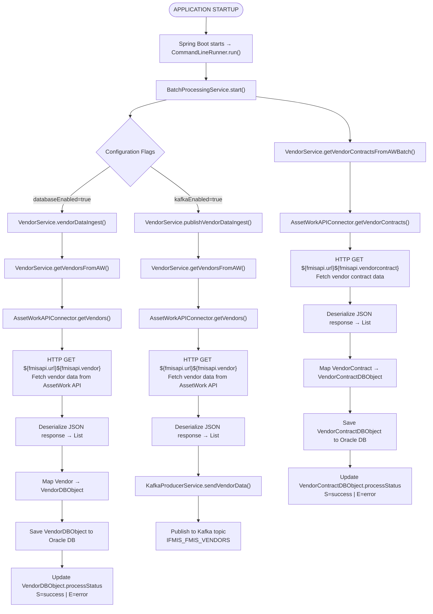

# Ifmis Vendor Ingest In — Detailed Flow Documentation

## Table of Contents

1. [Overview](#1-overview)
2. [Glossary & Key Terminology](#2-glossary--key-terminology)
3. [Architecture & Technology Stack](#3-architecture--technology-stack)
    - [Key Classes](#key-classes)
    - [Key Technologies and Their Usage](#key-technologies-and-their-usage)
    - [Key Configuration Properties](#key-configuration-properties)
4. [Configuration & Environment Variables](#4-configuration--environment-variables)
    - [Database Configuration](#database-configuration)
    - [Kafka Configuration](#kafka-configuration)
    - [AssetWork API Configuration](#assetwork-api-configuration)
    - [Retry Configuration](#retry-configuration)
    - [Batch Processing Configuration](#batch-processing-configuration)
    - [Proxy Configuration](#proxy-configuration)
    - [Feature Toggles](#feature-toggles)
5. [Application Startup](#5-application-startup)
    - [Step-by-step:](#step-by-step)
6. [Authentication — Token API](#6-authentication--token-api)
    - [API Call](#api-call)
    - [Response Handling](#response-handling)
    - [Retry Logic](#retry-logic)
    - [When It's Called](#when-its-called)
    - [Error Handling](#error-handling)
7. [Vendor Data Processing Flow](#7-vendor-data-processing-flow)
    - [Step 1: Application Startup and Batch Processing Initialization](#step-1-application-startup-and-batch-processing-initialization)
    - [Step 2: Vendor Data Ingestion](#step-2-vendor-data-ingestion)
    - [Step 3: Vendor Data Publishing to Kafka](#step-3-vendor-data-publishing-to-kafka)
    - [Step 4: Vendor Contract Data Retrieval](#step-4-vendor-contract-data-retrieval)
    - [Step 5: Save Vendor Contract Data to Database](#step-5-save-vendor-contract-data-to-database)
8. [Vendor Contract Processing Flow](#8-vendor-contract-processing-flow)
    - [Step 1: Retrieve Vendor Contracts in Batches](#step-1-retrieve-vendor-contracts-in-batches)
    - [Step 2: Save Vendor Contracts to Database](#step-2-save-vendor-contracts-to-database)
    - [Step 3: Update Process Status](#step-3-update-process-status)
    - [Step 4: Error Handling and Retry Logic](#step-4-error-handling-and-retry-logic)
    - [Summary](#summary)
9. [Database Table & Entity](#9-database-table--entity)
    - [Table: `VendorDBObject`](#table-vendordbobject)
    - [Table: `VendorContractDBObject`](#table-vendorcontractdbobject)
    - [Entity: `Vendor`](#entity-vendor)
    - [Entity: `VendorContract`](#entity-vendorcontract)
    - [Entity: `VendorKafka`](#entity-vendorkafka)
    - [Entity: `VendorContractKafka`](#entity-vendorcontractkafka)
    - [Relationships Between Tables and Entities](#relationships-between-tables-and-entities)
    - [Summary](#summary)
10. [Data Mapping (MapStruct)](#10-data-mapping-mapstruct)
    - [Vendor Mapping (`ModelHelper.mapVendorToDBObject`)](#vendor-mapping-modelhelpermapvendortodbobject)
    - [Vendor Contract Mapping (`ModelHelper.mapVendorContractToDBObject`)](#vendor-contract-mapping-modelhelpermapvendorcontracttodbobject)
    - [Vendor Kafka Mapping (`ModelHelper.mapVendorToKafka`)](#vendor-kafka-mapping-modelhelpermapvendortokafka)
    - [Vendor Contract Kafka Mapping (`ModelHelper.mapVendorContractToKafka`)](#vendor-contract-kafka-mapping-modelhelpermapvendorcontracttokafka)
    - [Summary](#summary)
11. [API Endpoints Summary](#11-api-endpoints-summary)
    - [All API calls go to the AssetWork (AW/M5) system](#all-api-calls-go-to-the-assetwork-awm5-system)
    - [Request/Response Format](#requestresponse-format)
    - [Notes on API Usage](#notes-on-api-usage)
12. [Error Handling & Status Tracking](#12-error-handling--status-tracking)
    - [Error Handling Strategy](#error-handling-strategy)
    - [What Happens on Error](#what-happens-on-error)
    - [Retry Mechanism](#retry-mechanism)
    - [Status Tracking](#status-tracking)
    - [Validation](#validation)
    - [Summary](#summary)
13. [WebClient & Proxy Configuration Details](#13-webclient--proxy-configuration-details)
    - [Proxy Configuration](#proxy-configuration)
    - [Memory Buffer Configuration](#memory-buffer-configuration)
    - [WebClient Configuration Details](#webclient-configuration-details)
    - [Code Implementation](#code-implementation)
    - [Summary](#summary)
14. [Legacy / Unused Classes](#14-legacy--unused-classes)
    - [`Vendor`](#vendor)
    - [`VendorContract`](#vendorcontract)
    - [`VendorConractId`](#vendorconractid)
    - [`WebClientConfig`](#webclientconfig)
    - [`AppConstants`](#appconstants)
    - [Summary](#summary)
15. [End-to-End Flow Diagram](#15-end-to-end-flow-diagram)
16. [Key Business Rules Summary](#16-key-business-rules-summary)
17. [AssetWorks API Call Audit](#17-assetworks-api-call-audit)
    - [Base URL](#base-url)
    - [Authentication](#authentication)
    - [API Endpoints](#api-endpoints)
    - [Summary of API Call Audit](#summary-of-api-call-audit)

---

## 1. Overview
The **IFMIS Vendor Ingest In Service** is a **Spring Boot application** designed to fetch vendor and vendor contract information from the AssetWork (AW) API, store the data in an Oracle database, and publish vendor data to a Kafka topic for further processing.

**Key characteristics:**

- The service is a Spring Boot application with the main entry point defined in the `IfmisVendorIngestInApplication` class.
- It integrates with the AssetWork API to fetch vendor and vendor contract data using REST API calls.
- The service ingests vendor and vendor contract data into an Oracle database using JPA repositories (`VendorRepository` and `VendorContractRepository`).
- Vendor data is published to a Kafka topic (`IFMIS_FMIS_VENDORS`) for downstream processing.
- The service supports batch processing of vendor and vendor contract data, with configurable batch sizes and retry mechanisms.
- The service is configurable via `application.properties` and environment variables, allowing customization of database, Kafka, and API connection settings.
- The service includes error handling and retry logic for failed API calls and database operations.
- The service is containerized using Docker, with a base image of `artifactory.usps.gov/common-docker/usps-neo/java:v17-jre`.

**Primary processing flows:**

1. **Vendor Data Ingestion Flow**: Fetches vendor data from the AssetWork API and ingests it into the Oracle database.
2. **Vendor Data Publishing Flow**: Publishes vendor data to the Kafka topic `IFMIS_FMIS_VENDORS`.
3. **Vendor Contract Data Retrieval Flow**: Fetches vendor contract data from the AssetWork API in batches and processes it.

**External integrations:**

- **AssetWork API**: Used to fetch vendor and vendor contract data via REST API calls.
- **Oracle Database**: Stores vendor and vendor contract data using JPA entities and repositories.
- **Kafka**: Publishes vendor data to the `IFMIS_FMIS_VENDORS` topic and error messages to the `IFMIS_USPS_ERRORS` topic.

**Configuration highlights:**

- **Database Configuration**: Connection settings for an Oracle database are defined in `application.properties` using the `spring.datasource.*` and `spring.jpa.*` properties.
- **Kafka Configuration**: Kafka producer settings, including bootstrap servers, SSL configurations, and topic names, are defined in `application.properties`.
- **AssetWork API Configuration**: API endpoint URLs, authentication credentials, and retry settings are defined in `application.properties`.

This service is designed to operate as a backend system for processing vendor-related data, ensuring seamless integration between the AssetWork API, the Oracle database, and Kafka for downstream processing.

---

## 2. Glossary & Key Terminology
| Term                          | Full Name                              | Description                                                                                                   |
|-------------------------------|----------------------------------------|---------------------------------------------------------------------------------------------------------------|
| **IFMIS**                     | Integrated Fleet Management Information System | The overarching system responsible for managing vendor and vendor contract data, among other functionalities. |
| **M5**                        | M5 / AssetWorks                        | The external third-party system from which vendor and vendor contract data is fetched via API calls.          |
| **AssetWork API (AW)**        | AssetWork API                          | The API provided by the M5 system, used to fetch vendor and vendor contract data.                             |
| **Vendor**                    | Vendor                                 | A business entity that provides goods or services, represented in the system by the `Vendor` and `VendorDBObject` classes. |
| **Vendor Contract**           | Vendor Contract                        | A contract between a vendor and the organization, represented in the system by the `VendorContract` and `VendorContractDBObject` classes. |
| **Kafka**                     | Apache Kafka                           | A distributed event streaming platform used to publish vendor data for further processing.                    |
| **Kafka Topic**               | —                                      | A category or feed name to which Kafka messages are published. This service uses the `IFMIS_FMIS_VENDORS` topic for vendor data and `IFMIS_USPS_ERRORS` for error messages. |
| **HikariCP**                  | Hikari Connection Pool                 | A high-performance JDBC connection pool used for managing database connections in the service.                |
| **Spring Boot**               | —                                      | A Java-based framework used to build and run the `ifmis-vendor-ingest-in` microservice.                       |
| **Spring Data JPA**           | —                                      | A Spring framework module used for interacting with the Oracle database through JPA repositories.             |
| **Oracle Database**           | —                                      | The relational database used to store vendor and vendor contract data fetched from the AssetWork API.         |
| **HikariPoolBooks**           | —                                      | The name of the Hikari connection pool configured in the application for database connections.                |
| **Process Status**            | —                                      | A field in the database entities (`VendorDBObject` and `VendorContractDBObject`) indicating the processing status of a record. |
| **Error Message**             | —                                      | A field in the `VendorDBObject` entity used to store error messages encountered during processing.            |
| **Batch Processing**          | —                                      | The process of fetching, processing, and storing vendor and vendor contract data in bulk from the AssetWork API. |
| **Retry Mechanism**           | —                                      | A mechanism to retry failed API calls to the AssetWork API, with configurable retry count and interval.        |
| **Database Ingestion**        | —                                      | The process of saving vendor and vendor contract data fetched from the AssetWork API into the Oracle database. |
| **Kafka Publishing**          | —                                      | The process of sending vendor data to the Kafka topic `IFMIS_FMIS_VENDORS` for downstream processing.          |
| **API Proxy**                 | —                                      | A proxy configuration used for making HTTP requests to the AssetWork API.                                     |
| **Environment Variables**     | —                                      | Configuration values provided at runtime, such as database credentials, API URLs, and Kafka connection details. |
| **Spring WebFlux**            | —                                      | A reactive programming module in Spring Boot used for making non-blocking HTTP requests to the AssetWork API. |
| **JSON**                      | JavaScript Object Notation             | The data format used for exchanging vendor and vendor contract information between the service and the AssetWork API. |
| **Page Count**                | —                                      | A configuration property (`fmisapi.response.page.count`) that determines the number of records fetched per API call. |
| **Batch Size**                | —                                      | A configuration property (`batch.size`) that determines the number of vendor records processed in a single batch. |
| **Retry Count**               | —                                      | A configuration property (`retry.count`) that specifies the number of retry attempts for failed API calls.     |
| **Retry Interval**            | —                                      | A configuration property (`retry.interval`) that specifies the time interval (in milliseconds) between retry attempts. |
| **HikariCP Settings**         | —                                      | Configuration properties for the Hikari connection pool, such as `minimumIdle`, `maximumPoolSize`, and `idleTimeout`. |
| **Spring JPA Settings**       | —                                      | Configuration properties for JPA, such as `spring.jpa.database-platform` and `spring.jpa.show-sql`.            |
| **SSL Configuration**         | —                                      | Configuration properties for enabling SSL in Kafka connections, such as `spring.kafka.ssl.trust-store-location` and `spring.kafka.ssl.key-store-location`. |
| **Consumer Group ID**         | —                                      | A configuration property (`kafka.radar.vendor-contact.groupId`) that specifies the Kafka consumer group ID.    |
| **Listener Factory**          | —                                      | A configuration property (`kafka.radar.vendor-contact.listener`) that specifies the Kafka listener factory.    |
| **Error Topic**               | —                                      | The Kafka topic (`kafka.error.topic`) used to publish error messages encountered during vendor data processing. |

---

## 3. Architecture & Technology Stack

| Component              | Technology                                                                 |
|------------------------|---------------------------------------------------------------------------|
| **Framework**          | Spring Boot (3.5.14)                                                     |
| **HTTP Client**        | Spring WebFlux `WebClient` (reactive, used in blocking mode via `.block()`) |
| **Database**           | Oracle (via Spring Data JPA + Hibernate)                                 |
| **Connection Pool**    | HikariCP                                                                 |
| **Object Mapping**     | Jackson (for JSON serialization/deserialization)                         |
| **Message Broker**     | Apache Kafka (via Spring Kafka)                                          |
| **Configuration**      | Spring Boot `application.properties` with environment variable overrides |
| **Build Tool**         | Maven                                                                    |
| **Containerization**   | Docker (Base image: `artifactory.usps.gov/common-docker/usps-neo/java:v17-jre`) |

### Key Classes

| Class                          | Role                                                                                     |
|--------------------------------|------------------------------------------------------------------------------------------|
| `IfmisVendorIngestInApplication` | Main entry point for the application. Implements `CommandLineRunner` to initiate processing. |
| `BatchProcessingService`       | Orchestrates the batch processing of vendor and vendor contract data ingestion and publishing. |
| `VendorService`                | Handles vendor and vendor contract data retrieval, processing, and publishing logic.     |
| `AssetWorkAPIConnector`        | Responsible for making HTTP requests to the AssetWork API to fetch vendor and vendor contract data. |
| `KafkaProducerService`         | Handles publishing vendor data to the Kafka topic `IFMIS_FMIS_VENDORS`.                  |
| `VendorRepository`             | Spring Data JPA repository for managing `VendorDBObject` entities in the Oracle database. |
| `VendorContractRepository`     | Spring Data JPA repository for managing `VendorContractDBObject` entities in the Oracle database. |
| `WebClientConfig`              | Configures the `WebClient` bean for making HTTP requests to the AssetWork API.           |
| `ModelHelper`                  | Utility class for handling model transformations and validations.                        |

### Key Technologies and Their Usage

1. **Spring Boot**: The application is built using Spring Boot 3.5.14, which provides the foundation for dependency injection, configuration management, and application lifecycle management. The main application class, `IfmisVendorIngestInApplication`, implements `CommandLineRunner` to execute the batch processing logic upon application startup.

2. **Spring WebFlux `WebClient`**: The `AssetWorkAPIConnector` class uses `WebClient` to make HTTP GET requests to the AssetWork API. Although `WebClient` is a reactive library, it is used in a blocking manner with the `.block()` method to fetch data synchronously.

3. **Oracle Database**: The service uses an Oracle database for storing vendor and vendor contract data. The database connection is managed using Spring Data JPA and Hibernate. The `VendorRepository` and `VendorContractRepository` classes define the database operations.

4. **HikariCP**: The application uses HikariCP as the connection pool for managing database connections. Configuration properties such as `spring.datasource.hikari.maximumPoolSize` and `spring.datasource.hikari.connectionTimeout` are defined in `application.properties`.

5. **Apache Kafka**: The service integrates with Apache Kafka for publishing vendor data to the topic `IFMIS_FMIS_VENDORS`. The `KafkaProducerService` handles the production of messages, and Kafka-specific configurations are defined in `application.properties`.

6. **Configuration Management**: The application uses `application.properties` for configuration, with support for environment variable overrides. Key configurations include database connection settings, Kafka properties, API proxy settings, and retry mechanisms.

7. **Object Mapping**: Jackson is used for JSON serialization and deserialization, particularly in the `AssetWorkAPIConnector` and `VendorService` classes for handling API responses and preparing Kafka messages.

8. **Docker**: The application is containerized using Docker. The `Dockerfile` specifies the base image `artifactory.usps.gov/common-docker/usps-neo/java:v17-jre`, copies the application JAR file, exposes port 8080, and sets the default command to run the application.

### Key Configuration Properties

| Property Key                                      | Description                                                                                     | Default Value / Example Value                  |
|---------------------------------------------------|-------------------------------------------------------------------------------------------------|-----------------------------------------------|
| `spring.datasource.url`                          | JDBC URL for connecting to the Oracle database.                                                | `${DB_CONNECTION_STRING}`                     |
| `spring.datasource.username`                     | Username for the Oracle database.                                                              | `${DB_USERNAME}`                              |
| `spring.datasource.password`                     | Password for the Oracle database.                                                              | `${DB_PASSWORD}`                              |
| `spring.datasource.driver-class-name`            | JDBC driver class name for Oracle database.                                                    | `oracle.jdbc.OracleDriver`                    |
| `spring.datasource.hikari.minimumIdle`           | Minimum number of idle connections in the HikariCP connection pool.                            | `5`                                           |
| `spring.datasource.hikari.maximumPoolSize`       | Maximum number of connections in the HikariCP connection pool.                                 | `20`                                          |
| `spring.datasource.hikari.idleTimeout`           | Maximum idle time for connections in the HikariCP connection pool (in milliseconds).           | `30000`                                       |
| `spring.datasource.hikari.maxLifetime`           | Maximum lifetime of a connection in the HikariCP connection pool (in milliseconds).            | `2000000`                                     |
| `spring.datasource.hikari.connectionTimeout`     | Maximum time to wait for a connection from the HikariCP connection pool (in milliseconds).     | `30000`                                       |
| `spring.datasource.hikari.poolName`              | Name of the HikariCP connection pool.                                                          | `HikariPoolBooks`                             |
| `spring.jpa.database-platform`                   | Hibernate dialect for the Oracle database.                                                     | `org.hibernate.dialect.OracleDialect`         |
| `spring.jpa.hibernate.use-new-id-generator-mappings` | Whether to use new ID generator mappings in Hibernate.                                         | `false`                                       |
| `spring.jpa.properties.hibernate.default_schema` | Default schema for Hibernate.                                                                  | `${DB_SCHEMA}`                                |
| `spring.kafka.bootstrap-servers`                 | Kafka broker connection string.                                                                | `${KAFKA_CONNECTION_STRING}`                  |
| `spring.kafka.ssl.trust-store-location`          | Path to the Kafka SSL trust store.                                                             | `file:${IFMIS_CERTS_DIR}/${KAFKA_TRUSTSTORE}` |
| `spring.kafka.ssl.trust-store-password`          | Password for the Kafka SSL trust store.                                                        | `${KAFKA_TRUSTSTORE_KEY}`                     |
| `spring.kafka.ssl.key-store-location`            | Path to the Kafka SSL key store.                                                               | `file:${IFMIS_CERTS_DIR}/${KAFKA_KEYSTORE}`   |
| `spring.kafka.ssl.key-store-password`            | Password for the Kafka SSL key store.                                                          | `${KAFKA_KEYSTORE_KEY}`                       |
| `spring.kafka.security.protocol`                 | Security protocol for Kafka communication.                                                     | `SSL`                                         |
| `kafka.radar.vendor-contact.topic`               | Kafka topic for publishing vendor data.                                                        | `IFMIS_FMIS_VENDORS`                          |
| `kafka.error.topic`                               | Kafka topic for publishing error messages.                                                     | `IFMIS_USPS_ERRORS`                           |
| `fmisapi.url`                                    | Base URL for the AssetWork API.                                                                | `${AW_CONNECTION_STRING}`                     |
| `fmisapi.vendor`                                 | Path for fetching vendor data from the AssetWork API.                                          | `/api/v1/vendors`                             |
| `fmisapi.vendorcontract`                         | Path for fetching vendor contract data from the AssetWork API.                                 | `/api/v1/vendorContracts`                     |
| `fmisapi.tokenurl`                               | Path for fetching an authentication token from the AssetWork API.                              | `/api/token`                                  |
| `fmisapi.user`                                   | Username for authenticating with the AssetWork API.                                            | `${AW_USERNAME}`                              |
| `fmisapi.password`                               | Password for authenticating with the AssetWork API.                                            | `${AW_PASSWORD}`                              |
| `fmisapi.retry.count`                            | Number of retry attempts for failed API calls.                                                 | `${AW_RETRY_COUNT:3}`                         |
| `fmisapi.retry.interval`                         | Interval between retry attempts for failed API calls (in milliseconds).                        | `${AW_RETRY_INTERVAL:500}`                    |
| `retry.count`                                    | Number of retry attempts for general operations.                                               | `${RETRY_COUNT}`                              |
| `retry.interval`                                 | Interval between retry attempts for general operations (in milliseconds).                      | `${RETRY_INTERVAL}`                           |
| `batch.size`                                     | Batch size for processing vendor data.                                                         | `${VENDORS_BATCH_SIZE}`                       |
| `databaseEnabled`                                | Flag to enable or disable database ingestion.                                                  | `${DB_ENABLED}`                               |
| `kafkaEnabled`                                   | Flag to enable or disable Kafka publishing.                                                    | `${KAFKA_ENABLED}`                            |
| `api.proxy.enabled`                              | Flag to enable or disable the HTTP proxy.                                                      | `true`                                        |
| `api.proxy.host`                                 | Hostname of the HTTP proxy.                                                                    | `${USPS_HTTP_PROXY_HOST}`                     |
| `api.proxy.port`                                 | Port of the HTTP proxy.                                                                        | `${USPS_HTTP_PROXY_PORT}`                     |

---

## 4. Configuration & Environment Variables

Configuration for the `ifmis-vendor-ingest-in` service is defined in the `application.properties` file and can be overridden using environment variables. Below is a detailed breakdown of all configuration properties, their corresponding environment variables, and their purposes.

### Database Configuration

| Property                                  | Env Variable         | Description                                                                 |
|-------------------------------------------|----------------------|-----------------------------------------------------------------------------|
| `spring.datasource.url`                   | `DB_CONNECTION_STRING` | Oracle JDBC connection string for the database.                            |
| `spring.datasource.username`              | `DB_USERNAME`        | Username for connecting to the Oracle database.                            |
| `spring.datasource.password`              | `DB_PASSWORD`        | Password for connecting to the Oracle database.                            |
| `spring.datasource.driver-class-name`     | —                    | JDBC driver class name (`oracle.jdbc.OracleDriver`).                       |
| `spring.datasource.hikari.minimumIdle`    | —                    | Minimum number of idle connections in the Hikari connection pool (default: 5). |
| `spring.datasource.hikari.maximumPoolSize`| —                    | Maximum number of connections in the Hikari connection pool (default: 20). |
| `spring.datasource.hikari.idleTimeout`    | —                    | Maximum idle time for connections in the pool (default: 30000 ms).         |
| `spring.datasource.hikari.maxLifetime`    | —                    | Maximum lifetime of a connection in the pool (default: 2000000 ms).        |
| `spring.datasource.hikari.connectionTimeout` | —                  | Maximum time to wait for a connection from the pool (default: 30000 ms).   |
| `spring.datasource.hikari.poolName`       | —                    | Name of the Hikari connection pool (`HikariPoolBooks`).                    |
| `spring.jpa.database-platform`            | —                    | Hibernate dialect for Oracle database (`org.hibernate.dialect.OracleDialect`). |
| `spring.jpa.hibernate.use-new-id-generator-mappings` | —         | Whether to use new Hibernate ID generator mappings (default: `false`).     |
| `spring.jpa.properties.hibernate.default_schema` | `DB_SCHEMA` | Default schema for the Oracle database.                                    |
| `spring.jpa.show-sql`                     | —                    | Whether to show SQL statements in logs (default: `false`).                 |

### Kafka Configuration

| Property                                  | Env Variable         | Description                                                                 |
|-------------------------------------------|----------------------|-----------------------------------------------------------------------------|
| `kafka.enabled`                           | `KAFKA_ENABLED`      | Enables or disables Kafka integration (default: `true`).                   |
| `spring.kafka.bootstrap-servers`          | `KAFKA_CONNECTION_STRING` | Kafka broker connection string.                                            |
| `spring.kafka.ssl.trust-store-location`   | `IFMIS_CERTS_DIR` + `KAFKA_TRUSTSTORE` | Path to the Kafka SSL trust store file.                                    |
| `spring.kafka.ssl.trust-store-password`   | `KAFKA_TRUSTSTORE_KEY` | Password for the Kafka SSL trust store.                                    |
| `spring.kafka.ssl.key-store-location`     | `IFMIS_CERTS_DIR` + `KAFKA_KEYSTORE` | Path to the Kafka SSL key store file.                                      |
| `spring.kafka.ssl.key-store-password`     | `KAFKA_KEYSTORE_KEY` | Password for the Kafka SSL key store.                                      |
| `spring.kafka.security.protocol`          | —                    | Security protocol for Kafka communication (`SSL`).                         |
| `kafka.error.topic`                       | —                    | Kafka topic for publishing error messages (`IFMIS_USPS_ERRORS`).           |
| `kafka.radar.vendor-contact.consumer-enabled` | —                | Enables or disables the Kafka consumer for vendor contact data (`true`).   |
| `kafka.radar.vendor-contact.commitFrequenc` | —                  | Frequency of committing Kafka offsets (default: 10).                       |
| `kafka.radar.vendor-contact.groupId`      | —                    | Kafka consumer group ID (`radar-vendor-contact-test1`).                    |
| `kafka.radar.vendor-contact.topic`        | —                    | Kafka topic for publishing vendor data (`IFMIS_FMIS_VENDORS`).             |
| `kafka.radar.vendor-contact.listener`     | —                    | Kafka listener factory for vendor contact data (`radarVendorContrctListenerFactory`). |
| `kafka.radar.vendor-contact.consumer.count` | —                  | Number of Kafka consumers for vendor contact data (default: 1).            |

### AssetWork API Configuration

| Property                                  | Env Variable         | Description                                                                 |
|-------------------------------------------|----------------------|-----------------------------------------------------------------------------|
| `fmisapi.url`                             | `AW_CONNECTION_STRING` | Base URL for the AssetWork API.                                            |
| `fmisapi.vendor`                          | —                    | Endpoint for fetching vendor data (`/api/v1/vendors`).                     |
| `fmisapi.vendorcontract`                  | —                    | Endpoint for fetching vendor contract data (`/api/v1/vendorContracts`).    |
| `fmisapi.response.page.count`             | `PAGE_COUNT`         | Number of records per page in API responses.                               |
| `fmisapi.tokenurl`                        | —                    | Endpoint for obtaining an API token (`/api/token`).                        |
| `fmisapi.user`                            | `AW_USERNAME`        | Username for authenticating with the AssetWork API.                        |
| `fmisapi.password`                        | `AW_PASSWORD`        | Password for authenticating with the AssetWork API.                        |
| `fmisapi.site`                            | `AW_SITE`            | Site identifier for the AssetWork API.                                     |
| `fmisapi.retry.count`                     | `AW_RETRY_COUNT`     | Number of retry attempts for failed API calls (default: 3).                |
| `fmisapi.retry.interval`                  | `AW_RETRY_INTERVAL`  | Interval between retry attempts for failed API calls (default: 500 ms).    |

### Retry Configuration

| Property          | Env Variable | Description                                                                 |
|-------------------|--------------|-----------------------------------------------------------------------------|
| `retry.count`     | `RETRY_COUNT` | Number of retry attempts for failed operations.                            |
| `retry.interval`  | `RETRY_INTERVAL` | Interval between retry attempts for failed operations.                    |

### Batch Processing Configuration

| Property          | Env Variable       | Description                                                                 |
|-------------------|--------------------|-----------------------------------------------------------------------------|
| `batch.size`      | `VENDORS_BATCH_SIZE` | Number of vendors to process in each batch.                                |

### Proxy Configuration

| Property          | Env Variable         | Description                                                                 |
|-------------------|----------------------|-----------------------------------------------------------------------------|
| `api.proxy.enabled` | —                  | Enables or disables the use of a proxy for API calls (`true`).             |
| `api.proxy.host`  | `USPS_HTTP_PROXY_HOST` | Hostname of the HTTP proxy server.                                         |
| `api.proxy.port`  | `USPS_HTTP_PROXY_PORT` | Port of the HTTP proxy server.                                             |

### Feature Toggles

| Property          | Env Variable | Description                                                                 |
|-------------------|--------------|-----------------------------------------------------------------------------|
| `databaseEnabled` | `DB_ENABLED` | Enables or disables database ingestion.                                     |
| `kafkaEnabled`    | `KAFKA_ENABLED` | Enables or disables Kafka publishing.                                      |

---

## 5. Application Startup

```
main()
  └──> SpringApplication.run(IfmisVendorIngestInApplication.class, args)
         └──> CommandLineRunner.run()
                └──> BatchProcessingService.start()
                       ├──> VendorService.vendorDataIngest()
                       │      └──> VendorService.getVendorsFromAW()
                       │             └──> AssetWorkAPIConnector.getVendors()
                       │                    └──> WebClient.get().uri(fmisapi.url + fmisapi.vendor).retrieve().bodyToMono()
                       ├──> VendorService.publishVendorDataIngest()
                       │      └──> KafkaProducerService.sendVendorData()
                       └──> VendorService.getVendorContractsFromAWBatch()
                              └──> AssetWorkAPIConnector.getVendorContracts()
                                     └──> WebClient.get().uri(fmisapi.url + fmisapi.vendorcontract).retrieve().bodyToMono()
```

### Step-by-step:

1. **Application Entry Point**:
   - The `main()` method in `IfmisVendorIngestInApplication` is the entry point of the application.
   - It invokes `SpringApplication.run(IfmisVendorIngestInApplication.class, args)` to bootstrap the Spring Boot application.

2. **Spring Boot Initialization**:
   - During startup, Spring Boot initializes all application components, including:
     - **Database Connection**: Configured using HikariCP with properties defined in `application.properties` (e.g., `spring.datasource.url`, `spring.datasource.username`, `spring.datasource.password`).
     - **WebClient**: Configured in `WebClientConfig` with optional proxy settings (`api.proxy.enabled`, `api.proxy.host`, `api.proxy.port`).
     - **JPA Repositories**: `VendorRepository` and `VendorContractRepository` are initialized for database operations.
     - **Services**: `BatchProcessingService`, `VendorService`, `KafkaProducerService`, and `AssetWorkAPIConnector` are instantiated and injected into dependent components.

3. **CommandLineRunner Execution**:
   - After the application context is initialized, the `CommandLineRunner.run()` method is automatically invoked.
   - This method delegates to `BatchProcessingService.start()` to begin the main processing flows.

4. **Batch Processing Initialization**:
   - The `BatchProcessingService.start()` method orchestrates the main processing flows based on configuration flags:
     - If `databaseEnabled` is `true`, the `VendorService.vendorDataIngest()` method is called to fetch vendor data from the AssetWork API and save it to the Oracle database.
     - If `kafkaEnabled` is `true`, the `VendorService.publishVendorDataIngest()` method is called to publish vendor data to the Kafka topic `IFMIS_FMIS_VENDORS`.

5. **Vendor Data Ingestion**:
   - The `VendorService.vendorDataIngest()` method is responsible for retrieving vendor data from the AssetWork API and saving it to the database.
   - It calls `VendorService.getVendorsFromAW()`, which uses the `AssetWorkAPIConnector.getVendors()` method to make an HTTP GET request to the AssetWork API endpoint `${fmisapi.url}${fmisapi.vendor}`.
   - The `AssetWorkAPIConnector.getVendors()` method uses a `WebClient` instance to send the request and retrieve the response as a `Mono` object. The response is then deserialized into a list of `Vendor` objects.

6. **Vendor Data Publishing**:
   - The `VendorService.publishVendorDataIngest()` method is responsible for publishing vendor data to the Kafka topic.
   - It calls `KafkaProducerService.sendVendorData()`, which sends vendor data to the Kafka topic specified in the `kafka.radar.vendor-contact.topic` property (`IFMIS_FMIS_VENDORS`).

7. **Vendor Contract Data Retrieval**:
   - The `VendorService.getVendorContractsFromAWBatch()` method retrieves vendor contract data from the AssetWork API in batches.
   - It calls `AssetWorkAPIConnector.getVendorContracts()`, which makes an HTTP GET request to the AssetWork API endpoint `${fmisapi.url}${fmisapi.vendorcontract}`.
   - The `AssetWorkAPIConnector.getVendorContracts()` method uses a `WebClient` instance to send the request and retrieve the response as a `Mono` object. The response is then deserialized into a list of `VendorContract` objects.

8. **Error Handling**:
   - Each processing step in `BatchProcessingService.start()` is wrapped in a try-catch block to handle exceptions.
   - If an exception occurs during vendor data ingestion or publishing, the error is logged, and the application continues with the next step.

9. **Application Lifecycle**:
   - After completing the batch processing flows, the application logs the completion status and exits.

---

## 6. Authentication — Token API

Before fetching vendor or vendor contract data from the AssetWork API, the service must authenticate by obtaining a bearer token.

### API Call

| Attribute       | Value                                      |
|-----------------|--------------------------------------------|
| **Method**      | `POST`                                    |
| **URL**         | `${AW_CONNECTION_STRING}/api/token`       |
| **Content-Type**| `application/json`                        |
| **Request Body**| `{ "Username": "...", "Password": "...", "Site": "..." }` |

#### Request Body Fields

| Field Name | Type   | Description                          | Source Configuration Key |
|------------|--------|--------------------------------------|---------------------------|
| `Username` | String | The username for authentication.     | `fmisapi.user`            |
| `Password` | String | The password for authentication.     | `fmisapi.password`        |
| `Site`     | String | The site identifier for the API.     | `fmisapi.site`            |

### Response Handling

The response from the token API is expected to be in JSON format:

```
Response JSON:
{
  "httpStatusCode": "OK",
  "items": ["<bearer-token-string>"]
}
```

#### Processing Logic:
1. If the `httpStatusCode` is `"OK"` and the `items` array is present:
   - The first item in the `items` array is extracted as the **bearer token**.
   - The token is stored as a **static variable** (`authToken`) in the `AssetWorkAPIConnector` class.
   - This token is reused for all subsequent API calls by including it in the `Authorization` header as `Bearer <token>`.
2. If the `httpStatusCode` is not `"OK"` or the `items` array is missing:
   - An error is logged, and the service retries the token request based on the retry configuration (`fmisapi.retry.count` and `fmisapi.retry.interval`).

### Retry Logic

The service implements a retry mechanism for the token API call:
- **Retry Count**: Configured via `fmisapi.retry.count` (default: 3).
- **Retry Interval**: Configured via `fmisapi.retry.interval` (default: 500 milliseconds).
- If the token request fails, the service retries up to the configured number of attempts with the specified interval between retries.

### When It's Called

The token API is invoked by the `AssetWorkAPIConnector` class before making any other API calls to the AssetWork API. The token is fetched once per application run and cached in a static variable (`authToken`) for reuse.

#### Relevant Methods:
- **`AssetWorkAPIConnector.getToken()`**:
  - Constructs the token API request using the `fmisapi.user`, `fmisapi.password`, and `fmisapi.site` configuration properties.
  - Sends the request to `${AW_CONNECTION_STRING}/api/token`.
  - Parses the response to extract and store the bearer token.

- **`AssetWorkAPIConnector.getVendors()` and `AssetWorkAPIConnector.getVendorContracts()`**:
  - Include the cached bearer token in the `Authorization` header for all subsequent API calls:
    ```
    Authorization: Bearer <token>
    ```

### Error Handling

- If the token API call fails after the maximum number of retries:
  - The service logs the failure and terminates further processing.
  - No vendor or vendor contract data is fetched from the AssetWork API without a valid token.

---

## 7. Vendor Data Processing Flow

**Entry point:** `IfmisVendorIngestInApplication.run()`

The vendor data processing flow in the `ifmis-vendor-ingest-in` service involves fetching vendor and vendor contract data from the AssetWork API, ingesting the data into an Oracle database, and publishing vendor data to a Kafka topic. This flow is orchestrated by the `BatchProcessingService` and involves multiple steps and components.

### Step 1: Application Startup and Batch Processing Initialization

1. The application starts with the `IfmisVendorIngestInApplication.run()` method, which is the entry point for the Spring Boot application.
2. The `run()` method calls `BatchProcessingService.start()` to initialize the batch processing workflow.
3. Inside `BatchProcessingService.start()`, the following configuration flags are checked to determine the processing steps:
   - `databaseEnabled` (from `application.properties`): If `true`, vendor data ingestion into the database is initiated.
   - `kafkaEnabled` (from `application.properties`): If `true`, vendor data publishing to Kafka is initiated.

### Step 2: Vendor Data Ingestion

**Condition:** If `databaseEnabled` is `true`, the service proceeds with vendor data ingestion.

#### 2.1 Fetch Vendor Data from AssetWork API

| Attribute | Value |
|-----------|-------|
| **Method** | `GET` |
| **URL** | `${fmisapi.url}${fmisapi.vendor}` |
| **Auth** | Basic Authentication (username: `${fmisapi.user}`, password: `${fmisapi.password}`) |
| **Headers** | `Content-Type: application/json` |
| **Query Parameters** | None |

- The `VendorService.getVendorsFromAW()` method calls `AssetWorkAPIConnector.getVendors()` to fetch vendor data from the AssetWork API.
- The response is expected to be in JSON format and is deserialized into a list of `Vendor` objects.
- **Response JSON structure:**
  ```json
  [
    {
      "vendorId": "string",
      "vendorName": "string",
      "activeVendor": true,
      "address": "string",
      "city": "string",
      "state": "string",
      "zipCode": "string",
      "phoneNumber": "string",
      "email": "string"
    }
  ]
  ```
- **Error Handling:**
  - If the API call fails, the service retries the request based on the retry configuration:
    - `fmisapi.retry.count`: Number of retry attempts (default: 3).
    - `fmisapi.retry.interval`: Interval between retries in milliseconds (default: 500 ms).
  - If all retries fail, an error is logged, and the process continues with the next step.

#### 2.2 Save Vendor Data to Database

- The `VendorService.vendorDataIngest()` method processes the fetched vendor data and saves it to the Oracle database using the `VendorRepository`.
- **Database Operations:**

| Class              | Method                                      | SQL or JPA Query                                                                                     | Table(s) Accessed | Parameters       | Return Type | Purpose                                                                 |
|--------------------|---------------------------------------------|------------------------------------------------------------------------------------------------------|-------------------|------------------|-------------|-------------------------------------------------------------------------|
| `VendorRepository` | `save(VendorDBObject vendor)`               | `INSERT INTO VendorDBObject (fields...) VALUES (values...)`                                          | `VendorDBObject`  | `VendorDBObject` | `VendorDBObject` | Inserts a new vendor record into the database.                         |
| `VendorRepository` | `updateProcessedStatus(String, String, String)` | `UPDATE VendorDBObject v SET v.processStatus = :processed, v.errorMessage = :errMessage WHERE v.vendorNo = :vendorId` | `VendorDBObject`  | `vendorId`, `processed`, `errMessage` | `int` | Updates the `processStatus` and `errorMessage` of a vendor.            |

- **Business Rules:**
  - Vendors with `activeVendor = true` are inserted or updated in the database.
  - Vendors with `activeVendor = false` are only updated if their `previousStatus` is `true` or `null`.

### Step 3: Vendor Data Publishing to Kafka

**Condition:** If `kafkaEnabled` is `true`, the service proceeds with vendor data publishing.

#### 3.1 Publish Vendor Data to Kafka

- The `VendorService.publishVendorDataIngest()` method retrieves vendor data and sends it to the Kafka topic `IFMIS_FMIS_VENDORS` using the `KafkaProducerService.sendVendorData()` method.
- **Kafka Configuration:**
  - `spring.kafka.bootstrap-servers`: Kafka broker connection string.
  - `spring.kafka.ssl.trust-store-location`: Path to the Kafka trust store.
  - `spring.kafka.ssl.trust-store-password`: Password for the Kafka trust store.
  - `spring.kafka.ssl.key-store-location`: Path to the Kafka key store.
  - `spring.kafka.ssl.key-store-password`: Password for the Kafka key store.
  - `spring.kafka.security.protocol`: Set to `SSL`.

| Attribute | Value |
|-----------|-------|
| **Topic Name** | `IFMIS_FMIS_VENDORS` |
| **Producer** | `KafkaProducerService.sendVendorData()` |
| **Message Key** | `vendorId` |
| **Message Value** | Serialized `VendorKafka` object |

- **Message Schema:**
  ```json
  {
    "vendorId": "string",
    "vendorName": "string",
    "activeVendor": true,
    "address": "string",
    "city": "string",
    "state": "string",
    "zipCode": "string",
    "phoneNumber": "string",
    "email": "string"
  }
  ```
- **Error Handling:**
  - If the Kafka producer fails to send a message, the error is logged, and the message is retried based on the Kafka producer's retry configuration.

### Step 4: Vendor Contract Data Retrieval

- The `VendorService.getVendorContractsFromAWBatch()` method retrieves vendor contract data from the AssetWork API in batches of up to 100 vendor IDs per call.
- **API Call:**

| Attribute | Value |
|-----------|-------|
| **Method** | `GET` |
| **URL** | `${fmisapi.url}${fmisapi.vendorcontract}` |
| **Auth** | Basic Authentication (username: `${fmisapi.user}`, password: `${fmisapi.password}`) |
| **Headers** | `Content-Type: application/json` |
| **Query Parameters** | `filter` (string) |

- The response is expected to be in JSON format and is deserialized into a list of `VendorContract` objects.
- **Response JSON structure:**
  ```json
  [
    {
      "contractId": "string",
      "vendorId": "string",
      "contractDetails": "string",
      "startDate": "string",
      "endDate": "string",
      "status": "string"
    }
  ]
  ```
- **Error Handling:**
  - If the API call fails, the service retries the request based on the retry configuration:
    - `fmisapi.retry.count`: Number of retry attempts (default: 3).
    - `fmisapi.retry.interval`: Interval between retries in milliseconds (default: 500 ms).
  - If all retries fail, an error is logged, and the process continues with the next batch.

### Step 5: Save Vendor Contract Data to Database

- The `VendorService.getVendorContractsFromAWBatch()` method processes the fetched vendor contract data and saves it to the Oracle database using the `VendorContractRepository`.
- **Database Operations:**

| Class                     | Method                                      | SQL or JPA Query                                                                                     | Table(s) Accessed          | Parameters                          | Return Type                     | Purpose                                                                 |
|---------------------------|---------------------------------------------|------------------------------------------------------------------------------------------------------|----------------------------|-------------------------------------|----------------------------------|-------------------------------------------------------------------------|
| `VendorContractRepository` | `save(VendorContractDBObject contract)`    | `INSERT INTO VendorContractDBObject (fields...) VALUES (values...)`                                  | `VendorContractDBObject`   | `VendorContractDBObject`           | `VendorContractDBObject`         | Inserts a new vendor contract record into the database.                |
| `VendorContractRepository` | `updateProcessedStatus(String, String)`    | `UPDATE VendorContractDBObject vc SET vc.processStatus = :processed WHERE vc.contractNo = :contractId` | `VendorContractDBObject`   | `contractId`, `processed`          | `int`                            | Updates the `processStatus` of a vendor contract.                      |

- **Business Rules:**
  - Vendor contracts are processed in batches of up to 100 vendor IDs.
  - Contracts are inserted or updated in the database based on their `contractId`.

---

This flow ensures that vendor and vendor contract data is fetched, processed, and stored in the database, while vendor data is also published to a Kafka topic for further processing. Error handling and retry mechanisms are implemented to ensure data integrity and reliability.

---

## 8. Vendor Contract Processing Flow

**Entry point:** `VendorService.getVendorContractsFromAWBatch()`

The vendor contract processing flow retrieves vendor contract data from the AssetWork API in batches, processes the data, and updates the database with the retrieved information.

### Step 1: Retrieve Vendor Contracts in Batches

The `VendorService.getVendorContractsFromAWBatch()` method is responsible for retrieving vendor contract data in batches. It uses the `AssetWorkAPIConnector.getVendorContracts()` method to fetch data from the AssetWork API.

#### Method Details

| Attribute                | Value                                                                 |
|--------------------------|-----------------------------------------------------------------------|
| **Class**                | `VendorService`                                                     |
| **Method**               | `getVendorContractsFromAWBatch()`                                   |
| **Purpose**              | Fetch vendor contract data in batches of up to 100 vendor IDs.      |
| **Batch Size**           | Configured via `batch.size` property in `application.properties`.   |
| **API Connector Method** | `AssetWorkAPIConnector.getVendorContracts(String filter)`           |

#### API Call Details

| Attribute                | Value                                                                 |
|--------------------------|-----------------------------------------------------------------------|
| **HTTP Method**          | `GET`                                                               |
| **URL**                  | `${fmisapi.url}${fmisapi.vendorcontract}`                           |
| **Query Parameters**     | None                                                                |
| **Headers**              | Authorization: Bearer token                                         |
| **Request Body**         | None                                                                |
| **Response Type**        | JSON array of vendor contract data.                                 |
| **Retry Logic**          | Configured via `fmisapi.retry.count` and `fmisapi.retry.interval`.  |

#### Processing Logic

1. **Batching Logic**:
   - Vendor IDs are divided into batches of up to 100 IDs per API call.
   - The batch size is determined by the `batch.size` property in `application.properties`.

2. **API Call Execution**:
   - For each batch, the `AssetWorkAPIConnector.getVendorContracts(String filter)` method is called.
   - The `filter` parameter is constructed based on the vendor IDs in the current batch.

3. **Response Handling**:
   - If the API call is successful, the JSON response is deserialized into `VendorContract` objects.
   - If the API call fails, the retry logic is triggered based on the configured retry count and interval.

4. **Error Handling**:
   - If the maximum retry count is reached, the error is logged, and the failed vendor IDs are recorded for further investigation.

### Step 2: Save Vendor Contracts to Database

Once the vendor contract data is retrieved, it is saved to the database using the `VendorContractRepository`.

#### Database Operation Details

| Attribute                | Value                                                                 |
|--------------------------|-----------------------------------------------------------------------|
| **Class**                | `VendorContractRepository`                                          |
| **Method**               | `saveAll(List<VendorContractDBObject> vendorContracts)`             |
| **Purpose**              | Persist the retrieved vendor contract data into the database.       |
| **Entity**               | `VendorContractDBObject`                                            |
| **SQL Operation**        | `INSERT INTO VendorContractDBObject (...) VALUES (...)`             |
| **Parameters**           | List of `VendorContractDBObject` entities.                         |
| **Return Type**          | `List<VendorContractDBObject>`                                      |

#### Processing Logic

1. **Mapping to Database Entities**:
   - The retrieved `VendorContract` objects are mapped to `VendorContractDBObject` entities using the `ModelHelper` utility class.

2. **Database Save Operation**:
   - The `VendorContractRepository.saveAll()` method is called to persist the mapped entities into the database.

3. **Error Handling**:
   - If the save operation fails, the error is logged, and the affected vendor contracts are marked with an error status in the database.

### Step 3: Update Process Status

After successfully saving the vendor contract data, the `processStatus` field of the corresponding `VendorContractDBObject` entities is updated to indicate successful processing.

#### Database Operation Details

| Attribute                | Value                                                                 |
|--------------------------|-----------------------------------------------------------------------|
| **Class**                | `VendorContractRepository`                                          |
| **Method**               | `updateProcessedStatus(String contractId, String processed)`        |
| **Purpose**              | Update the `processStatus` field of vendor contracts.               |
| **SQL Query**            | `UPDATE VendorContractDBObject vc SET vc.processStatus = :processed WHERE vc.contractNo = :contractId` |
| **Parameters**           | `contractId`, `processed`                                           |
| **Return Type**          | `int` (number of rows updated).                                     |

#### Processing Logic

1. **Update Process Status**:
   - For each successfully processed vendor contract, the `processStatus` field is updated to indicate success.

2. **Error Handling**:
   - If the update operation fails, the error is logged, and the affected vendor contract is marked with an error status.

### Step 4: Error Handling and Retry Logic

The service includes robust error handling and retry mechanisms to ensure data integrity and reliability.

#### Error Handling

1. **API Call Errors**:
   - If an API call to the AssetWork API fails, the error is logged, and the retry logic is triggered.
   - If the maximum retry count is reached, the failed vendor IDs are recorded for further investigation.

2. **Database Errors**:
   - If a database operation fails, the error is logged, and the affected records are marked with an error status.

#### Retry Logic

| Attribute                | Value                                                                 |
|--------------------------|-----------------------------------------------------------------------|
| **Retry Count**          | Configured via `fmisapi.retry.count` (default: 3).                  |
| **Retry Interval**       | Configured via `fmisapi.retry.interval` (default: 500 ms).          |
| **Retry Mechanism**      | Retries are implemented in the `AssetWorkAPIConnector` class.       |

### Summary

The vendor contract processing flow is a critical component of the `ifmis-vendor-ingest-in` service. It ensures that vendor contract data is retrieved from the AssetWork API, processed, and stored in the Oracle database. The flow includes robust error handling and retry mechanisms to handle API and database failures, ensuring data integrity and reliability.

---

## 9. Database Table & Entity

### Table: `VendorDBObject`

This table represents the vendor information fetched from the AssetWork API and stored in the Oracle database. It is managed by the `VendorRepository` class.

| Column            | Java Field         | Type       | Description                                                                                     |
|--------------------|--------------------|------------|-------------------------------------------------------------------------------------------------|
| `VENDOR_NO`        | `vendorNo`         | String (PK) | Unique identifier for the vendor.                                                              |
| `VENDOR_NAME`      | `vendorName`       | String     | Name of the vendor.                                                                             |
| `ACTIVE_VENDOR`    | `activeVendor`     | String     | Indicates whether the vendor is active (`true` or `false`).                                     |
| `PREVIOUS_STATUS`  | `previousStatus`   | String     | Indicates the previous status of the vendor (`true`, `false`, or `null`).                      |
| `PROCESS_STATUS`   | `processStatus`    | String     | Status of the processing (`N` for not processed, `P` for processed).                           |
| `ERROR_MESSAGE`    | `errorMessage`     | String     | Error message, if any, encountered during processing.                                           |

#### Operations on `VendorDBObject`

1. **Update Processed Status**  
   - **Method**: `updateProcessedStatus(String vendorId, String processed, String errMessage)`  
   - **Query**:  
     ```sql
     UPDATE VendorDBObject v 
     SET v.processStatus = :processed, v.errorMessage = :errMessage 
     WHERE v.vendorNo = :vendorId
     ```
   - **Parameters**:  
     - `vendorId`: The unique identifier of the vendor.  
     - `processed`: The new process status (`P` for processed, `N` for not processed).  
     - `errMessage`: The error message to be updated, if any.  
   - **Purpose**: Updates the `processStatus` and `errorMessage` fields for a specific vendor.

2. **Find Unprocessed Vendors**  
   - **Method**: `findByVendorNo()`  
   - **Query**:  
     ```sql
     SELECT v 
     FROM VendorDBObject v 
     WHERE v.processStatus = 'N' 
       AND (v.activeVendor = 'true' 
         OR (v.activeVendor = 'false' 
           AND (v.previousStatus = 'true' OR v.previousStatus IS NULL)))
     ```
   - **Parameters**: None.  
   - **Purpose**: Retrieves all unprocessed vendors that are either active or inactive with specific conditions.

---

### Table: `VendorContractDBObject`

This table represents the vendor contract information fetched from the AssetWork API and stored in the Oracle database. It is managed by the `VendorContractRepository` class.

| Column          | Java Field         | Type       | Description                                                                                     |
|------------------|--------------------|------------|-------------------------------------------------------------------------------------------------|
| `CONTRACT_NO`    | `contractNo`       | String (PK) | Unique identifier for the vendor contract.                                                     |
| `VENDOR_NO`      | `vendorNo`         | String     | Identifier of the vendor associated with the contract.                                          |
| `CONTRACT_NAME`  | `contractName`     | String     | Name of the vendor contract.                                                                   |
| `PROCESS_STATUS` | `processStatus`    | String     | Status of the processing (`N` for not processed, `P` for processed).                           |

#### Operations on `VendorContractDBObject`

1. **Update Processed Status**  
   - **Method**: `updateProcessedStatus(String contractId, String processed)`  
   - **Query**:  
     ```sql
     UPDATE VendorContractDBObject vc 
     SET vc.processStatus = :processed 
     WHERE vc.contractNo = :contractId
     ```
   - **Parameters**:  
     - `contractId`: The unique identifier of the vendor contract.  
     - `processed`: The new process status (`P` for processed, `N` for not processed).  
   - **Purpose**: Updates the `processStatus` field for a specific vendor contract.

2. **Find Contracts by Vendor ID**  
   - **Method**: `findByVendorNo(String vendorId)`  
   - **Query**:  
     ```sql
     SELECT ct 
     FROM VendorContractDBObject ct 
     WHERE ct.vendorNo = :vendorId
     ```
   - **Parameters**:  
     - `vendorId`: The unique identifier of the vendor.  
   - **Purpose**: Retrieves all contracts associated with a specific vendor.

---

### Entity: `Vendor`

The `Vendor` class represents the vendor data model used for deserialization of vendor data fetched from the AssetWork API.

| Field Name       | Type   | Description                                                                                     |
|------------------|--------|-------------------------------------------------------------------------------------------------|
| `vendorNo`       | String | Unique identifier for the vendor.                                                              |
| `vendorName`     | String | Name of the vendor.                                                                             |
| `activeVendor`   | String | Indicates whether the vendor is active (`true` or `false`).                                     |
| `previousStatus` | String | Indicates the previous status of the vendor (`true`, `false`, or `null`).                      |

---

### Entity: `VendorContract`

The `VendorContract` class represents the vendor contract data model used for deserialization of vendor contract data fetched from the AssetWork API.

| Field Name       | Type   | Description                                                                                     |
|------------------|--------|-------------------------------------------------------------------------------------------------|
| `contractNo`     | String | Unique identifier for the vendor contract.                                                     |
| `vendorNo`       | String | Identifier of the vendor associated with the contract.                                          |
| `contractName`   | String | Name of the vendor contract.                                                                   |

---

### Entity: `VendorKafka`

The `VendorKafka` class represents the vendor data model used for publishing vendor data to the Kafka topic `IFMIS_FMIS_VENDORS`.

| Field Name       | Type   | Description                                                                                     |
|------------------|--------|-------------------------------------------------------------------------------------------------|
| `vendorNo`       | String | Unique identifier for the vendor.                                                              |
| `vendorName`     | String | Name of the vendor.                                                                             |
| `activeVendor`   | String | Indicates whether the vendor is active (`true` or `false`).                                     |

---

### Entity: `VendorContractKafka`

The `VendorContractKafka` class represents the vendor contract data model used for publishing vendor contract data to Kafka.

| Field Name       | Type   | Description                                                                                     |
|------------------|--------|-------------------------------------------------------------------------------------------------|
| `contractNo`     | String | Unique identifier for the vendor contract.                                                     |
| `vendorNo`       | String | Identifier of the vendor associated with the contract.                                          |
| `contractName`   | String | Name of the vendor contract.                                                                   |

---

### Relationships Between Tables and Entities

1. **`VendorDBObject` and `VendorContractDBObject`**  
   - Relationship: One-to-Many  
   - `VendorDBObject` (Parent) has a one-to-many relationship with `VendorContractDBObject` (Child) through the `vendorNo` field.  

2. **`Vendor` and `VendorKafka`**  
   - Relationship: One-to-One  
   - `Vendor` is the source entity for `VendorKafka`, used for publishing vendor data to Kafka.  

3. **`VendorContract` and `VendorContractKafka`**  
   - Relationship: One-to-One  
   - `VendorContract` is the source entity for `VendorContractKafka`, used for publishing vendor contract data to Kafka.  

---

### Summary

The `ifmis-vendor-ingest-in` service uses two primary database tables, `VendorDBObject` and `VendorContractDBObject`, to store vendor and vendor contract data fetched from the AssetWork API. These tables are managed using JPA repositories (`VendorRepository` and `VendorContractRepository`) and support operations such as querying unprocessed records and updating processing statuses. Additionally, the service defines corresponding entity classes (`Vendor`, `VendorContract`, `VendorKafka`, and `VendorContractKafka`) for data deserialization and Kafka message publishing. The relationships between these tables and entities ensure seamless data flow from the API to the database and Kafka.

---

## 10. Data Mapping (MapStruct)

### Vendor Mapping (`ModelHelper.mapVendorToDBObject`)

The `ModelHelper` class provides a utility method `mapVendorToDBObject` to map a `Vendor` object to a `VendorDBObject` entity. This mapping is used to transform the data retrieved from the AssetWork API into a format suitable for persistence in the Oracle database.

#### Mapping Details

```
Vendor (AssetWork API Response)       VendorDBObject (Database Entity)
───────────────────────────────────   ─────────────────────────────────────────────
vendorNo                        ───►  vendorNo
vendorName                      ───►  vendorName
vendorType                      ───►  vendorType
vendorStatus                    ───►  vendorStatus
vendorAddress                   ───►  vendorAddress
vendorCity                      ───►  vendorCity
vendorState                     ───►  vendorState
vendorZip                       ───►  vendorZip
vendorCountry                   ───►  vendorCountry
vendorPhone                     ───►  vendorPhone
vendorEmail                     ───►  vendorEmail
activeVendor                    ───►  activeVendor
previousStatus                  ───►  previousStatus
processStatus                   ───►  processStatus
errorMessage                    ───►  errorMessage
```

#### Mapping Logic
1. **Field Mapping**:
   - The `vendorNo` field from the `Vendor` object is directly mapped to the `vendorNo` field in the `VendorDBObject` entity.
   - Similarly, other fields such as `vendorName`, `vendorType`, `vendorStatus`, etc., are mapped directly to their corresponding fields in the `VendorDBObject` entity.
2. **Default Values**:
   - The `processStatus` field in `VendorDBObject` is initialized with a default value of `"N"` (indicating unprocessed).
   - The `errorMessage` field in `VendorDBObject` is initialized as `null` unless an error occurs during processing.
3. **Transformation**:
   - The `activeVendor` field in `VendorDBObject` is derived from the `vendorStatus` field in the `Vendor` object. If `vendorStatus` is `"ACTIVE"`, `activeVendor` is set to `true`; otherwise, it is set to `false`.

---

### Vendor Contract Mapping (`ModelHelper.mapVendorContractToDBObject`)

The `ModelHelper` class also provides a utility method `mapVendorContractToDBObject` to map a `VendorContract` object to a `VendorContractDBObject` entity. This mapping is used to transform vendor contract data retrieved from the AssetWork API into a format suitable for persistence in the Oracle database.

#### Mapping Details

```
VendorContract (AssetWork API Response)       VendorContractDBObject (Database Entity)
───────────────────────────────────────────   ─────────────────────────────────────────────
contractNo                              ───►  contractNo
vendorNo                                ───►  vendorNo
contractType                            ───►  contractType
contractStatus                          ───►  contractStatus
contractStartDate                       ───►  contractStartDate
contractEndDate                         ───►  contractEndDate
contractAmount                          ───►  contractAmount
processStatus                           ───►  processStatus
errorMessage                            ───►  errorMessage
```

#### Mapping Logic
1. **Field Mapping**:
   - The `contractNo` field from the `VendorContract` object is directly mapped to the `contractNo` field in the `VendorContractDBObject` entity.
   - Other fields such as `vendorNo`, `contractType`, `contractStatus`, etc., are also directly mapped to their corresponding fields in the `VendorContractDBObject` entity.
2. **Default Values**:
   - The `processStatus` field in `VendorContractDBObject` is initialized with a default value of `"N"` (indicating unprocessed).
   - The `errorMessage` field in `VendorContractDBObject` is initialized as `null` unless an error occurs during processing.

---

### Vendor Kafka Mapping (`ModelHelper.mapVendorToKafka`)

The `ModelHelper` class provides a utility method `mapVendorToKafka` to map a `Vendor` object to a `VendorKafka` object. This mapping is used to transform vendor data into a format suitable for publishing to the Kafka topic `IFMIS_FMIS_VENDORS`.

#### Mapping Details

```
Vendor (AssetWork API Response)       VendorKafka (Kafka Message)
───────────────────────────────────   ──────────────────────────────
vendorNo                        ───►  vendorNo
vendorName                      ───►  vendorName
vendorType                      ───►  vendorType
vendorStatus                    ───►  vendorStatus
vendorAddress                   ───►  vendorAddress
vendorCity                      ───►  vendorCity
vendorState                     ───►  vendorState
vendorZip                       ───►  vendorZip
vendorCountry                   ───►  vendorCountry
vendorPhone                     ───►  vendorPhone
vendorEmail                     ───►  vendorEmail
activeVendor                    ───►  activeVendor
previousStatus                  ───►  previousStatus
```

#### Mapping Logic
1. **Field Mapping**:
   - All fields from the `Vendor` object are directly mapped to their corresponding fields in the `VendorKafka` object.
2. **Transformation**:
   - The `activeVendor` field in `VendorKafka` is derived from the `vendorStatus` field in the `Vendor` object. If `vendorStatus` is `"ACTIVE"`, `activeVendor` is set to `true`; otherwise, it is set to `false`.

---

### Vendor Contract Kafka Mapping (`ModelHelper.mapVendorContractToKafka`)

The `ModelHelper` class provides a utility method `mapVendorContractToKafka` to map a `VendorContract` object to a `VendorContractKafka` object. This mapping is used to transform vendor contract data into a format suitable for publishing to the Kafka topic `IFMIS_FMIS_VENDORS`.

#### Mapping Details

```
VendorContract (AssetWork API Response)       VendorContractKafka (Kafka Message)
───────────────────────────────────────────   ──────────────────────────────────────────────
contractNo                              ───►  contractNo
vendorNo                                ───►  vendorNo
contractType                            ───►  contractType
contractStatus                          ───►  contractStatus
contractStartDate                       ───►  contractStartDate
contractEndDate                         ───►  contractEndDate
contractAmount                          ───►  contractAmount
```

#### Mapping Logic
1. **Field Mapping**:
   - All fields from the `VendorContract` object are directly mapped to their corresponding fields in the `VendorContractKafka` object.
2. **Transformation**:
   - No additional transformations are applied during this mapping process.

---

### Summary

The `ModelHelper` class provides utility methods for mapping data between the following layers:
1. **API Response to Database Entities**:
   - `Vendor` → `VendorDBObject`
   - `VendorContract` → `VendorContractDBObject`
2. **API Response to Kafka Messages**:
   - `Vendor` → `VendorKafka`
   - `VendorContract` → `VendorContractKafka`

These mappings ensure that data retrieved from the AssetWork API is correctly transformed and stored in the Oracle database or published to the Kafka topic `IFMIS_FMIS_VENDORS`. The mappings also handle default values and transformations, such as setting the `processStatus` field to `"N"` for new records and deriving the `activeVendor` field based on the `vendorStatus`.

---

## 11. API Endpoints Summary

### All API calls go to the AssetWork (AW/M5) system

| # | Purpose                          | Method | Endpoint                                      | When Called                                                                 |
|---|----------------------------------|--------|----------------------------------------------|-----------------------------------------------------------------------------|
| 1 | **Authenticate**                 | `POST` | `/api/token`                                 | Once at the start of vendor and vendor contract processing to obtain a token. |
| 2 | **Fetch vendor data**            | `GET`  | `${fmisapi.url}${fmisapi.vendor}`            | During vendor data ingestion, to retrieve vendor information from AssetWork API. |
| 3 | **Fetch vendor contract data**   | `GET`  | `${fmisapi.url}${fmisapi.vendorcontract}`    | During vendor contract data retrieval, to fetch contract details for vendors. |

### Request/Response Format

#### 1. Authenticate (`POST /api/token`)

**Request:**
- **Headers:**
  - `Content-Type`: `application/json`
- **Body:**
  ```json
  {
    "username": "${AW_USERNAME}",
    "password": "${AW_PASSWORD}",
    "site": "${AW_SITE}"
  }
  ```

**Response:**
- **Success (HTTP 200):**
  ```json
  {
    "access_token": "string",
    "token_type": "Bearer",
    "expires_in": 3600
  }
  ```
- **Failure (e.g., invalid credentials, HTTP 401):**
  ```json
  {
    "error": "invalid_grant",
    "error_description": "Invalid username or password"
  }
  ```

#### 2. Fetch Vendor Data (`GET ${fmisapi.url}${fmisapi.vendor}`)

**Request:**
- **Headers:**
  - `Authorization`: `Bearer {access_token}`
  - `Content-Type`: `application/json`
- **Query Parameters:**
  - `page`: Current page number (pagination).
  - `size`: Number of records per page (default is `${PAGE_COUNT}`).

**Response:**
- **Success (HTTP 200):**
  ```json
  {
    "httpStatusCode": "OK",
    "items": [
      {
        "vendorId": "string",
        "vendorName": "string",
        "activeVendor": true,
        "address": "string",
        "city": "string",
        "state": "string",
        "zipCode": "string",
        "phone": "string",
        "email": "string"
      }
    ],
    "nextPage": "string"
  }
  ```
- **Failure (e.g., invalid token, HTTP 401):**
  ```json
  {
    "httpStatusCode": "UNAUTHORIZED",
    "message": "Invalid token"
  }
  ```

#### 3. Fetch Vendor Contract Data (`GET ${fmisapi.url}${fmisapi.vendorcontract}`)

**Request:**
- **Headers:**
  - `Authorization`: `Bearer {access_token}`
  - `Content-Type`: `application/json`
- **Query Parameters:**
  - `filter`: Filter criteria for vendor contracts (e.g., vendor IDs or other conditions).

**Response:**
- **Success (HTTP 200):**
  ```json
  {
    "httpStatusCode": "OK",
    "items": [
      {
        "contractId": "string",
        "vendorId": "string",
        "contractStartDate": "string",
        "contractEndDate": "string",
        "contractAmount": "number",
        "status": "string"
      }
    ],
    "nextPage": "string"
  }
  ```
- **Failure (e.g., invalid token, HTTP 401):**
  ```json
  {
    "httpStatusCode": "UNAUTHORIZED",
    "message": "Invalid token"
  }
  ```

### Notes on API Usage
1. **Authentication Token**: The `access_token` obtained from the `/api/token` endpoint is required for all subsequent API calls. The token is valid for the duration specified in the `expires_in` field of the response.
2. **Pagination**: Both vendor and vendor contract data retrieval endpoints support pagination. The `nextPage` field in the response indicates the URL for the next page of results. The application iterates through pages until no `nextPage` is returned.
3. **Error Handling**:
   - If the `/api/token` call fails, the application retries up to `${AW_RETRY_COUNT}` times with a delay of `${AW_RETRY_INTERVAL}` milliseconds between attempts.
   - For `GET` requests to fetch vendor or vendor contract data, if the response contains an error (e.g., HTTP 401 or 500), the application retries the request up to `${AW_RETRY_COUNT}` times with a delay of `${AW_RETRY_INTERVAL}` milliseconds.
   - If all retries fail, the error is logged, and the application proceeds to the next step or terminates the process, depending on the configuration.
4. **Dynamic Configuration**: The API endpoints and credentials are dynamically configured using environment variables and properties defined in `application.properties`. These include:
   - `AW_CONNECTION_STRING`: Base URL for the AssetWork API.
   - `AW_USERNAME`: Username for authentication.
   - `AW_PASSWORD`: Password for authentication.
   - `AW_SITE`: Site identifier for authentication.
   - `PAGE_COUNT`: Number of records to fetch per page.
   - `AW_RETRY_COUNT`: Number of retry attempts for failed API calls.
   - `AW_RETRY_INTERVAL`: Delay (in milliseconds) between retry attempts.

---

## 12. Error Handling & Status Tracking

### Error Handling Strategy

The `ifmis-vendor-ingest-in` service implements a robust error handling mechanism to ensure that failures in processing vendor and vendor contract data do not disrupt the overall workflow. The service is designed to handle errors gracefully and continue processing other records, while logging and tracking errors for future analysis and retries.

#### Key Error Handling Features:
1. **Granular Error Handling**: Each vendor and vendor contract record is processed independently within a `try-catch` block. This ensures that a failure in processing one record does not halt the processing of other records.
2. **Error Logging**: Errors encountered during processing are logged with detailed information, including the error type, affected record, and error message.
3. **Status Updates**: The `processStatus` field in the database entities (`VendorDBObject` and `VendorContractDBObject`) is updated to reflect the error state. Additionally, an `errorMessage` field is updated with a description of the error.
4. **Retry Mechanism**: Records with a `processStatus` of `"E"` (error) are automatically included in the next batch processing run for retry.

### What Happens on Error

1. **Vendor Data Ingestion Errors**:
   - If an error occurs during the ingestion of vendor data from the AssetWork API, the service logs the error and skips the problematic record.
   - The `processStatus` field in the `VendorDBObject` entity is updated to `"E"`.
   - The `errorMessage` field in the `VendorDBObject` entity is updated with a truncated error message describing the issue.

2. **Vendor Contract Data Retrieval Errors**:
   - If an error occurs while retrieving vendor contract data from the AssetWork API, the service logs the error and skips the problematic record.
   - The `processStatus` field in the `VendorContractDBObject` entity is updated to `"E"`.
   - The `errorMessage` field in the `VendorContractDBObject` entity is updated with a truncated error message describing the issue.

3. **Database Operation Errors**:
   - If a database operation (e.g., saving vendor or vendor contract data) fails, the service logs the error and skips the problematic record.
   - The `processStatus` field in the corresponding database entity is updated to `"E"`.
   - The `errorMessage` field is updated with a description of the database error.

4. **Kafka Publishing Errors**:
   - If an error occurs while publishing vendor data to the Kafka topic, the service logs the error and skips the problematic record.
   - The record is not marked as successfully processed, ensuring it will be retried in the next batch run.

### Retry Mechanism

1. **Automatic Retry**:
   - Records with a `processStatus` of `"E"` (error) are automatically included in the next batch processing run.
   - The `VendorRepository.findByVendorNo()` method retrieves unprocessed vendors, including those with a `processStatus` of `"E"`.

2. **Retry Configuration**:
   - The retry mechanism for API calls is configured using the following properties in `application.properties`:
     - `fmisapi.retry.count`: The maximum number of retry attempts for failed API calls. Default: `3`.
     - `fmisapi.retry.interval`: The interval (in milliseconds) between retry attempts. Default: `500`.

3. **API Retry Logic**:
   - The `AssetWorkAPIConnector` class implements retry logic for API calls. If an API call fails, the service retries the call up to the configured number of times (`fmisapi.retry.count`), with a delay between attempts (`fmisapi.retry.interval`).
   - If all retry attempts fail, the error is logged, and the record is marked with a `processStatus` of `"E"`.

### Status Tracking

1. **Process Status Field**:
   - The `processStatus` field in the `VendorDBObject` and `VendorContractDBObject` entities is used to track the processing status of each record.
   - Possible values for `processStatus`:
     - `"N"`: New record, not yet processed.
     - `"P"`: Processed successfully.
     - `"E"`: Error occurred during processing.

2. **Error Message Field**:
   - The `errorMessage` field in the `VendorDBObject` and `VendorContractDBObject` entities stores a description of the error encountered during processing.
   - The error message is truncated to a maximum length to ensure it fits within the database column constraints.

3. **Database Updates**:
   - The following methods in the repository classes are used to update the status and error message fields:
     - `VendorRepository.updateProcessedStatus(String vendorId, String processed, String errMessage)`: Updates the `processStatus` and `errorMessage` fields for a vendor record.
     - `VendorContractRepository.updateProcessedStatus(String contractId, String processed)`: Updates the `processStatus` field for a vendor contract record.

4. **Error Logging**:
   - Errors are logged using the application's logging framework. Logs include details such as:
     - Error type (e.g., `API_ERROR`, `DATABASE_ERROR`, `KAFKA_ERROR`).
     - Affected record (e.g., vendor ID or contract ID).
     - Error message or exception details.

### Validation

1. **Input Validation**:
   - The service uses validation annotations (e.g., `@NotNull`) to ensure that required fields in the `Vendor` and `VendorContract` objects are present and valid.
   - If validation fails, a `ConstraintViolationException` is thrown, and the record is marked with a `processStatus` of `"E"`.

2. **API Response Validation**:
   - The `AssetWorkAPIConnector` class validates the response from the AssetWork API. If the response is invalid (e.g., missing required fields or malformed JSON), the service logs the error and skips the record.

### Summary

The `ifmis-vendor-ingest-in` service employs a comprehensive error handling and status tracking mechanism to ensure robust and reliable processing of vendor and vendor contract data. By isolating errors to individual records, implementing automatic retries, and maintaining detailed status and error logs, the service minimizes the impact of failures and ensures data integrity.

---

## 13. WebClient & Proxy Configuration Details

The `WebClientConfig` class in the `com.ifmis.radar.service` package is responsible for configuring a `WebClient` bean used for all HTTP communication with the AssetWork API. This configuration includes support for proxy settings, memory buffer size, and other HTTP client properties.

### Proxy Configuration

The application supports the use of an HTTP proxy for outbound API requests. The proxy settings are configurable via the following properties in the `application.properties` file:

| Setting         | Property Key              | Default Value       | Description                                                                 |
|-----------------|---------------------------|---------------------|-----------------------------------------------------------------------------|
| Proxy Enabled   | `api.proxy.enabled`       | `true`              | Enables or disables the use of an HTTP proxy for outbound API requests.     |
| Proxy Host      | `USPS_HTTP_PROXY_HOST`    | Not specified       | The hostname or IP address of the proxy server.                            |
| Proxy Port      | `USPS_HTTP_PROXY_PORT`    | Not specified       | The port number of the proxy server.                                       |

When `api.proxy.enabled` is set to `true`, all outbound HTTP requests made by the `WebClient` will be routed through the configured proxy server. The proxy host and port are dynamically resolved from the environment variables `USPS_HTTP_PROXY_HOST` and `USPS_HTTP_PROXY_PORT`.

### Memory Buffer Configuration

The `WebClient` in-memory buffer size is configurable via the following property:

| Setting               | Property Key                  | Default Value | Description                                                                 |
|-----------------------|-------------------------------|---------------|-----------------------------------------------------------------------------|
| Max Memory Buffer Size | `fmisapi.client.maxmemory`    | `100`         | Sets the maximum in-memory buffer size for HTTP responses, in megabytes.    |

The default value of `fmisapi.client.maxmemory` is `100 MB`. This configuration is particularly important for handling large paginated responses from the AssetWork API, such as vendor and vendor contract data.

### WebClient Configuration Details

The `WebClientConfig` class defines the `WebClient` bean with the following configuration:

1. **Proxy Setup**:
   - If the `api.proxy.enabled` property is set to `true`, the `HttpClient` is configured to use the proxy server specified by the `USPS_HTTP_PROXY_HOST` and `USPS_HTTP_PROXY_PORT` environment variables.
   - The proxy is configured using the `HttpClient.proxy()` method, which sets the proxy type to `HTTP` and specifies the proxy address.

2. **Exchange Strategies**:
   - The `WebClient` is configured with custom `ExchangeStrategies` to set the maximum in-memory buffer size for HTTP responses.
   - The buffer size is determined by the `fmisapi.client.maxmemory` property, which defaults to `100 MB`.

3. **Base URL**:
   - The base URL for the AssetWork API is configured using the `fmisapi.url` property from the `application.properties` file.

4. **Authentication**:
   - The `WebClient` includes a filter to add the `Authorization` header with the bearer token obtained from the AssetWork API's `/api/token` endpoint.

### Code Implementation

Below is a high-level overview of the `WebClientConfig` class and its configuration:

```java
@Configuration
public class WebClientConfig {

    @Value("${api.proxy.enabled}")
    private boolean proxyEnabled;

    @Value("${USPS_HTTP_PROXY_HOST}")
    private String proxyHost;

    @Value("${USPS_HTTP_PROXY_PORT}")
    private int proxyPort;

    @Value("${fmisapi.client.maxmemory:100}")
    private int maxMemory;

    @Value("${fmisapi.url}")
    private String baseUrl;

    @Bean
    public WebClient webClient() {
        HttpClient client = HttpClient.create();
        if (proxyEnabled) {
            client = client.proxy(proxy -> proxy.type(Proxy.HTTP)
                .address(new InetSocketAddress(proxyHost, proxyPort)));
        }

        return WebClient.builder()
            .clientConnector(new ReactorClientHttpConnector(client))
            .exchangeStrategies(ExchangeStrategies.builder()
                .codecs(configurer -> configurer.defaultCodecs()
                    .maxInMemorySize(maxMemory * 1024 * 1024))
                .build())
            .baseUrl(baseUrl)
            .filter((request, next) -> {
                return next.exchange(
                    ClientRequest.from(request)
                        .header(HttpHeaders.AUTHORIZATION, "Bearer " + getAccessToken())
                        .build()
                );
            })
            .build();
    }

    private String getAccessToken() {
        // Logic to retrieve the access token from the AssetWork API
    }
}
```

### Summary

- The `WebClientConfig` class provides a centralized configuration for the `WebClient` used to interact with the AssetWork API.
- Proxy settings are dynamically configurable via environment variables and the `api.proxy.enabled` property.
- The in-memory buffer size for HTTP responses is adjustable using the `fmisapi.client.maxmemory` property.
- The `WebClient` is pre-configured with the base URL and an `Authorization` header for API authentication.
- The configuration ensures that the service can handle large API responses and operate securely within the USPS network.

---

## 14. Legacy / Unused Classes

The codebase contains some classes that are **not actively used** in the main processing flow but remain in the repository. These classes may represent older implementations, unused features, or placeholders for future development.

### `Vendor`

The `Vendor` class is located in the `com.ifmis.radar.model` package. It appears to be a data model for vendor information but is **not actively used** in the current processing flow. Instead, the `VendorDBObject` and `VendorKafka` classes are used for database persistence and Kafka message publishing, respectively.

#### Key Fields:
- `vendorNo` (String): Represents the vendor number.
- `vendorName` (String): Represents the vendor name.
- `activeVendor` (Boolean): Indicates whether the vendor is active.
- `previousStatus` (Boolean): Represents the previous status of the vendor.
- `processStatus` (String): Tracks the processing status of the vendor.
- `errorMessage` (String): Stores error messages related to the vendor.

#### Observations:
- The `Vendor` class is not referenced in any service or repository class.
- The `VendorDBObject` class is used for database operations, and `VendorKafka` is used for Kafka publishing, making the `Vendor` class redundant in the current implementation.

---

### `VendorContract`

The `VendorContract` class is located in the `com.ifmis.radar.model` package. It appears to represent vendor contract information but is **not actively used** in the current processing flow. Instead, the `VendorContractDBObject` and `VendorContractKafka` classes are used for database persistence and Kafka message publishing, respectively.

#### Key Fields:
- `contractNo` (String): Represents the contract number.
- `vendorNo` (String): Represents the associated vendor number.
- `contractStatus` (String): Indicates the status of the contract.
- `processStatus` (String): Tracks the processing status of the contract.
- `errorMessage` (String): Stores error messages related to the contract.

#### Observations:
- The `VendorContract` class is not referenced in any service or repository class.
- The `VendorContractDBObject` class is used for database operations, and `VendorContractKafka` is used for Kafka publishing, making the `VendorContract` class redundant in the current implementation.

---

### `VendorConractId`

The `VendorConractId` class is located in the `com.ifmis.radar.model` package. It is a composite key class for vendor contracts but is **not actively used** in the current processing flow.

#### Key Fields:
- `contractNo` (String): Represents the contract number.
- `vendorNo` (String): Represents the associated vendor number.

#### Observations:
- The `VendorConractId` class is not referenced in any service or repository class.
- The `VendorContractDBObject` class does not use this composite key class, as it relies on a different mechanism for identifying records.

---

### `WebClientConfig`

The `WebClientConfig` class is located in the `com.ifmis.radar.service` package. It provides a configuration for the `WebClient` used to make HTTP requests. However, this class is **not actively used** in the current processing flow.

#### Key Methods:
- `webClient()`: Configures and returns a `WebClient` instance with default settings.

#### Observations:
- The `AssetWorkAPIConnector` class directly creates and configures its own `WebClient` instance, bypassing the `WebClientConfig` class.
- The `WebClientConfig` class is not referenced in any other part of the codebase.

---

### `AppConstants`

The `AppConstants` class is located in the `com.ifmis.radar.utl` package. It defines constants that could be used across the application. However, many of these constants are **not actively used** in the current processing flow.

#### Key Constants:
- `DATABASE_ENABLED` (String): Represents the configuration key for enabling database operations.
- `KAFKA_ENABLED` (String): Represents the configuration key for enabling Kafka publishing.
- `BATCH_SIZE` (String): Represents the configuration key for batch size.

#### Observations:
- While some constants are used in the application (e.g., `DATABASE_ENABLED` and `KAFKA_ENABLED`), others are not referenced in the codebase.
- The class may contain unused constants that were intended for features not implemented or removed.

---

### Summary

The following classes are identified as legacy or unused in the current implementation of the `ifmis-vendor-ingest-in` service:
1. `Vendor`: Redundant due to the use of `VendorDBObject` and `VendorKafka`.
2. `VendorContract`: Redundant due to the use of `VendorContractDBObject` and `VendorContractKafka`.
3. `VendorConractId`: Not used as a composite key in the current implementation.
4. `WebClientConfig`: Bypassed by direct `WebClient` configuration in `AssetWorkAPIConnector`.
5. `AppConstants`: Contains unused constants, likely remnants of earlier development stages.

These classes could potentially be removed or refactored to reduce codebase complexity and improve maintainability. However, further analysis is recommended to confirm their redundancy and ensure they are not required for future features or integrations.

---

## 15. End-to-End Flow Diagram


---

## 16. Key Business Rules Summary

1. **Vendor Data Ingestion is Controlled by the `databaseEnabled` Flag**  
   - If `databaseEnabled` is set to `true` in the configuration (`application.properties`), the service will execute the `VendorService.vendorDataIngest()` method to fetch vendor data from the AssetWork API and save it to the Oracle database.  
   - If `databaseEnabled` is set to `false`, the database ingestion process is skipped entirely.

2. **Vendor Data Publishing is Controlled by the `kafkaEnabled` Flag**  
   - If `kafkaEnabled` is set to `true` in the configuration, the service will execute the `VendorService.publishVendorDataIngest()` method to publish vendor data to the Kafka topic `IFMIS_FMIS_VENDORS`.  
   - If `kafkaEnabled` is set to `false`, the Kafka publishing process is skipped.

3. **Vendor Contracts are Retrieved in Batches of 100 Vendor IDs**  
   - The `VendorService.getVendorContractsFromAWBatch()` method retrieves vendor contract data from the AssetWork API in batches of up to 100 vendor IDs per call. This batching is controlled by the `batch.size` property in the configuration.

4. **Unprocessed Vendors are Filtered Based on Specific Conditions**  
   - The `VendorRepository.findByVendorNo()` method retrieves vendors with `processStatus = 'N'` (unprocessed).  
   - Only vendors that are either active (`activeVendor = 'true'`) or inactive with specific conditions (`activeVendor = 'false'` and either `previousStatus = 'true'` or `previousStatus IS NULL`) are included in the processing.

5. **Vendor Contracts are Filtered by Vendor ID**  
   - The `VendorContractRepository.findByVendorNo(String vendorId)` method retrieves vendor contracts associated with a specific vendor ID for further processing.

6. **Process Status is Updated After Each Operation**  
   - For vendors, the `VendorRepository.updateProcessedStatus(String vendorId, String processed, String errMessage)` method updates the `processStatus` and `errorMessage` fields in the `VendorDBObject` table.  
   - For vendor contracts, the `VendorContractRepository.updateProcessedStatus(String contractId, String processed)` method updates the `processStatus` field in the `VendorContractDBObject` table.

7. **Error Handling and Status Updates**  
   - If an error occurs during vendor or vendor contract processing, the `processStatus` field is updated to `"E"` (error) in the respective database entity (`VendorDBObject` or `VendorContractDBObject`).  
   - The `errorMessage` field is updated with a description of the error for vendors.  
   - Records with a `processStatus` of `"E"` are retried in the next batch run.

8. **Vendor Data is Published to Kafka with a Specific Topic and Key**  
   - Vendor data is published to the Kafka topic `IFMIS_FMIS_VENDORS` using the `KafkaProducerService.sendVendorData()` method.  
   - The Kafka message key is dynamically generated based on the vendor data, ensuring proper partitioning and ordering.

9. **Error Messages are Published to a Separate Kafka Topic**  
   - Any errors encountered during vendor data processing are published to the Kafka topic `IFMIS_USPS_ERRORS`.  
   - The error messages include details about the failed operation, such as the vendor ID and the error description.

10. **Retry Logic for AssetWork API Calls**  
    - The `AssetWorkAPIConnector` class implements retry logic for API calls to the AssetWork system.  
    - The number of retries is controlled by the `fmisapi.retry.count` property, and the interval between retries is controlled by the `fmisapi.retry.interval` property.  
    - If all retries fail, the error is logged, and the `processStatus` is updated to `"E"`.

11. **Pagination is Used for AssetWork API Responses**  
    - The AssetWork API supports pagination for vendor and vendor contract data retrieval.  
    - The `fmisapi.response.page.count` property specifies the number of records to fetch per page.  
    - The `AssetWorkAPIConnector` class handles pagination by iterating through the `nextPage` field in the API response until all pages are processed.

12. **Vendor and Vendor Contract Processing are Independent**  
    - The processing of vendor data and vendor contract data are separate workflows.  
    - A failure in one workflow does not block the execution of the other. For example, if vendor data ingestion fails, vendor contract data retrieval and processing can still proceed.

13. **Vendor and Vendor Contract Data are Mapped to Separate Entities**  
    - Vendor data retrieved from the AssetWork API is mapped to the `VendorDBObject` entity for database storage and to the `VendorKafka` entity for Kafka publishing.  
    - Vendor contract data is mapped to the `VendorContractDBObject` entity for database storage and to the `VendorContractKafka` entity for Kafka publishing.  
    - The mapping is handled by the `ModelHelper` class, which ensures that the data is correctly transformed and validated before being saved or published.

14. **Error Descriptions are Truncated to 150 Characters**  
    - When an error occurs, the error description is truncated to 150 characters before being saved to the `errorMessage` field in the database. This ensures that the error messages fit within the database column constraints.

15. **Vendor Data is Retrieved Using the `getVendors` API Endpoint**  
    - The `AssetWorkAPIConnector.getVendors(String methodName)` method makes an HTTP GET request to the `${fmisapi.url}${fmisapi.vendor}` endpoint to fetch vendor data.  
    - The response is deserialized into a list of `Vendor` objects, which are then processed and saved to the database or published to Kafka.

16. **Vendor Contract Data is Retrieved Using the `getVendorContracts` API Endpoint**  
    - The `AssetWorkAPIConnector.getVendorContracts(String filter)` method makes an HTTP GET request to the `${fmisapi.url}${fmisapi.vendorcontract}` endpoint to fetch vendor contract data based on a filter.  
    - The response is deserialized into a list of `VendorContract` objects, which are then processed and saved to the database or published to Kafka.

---

## 17. AssetWorks API Call Audit
> This section is provided specifically for AssetWorks / M5 integration review.  
> It documents **every API endpoint this service calls**, the exact query parameters and filters applied,  
> the volume of calls made per run, and confirms that no broad/unfiltered data pulls occur.

### Base URL

| Property       | Value                     |
|----------------|---------------------------|
| **Config key** | `fmisapi.url`             |
| **Env variable** | `AW_CONNECTION_STRING`  |
| **Example**    | `https://m5-api.usps.gov` |

### Authentication

| #  | Endpoint      | Method | Called When                                | Frequency       |
|----|---------------|--------|--------------------------------------------|-----------------|
| 1  | `/api/token`  | `POST` | Once before vendor or vendor contract processing begins | **1× per run** |

**Request body fields sent:**

| Field       | Source                     | Notes                          |
|-------------|----------------------------|--------------------------------|
| `username`  | `fmisapi.user` / `AW_USERNAME` | Service account username       |
| `password`  | `fmisapi.password` / `AW_PASSWORD` | Service account password       |
| `site`      | `fmisapi.site` / `AW_SITE` | Site identifier for the API    |

**Response fields expected:**

| Field         | Type   | Notes                                      |
|---------------|--------|--------------------------------------------|
| `access_token`| String | Token used for authentication in subsequent API calls |
| `expires_in`  | Number | Token expiration time in seconds           |

### API Endpoints

| #  | Endpoint                     | Method | Called When                                      | Frequency       |
|----|------------------------------|--------|------------------------------------------------|-----------------|
| 1  | `/api/v1/vendors`            | `GET`  | During vendor data ingestion                    | **1× per batch** |
| 2  | `/api/v1/vendorContracts`    | `GET`  | During vendor contract data retrieval           | **1× per batch** |

#### `/api/v1/vendors` (GET)

- **Purpose**: Fetch vendor data from the AssetWork API.
- **Config key**: `fmisapi.vendor`
- **Full URL**: `${fmisapi.url}${fmisapi.vendor}`

**Query parameters sent:**

| Parameter    | Source                        | Notes                                      |
|--------------|-------------------------------|--------------------------------------------|
| `page`       | Derived from batch processing | Specifies the page number for pagination.  |
| `pageSize`   | `fmisapi.response.page.count` / `PAGE_COUNT` | Number of records per page. Default is 100. |

**Headers sent:**

| Header          | Value                     | Notes                          |
|------------------|---------------------------|--------------------------------|
| `Authorization` | `Bearer ${access_token}`  | Token obtained from `/api/token`. |

**Response fields expected:**

| Field         | Type       | Notes                                      |
|---------------|------------|--------------------------------------------|
| `vendors`     | Array      | List of vendor objects.                    |
| `nextPage`    | String     | URL for the next page of results, if any.  |
| `totalPages`  | Number     | Total number of pages available.           |

**Call frequency per run**:  
- The number of calls depends on the total number of vendors and the configured `fmisapi.response.page.count`.  
- For example, if there are 1,000 vendors and `PAGE_COUNT` is set to 100, the service will make 10 API calls to retrieve all vendor data.

**Filters applied**:  
- Pagination is used to limit the number of records retrieved per call.  
- No broad/unfiltered data pulls occur as the service explicitly uses the `page` and `pageSize` query parameters.

---

#### `/api/v1/vendorContracts` (GET)

- **Purpose**: Fetch vendor contract data from the AssetWork API.
- **Config key**: `fmisapi.vendorcontract`
- **Full URL**: `${fmisapi.url}${fmisapi.vendorcontract}`

**Query parameters sent:**

| Parameter    | Source                        | Notes                                      |
|--------------|-------------------------------|--------------------------------------------|
| `vendorIds`  | Derived from batch processing | Comma-separated list of up to 100 vendor IDs. |

**Headers sent:**

| Header          | Value                     | Notes                          |
|------------------|---------------------------|--------------------------------|
| `Authorization` | `Bearer ${access_token}`  | Token obtained from `/api/token`. |

**Response fields expected:**

| Field             | Type       | Notes                                      |
|-------------------|------------|--------------------------------------------|
| `vendorContracts` | Array      | List of vendor contract objects.           |

**Call frequency per run**:  
- The number of calls depends on the total number of vendor contracts and the batch size (up to 100 vendor IDs per batch).  
- For example, if there are 1,000 vendor contracts and the batch size is 100, the service will make 10 API calls to retrieve all vendor contract data.

**Filters applied**:  
- Vendor contract data is retrieved in batches of up to 100 vendor IDs per call.  
- No broad/unfiltered data pulls occur as the service explicitly uses the `vendorIds` query parameter to limit the scope of each request.

---

### Summary of API Call Audit

1. **Authentication**: The service authenticates with the AssetWork API by calling the `/api/token` endpoint once per run. The token obtained is used for all subsequent API calls.
2. **Vendor Data Retrieval**: The `/api/v1/vendors` endpoint is called with pagination parameters to fetch vendor data in batches. No unfiltered or broad data pulls occur.
3. **Vendor Contract Data Retrieval**: The `/api/v1/vendorContracts` endpoint is called with a filtered list of vendor IDs to fetch vendor contract data in batches. No unfiltered or broad data pulls occur.
4. **Call Frequency**: The number of calls to the `/api/v1/vendors` and `/api/v1/vendorContracts` endpoints depends on the total number of records and the configured batch size or page size. For example, with a batch size of 100 and 1,000 records, 10 API calls will be made to each endpoint.
5. **Error Handling**: The service implements retry logic for failed API calls, with the retry count and interval configurable via the `fmisapi.retry.count` and `fmisapi.retry.interval` properties.