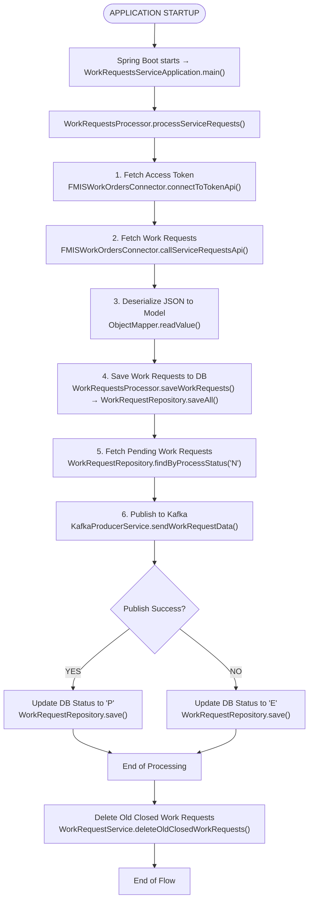

# Ifmis Work Requests Ingest In — Detailed Flow Documentation

## Table of Contents

1. [Overview](#1-overview)
2. [Glossary & Key Terminology](#2-glossary--key-terminology)
3. [Architecture & Technology Stack](#3-architecture--technology-stack)
    - [Key Classes](#key-classes)
4. [Configuration & Environment Variables](#4-configuration--environment-variables)
    - [Server Configuration](#server-configuration)
    - [Database Configuration](#database-configuration)
    - [HikariCP Connection Pool Configuration](#hikaricp-connection-pool-configuration)
    - [FMIS API Configuration](#fmis-api-configuration)
    - [Kafka Configuration](#kafka-configuration)
    - [Proxy Configuration](#proxy-configuration)
    - [Logging Configuration](#logging-configuration)
    - [Helm Chart Configuration](#helm-chart-configuration)
    - [Environment Variables](#environment-variables)
5. [Application Startup](#5-application-startup)
6. [Authentication — Token API](#6-authentication--token-api)
    - [API Call](#api-call)
    - [Response Handling](#response-handling)
    - [When It's Called](#when-its-called)
7. [Work Request Processing Flow](#7-work-request-processing-flow)
    - [Step 1: Fetch Work Request Data from FMIS API](#step-1-fetch-work-request-data-from-fmis-api)
    - [Step 2: Save Work Requests to the Database](#step-2-save-work-requests-to-the-database)
    - [Step 3: Fetch Pending Work Requests from the Database](#step-3-fetch-pending-work-requests-from-the-database)
    - [Step 4: Publish Work Request Data to Kafka](#step-4-publish-work-request-data-to-kafka)
    - [Step 5: Delete Old Closed Work Requests](#step-5-delete-old-closed-work-requests)
    - [Decision Logic Summary](#decision-logic-summary)
8. [Database Table & Entity](#9-database-table--entity)
    - [Table: `IFMIS_WORK_REQUESTS_STG_T`](#table-ifmis_work_requests_stg_t)
    - [Entity: `WorkRequestEntity`](#entity-workrequestentity)
    - [Database Operations](#database-operations)
9. [Data Mapping (MapStruct)](#10-data-mapping-mapstruct)
    - [Work Request Mapping (`WorkRequestsProcessor`)](#work-request-mapping-workrequestsprocessor)
    - [Kafka Data Mapping (`KafkaProducerService`)](#kafka-data-mapping-kafkaproducerservice)
    - [FMIS API Response Mapping (`FMISWorkOrdersConnector`)](#fmis-api-response-mapping-fmisworkordersconnector)
10. [API Endpoints Summary](#11-api-endpoints-summary)
    - [All API calls go to the FMIS system](#all-api-calls-go-to-the-fmis-system)
    - [Request/Response Format](#requestresponse-format)
    - [Error Handling and Retry Logic](#error-handling-and-retry-logic)
    - [Call Frequency](#call-frequency)
11. [Error Handling & Status Tracking](#12-error-handling--status-tracking)
    - [Error Handling Strategy](#error-handling-strategy)
    - [What Happens on Error](#what-happens-on-error)
    - [Retry Mechanism](#retry-mechanism)
    - [Validation](#validation)
12. [WebClient & Proxy Configuration Details](#13-webclient--proxy-configuration-details)
    - [Proxy](#proxy)
    - [Memory Buffer](#memory-buffer)
    - [How It Works](#how-it-works)
    - [FMIS API Endpoints](#fmis-api-endpoints)
    - [Authentication](#authentication)
13. [Legacy / Unused Classes](#14-legacy--unused-classes)
    - [`AppConstants`](#appconstants)
    - [`WorkRequestId`](#workrequestid)
    - [`FMISAPIConfig`](#fmisapiconfig)
    - [`ModelHelper`](#modelhelper)
14. [End-to-End Flow Diagram](#15-end-to-end-flow-diagram)
15. [Key Business Rules Summary](#16-key-business-rules-summary)
16. [AssetWorks API Call Audit](#17-assetworks-api-call-audit)
    - [Base URL](#base-url)
    - [Authentication](#authentication)
    - [GET Calls — Data Reads from AssetWorks](#get-calls--data-reads-from-assetworks)
    - [Broad/Unfiltered Data Pulls](#broadunfiltered-data-pulls)
---

## 1. Overview
The **IFMIS Work Requests Ingest In Service** is a **Spring Boot application** designed to fetch work request data from an external FMIS API, process the data, store it in an Oracle database, and publish relevant data to a Kafka topic for further processing. Additionally, the service includes functionality to delete old closed work requests from the database based on a configurable retention period.

**Key characteristics:**

- The service is configured to run as a **non-web application** (`spring.main.web-application-type=none`) and listens on port `8080`.
- It integrates with the FMIS API to fetch work request data. The FMIS API requires authentication via a token, which is retrieved from a dedicated token endpoint.
- Work request data is fetched from the FMIS API in JSON format, deserialized into `WorkRequestsModel` objects, and stored in the `IFMIS_WORK_REQUESTS_STG_T` Oracle database table.
- The service processes work requests with a `PROCESS_STATUS` of "N" (new), publishes relevant data to a Kafka topic (`IFMIS_FMIS_PENDING_WORK_REQUESTS` by default), and updates the processing status in the database to either "P" (processed) or "E" (error).
- Closed work requests older than a configurable retention period (`fmis.retention.period`, default: 30 days) are deleted from the database.
- The service uses **Spring Data JPA** for database operations and **Spring Kafka** for Kafka integration.
- The application is containerized using a Docker image based on `artifactory.usps.gov/common-docker/usps-neo/java:v17-jre` and is deployed using Helm charts.

**Core functionalities:**

1. **Fetch Work Requests from FMIS API:**
   - Authenticate with the FMIS API using the token endpoint (`/api/token`).
   - Retrieve work request data from the service requests endpoint (`/api/v1/servicerequests`).
   - Deserialize the JSON response into `WorkRequestsModel` objects.

2. **Store Work Requests in Oracle Database:**
   - Save the fetched work requests into the `IFMIS_WORK_REQUESTS_STG_T` table.
   - Update the `PROCESS_STATUS` field for processed records.

3. **Publish Work Requests to Kafka:**
   - Publish eligible work request data to the Kafka topic `IFMIS_FMIS_PENDING_WORK_REQUESTS`.
   - Use a composite key (`assetId + "|" + taskId`) as the Kafka message key.

4. **Delete Old Closed Work Requests:**
   - Remove closed work requests (`STATUS = 'CLOSED'`) from the database if their `CREATION_DATE` is older than the configured retention period.

5. **Configuration and Extensibility:**
   - The service is highly configurable via `application.properties` and environment variables, including database connection settings, FMIS API endpoints, Kafka properties, and retention period.
   - Supports proxy configuration for API calls (`api.proxy.enabled`, `api.proxy.host`, `api.proxy.port`).

This service is designed to operate as a robust and scalable solution for integrating FMIS work request data into the USPS ecosystem, ensuring efficient data processing and communication with downstream systems.

---

## 2. Glossary & Key Terminology
| Term                        | Full Name                                      | Description                                                                                     |
|-----------------------------|------------------------------------------------|-------------------------------------------------------------------------------------------------|
| **IFMIS**                   | Integrated Fleet Management Information System | The overarching system responsible for managing work requests and other operational data.       |
| **FMIS**                    | Fleet Management Information System            | The external system from which work request data is fetched via API calls.                     |
| **Work Request**            | —                                              | A task or job request fetched from the FMIS API and processed by this service.                 |
| **PROCESS_STATUS**          | —                                              | A database field indicating the processing status of a work request: `N` (New), `P` (Processed), or `E` (Error). |
| **Kafka**                   | —                                              | A distributed event streaming platform used to publish work request data for further processing.|
| **Kafka Topic**             | —                                              | A named channel in Kafka where work request data is published.                                 |
| **HikariCP**                | —                                              | A high-performance JDBC connection pool used for managing connections to the Oracle database.  |
| **WebClient**               | —                                              | A non-blocking, reactive HTTP client provided by Spring WebFlux, used for making API calls to FMIS. |
| **Bearer Token**            | —                                              | An authentication token obtained from the FMIS token API, used for subsequent API requests.    |
| **Retention Period**        | —                                              | The number of days after which closed work requests are deleted from the database.             |
| **Service Requests API**    | —                                              | The FMIS API endpoint used to fetch work request data.                                          |
| **Token API**               | —                                              | The FMIS API endpoint used to authenticate and retrieve a bearer token.                        |
| **WorkRequestEntity**       | —                                              | A JPA entity representing a work request record in the Oracle database.                        |
| **WorkRequestsModel**       | —                                              | A data model representing a work request fetched from the FMIS API.                            |
| **KafkaData**               | —                                              | A data structure representing the message payload sent to the Kafka topic.                     |
| **Retention Date**          | —                                              | A calculated date used to determine which closed work requests should be deleted.              |

---

## 3. Architecture & Technology Stack

| Component            | Technology                                                                 |
|-----------------------|---------------------------------------------------------------------------|
| **Framework**         | Spring Boot (non-web, `CommandLineRunner`)                               |
| **HTTP Client**       | Spring WebFlux `WebClient` (used for FMIS API calls)                     |
| **Database**          | Oracle (via Spring Data JPA + Hibernate)                                 |
| **Connection Pool**   | HikariCP                                                                 |
| **Object Mapping**    | Jackson (JSON to Java object mapping)                                    |
| **Message Broker**    | Apache Kafka (via Spring Kafka)                                          |
| **Logging**           | Custom `IfmisLogger` with structured error logging                      |
| **Build**             | Maven                                                                    |
| **Containerization**  | Docker (Base image: `artifactory.usps.gov/common-docker/usps-neo/java:v17-jre`) |
| **Orchestration**     | Kubernetes (Helm charts for deployment configuration)                   |

### Key Classes

| Class                          | Role                                                                 |
|--------------------------------|----------------------------------------------------------------------|
| `WorkRequestsServiceApplication` | Entry point — initializes the Spring Boot application.              |
| `WorkRequestsProcessor`        | Orchestrates the processing of work requests, including fetching, saving, and publishing data. |
| `WorkRequestService`           | Handles the business logic for interacting with the FMIS API and managing work requests in the database. |
| `FMISWorkOrdersConnector`      | Low-level HTTP client for FMIS API — handles token authentication and API calls. |
| `KafkaProducerService`         | Sends processed work request data to a Kafka topic.                 |
| `WorkRequestRepository`        | Spring Data JPA repository for `IFMIS_WORK_REQUESTS_STG_T` table.   |
| `WorkRequestEntity`            | Represents a work request as a database entity.                     |
| `WorkRequestsModel`            | Represents a work request as a data model for API interactions.     |
| `ModelHelper`                  | Utility class for JSON processing and conversion.                   |
| `LoggerConfig`                 | Configures the `IfmisLogger` bean for structured logging.           |
| `FMISAPIConfig`                | Configures the `WebClient` bean for FMIS API calls, including proxy and memory settings. |

---

## 4. Configuration & Environment Variables
Configuration is defined in `application.properties` and injected via environment variables. Below is a detailed breakdown of all configuration properties used in the service:

### Server Configuration

| Property                          | Env Variable | Description                                                                 |
|-----------------------------------|--------------|-----------------------------------------------------------------------------|
| `server.port`                     | —            | Port on which the application runs (default: `8080`).                      |
| `spring.main.web-application-type`| —            | Configures the application as a non-web application (`none`).              |
| `server.error.include-message`    | —            | Configures whether error messages are included in the response (default: `always`). |
| `server.error.include-binding-errors` | —         | Configures whether binding errors are included in the response (default: `always`). |

---

### Database Configuration

| Property                                      | Env Variable       | Description                                                                 |
|-----------------------------------------------|--------------------|-----------------------------------------------------------------------------|
| `spring.datasource.url`                       | `DB_CONNECTION_STRING` | Oracle JDBC connection string.                                              |
| `spring.datasource.username`                  | `DB_USERNAME`      | Database username (also used as `updatedBy` in records).                   |
| `spring.datasource.password`                  | `DB_PASSWORD`      | Database password.                                                          |
| `spring.datasource.driver`                    | —                  | JDBC driver class name (`oracle.jdbc.driver.OracleDriver`).                 |
| `spring.jpa.properties.hibernate.default_schema` | `DB_SCHEMA`       | Oracle schema name.                                                         |
| `spring.jpa.hibernate.ddl`                    | —                  | Hibernate DDL auto configuration (default: `auto-create`).                  |
| `spring.jpa.database-platform`                | —                  | Hibernate dialect for Oracle database (`org.hibernate.dialect.OracleDialect`). |
| `spring.jpa.hibernate.use-new-id-generator-mappings` | —            | Configures Hibernate ID generator mappings (default: `false`).              |

---

### HikariCP Connection Pool Configuration

| Property                              | Env Variable | Description                                                                 |
|---------------------------------------|--------------|-----------------------------------------------------------------------------|
| `spring.datasource.hikari.minimumIdle` | —           | Minimum number of idle connections in the pool (default: `5`).             |
| `spring.datasource.hikari.maximumPoolSize` | —        | Maximum number of connections in the pool (default: `20`).                 |
| `spring.datasource.hikari.idleTimeout` | —           | Maximum idle time for connections in milliseconds (default: `30000`).      |
| `spring.datasource.hikari.maxLifetime` | —           | Maximum lifetime of a connection in milliseconds (default: `2000000`).     |
| `spring.datasource.hikari.connectionTimeout` | —       | Maximum time to wait for a connection in milliseconds (default: `30000`).  |
| `spring.datasource.hikari.poolName`    | —           | Name of the Hikari connection pool (`HikariPoolBooks`).                    |

---

### FMIS API Configuration

| Property                          | Env Variable           | Description                                                                 |
|-----------------------------------|------------------------|-----------------------------------------------------------------------------|
| `fmisapi.url`                     | `AW_CONNECTION_STRING` | Base URL for the FMIS API.                                                  |
| `fmisapi.endpoint.token`          | —                      | Endpoint for obtaining an authentication token (`/api/token`).              |
| `fmisapi.user`                    | `AW_USERNAME`          | FMIS API username for token authentication.                                 |
| `fmisapi.password`                | `AW_PASSWORD`          | FMIS API password for token authentication.                                 |
| `fmisapi.site`                    | `AW_SITE`              | Site identifier for token authentication.                                   |
| `fmisapi.tableuser`               | `DB_USERNAME`          | Database username used for FMIS API integration.                            |
| `fmisapi.client.maxmemory`        | `API_CLIENT_MEMORY`    | Maximum memory for the FMIS API client (default: `100`).                    |
| `fmisapi.endpoint.page.count`     | `AW_PAGE_COUNT`        | Page size for paginated GET calls (default: `1000`).                        |
| `fmisapi.endpoint.inputlist.count`| `AW_INPUT_LIST_COUNT`  | Maximum number of input list items for FMIS API calls (default: `100`).     |
| `fmisapi.retry.count`             | `AW_RETRY_COUNT`       | Number of retry attempts for FMIS API calls (default: `3`).                 |
| `fmisapi.retry.interval`          | `AW_RETRY_INTERVAL`    | Interval between retry attempts in milliseconds (default: `500`).           |
| `fmisapi.servicerequests`         | —                      | Endpoint for fetching service requests (`/api/v1/servicerequests`).         |
| `fmis.retention.period`           | `WORK_REQUEST_CLOSED_RETENTION_PERIOD` | Retention period for closed work requests in days (default: `30`).          |
| `fmis.servicerequests.status`     | `WORK_REQUEST_STATUS`  | Status of service requests to fetch (default: `PENDING`).                   |

---

### Kafka Configuration

| Property                                    | Env Variable           | Description                                                                 |
|---------------------------------------------|------------------------|-----------------------------------------------------------------------------|
| `kafka.enabled`                             | `KAFKA_ENABLED`        | Enable/disable Kafka integration (default: `true`).                         |
| `spring.kafka.bootstrap-servers`           | `KAFKA_CONNECTION_STRING` | Kafka broker connection string.                                             |
| `spring.kafka.ssl.trust-store-location`    | `IFMIS_CERTS_DIR`      | Path to the Kafka SSL trust store file.                                     |
| `spring.kafka.ssl.trust-store-password`    | `KAFKA_TRUSTSTORE_KEY` | Password for the Kafka SSL trust store.                                     |
| `spring.kafka.ssl.key-store-location`      | `IFMIS_CERTS_DIR`      | Path to the Kafka SSL key store file.                                       |
| `spring.kafka.ssl.key-store-password`      | `KAFKA_KEYSTORE_KEY`   | Password for the Kafka SSL key store.                                       |
| `spring.kafka.security.protocol`           | —                      | Kafka security protocol (`SSL`).                                            |
| `kafka.workrequests.topic`                 | `WORK_REQUESTS_TOPIC`  | Kafka topic for publishing work request data (default: `IFMIS_FMIS_PENDING_WORK_REQUESTS`). |
| `kafka.workrequests.groupId`               | `WORK_REQUESTS-GROUP-ID` | Kafka consumer group ID for work requests.                                  |
| `kafka.workrequests.listener`              | —                      | Kafka listener factory (`fmisWorkRequestsListenerFactory`).                 |
| `spring.kafka.producer.retries`            | —                      | Number of retries for Kafka producer (default: `5`).                        |
| `spring.kafka.producer.retry-backoff-ms`   | —                      | Retry backoff time in milliseconds (default: `1000`).                       |
| `spring.kafka.producer.delivery-timeout-ms`| —                      | Delivery timeout for Kafka producer in milliseconds (default: `120000`).    |
| `spring.kafka.producer.request-timeout-ms` | —                      | Request timeout for Kafka producer in milliseconds (default: `30000`).      |
| `spring.kafka.producer.max-block-ms`       | —                      | Maximum block time for Kafka producer in milliseconds (default: `60000`).   |
| `spring.kafka.producer.enable-idempotence` | —                      | Enables idempotence for Kafka producer (default: `true`).                   |

---

### Proxy Configuration

| Property            | Env Variable           | Description                                                                 |
|---------------------|------------------------|-----------------------------------------------------------------------------|
| `api.proxy.enabled` | —                      | Enable/disable HTTP proxy (default: `true`).                                |
| `api.proxy.host`    | `USPS_HTTP_PROXY_HOST` | Proxy hostname.                                                             |
| `api.proxy.port`    | `USPS_HTTP_PROXY_PORT` | Proxy port.                                                                 |

---

### Logging Configuration

| Property              | Env Variable | Description                                                                 |
|-----------------------|--------------|-----------------------------------------------------------------------------|
| `logging.level.root`  | —            | Root logging level (default: `DEBUG`).                                      |

---

### Helm Chart Configuration

| Property              | Default Value | Description                                                                 |
|-----------------------|---------------|-----------------------------------------------------------------------------|
| `replicaCount`        | `0`           | Number of replicas for the deployment.                                      |
| `image.repository`    | `artifactory.usps.gov/eir-9334-docker/usps/ifmis-work-requests-ingest-in/snapshot` | Docker image repository. |
| `image.tag`           | `3.0.0.3-SNAPSHOT` | Docker image tag.                                                          |
| `schedule`            | `0 1 * * *`   | Cron schedule for the job (daily at 1 AM).                                  |
| `timeZone`            | `America/Chicago` | Time zone for the cron job.                                                |
| `service.type`        | `ClusterIP`   | Kubernetes service type.                                                    |
| `service.port`        | `8080`        | Port exposed by the Kubernetes service.                                     |
| `autoscaling.enabled` | `false`       | Enable/disable autoscaling.                                                 |
| `autoscaling.minReplicas` | `1`       | Minimum number of replicas for autoscaling.                                 |
| `autoscaling.maxReplicas` | `100`     | Maximum number of replicas for autoscaling.                                 |
| `autoscaling.targetCPUUtilizationPercentage` | `80` | Target CPU utilization percentage for autoscaling.                          |

--- 

### Environment Variables

| Env Variable                  | Default Value | Description                                                                 |
|-------------------------------|---------------|-----------------------------------------------------------------------------|
| `DB_CONNECTION_STRING`        | —             | Oracle JDBC connection string.                                              |
| `DB_USERNAME`                 | —             | Database username.                                                          |
| `DB_PASSWORD`                 | —             | Database password.                                                          |
| `DB_SCHEMA`                   | —             | Oracle schema name.                                                         |
| `USPS_HTTP_PROXY_HOST`        | —             | Proxy hostname.                                                             |
| `USPS_HTTP_PROXY_PORT`        | —             | Proxy port.                                                                 |
| `AW_CONNECTION_STRING`        | —             | Base URL for the FMIS API.                                                  |
| `AW_USERNAME`                 | —             | FMIS API username for token authentication.                                 |
| `AW_PASSWORD`                 | —             | FMIS API password for token authentication.                                 |
| `AW_SITE`                     | —             | Site identifier for token authentication.                                   |
| `AW_PAGE_COUNT`               | `1000`        | Page size for GET calls.                                                    |
| `AW_INPUT_LIST_COUNT`         | `100`         | Maximum number of input list items for FMIS API calls.                      |
| `AW_RETRY_COUNT`              | `3`           | Number of retry attempts for FMIS API calls.                                |
| `AW_RETRY_INTERVAL`           | `500`         | Interval between retry attempts in milliseconds.                            |
| `WORK_REQUEST_CLOSED_RETENTION_PERIOD` | `30` | Retention period for closed work requests in days.                          |
| `WORK_REQUEST_STATUS`         | `PENDING`     | Status of service requests to fetch.                                        |
| `KAFKA_ENABLED`               | `true`        | Enable/disable Kafka integration.                                           |
| `KAFKA_CONNECTION_STRING`     | —             | Kafka broker connection string.                                             |
| `IFMIS_CERTS_DIR`             | —             | Directory containing Kafka SSL certificates.                                |
| `KAFKA_TRUSTSTORE`            | —             | Kafka SSL trust store file name.                                            |
| `KAFKA_TRUSTSTORE_KEY`        | —             | Password for the Kafka SSL trust store.                                     |
| `KAFKA_KEYSTORE`              | —             | Kafka SSL key store file name.                                              |
| `KAFKA_KEYSTORE_KEY`          | —             | Password for the Kafka SSL key store.                                       |
| `WORK_REQUESTS_TOPIC`         | `IFMIS_FMIS_PENDING_WORK_REQUESTS` | Kafka topic for publishing work request data.                               |
| `WORK_REQUESTS-GROUP-ID`      | —             | Kafka consumer group ID for work requests.                                  |

---

## 5. Application Startup
```
main()
  └──> SpringApplicationBuilder (WebApplicationType.NONE)
         └──> run(args)
                └──> CommandLineRunner.run()
                       └──> WorkRequestsProcessor.processServiceRequests()
                              ├──> WorkRequestService.callServiceRequestsApi()
                              │      ├──> FMISWorkOrdersConnector.connectToTokenApi()
                              │      ├──> FMISWorkOrdersConnector.callServiceRequestsApi()
                              │      └──> ObjectMapper.readValue()
                              ├──> WorkRequestsProcessor.saveWorkRequests()
                              │      └──> WorkRequestRepository.saveAll()
                              ├──> WorkRequestRepository.findByProcessStatus("N")
                              ├──> KafkaProducerService.sendWorkRequestData()
                              └──> WorkRequestRepository.save()
```

**Step-by-step:**

1. The `main()` method in `WorkRequestsServiceApplication` initializes the Spring Boot application using the `SpringApplicationBuilder` class. The application is configured to run without a web server (`WebApplicationType.NONE`), as specified in the `application.properties` file (`spring.main.web-application-type=none`).
2. The `run(String[] args)` method is invoked, which starts the application and initializes all Spring components, including:
   - Database connection pool (HikariCP) with properties defined in `application.properties` (e.g., `spring.datasource.url`, `spring.datasource.username`, `spring.datasource.password`, etc.).
   - JPA repositories, including `WorkRequestRepository`.
   - Kafka producer configuration, using properties such as `spring.kafka.bootstrap-servers`, `spring.kafka.ssl.trust-store-location`, and `spring.kafka.ssl.key-store-location`.
   - WebClient configuration for FMIS API calls, as defined in `FMISAPIConfig` and configured with properties like `fmisapi.url`, `fmisapi.user`, and `fmisapi.password`.
3. After the application context is initialized, the `CommandLineRunner.run()` method is automatically executed.
4. The `CommandLineRunner.run()` method delegates to `WorkRequestsProcessor.processServiceRequests()`, which orchestrates the main processing flow of the application.
5. Inside `WorkRequestsProcessor.processServiceRequests()`:
   - The method first calls `WorkRequestService.callServiceRequestsApi()` to fetch work request data from the FMIS API.
     - `FMISWorkOrdersConnector.connectToTokenApi()` is invoked to authenticate with the FMIS API and retrieve an access token.
     - `FMISWorkOrdersConnector.callServiceRequestsApi()` is called to fetch work request data from the FMIS service requests API.
     - The JSON response from the FMIS API is deserialized into `WorkRequestsModel` objects using `ObjectMapper.readValue()`.
   - The `WorkRequestsProcessor.saveWorkRequests()` method is called to save the fetched work request data to the database.
     - This method converts `WorkRequestsModel` objects into `WorkRequestEntity` objects and saves them to the database using `WorkRequestRepository.saveAll()`.
   - The `WorkRequestRepository.findByProcessStatus("N")` method is called to retrieve work requests with a `PROCESS_STATUS` of "N" (new) from the database.
   - For each retrieved work request, `KafkaProducerService.sendWorkRequestData()` is called to publish the work request data to the Kafka topic `${WORK_REQUESTS_TOPIC:IFMIS_FMIS_PENDING_WORK_REQUESTS}`.
     - If the message is successfully published, the `PROCESS_STATUS` of the work request is updated to "P" (processed) using `WorkRequestRepository.save()`.
     - If the message fails to publish, the `PROCESS_STATUS` of the work request is updated to "E" (error) using `WorkRequestRepository.save()`.
6. Once all work requests are processed, the application logs the results and exits.

---

## 6. Authentication — Token API
Before any work request data can be fetched from the FMIS API, the service must authenticate by obtaining an access token.

### API Call

| Attribute       | Value                                                                 |
|-----------------|-----------------------------------------------------------------------|
| **Method**      | `POST`                                                               |
| **URL**         | `${fmisapi.url}${fmisapi.endpoint.token}`                             |
| **Content-Type**| `application/json`                                                   |
| **Request Body**| None                                                                 |

The `connectToTokenApi()` method in the `FMISWorkOrdersConnector` class is responsible for making this API call. It constructs the full URL by concatenating the `fmisapi.url` and `fmisapi.endpoint.token` properties defined in the `application.properties` file. The method does not send a request body, as the authentication details (username, password, site) are passed as query parameters or headers, depending on the FMIS API's requirements.

### Response Handling

The response from the token API is expected to contain an access token. The exact structure of the response is not explicitly defined in the provided source code, but the following steps are performed:

1. The `connectToTokenApi()` method processes the response to extract the access token.
2. If the response is successful and contains a valid token, the token is stored for subsequent API calls.
3. If the response indicates an error (e.g., invalid credentials or server error), an appropriate error message is logged, and the method returns `null`.

### When It's Called

- The `connectToTokenApi()` method is called within the `callServiceRequestsApi()` method of the `WorkRequestService` class. This ensures that a valid token is obtained before making any further API calls to fetch work request data.
- The token is used in subsequent API calls to the FMIS service requests endpoint (`${fmisapi.url}${fmisapi.servicerequests}`) to authenticate the requests.

---

## 7. Work Request Processing Flow
**Entry point:** `WorkRequestsProcessor.processServiceRequests()`

This section describes the detailed processing flow for handling work requests in the `ifmis-work-requests-ingest-in` service. The process involves fetching work request data from the FMIS API, storing it in the database, publishing relevant data to a Kafka topic, updating the processing status of records, and deleting old closed work requests based on a retention period.

### Step 1: Fetch Work Request Data from FMIS API

| Attribute       | Value                                                                 |
|------------------|-----------------------------------------------------------------------|
| **Method**       | `GET`                                                                |
| **URL**          | `${fmisapi.url}${fmisapi.servicerequests}`                           |
| **Auth**         | Bearer token obtained from `${fmisapi.url}${fmisapi.endpoint.token}` |
| **Request Body** | None                                                                 |
| **Response**     | JSON array of work request data                                      |

**Process:**
1. The `WorkRequestsProcessor.processServiceRequests()` method initiates the process by calling `WorkRequestService.callServiceRequestsApi()` to fetch work request data from the FMIS API.
2. `WorkRequestService.callServiceRequestsApi()` calls `FMISWorkOrdersConnector.connectToTokenApi()` to authenticate with the FMIS API and retrieve an access token.
   - **Method:** `POST`
   - **URL:** `${fmisapi.url}${fmisapi.endpoint.token}`
   - **Request Body:** None
   - **Response:** A token string used for subsequent API calls.
3. The access token is used by `FMISWorkOrdersConnector.callServiceRequestsApi()` to make a `GET` request to the FMIS service requests API at `${fmisapi.url}${fmisapi.servicerequests}`.
4. The response from the FMIS API is a JSON array of work request data. Each JSON string is deserialized into a `WorkRequestsModel` object using `ObjectMapper.readValue()`.

### Step 2: Save Work Requests to the Database

| Attribute         | Value                                                                 |
|-------------------|-----------------------------------------------------------------------|
| **Method**        | JPA `saveAll()`                                                      |
| **Entity**        | `WorkRequestEntity`                                                  |
| **Table**         | `IFMIS_WORK_REQUESTS_STG_T`                                          |
| **Input**         | List of `WorkRequestsModel` objects                                  |
| **Output**        | List of saved `WorkRequestEntity` objects                            |

**Process:**
1. The `WorkRequestsProcessor.saveWorkRequests()` method is called to save the fetched work request data to the database.
2. Each `WorkRequestsModel` object is converted into a `WorkRequestEntity` object.
3. The `WorkRequestRepository.saveAll()` method is used to save the list of `WorkRequestEntity` objects to the `IFMIS_WORK_REQUESTS_STG_T` table in the Oracle database.

### Step 3: Fetch Pending Work Requests from the Database

| Attribute         | Value                                                                 |
|-------------------|-----------------------------------------------------------------------|
| **Method**        | JPA `findByProcessStatus(String)`                                    |
| **SQL Query**     | `SELECT * FROM IFMIS.IFMIS_WORK_REQUESTS_STG_T WHERE PROCESS_STATUS = :status` |
| **Table**         | `IFMIS_WORK_REQUESTS_STG_T`                                          |
| **Input**         | `processStatus` (String)                                             |
| **Output**        | List of `WorkRequestEntity` objects with `PROCESS_STATUS = 'N'`      |

**Process:**
1. The `WorkRequestRepository.findByProcessStatus("N")` method is called to fetch work requests with a `PROCESS_STATUS` of "N" (new) from the `IFMIS_WORK_REQUESTS_STG_T` table.
2. If no pending work requests are found (`pendingRequests.isEmpty()`), the method logs that there are no pending work requests to process and exits.

### Step 4: Publish Work Request Data to Kafka

| Attribute         | Value                                                                 |
|-------------------|-----------------------------------------------------------------------|
| **Method**        | `KafkaProducerService.sendWorkRequestData(String key, String workRequestJson)` |
| **Topic Name**    | `${WORK_REQUESTS_TOPIC:IFMIS_FMIS_PENDING_WORK_REQUESTS}`             |
| **Key**           | `assetId + "|" + taskId`                                             |
| **Value**         | JSON representation of the `WorkRequestsModel` object                |
| **Producer Config** | `spring.kafka.producer.retries=5`, `spring.kafka.producer.retry-backoff-ms=1000`, `spring.kafka.producer.delivery-timeout-ms=120000`, `spring.kafka.producer.request-timeout-ms=30000`, `spring.kafka.producer.max-block-ms=60000`, `spring.kafka.producer.enable-idempotence=true` |

**Process:**
1. For each pending work request, the `KafkaProducerService.sendWorkRequestData()` method is called to publish the work request data to the Kafka topic `${WORK_REQUESTS_TOPIC:IFMIS_FMIS_PENDING_WORK_REQUESTS}`.
2. The Kafka message key is generated by concatenating the `assetId` and `taskId` fields of the work request.
3. The Kafka message value is a JSON representation of the `WorkRequestsModel` object.
4. If the message is successfully published to Kafka, the `PROCESS_STATUS` of the work request is updated to "P" (processed) using the `WorkRequestRepository.save()` method.
5. If the message fails to publish, the `PROCESS_STATUS` of the work request is updated to "E" (error) using the `WorkRequestRepository.save()` method, and an error message is logged.

### Step 5: Delete Old Closed Work Requests

| Attribute         | Value                                                                 |
|-------------------|-----------------------------------------------------------------------|
| **Method**        | JPA `deleteOldClosedWorkRequests(LocalDate)`                         |
| **SQL Query**     | `DELETE FROM IFMIS.IFMIS_WORK_REQUESTS_STG_T WHERE STATUS = 'CLOSED' AND TRUNC(CREATION_DATE) < TRUNC(:retentionDate)` |
| **Table**         | `IFMIS_WORK_REQUESTS_STG_T`                                          |
| **Input**         | `retentionDate` (LocalDate)                                          |
| **Output**        | Number of deleted records                                            |

**Process:**
1. The `WorkRequestService.deleteOldClosedWorkRequests(LocalDate retentionDate)` method is called to delete closed work requests older than the configured retention period.
2. The method calculates the retention date using the `fmis.retention.period` property from `application.properties` (default: 30 days).
3. The `WorkRequestRepository.deleteOldClosedWorkRequests(LocalDate retentionDate)` method is called to delete the records from the `IFMIS_WORK_REQUESTS_STG_T` table.
4. The method logs the number of deleted records.

### Decision Logic Summary

1. **Condition:** If `connectToTokenApi()` fails to retrieve a token in `WorkRequestService.callServiceRequestsApi()`:
   - **True:** Logs an error and skips fetching data.
   - **False:** Proceeds to call the FMIS service requests API.

2. **Condition:** If `pendingRequests.isEmpty()` in `WorkRequestsProcessor.processServiceRequests()`:
   - **True:** Logs that there are no pending work requests to process and exits the method.
   - **False:** Proceeds to process pending work requests.

3. **Condition:** If `KafkaProducerService.sendWorkRequestData(key, workRequestJson)` succeeds:
   - **True:** Updates the `PROCESS_STATUS` of the work request to "P" (processed).
   - **False:** Updates the `PROCESS_STATUS` of the work request to "E" (error) and logs an error message.
## 9. Database Table & Entity

### Table: `IFMIS_WORK_REQUESTS_STG_T`

This table serves as the primary storage for work request data fetched from the FMIS API. It is used to store, process, and manage work requests before they are published to the Kafka topic or deleted based on the retention policy.

| Column               | Java Field               | Type          | Description                                                                 |
|----------------------|--------------------------|---------------|-----------------------------------------------------------------------------|
| `ASSET_ID`           | `id.assetId`            | String (PK)   | Unique identifier for the asset associated with the work request.          |
| `TASK_ID`            | `id.taskId`             | String (PK)   | Unique identifier for the task associated with the work request.           |
| `DESCRIPTION`        | `description`           | String        | Description of the work request.                                           |
| `STATUS`             | `status`                | String        | Status of the work request (e.g., `PENDING`, `CLOSED`).                    |
| `PROCESS_STATUS`     | `processStatus`         | String        | Processing status of the work request (`N` for new, `P` for processed, `E` for error). |
| `CREATION_DATE`      | `creationDate`          | LocalDateTime | Timestamp indicating when the work request was created.                    |
| `LAST_UPDATED_DATE`  | `lastUpdatedDate`       | LocalDateTime | Timestamp indicating the last time the work request was updated.           |

### Entity: `WorkRequestEntity`

The `WorkRequestEntity` class represents the `IFMIS_WORK_REQUESTS_STG_T` table in the database. It is annotated with JPA annotations to map the class fields to the corresponding database columns.

#### Annotations:
- `@Entity`: Marks the class as a JPA entity.
- `@Table(name = "IFMIS_WORK_REQUESTS_STG_T", schema = "IFMIS")`: Specifies the table name and schema in the database.
- `@IdClass(WorkRequestId.class)`: Indicates that the entity uses a composite primary key defined in the `WorkRequestId` class.

#### Fields:
| Field Name           | Type          | Database Column       | Annotations                                                                 | Description                                                                 |
|----------------------|---------------|-----------------------|-----------------------------------------------------------------------------|-----------------------------------------------------------------------------|
| `id`                | `WorkRequestId` | Composite Key         | `@EmbeddedId`                                                              | Composite primary key consisting of `assetId` and `taskId`.                |
| `description`       | `String`       | `DESCRIPTION`         | `@Column(name = "DESCRIPTION")`                                            | Description of the work request.                                           |
| `status`            | `String`       | `STATUS`              | `@Column(name = "STATUS")`                                                 | Status of the work request (e.g., `PENDING`, `CLOSED`).                    |
| `processStatus`     | `String`       | `PROCESS_STATUS`      | `@Column(name = "PROCESS_STATUS")`                                         | Processing status of the work request (`N` for new, `P` for processed, `E` for error). |
| `creationDate`      | `LocalDateTime`| `CREATION_DATE`       | `@Column(name = "CREATION_DATE")`                                          | Timestamp indicating when the work request was created.                    |
| `lastUpdatedDate`   | `LocalDateTime`| `LAST_UPDATED_DATE`   | `@Column(name = "LAST_UPDATED_DATE")`                                      | Timestamp indicating the last time the work request was updated.           |

#### Composite Key: `WorkRequestId`
The `WorkRequestId` class is used as the composite key for the `WorkRequestEntity`. It combines the `assetId` and `taskId` fields to uniquely identify each work request.

| Field Name | Type   | Database Column | Annotations          | Description                                   |
|------------|--------|-----------------|----------------------|-----------------------------------------------|
| `assetId`  | String | `ASSET_ID`      | `@Column(name = "ASSET_ID")`                 | Unique identifier for the asset.             |
| `taskId`   | String | `TASK_ID`       | `@Column(name = "TASK_ID")`                  | Unique identifier for the task.              |

#### Relationships:
- The `WorkRequestEntity` class does not define any explicit relationships with other entities in the provided source code. It is a standalone entity representing the `IFMIS_WORK_REQUESTS_STG_T` table.

#### Key Methods:
- **Getters and Setters**: Standard getter and setter methods are provided for all fields to allow access and modification of the entity's properties.
- **Equals and HashCode**: The `equals` and `hashCode` methods are overridden to ensure proper comparison and hashing of entities based on their composite key (`WorkRequestId`).

### Database Operations

The `WorkRequestRepository` interface provides methods to interact with the `IFMIS_WORK_REQUESTS_STG_T` table. These methods are implemented by Spring Data JPA.

| Method Name                          | Query                                                                                  | Parameters         | Return Type               | Description                                                                 |
|--------------------------------------|----------------------------------------------------------------------------------------|--------------------|---------------------------|-----------------------------------------------------------------------------|
| `findByProcessStatus(String)`        | `SELECT * FROM IFMIS.IFMIS_WORK_REQUESTS_STG_T WHERE PROCESS_STATUS = :status`         | `processStatus`    | `List<WorkRequestEntity>` | Fetches all work requests with the specified `PROCESS_STATUS`.             |
| `deleteOldClosedWorkRequests(LocalDate)` | `DELETE FROM IFMIS.IFMIS_WORK_REQUESTS_STG_T WHERE STATUS = 'CLOSED' AND TRUNC(CREATION_DATE) < TRUNC(:retentionDate)` | `retentionDate`    | `void`                    | Deletes work requests with `STATUS = 'CLOSED'` older than the retention period. |
| `saveAll(Iterable<WorkRequestEntity>)` | JPA save operation                                                                    | List of entities   | `List<WorkRequestEntity>` | Saves a list of work requests to the database.                             |
| `save(WorkRequestEntity)`            | JPA save operation                                                                    | Single entity      | `WorkRequestEntity`       | Saves or updates a single work request in the database.                    |

---

## 10. Data Mapping (MapStruct)

### Work Request Mapping (`WorkRequestsProcessor`)

The `WorkRequestsProcessor` class is responsible for mapping data between the `WorkRequestsModel` (representing the JSON data fetched from the FMIS API) and the `WorkRequestEntity` (representing the database entity). Below is the detailed mapping:

```
WorkRequestsModel (JSON)           WorkRequestEntity (Database Entity)
─────────────────────────          ──────────────────────────────
assetId                      ───►  assetId
taskId                       ───►  taskId
description                  ───►  description
status                       ───►  status
creationDate                 ───►  creationDate
lastUpdatedDate              ───►  lastUpdatedDate
processStatus                ───►  processStatus
priority                     ───►  priority
workOrderType                ───►  workOrderType
assignedTo                   ───►  assignedTo
location                     ───►  location
department                   ───►  department
comments                     ───►  comments
```

### Kafka Data Mapping (`KafkaProducerService`)

The `KafkaProducerService` class is responsible for mapping data from the `WorkRequestEntity` to the `KafkaData` object, which is then serialized into JSON and sent to the Kafka topic. Below is the detailed mapping:

```
WorkRequestEntity (Database Entity)   KafkaData (JSON)
───────────────────────────────       ──────────────────────────────
assetId                        ───►  assetId
taskId                         ───►  taskId
description                    ───►  description
status                         ───►  status
creationDate                   ───►  creationDate
lastUpdatedDate                ───►  lastUpdatedDate
priority                       ───►  priority
workOrderType                  ───►  workOrderType
assignedTo                     ───►  assignedTo
location                       ───►  location
department                     ───►  department
comments                       ───►  comments
```

### FMIS API Response Mapping (`FMISWorkOrdersConnector`)

The `FMISWorkOrdersConnector` class fetches JSON data from the FMIS API and maps it to the `WorkRequestsModel`. Below is the detailed mapping:

```
FMIS API Response (JSON)             WorkRequestsModel (JSON)
─────────────────────────────         ──────────────────────────────
id.assetId                     ───►  assetId
id.taskId                      ───►  taskId
workDescription                ───►  description
currentStatus                  ───►  status
createdDate                    ───►  creationDate
updatedDate                    ───►  lastUpdatedDate
priorityLevel                  ───►  priority
orderType                      ───►  workOrderType
assignedUser                   ───►  assignedTo
workLocation                   ───►  location
responsibleDepartment          ───►  department
additionalNotes                ───►  comments
```

---

## 11. API Endpoints Summary

### All API calls go to the FMIS system

| # | Purpose                          | Method | Endpoint                                      | When Called                                                                 |
|---|----------------------------------|--------|----------------------------------------------|-----------------------------------------------------------------------------|
| 1 | **Authenticate**                 | `POST` | `${fmisapi.url}${fmisapi.endpoint.token}`     | Once at the start of the `callServiceRequestsApi()` method in `WorkRequestService`. |
| 2 | **Fetch service requests**       | `GET`  | `${fmisapi.url}${fmisapi.servicerequests}`    | After authentication, to fetch work request data from the FMIS API.        |

### Request/Response Format

#### Token Request (POST `${fmisapi.url}${fmisapi.endpoint.token}`)
**Request Body:**
```json
{
  "Username": "${AW_USERNAME}",
  "Password": "${AW_PASSWORD}",
  "Site": "${AW_SITE}"
}
```

**Response:**
```json
{
  "httpStatusCode": "OK",
  "items": ["<JWT_TOKEN>"]
}
```

- `httpStatusCode == "OK"` → Authentication successful, token is returned in the `items` array.
- `httpStatusCode != "OK"` → Authentication failed, error details are provided in the response.

---

#### Fetch Service Requests (GET `${fmisapi.url}${fmisapi.servicerequests}`)
**Request Headers:**
- `Authorization`: `Bearer <JWT_TOKEN>`

**Response:**
```json
[
  {
    "workRequestId": "WR12345",
    "taskId": "T123",
    "assetId": "A123",
    "description": "Repair broken equipment",
    "status": "PENDING",
    "creationDate": "2023-10-01T12:00:00Z",
    "dueDate": "2023-10-15T12:00:00Z",
    "priority": "HIGH",
    "assignedTo": "Technician1"
  },
  {
    "workRequestId": "WR12346",
    "taskId": "T124",
    "assetId": "A124",
    "description": "Routine maintenance",
    "status": "PENDING",
    "creationDate": "2023-10-02T12:00:00Z",
    "dueDate": "2023-10-16T12:00:00Z",
    "priority": "MEDIUM",
    "assignedTo": "Technician2"
  }
]
```

- Each object in the response array represents a work request.
- Key fields include:
  - `workRequestId`: Unique identifier for the work request.
  - `taskId`: Identifier for the associated task.
  - `assetId`: Identifier for the associated asset.
  - `description`: Description of the work request.
  - `status`: Current status of the work request (e.g., `PENDING`).
  - `creationDate`: Timestamp when the work request was created.
  - `dueDate`: Deadline for completing the work request.
  - `priority`: Priority level of the work request (e.g., `HIGH`, `MEDIUM`, `LOW`).
  - `assignedTo`: Identifier for the technician assigned to the work request.

### Error Handling and Retry Logic

1. **Token API (`connectToTokenApi`)**
   - **Error Handling:** If the token API call fails, an error is logged, and the process is terminated. The error message is captured and logged for debugging purposes.
   - **Retry Logic:** Not explicitly defined in the code. If the token API call fails, the process does not proceed to fetch service requests.

2. **Service Requests API (`callServiceRequestsApi`)**
   - **Error Handling:** If the service requests API call fails, an error is logged, and the process is terminated. The error message is captured and logged for debugging purposes.
   - **Retry Logic:** Not explicitly defined in the code. If the service requests API call fails, the process does not proceed to save or process work requests.

### Call Frequency

1. **Token API (`connectToTokenApi`)**
   - Called once at the start of the `callServiceRequestsApi()` method in `WorkRequestService`.

2. **Service Requests API (`callServiceRequestsApi`)**
   - Called once per execution of the `callServiceRequestsApi()` method in `WorkRequestService`. The frequency of this method's execution is determined by the scheduling configuration in the Helm chart (`schedule: 0 1 * * *`, which corresponds to daily at 1:00 AM).

---

## 12. Error Handling & Status Tracking

### Error Handling Strategy

- Each work request record is processed independently within a try/catch block to ensure that a failure in processing one record does not halt the processing of subsequent records.
- The service uses structured logging via the `IfmisLogger` bean (configured in `LoggerConfig`) to capture detailed error information for debugging and auditing purposes.
- Errors encountered during external API calls, database operations, or Kafka message publishing are logged with relevant details, including the record's `assetId` and `taskId`.

### What Happens on Error

1. **API Call Errors:**
   - If the `FMISWorkOrdersConnector.connectToTokenApi()` method fails to retrieve an access token, the error is logged, and the service skips the API call to fetch work requests.
   - If the `FMISWorkOrdersConnector.callServiceRequestsApi()` method fails to fetch work request data, the error is logged, and the service does not proceed with processing.

2. **Database Operation Errors:**
   - If the `WorkRequestRepository.saveAll()` method fails to save work requests to the database, the error is logged, and the service skips further processing for those records.
   - If the `WorkRequestRepository.save()` method fails to update the `PROCESS_STATUS` of a record, the error is logged, and the record remains in its previous state.

3. **Kafka Publishing Errors:**
   - If the `KafkaProducerService.sendWorkRequestData()` method fails to publish a message to the Kafka topic, the error is logged, and the `PROCESS_STATUS` of the corresponding work request is updated to `"E"` (error) in the database.

4. **General Errors:**
   - Any unexpected exceptions during the processing of a work request are caught, logged, and the `PROCESS_STATUS` of the record is updated to `"E"` (error).

### Retry Mechanism

- Work requests with a `PROCESS_STATUS` of `"E"` (error) are re-queried during the next execution of the `WorkRequestsProcessor.processServiceRequests()` method.
- The `WorkRequestRepository.findByProcessStatus("N")` method retrieves all work requests with a `PROCESS_STATUS` of `"N"` (new) or `"E"` (error), ensuring that failed records are automatically retried in subsequent runs.

### Validation

- The service uses the `ObjectMapper` to deserialize JSON data fetched from the FMIS API into `WorkRequestsModel` objects. If deserialization fails due to invalid JSON structure or missing required fields, an exception is thrown, and the error is logged.
- The `WorkRequestsProcessor.saveWorkRequests()` method validates the `WorkRequestsModel` objects before converting them into `WorkRequestEntity` objects. If validation fails, the record is not saved to the database, and the error is logged.
- Records with invalid data that cannot be processed are marked with a `PROCESS_STATUS` of `"E"` (error) in the database, ensuring they are retried in subsequent runs.

---

## 13. WebClient & Proxy Configuration Details
The `FMISAPIConfig` class configures a single `WebClient` bean used for all HTTP communication with the FMIS API.

### Proxy

| Setting         | Source                        | Default |
|-----------------|-------------------------------|---------|
| Proxy enabled   | `api.proxy.enabled`           | `true`  |
| Proxy host      | `USPS_HTTP_PROXY_HOST` env variable | —       |
| Proxy port      | `USPS_HTTP_PROXY_PORT` env variable | —       |

When `api.proxy.enabled` is set to `true`, all outbound HTTP requests are routed through the configured USPS HTTP proxy. This configuration is necessary to enable communication with the external FMIS API from within the USPS network.

### Memory Buffer

The WebClient's in-memory buffer size is configurable via the following property:

```
fmisapi.client.maxmemory=${API_CLIENT_MEMORY:100}
```

By default, the maximum in-memory size is set to `100 MB` (calculated as `1024 * 1000 * value`). This configuration is essential to handle potentially large paginated GET responses from the FMIS API, such as service request data.

### How It Works

The `FMISAPIConfig` class uses the `ReactorClientHttpConnector` to configure the `WebClient` with an optional proxy and a customizable in-memory buffer size. The following code snippet demonstrates the configuration:

```java
HttpClient client = HttpClient.create();
if (proxyEnabled) {
    client = client.proxy(proxy -> proxy.type(Proxy.HTTP)
        .address(new InetSocketAddress(proxy_host, proxy_port)));
}
WebClient.builder()
    .clientConnector(new ReactorClientHttpConnector(client))
    .exchangeStrategies(ExchangeStrategies.builder()
        .codecs(configurer -> configurer.defaultCodecs()
            .maxInMemorySize(1024 * 1000 * webClientMaxMemoryInMB))
        .build())
    .build();
```

### FMIS API Endpoints

The `FMISAPIConfig` class also defines the base URL and endpoints for the FMIS API:

| Property Key                  | Description                          | Default Value                  |
|-------------------------------|--------------------------------------|--------------------------------|
| `fmisapi.url`                 | Base URL for the FMIS API            | `${AW_CONNECTION_STRING}`      |
| `fmisapi.endpoint.token`      | Path for the token API               | `/api/token`                   |
| `fmisapi.servicerequests`     | Path for the service requests API    | `/api/v1/servicerequests`      |

### Authentication

The `FMISAPIConfig` class uses the following properties for authentication with the FMIS API:

| Property Key         | Description                     | Default Value       |
|----------------------|---------------------------------|---------------------|
| `fmisapi.user`       | FMIS API username              | `${AW_USERNAME}`    |
| `fmisapi.password`   | FMIS API password              | `${AW_PASSWORD}`    |
| `fmisapi.site`       | FMIS API site identifier       | `${AW_SITE}`        |
| `fmisapi.tableuser`  | FMIS API table user identifier | `${DB_USERNAME}`    |

These properties are used to authenticate with the FMIS API and retrieve an access token via the `connectToTokenApi()` method in the `FMISWorkOrdersConnector` class. The token is then used for subsequent API calls, such as fetching service requests.

---

## 14. Legacy / Unused Classes

The codebase contains some classes that are **not actively used** in the main processing flow but remain in the repository:

### `AppConstants`

The `AppConstants` class is located in the `com.usps.ifmis.workrequests` package. It appears to be a utility class intended to store constant values for the application. However, based on the provided source code and the pre-analyzed service summary, this class is **not referenced** in the main processing flow or any other classes. It is unclear if this class is intended for future use or if it is a remnant of earlier development.

### `WorkRequestId`

The `WorkRequestId` class is located in the `com.usps.ifmis.workrequests.entity` package. It is defined as a composite key for the `WorkRequestEntity` class. However, based on the provided source code and the pre-analyzed service summary, this class is **not explicitly used** in any of the main processing flows or repository methods. The `WorkRequestEntity` class does not appear to reference this composite key, and its purpose in the current implementation is unclear.

### `FMISAPIConfig`

The `FMISAPIConfig` class is located in the `com.usps.ifmis.workrequests.service` package. It is intended to configure the `WebClient` for making FMIS API calls. However, based on the provided source code and the pre-analyzed service summary, this class is **not directly utilized** in the main processing flow. The FMIS API calls are made through the `FMISWorkOrdersConnector` class, which does not reference `FMISAPIConfig`. This suggests that `FMISAPIConfig` may be a legacy or unused configuration class.

### `ModelHelper`

The `ModelHelper` class is located in the `com.usps.ifmis.workrequests` package. It is a utility class that provides a method `convertJson2JsonNode(String)` for converting JSON strings into `JsonNode` objects. However, based on the provided source code and the pre-analyzed service summary, this class is **not called** in the main processing flow or by any other classes. It is possible that this class was used in earlier versions of the service or is intended for future use.

---

## 15. End-to-End Flow Diagram


---

## 16. Key Business Rules Summary

1. **FMIS API Token Retrieval Failure**  
   - **Condition:** If the `FMISWorkOrdersConnector.connectToTokenApi()` method fails to retrieve a valid token from the FMIS token API.  
   - **True:** Logs an error message indicating the failure to retrieve the token and skips the subsequent API call to fetch service requests.  
   - **False:** Proceeds to call the FMIS service requests API to fetch work request data.

2. **No Pending Work Requests to Process**  
   - **Condition:** The `WorkRequestRepository.findByProcessStatus("N")` method returns an empty list of work requests with `PROCESS_STATUS = "N"`.  
   - **True:** Logs a message indicating that there are no pending work requests to process and exits the `WorkRequestsProcessor.processServiceRequests()` method.  
   - **False:** Proceeds to process the fetched work requests.

3. **Work Request Data Validation**  
   - **Condition:** Each work request fetched from the FMIS API is validated during deserialization into `WorkRequestsModel` objects using `ObjectMapper.readValue()`.  
   - **True:** The work request data is valid and is converted into `WorkRequestEntity` objects for database storage.  
   - **False:** Logs an error message indicating the invalid data and skips processing for the specific work request.

4. **Database Save Operation**  
   - **Condition:** The `WorkRequestsProcessor.saveWorkRequests()` method attempts to save the converted `WorkRequestEntity` objects to the database using `WorkRequestRepository.saveAll()`.  
   - **True:** Successfully saves the work requests to the database.  
   - **False:** Logs an error message indicating the failure to save the work requests and skips further processing for the affected records.

5. **Kafka Message Publishing**  
   - **Condition:** The `KafkaProducerService.sendWorkRequestData(String key, String workRequestJson)` method is called to publish work request data to the Kafka topic `${WORK_REQUESTS_TOPIC:IFMIS_FMIS_PENDING_WORK_REQUESTS}`.  
   - **True:** Successfully publishes the work request data to the Kafka topic. The `PROCESS_STATUS` of the corresponding work request is updated to "P" (processed) in the database using `WorkRequestRepository.save()`.  
   - **False:** Logs an error message indicating the failure to publish the work request data. The `PROCESS_STATUS` of the corresponding work request is updated to "E" (error) in the database using `WorkRequestRepository.save()`.

6. **Closed Work Request Retention Policy**  
   - **Condition:** The `WorkRequestService.deleteOldClosedWorkRequests(LocalDate retentionDate)` method is called to delete closed work requests older than the configured retention period (`fmis.retention.period`).  
   - **True:** Deletes all records from the `IFMIS_WORK_REQUESTS_STG_T` table where `STATUS = 'CLOSED'` and `CREATION_DATE` is older than the specified retention date.  
   - **False:** Logs an error message if the deletion operation fails.

7. **API Proxy Configuration**  
   - **Condition:** The `api.proxy.enabled` property is set to `true` in the `application.properties` file.  
   - **True:** The FMIS API calls are routed through the proxy specified by `api.proxy.host` and `api.proxy.port`.  
   - **False:** The FMIS API calls are made directly without using a proxy.

8. **Retry Logic for FMIS API Calls**  
   - **Condition:** The `fmisapi.retry.count` property specifies the number of retry attempts for FMIS API calls, and `fmisapi.retry.interval` specifies the interval between retries in milliseconds.  
   - **True:** If an FMIS API call fails, the service retries the call up to the configured number of attempts, waiting for the specified interval between retries.  
   - **False:** If all retry attempts fail, logs an error message and skips further processing for the affected operation.

9. **Pagination for FMIS API Requests**  
   - **Condition:** The `fmisapi.endpoint.page.count` property specifies the maximum number of records to fetch per page from the FMIS service requests API.  
   - **True:** The service fetches work request data in paginated batches, with each batch containing up to the specified number of records.  
   - **False:** If pagination is not supported or fails, logs an error message and skips further processing.

10. **Work Request Status Update**  
    - **Condition:** After processing a work request, the `PROCESS_STATUS` field in the `IFMIS_WORK_REQUESTS_STG_T` table is updated based on the outcome of the processing.  
    - **True:** If the work request is successfully processed and published to Kafka, the `PROCESS_STATUS` is updated to "P" (processed).  
    - **False:** If the work request processing or publishing fails, the `PROCESS_STATUS` is updated to "E" (error).

11. **Retention Period Configuration**  
    - **Condition:** The `fmis.retention.period` property specifies the number of days to retain closed work requests in the database.  
    - **True:** Closed work requests older than the specified retention period are deleted from the database.  
    - **False:** If the retention period is not configured or invalid, logs a warning and skips the deletion operation.

12. **Kafka Configuration**  
    - **Condition:** The `kafka.enabled` property is set to `true` in the `application.properties` file.  
    - **True:** The service publishes work request data to the Kafka topic `${WORK_REQUESTS_TOPIC:IFMIS_FMIS_PENDING_WORK_REQUESTS}`.  
    - **False:** Logs a message indicating that Kafka is disabled and skips the publishing step.

---

## 17. AssetWorks API Call Audit
> This section is provided specifically for AssetWorks / M5 integration review.  
> It documents **every API endpoint this service calls**, the exact query parameters and filters applied, the volume of calls made per run, and confirms that no broad/unfiltered data pulls occur.

### Base URL

| Property       | Value                          |
|----------------|--------------------------------|
| **Config key** | `fmisapi.url`                  |
| **Env variable** | `AW_CONNECTION_STRING`       |
| **Example**    | `https://fmis-api.usps.gov`    |

---

### Authentication

| #   | Endpoint               | Method | Called When                              | Frequency       |
|-----|------------------------|--------|------------------------------------------|-----------------|
| 1   | `/api/token`           | `POST` | Once before service requests processing begins | **1× per run** |

**Request body fields sent:**

| Field      | Source                        | Notes                          |
|------------|-------------------------------|--------------------------------|
| `Username` | `fmisapi.user` / `AW_USERNAME` | Service account username       |
| `Password` | `fmisapi.password` / `AW_PASSWORD` | Service account password       |
| `Site`     | `fmisapi.site` / `AW_SITE`    | Site identifier                |

**Token reuse:** The bearer token is cached as a static variable and reused for all subsequent calls in the same run. It is NOT refreshed mid-run.

---

### GET Calls — Data Reads from AssetWorks

These are the **only read calls** this service makes to AssetWorks. Both are paginated fetches used to retrieve work request data.

| #   | Endpoint                     | Method | Query Parameters | Filter Applied | Pagination | Frequency       | Purpose                                                                 |
|-----|------------------------------|--------|------------------|----------------|------------|-----------------|-------------------------------------------------------------------------|
| 1   | `/api/v1/servicerequests`    | `GET`  | None             | **Yes** — Filters by `fmis.servicerequests.status` (default: `PENDING`) | Yes — controlled by `fmisapi.endpoint.page.count` (default: 1000) | **1× per run** (multiple pages possible) | Fetches work request data from the FMIS service requests API. |

**Details for `/api/v1/servicerequests`:**

- **Filter Applied:**  
  The service applies a filter to fetch only work requests with a status matching the value of the `fmis.servicerequests.status` property. By default, this value is `PENDING`. This ensures that only relevant work requests are retrieved for processing.

- **Pagination:**  
  The service uses pagination to fetch data in chunks. The number of records per page is determined by the `fmisapi.endpoint.page.count` property, which defaults to 1000. The service continues fetching subsequent pages until all data is retrieved.

- **Frequency:**  
  This endpoint is called once per run, but multiple paginated requests may be made depending on the total number of work requests available.

---

### Broad/Unfiltered Data Pulls

This service does **not** perform any broad or unfiltered data pulls from the AssetWorks API. All data fetches are scoped to specific filters, such as `fmis.servicerequests.status`, and utilize pagination to limit the volume of data retrieved in each request. This ensures efficient and targeted data retrieval.