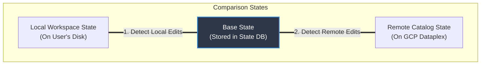
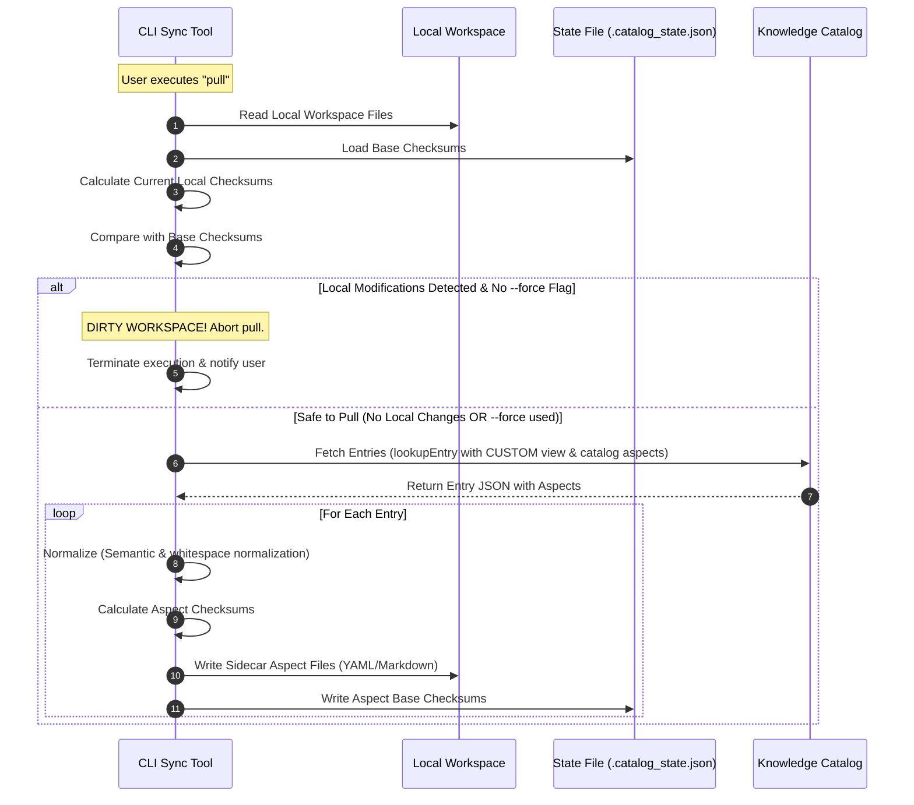
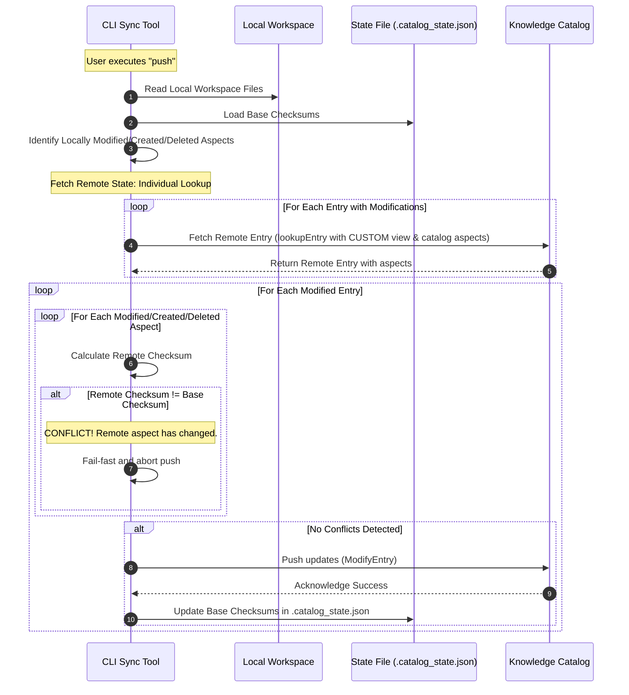

# Change Detection & Conflict Resolution Design Spec

This document outlines the design for local change detection and remote conflict resolution in the **Metadata as Code** library.

---

## Architecture Overview

To enable offline capabilities, minimal network updates, and robust conflict detection without cluttering the user's source files, the tool maintains a system-managed state database at the root of the workspace.

### Design Goals
* **Local Change Detection**: Swiftly isolates fields or aspects modified locally since the last `pull` or `push`.
* **Minimizing Network Footprint**: Only transmits aspects that have changed locally, omitting unmodified metadata.
* **Zero-Workspace Clutter**: System revisions, sync timestamps, and base checksums are stored entirely in the state database, keeping authorable source YAML/Markdown files clean for Git history.

---

## Comprehensive Conflict Resolution Matrix

A **conflict** occurs when the local filesystem is not in sync with the Catalog's state of the resource.

In the event of a conflict, the user has three choices:
* **Manual Merge (via Force Pull)**: Back up local modifications, run a force pull (`kcmd pull --force`) to fetch remote changes, and manually merge the desired local changes.
* **Abandon Local Changes (via Force Pull)**: Run a force pull (`kcmd pull --force`) to discard local modifications and align completely with the remote Catalog state.
* **Force Update (via Force Push)**: Run a force push (`kcmd push --force`) to overwrite the remote Catalog state with the local workspace state.

The conflict resolution matrix covers aspect modifications, creations, and deletions:

| Local Aspect State | Remote Aspect State | Outcome / Action | Description |
| :--- | :--- | :--- | :--- |
| **Unchanged** | **Unchanged** | **Skip** | No actions needed. |
| **Unchanged** | **Modified** | **Safe to Pull** | Safe to pull. Remote changes can overwrite local file on next pull. |
| **Unchanged** | **Deleted** | **Safe to Delete Locally** | Safe to delete locally on next pull. |
| **Does Not Exist** | **Exists Remotely** | **Safe to Pull** | Safe to pull/create locally. Local aspect files are written and base checksums are recorded. |
| **Modified** | **Unchanged** | **Safe to Push** | Push local modifications. Base checksum is updated. |
| **Modified** | **Modified** | **Conflict** | Conflict! Abort push. User must pull to resolve or use force push. |
| **Modified** | **Deleted (Entry Deleted)** | **Conflict** | Conflict! Remote entry itself was deleted. Options: (1) Abandon local changes via force pull to delete local files, or (2) Force push to recreate the entry and aspects. |
| **Modified** | **Deleted (Aspect Deleted)** | **Conflict** | Conflict! Only the aspect was deleted remotely. Options: (1) Abandon local changes via force pull to delete local aspect, or (2) Force push to recreate/push the aspect remotely. |
| **Deleted** | **Unchanged** | **Safe to Delete Remotely** | Push aspect deletion to remote catalog. Clean up local state entry. |
| **Deleted** | **Modified** | **Conflict** | Conflict! Remote was modified while local was deleted. |
| **Deleted** | **Deleted** | **Skip** | Aspect was deleted on both sides. Clean up local state. |
| **Created (New)** | **Exists Remotely** | **Conflict** | Conflict! Local aspect created but already exists on remote. |
| **Created (New)** | **Does Not Exist** | **Safe to Create** | Safe to push/create on remote. Base checksum is recorded. |

---

## Design Rationale: Why a State Database is Required

To perform three-way change detection and detect conflicts safely, the sync engine must distinguish between changes made by the local user and changes made on the remote Catalog. 

If the tool only compared the **Local Workspace State** directly to the **Remote Catalog State**, it would be impossible to determine the direction of change:
* Does a mismatch mean the user modified the local file, or that someone modified the remote entry?
* Did a missing aspect locally mean the user intentionally deleted it, or that the aspect was created remotely and is missing locally?

To resolve these ambiguities without polluting the user's authorable YAML and Markdown files with system metadata (e.g., sync timestamps, revision IDs, or base checksums), the design introduces a system-managed **State Database**. 

This database acts as a local ledger storing the **Base State (Last Synchronized State)**. By comparing the base checksum of an aspect at the last sync against its current local and remote checksums, the tool can uniquely determine the source of any modifications and execute the correct action:



---

## The State Database (`.catalog_state.json`)

A flat JSON database maps each tracked entry and its corresponding aspects to their last synchronized state.

### Checksum Scope & Modifiability Constraints

Before discussing database layout options, we define the scope and constraints of the tracked metadata:
* **Aspect-Level Only**: This tool does not support entry-level metadata modifications (e.g., `displayName`, `description` defined directly on the Entry resource). Therefore, no entry-level checksums are calculated or tracked.
* **Aspect `checksum`**: These checksums are calculated for the key-value properties inside each individual aspect type (e.g., `dataplex-types.global.overview`, `dataplex-types.global.descriptions`).
* **Static Modifiability Enforcement**: The `catalog.yaml` validation layer statically ensures that only modifiable aspects (e.g., non-required aspects for ingested entries, or any aspect for custom/user-managed entries) are configured to be synchronized and published.

### Proposed Design: Flat State File (`.catalog_state.json`)

A single JSON file at the root of the workspace containing a map of all tracked files, their base aspects, and their checksums.

> [!NOTE]
> **Why JSON over YAML for system state?**
> Since `.catalog_state.json` is entirely system-managed and gitignored, human readability is secondary to execution performance and parsing reliability. Node.js has native, highly-optimized C++ support for parsing and serializing JSON (`JSON.parse` / `JSON.stringify`). Utilizing YAML would require external JavaScript-based parser libraries, which introduce significant CPU and execution latency during CLI startup as the catalog scales.

```json
{
  "version": "1",
  "entries": {
    "ecommerce-prod.ecommerce-dataset/orders": {
      "lastSyncTime": "2026-05-26T06:18:49Z",
      "aspects": {
        "dataplex-types.global.overview": {
          "checksum": "a8f5c1e39834c2219efbf4c8996fb92427ae41e4649b934ca495991b7852b855",
          "format": "MARKDOWN",
          "file": "orders.overview.md"
        },
        "dataplex-types.global.descriptions": {
          "checksum": "5b30c44298fc1c149afbf4c8996fb92427ae41e4649b934ca495991b7852b856",
          "format": "YAML",
          "file": "orders.yaml"
        }
      }
    }
  }
}
```

* **Pros:**
  * **High Performance:** Native V8 JSON parsing (`JSON.parse`/`JSON.stringify`) is extremely fast and incurs zero external parsing dependency overhead.
  * **Zero Clutter:** Keeps the user's active catalog folders completely clean of system-managed state files.
  * **Easy Git Ignoring:** The single `.catalog_state.json` file is easily ignored globally via `.gitignore`.
* **Cons:**
  * **Parallelization Bottleneck (Lock Contention):** Operating on a single centralized file requires strict concurrent process locking to prevent state corruption. During large/bulk export or import operations, this single-file lock becomes a contention point that limits parallel execution capabilities across processes.

---

### Alternatives Considered

#### Mirror State Directory (`.catalog_state/`)

A hidden directory mirroring the structure of the `catalog/` folder, containing individual aspect state files.

```
path/to/root/
├── catalog.yaml
├── catalog/
│   └── ecommerce-prod.ecommerce-dataset/
│       ├── orders.yaml
│       └── orders.overview.md
└── .catalog_state/
    └── ecommerce-prod.ecommerce-dataset/
        ├── orders.yaml.state
        └── orders.overview.md.state
```

* **Pros:**
  * Keeps the developer's source directories clean of state metadata.
  * Matches the structure of the user catalog directory exactly, making mapping straightforward.
* **Cons:**
  * **High IO Overhead:** Incurs significant directory traversal and file manipulation overhead, since Node.js must manage and keep two identical directory hierarchies in sync as the catalog scales.

#### Co-located Checksum Files (In-place)

Checksum state files are stored directly inside the catalog directories, placed immediately next to their corresponding authorable source files using a `.checksum` suffix.

```
path/to/root/
├── catalog.yaml
└── catalog/
    └── ecommerce-prod.ecommerce-dataset/
        ├── orders.yaml
        ├── orders.yaml.checksum
        ├── orders.overview.md
        └── orders.overview.md.checksum
```

* **Pros:**
  * **Self-Contained:** Highly localized. If a directory or file is renamed/deleted by the user, the corresponding checksum file can be moved or deleted concurrently by standard OS tools.
* **Cons:**
  * **High Clutter:** Doubles the number of files in the user's workspace folders, drastically reducing manual curation readability and cluttering the Git tracking space.


### Concurrent Process Locking

To prevent state database corruption when multiple instances of the `kcmd` CLI or automated runners (such as CI/CD pipelines or local agent tools) run concurrently, the tool implements a lightweight, cross-platform file lock on `.catalog_state.json` during read/write sequences. If the state file is locked, concurrent operations will fail-fast with a concurrency conflict error.

> [!IMPORTANT]
> **Aspect Creations & Type Registration Constraints**
> Local creation or addition of an aspect within an entry is strictly permitted only for **existing, registered `aspectTypes`** in the Google Cloud Dataplex service. The CLI tool cannot create aspect types dynamically on the fly. The sync tool retrieves valid aspect schemas during snapshot initialization (see `_buildTypes` in `snapshot.ts`) and validates the local workspace against these schemas before executing any sync operations.

---

## Synchronization Workflows

### Pull Workflow

To prevent silent data loss, the `pull` command executes a safety "dirty guard" to verify if the user has any unpushed local modifications before writing remote catalog updates.



1. **Workspace Dirty Check (Pull-Safety Guard - Strict All-or-Nothing):**
   - Scan all local aspect files and compute their current local checksums.
   - Compare with the `Base Checksum` in the state file.
   - If *any* local change is detected anywhere in the workspace and the `--force` flag is absent, the entire pull operation aborts immediately. This strict all-or-nothing constraint protects unpushed work across the entire workspace.
   
   > [!NOTE]
   > **Why a Dirty Guard is necessary:**
   > If a user has modified local catalog files but has not yet pushed them, their workspace is considered "dirty". A standard `pull` fetches remote files and writes them directly to disk. Without the Dirty Guard, this would silently overwrite and permanently erase any unpushed local modifications.

2. **Fetch Remote State:**
   - Fetch entries (including aspects) from the remote catalog.

3. **Semantic Normalization (Semantic-Aware Checksumming):**
   A standard byte-level string hash (SHA-256) changes completely if an auto-formatter (like Prettier) re-orders object keys or toggles quotes, even if the underlying metadata remains exactly the same. To shield the sync engine from harmless formatting diffs, semantic-aware normalization ensures that the checksum strictly reflects the *semantic content* of the data.
   
   Before calculating checksums or comparing changes, the following normalization rules are applied:
   - **YAML/JSON Aspects**: Semantic data files are parsed into objects, their keys are recursively sorted alphabetically, and spacing is standardized to a single canonical format.
     - *Exception for Schema Arrays*: To preserve physical and logical database column ordering, array elements within `schema.fields` are not sorted alphabetically. Key sorting is recursively applied internally to the properties of each field object, but the array itself maintains its index order.
   - **Markdown Sidecars**: Markdown content sidecar files are normalized. The YAML frontmatter block undergoes the identical semantic normalization rules (parsing, alphabetical sorting, canonical formatting) as standard standalone YAML files. The Markdown body is stripped of trailing whitespace, and newlines are normalized (`\r\n` to `\n`).

4. **Save State:**
   - Save the normalized aspect content to disk (either in aspect YAML or sidecar `.md` files).
   - Update the computed aspect checksums as the new **Base Checksums** in `.catalog_state.json`.

---

### Push Workflow



1. **Detect Local Changes:**
   - Load local files, apply **Semantic Normalization**, and calculate the `Current Local Checksum`.
   - Identify:
     - **Modified Aspects**: Checksum differs from base checksum.
     - **Created Aspects**: Aspect exists locally but has no base checksum record.
     - **Deleted Aspects**: Base checksum record exists but local aspect file has been deleted.

2. **Lookup-Based Fetching Strategy with `CUSTOM` View:**
   - To verify remote checksums, the tool fetches remote entry states individually using `lookupEntry`.
   - **Payload Optimization:** Requests explicitly use `view: 'CUSTOM'` and specify only the exact aspect types defined in `catalog.yaml`. This minimizes network payload size and avoids hitting response limits.
   - **Concurrency Control:** Calls are executed using a throttled concurrent request pool to prevent socket exhaustion and service-side rate limiting (HTTP 429).

3. **Verify & Push (Strict All-or-Nothing):**
   - The push operation implements a strict **all-or-nothing** integrity guard. If *any* aspect on *any* entry fails the conflict verification (`Remote Checksum != Base Checksum`), the entire push operation is aborted immediately. No partial updates are committed.
   - If a push is aborted due to a conflict, the developer has two options:
     1. **Force Overwrite**: Push with the `--force` flag to explicitly overwrite the remote catalog with the local state.
     2. **Manual Resolution**: The developer can backup their local modified files, pull the remote changes using `kcmd pull --force` to align the local state with the remote catalog, and then manually merge their backed-up changes before pushing again.
   - If no conflicts are found, the tool pushes the configured and modifiable aspects using `modifyEntry` and updates the base checksums in `.catalog_state.json` to match.


## Dry Run (`--dry-run`) Mechanics

To allow developers to safely preview updates before applying changes to disk or remote metadata registries, both the `pull` and `push` operations support a `--dry-run` execution mode. 

During a dry run, the exact same calculation, lookup, and validation logic is executed, but all write mutations to the local disk or remote APIs are intercepted and replaced with a detailed summary report.

### 1. `kcmd pull --dry-run` Workflow
1. **Workspace Validation**: Runs the pull-safety "dirty guard" check. If the workspace contains local modifications, the dry run immediately aborts and reports a dirty workspace error.
2. **Fetch and Normalize**: Connects to the GCP Dataplex service and fetches the remote entry aspects matching the configured scope.
3. **Calculate and Compare**: Performs semantic normalization on the fetched aspects and compares their computed checksums to the base checksums in `.catalog_state.json` and the current local files.
4. **Preview Execution**: Prints a structured report of all pending changes to be synced locally:
   * **Added Aspects**: Aspects present remotely but not locally.
   * **Modified Aspects**: Aspects whose remote content differs from the local copy.
   * **Deleted Aspects**: Aspects deleted remotely but still present locally.
5. **Execution Safeguard**: **No write operations** are performed on the local workspace files or the `.catalog_state.json` file.

### 2. `kcmd push --dry-run` Workflow
1. **Local Change Detection**: Scans local files, applies semantic normalization, and isolates locally modified, created, or deleted aspects.
2. **Conflict Check**: Fetches the remote state of modified entries and checks if `Remote Checksum != Base Checksum` for any modified aspects. 
3. **Conflict and Integrity Report**: If conflicts are detected, they are printed clearly and the preview reports that the push *would fail* due to concurrency conflicts. If no conflicts are found, the engine reports that the push is safe to execute.
4. **Preview Mutations**: Logs a detailed sequence of the planned API modifications:
   * **Aspect Modifications**: Aspects to be updated.
   * **Aspect Creations**: New aspects to be added.
   * **Aspect Deletions**: Aspects to be removed.
5. **Execution Safeguard**: **No write operations** are performed on the remote Dataplex service (`modifyEntry` is not called) and `.catalog_state.json` remains unchanged.

---

## Future Scope

### 1. State File Resiliency & Atomic Writes
To prevent state file corruption when writing updates to `.catalog_state.json` (e.g., if the CLI process is interrupted, crashes, or the disk runs out of space):
* **Atomic Write Mechanism**: Future versions of the CLI should implement atomic file updates. Instead of writing directly to the target `.catalog_state.json` file, the tool will write the updated state to a temporary file (e.g., `.catalog_state.json.tmp`) in the same directory, and then use an atomic rename operation (`fs.rename` or equivalent OS-level rename) to replace the original file.
* **Automatic Backup**: Maintain a `.catalog_state.json.bak` copy before executing any state transitions to facilitate self-healing and recovery options for corrupted states.

### 2. State Scalability & Parallelization
To resolve the lock contention bottleneck of a single centralized state file during large-scale or bulk import/export operations:
* **Transactional State Indexer**: Explore transitioning the state storage to a transactional database. Utilizing a lightweight embedded engine like SQLite is one potential option to enable row-level concurrency control rather than file-level locking; however, the final choice of approach or storage engine should be thoroughly evaluated and decided based on performance and architectural requirements at the time of implementation.

### 3. Fine-Grained Change Isolation & Automatic Merging
To optimize synchronization workflows and prevent unnecessary blocks when editing non-overlapping metadata:
* **Publish-Scoped Dirty Checks**: If the snapshot configuration pulls aspects A, B, and C, but the publishing configuration only pushes aspects A and B, local modifications on aspect C should be isolated. The push operation for aspects A and B should proceed successfully without being blocked by the unpushed changes in aspect C.
* **Three-Way Merging of Aspects**: Implement intelligent, non-overlapping aspect-level merging during pull/push conflicts so that independent updates to distinct aspects in the same entry can merge automatically without requiring human intervention.


