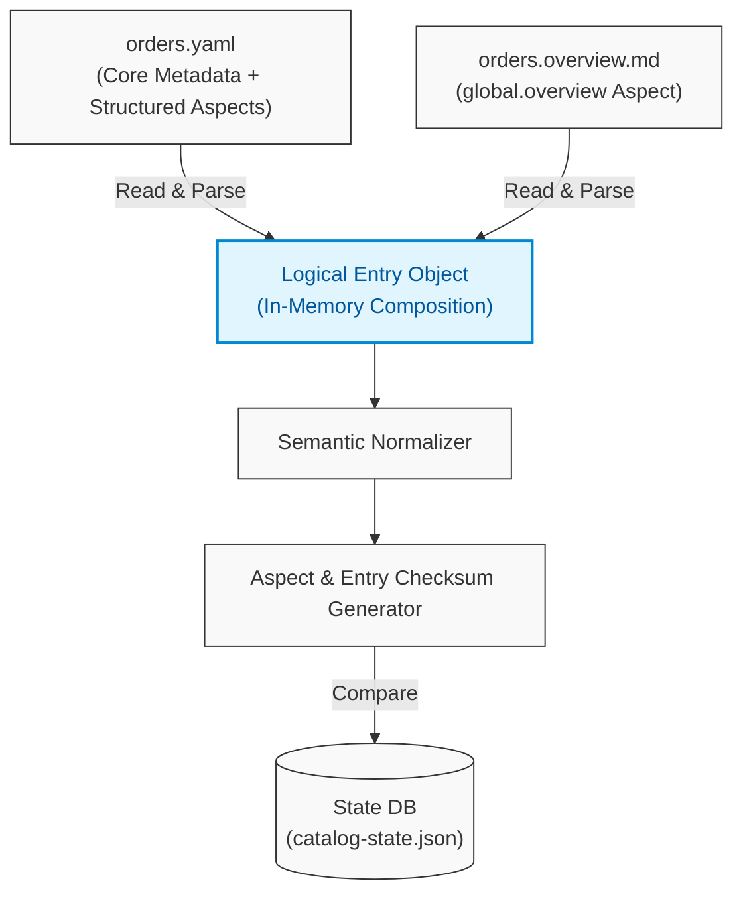
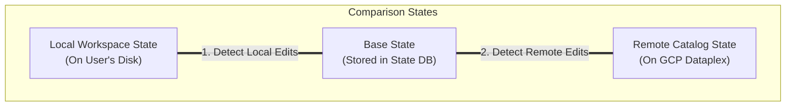
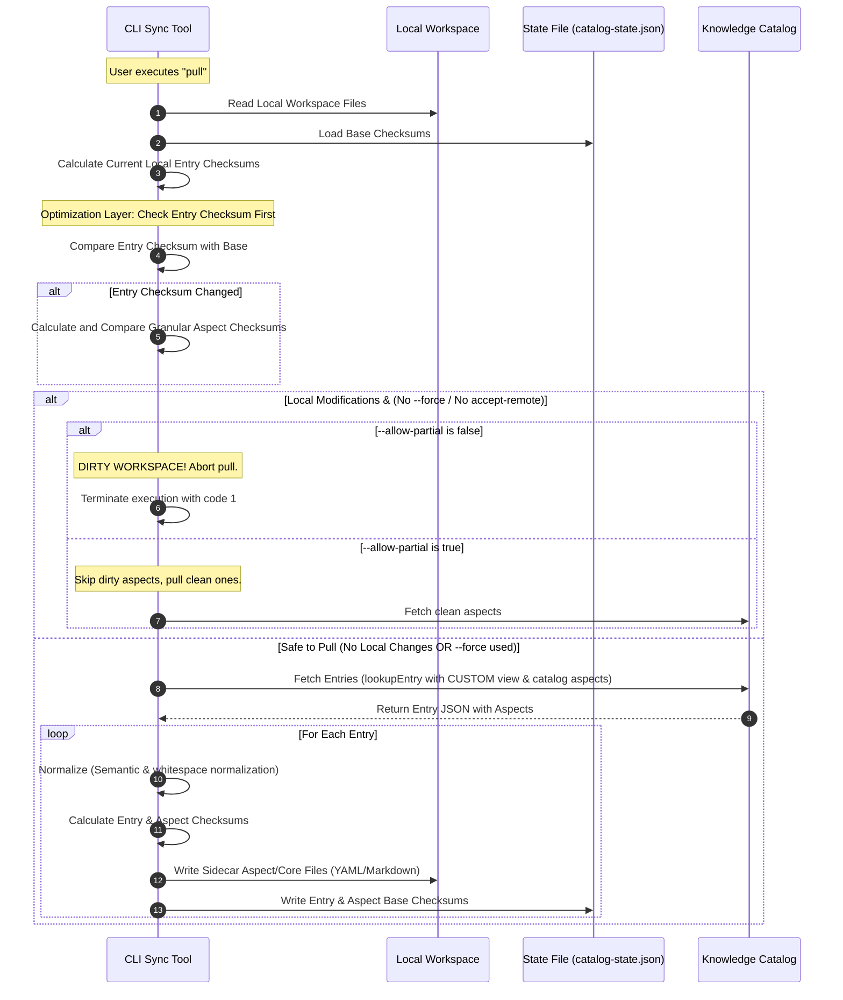
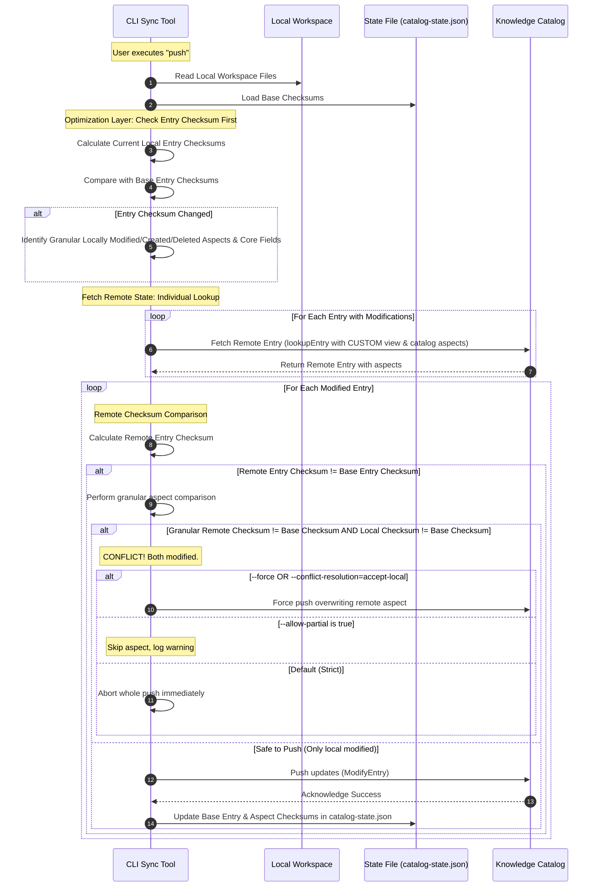

# Change Detection & Conflict Resolution Design Spec

This document outlines the design for local change detection and remote conflict resolution in the **Metadata as Code** library.

---

## Architecture Overview

To enable offline capabilities, minimal network updates, and robust conflict detection without cluttering the user's source files, the tool maintains a system-managed state database at the root of the workspace.

### Design Goals
* **Local Change Detection**: Swiftly isolates fields or aspects modified locally since the last `pull` or `push`.
* **Minimizing Network Footprint**: Only transmits aspects that have changed locally, omitting unmodified metadata.
* **Zero-Workspace Clutter**: System revisions, sync timestamps, and base checksums are stored entirely in the state database, keeping authorable source YAML/Markdown files clean for Git history.

---

## Logical Entry Composition & Sidecar Mapping

To provide a clean, readable layout for unstructured text (such as rich-text documentation or Markdown profiles), the synchronization operates on a logical **Entry** boundary rather than treating filesystem files in isolation.

### 1. Logical Entry Assembly
At runtime, the synchronization scans the local workspace directories and reconstructs each entry by composing its constituent physical files:
*   **Core Entry File (mandatory):** A single YAML file (e.g., `orders.yaml`) containing the entry's identity, core attributes (e.g., `displayName`, `description`), and any structured/inline aspects.
*   **Sidecar Aspect Files (optional):** Dedicated Markdown files (e.g., `orders.overview.md`) that contain specific, unstructured rich-text metadata aspects mapped to the entry.

Before any change detection, validation, or API operation is performed, the synchronization merges these files in memory into a single unified Entry representation:



---

## Conflict Resolution

A **conflict** occurs when both the local workspace copy and the remote catalog copy of the same aspect or core metadata have been modified since the last synchronization.

Synchronization keeps the local developer workspace and the remote Knowledge Catalog consistent, depending on the direction of transfer:
*   **Pull**: Synchronizes the local workspace with the remote catalog.
*   **Push**: Synchronizes the remote catalog with the local workspace.

To handle these scenarios safely and flexibly, the library provides fine-grained CLI configurations and distinct workflow strategies.

### 1. CLI Synchronization Configurations
The library supports three core flags to customize conflict handling in both interactive (local developer) and automated (CI/CD) environments:

*   **`--allow-partial` (Boolean, default: `false`):** Applies to both `push` and `pull` operations.
    *   When `false` (strict mode): Any unresolved conflict aborts the entire operation immediately (non-zero exit code).
    *   When `true` (partial mode): The library pushes or pulls all non-conflicting aspects, but skips and warns about the conflicting aspects. The CLI exits with code `0` (success) but logs a warning summary.
*   **`--conflict-resolution=<strategy>` (Enum, default: `manual`):** Specifies the programmatic resolution policy:
    *   `manual`: Conflicts are flagged for human intervention.
    *   `accept-remote` (Remote Wins - applies to `pull` operations): Automatically resolves conflicts by overwriting the local workspace with the remote catalog state.
    *   `accept-local` (Local Wins - applies to `push` operations): Automatically resolves conflicts by overwriting the remote catalog with the local workspace state.
*   **`--force` / `-f` (Shorthand Alias):** A standard alias providing convenient developer ergonomics for global overrides:
    *   `kcmd push --force` $\equiv$ `kcmd push --conflict-resolution=accept-local`
    *   `kcmd pull --force` $\equiv$ `kcmd pull --conflict-resolution=accept-remote`

---

### 2. Workflow Resolution Strategies

Depending on the synchronization direction, developers can apply these CLI flags to execute the following workflow choices:

#### Pull Conflict Resolution Strategies
*   **Abandon Local Changes (`kcmd pull --force`):** Discards all local modifications and completely overwrites the local workspace with the remote catalog state.
*   **Partial Pull (`kcmd pull --allow-partial`):** Pulls all non-conflicting remote changes, while skipping aspects that have local modifications to protect unpushed local work.

#### Push Conflict Resolution Strategies
*   **Force Overwrite (`kcmd push --force`):** Explicitly overwrites the remote catalog with the local workspace state, ignoring any remote changes.
*   **Partial Push (`kcmd push --allow-partial`):** Pushes all safe, non-conflicting aspect edits while leaving conflicting aspects unpushed (dirty) for subsequent manual resolution.

The synchronization behaviors and conflict resolutions are split below into operations impacting pull and push workflows.

### 1. Pull Conflict Resolution Matrix

During a `pull` operation, the main objective is to bring remote changes into the local workspace. To protect unpushed work, the standard `pull` command implements a strict "dirty guard" check on the entire workspace first.

> [!NOTE]
> **Partial Pull Behavior (`--allow-partial`):**
> If `--allow-partial` is set during a standard pull, any aspect triggering an **Abort (Dirty Workspace)** will be cleanly skipped with a warning, allowing all other unmodified/safe aspects to be pulled successfully.

| Local Aspect State | Remote Aspect State | Standard Pull (`kcmd pull`) | Force Pull (`kcmd pull --force`) | Description |
| :--- | :--- | :--- | :--- | :--- |
| **Unchanged** | **Unchanged** | **Skip** | **Skip** | No changes on either side. |
| **Unchanged** | **Modified** | **Safe to Pull** | **Safe to Pull** | Remote modifications are safely written to the local workspace. |
| **Unchanged** | **Deleted (Aspect Deleted)** | **Safe to Delete Locally** | **Safe to Delete Locally** | Remote aspect deletion is propagated locally; the local aspect (file - if applicable) is deleted. |
| **Unchanged** | **Deleted (Entry Deleted)** | **Safe to Delete Locally** | **Safe to Delete Locally** | Remote entry deletion is propagated locally; all local entry and aspect files are deleted. |
| **Does Not Exist** | **Exists Remotely** | **Safe to Pull** | **Safe to Pull** | The remote aspect is pulled down and created in the local workspace. |
| **Modified** / **Created** / **Deleted** | **Any State** | **Abort (Dirty Workspace)** | **Overwritten by Remote** | Local changes exist in the workspace. Standard pull aborts immediately to prevent overwriting unpushed local work. Force pull discards local changes and overwrites them with the remote state. |

### 2. Push Conflict Resolution Matrix

During a `push` operation, local modifications are sent to the remote catalog. A standard `push` will abort if any conflict is detected (i.e., if the remote state has changed since the last synchronization).

> [!NOTE]
> **Partial Push Behavior (`--allow-partial`):**
> If `--allow-partial` is set during a standard push, any aspect triggering a **Conflict (Abort)** will be skipped and logged as a warning, allowing the rest of the non-conflicting aspects to be successfully published.

> [!WARNING]
> **Lack of Remote Etag Support (Overwrite Risk):**
> Since the remote Knowledge Catalog does not support Entity/Aspect Etag concurrency controls yet, there is a race-condition window where even a deemed "safe" change (e.g., a change evaluated as non-conflicting during the lookup phase) could overwrite concurrent updates made directly to the latest remote catalog state during the write phase.

| Local Aspect State | Remote Aspect State | Standard Push (`kcmd push`) | Force Push (`kcmd push --force`) | Description |
| :--- | :--- | :--- | :--- | :--- |
| **Unchanged** | **Unchanged** | **Skip** | **Skip** | No changes on either side. |
| **Unchanged** | **Modified** | **Skip** | **Skip** | No local changes to push. Remote changes remain until the next pull. |
| **Modified** | **Unchanged** | **Safe to Push** | **Safe to Push** | Pushes local modifications to the remote catalog. Base checksum is updated. |
| **Modified** | **Modified** | **Conflict (Abort)** | **Force Overwrite** | Both copies were modified. Standard push aborts. Force push overwrites the remote aspect. |
| **Modified** | **Deleted (Entry Deleted)** | **Conflict (Abort)** | **Force Create/Overwrite** | The remote entry itself was deleted. Force push recreates the entry and aspect on the remote (entry-level creation/recreation is only supported for custom/user-managed entries, not GCP-managed entries). |
| **Modified** | **Deleted (Aspect Deleted)** | **Conflict (Abort)** | **Force Create/Overwrite** | The remote aspect was deleted. Force push recreates/updates the aspect on the remote. |
| **Deleted** | **Unchanged** | **Safe to Delete Remotely** | **Safe to Delete Remotely** | Pushes the aspect deletion to the remote catalog. Base state is cleaned up. |
| **Deleted** | **Modified** | **Conflict (Abort)** | **Force Delete Remotely** | The aspect was modified remotely while being deleted locally. Force push deletes the aspect remotely. |
| **Deleted** | **Deleted** | **Skip** | **Skip** | The aspect was deleted on both sides. Local state base checksum is cleaned up. |
| **Created (New)** | **Exists Remotely** | **Conflict (Abort)** | **Force Overwrite** | Local aspect created but already exists on the remote. Force push overwrites remote aspect. |
| **Created (New)** | **Does Not Exist** | **Safe to Create** | **Safe to Create** | Pushes the new aspect to the remote catalog. Base checksum is recorded. |

---

## Deletion Mechanics & Lifecycle

Deletion represents a critical state transition in metadata synchronization. The synchronization enforces strict rules to distinguish between deleting a specific aspect and deleting an entire catalog entry.

### 1. Entry-Level Deletion
The presence of the **Core Entry File** (e.g., `orders.yaml`) represents the existence of the Entry.
*   **Local Entry Deletion:** If a developer deletes `orders.yaml` from their workspace, the synchronization interprets this as an intentional request to delete the entire entry and all its aspects. During `push`, the entry is removed from the remote catalog if there is no conflict. In case of conflict, please check the [Push Conflict Resolution Matrix](#2-push-conflict-resolution-matrix) above.
*   **Remote Entry Deletion:** If an entry is deleted remotely, a `pull` operation will remove `orders.yaml` and all its sidecars from the local workspace if there is no conflict. In case of conflict, please check the [Pull Conflict Resolution Matrix](#1-pull-conflict-resolution-matrix) above.

### 2. Aspect-Level Deletion

Aspects can be stored either in dedicated sidecar files (e.g., `orders.overview.md`) or inline within the main entry file (e.g., `orders.yaml`). Removing an aspect while leaving the rest of the entry intact represents the deletion of only that specific aspect.

*   **Local Aspect Deletion:** 
    *   *For sidecar aspects:* Deleting the sidecar file (e.g., `orders.overview.md`) from disk registers a local aspect deletion.
    *   *For inline aspects:* Removing the aspect's key and data block from the main entry YAML file (e.g., `orders.yaml`) registers a local aspect deletion.
    *   During `push`, the remote aspect is deleted from the catalog while the core entry remains intact.
*   **Remote Aspect Deletion:** 
    *   If an aspect is deleted remotely, a `pull` operation propagates this deletion locally by either deleting the corresponding sidecar file from disk, or removing the aspect's key/data block from the main entry YAML file.

### 3. Safety & Validation Rules
*   **Orphaned Sidecars Check:** If a sidecar aspect file (e.g., `orders.overview.md`) is present in the directory but the core entry file (`orders.yaml`) is missing, the synchronization aborts and fails-fast with a **Validation Error**. This prevents orphaned aspect data from lingering or causing dirty state conflicts.
*   **Empty Sidecars:** Empty sidecar files (containing 0 bytes or only whitespace) are interpreted as a **local aspect deletion request**. The aspect is removed on the remote catalog during push.
*   **Managed Entries Safeguard:** The synchronization bypasses physical entry deletion APIs for cloud-managed catalog entries (e.g., BigQuery tables/datasets) which are owned and managed by GCP. However, the library continues to support aspect creations, updates, and deletions on these entries.

---

## Design Rationale: Why a State Database is Required

To perform three-way change detection and detect conflicts safely, the synchronization must distinguish between changes made by the local user and changes made on the remote Catalog. 

If the tool only compared the **Local Workspace State** directly to the **Remote Catalog State**, it would be impossible to determine the direction of change:
* Does a mismatch mean the user modified the local file, or that someone modified the remote entry?
* Did a missing aspect locally mean the user intentionally deleted it, or that the aspect was created remotely and is missing locally?

To resolve these ambiguities without polluting the user's authorable YAML and Markdown files with system metadata (e.g., sync timestamps, revision IDs, or base checksums), the design introduces a system-managed **State Database**. 

This database acts as a local ledger storing the **Base State (Last Synchronized State)**. By comparing the base checksum of an aspect at the last sync against its current local and remote checksums, the tool can uniquely determine the source of any modifications and execute the correct action:



---

## The State Database (`catalog-state.json`)

A flat JSON database maps each tracked entry and its corresponding aspects to their last synchronized state.

### Checksum Scope & Modifiability Constraints

Before discussing database layout options, we define the scope and constraints of the tracked metadata:
* **Entry-Level & Aspect-Level Checksums**: The tool tracks both a unified **Entry-Level Checksum** and individual **Aspect-Level Checksums**. This is critical for user-managed or custom entries where the entry itself can be created or deleted, and for uningested entry groups where entry-level metadata (such as `entrySource`, `displayName`, or `description`) is modifiable.
* **Aspect `checksum`**: These checksums are calculated for the key-value properties inside each individual aspect type (e.g., `dataplex-types.global.overview`, `dataplex-types.global.descriptions`).
* **Static Modifiability Enforcement**: The `catalog.yaml` validation layer statically ensures that only modifiable aspects and entry properties are configured under the `publishing` section to be written back to the remote service. Users are explicitly permitted to configure non-modifiable/read-only aspects and properties in the `snapshot` section to retrieve them locally as reference context.

### Proposed Design: Flat State File (`catalog-state.json`)

A single JSON file at the root of the workspace containing a map of all tracked entries, their unified entry-level base checksum, their last sync timestamps, and individual base aspect checksums.

> [!NOTE]
> **Why JSON over YAML for system state?**
> Since `catalog-state.json` is entirely system-managed and gitignored, human readability is secondary to execution performance and parsing reliability. Node.js has native, highly-optimized C++ support for parsing and serializing JSON (`JSON.parse` / `JSON.stringify`). Utilizing YAML would require external JavaScript-based parser libraries, which introduce significant CPU and execution latency during CLI startup as the catalog scales.

```json
{
  "version": "1",
  "entries": {
    "ecommerce-prod.ecommerce-dataset/orders": {
      "entryChecksum": "e93fa854cd329fc1c149afbf4c8996fb92427ae41e4649b934ca495991b7852b857",
      "lastSyncTime": "2026-05-26T06:18:49Z",
      "aspects": {
        "dataplex-types.global.overview": "a8f5c1e39834c2219efbf4c8996fb92427ae41e4649b934ca495991b7852b855",
        "dataplex-types.global.descriptions": "5b30c44298fc1c149afbf4c8996fb92427ae41e4649b934ca495991b7852b856"
      }
    }
  }
}
```

* **Pros:**
  * **High Performance:** Native V8 JSON parsing (`JSON.parse`/`JSON.stringify`) is extremely fast and incurs zero external parsing dependency overhead.
  * **Startup Optimization / Mapping:** The state file maps entry IDs directly to their base hashes and structures. This acts as an in-memory catalog index, allowing the startup phase to construct a map of the local catalog's content without recursively enumerating, scanning, and parsing every file in the workspace directory.
  * **Derivable File Paths:** File locations and formats are derived from entry names based on the `CatalogSource` and `CatalogLayout` implementations, allowing the state file to omit `format` and `file` fields for a highly compact representation.
  * **Zero Clutter:** Keeps the user's active catalog folders completely clean of system-managed state files.
* **Cons:**
  * **State Desynchronization & Atomicity Risk:** Storing authorable metadata in the `catalog/` directory and its base sync state in `catalog-state.json` separates the data from its tracking ledger. Because writing to two separate files cannot be executed as a single atomic OS transaction, any process interruption (such as a crash, manual cancel, or disk-full error) in between operations can leave the workspace in an inconsistent state. This requires the CLI tool to implement strict write-ordering sequences or write-ahead journaling to detect and self-heal inconsistencies.
  * **Global Write Amplification:** Every single metadata modification, creation, or deletion—even to a single aspect or description—requires the CLI to read, deserialize, modify, reserialize, and rewrite the *entire* centralized `catalog-state.json` database. At a large catalog scale, this introduces massive I/O overhead for minor incremental changes and creates a global execution bottleneck if multiple automated runs attempt concurrent updates.

---

### Alternatives Considered

#### Mirror State Directory (`.catalog_state/`)

A hidden directory mirroring the structure of the `catalog/` folder, containing individual aspect state files.

```
path/to/root/
├── catalog.yaml
├── catalog/
│   └── ecommerce-prod.ecommerce-dataset/
│       ├── orders.yaml
│       └── orders.overview.md
└── .catalog_state/
    └── ecommerce-prod.ecommerce-dataset/
        ├── orders.yaml.state
        └── orders.overview.md.state
```

* **Pros:**
  * Keeps the developer's source directories clean of state metadata.
  * Matches the structure of the user catalog directory exactly, making mapping straightforward.
* **Cons:**
  * **High IO Overhead:** Incurs significant directory traversal and file manipulation overhead, since Node.js must manage and keep two identical directory hierarchies in sync as the catalog scales.

#### Co-located Checksum Files (In-place)

Checksum state files are stored directly inside the catalog directories, placed immediately next to their corresponding authorable source files using a `.checksum` suffix.

```
path/to/root/
├── catalog.yaml
└── catalog/
    └── ecommerce-prod.ecommerce-dataset/
        ├── orders.yaml
        ├── orders.yaml.checksum
        ├── orders.overview.md
        └── orders.overview.md.checksum
```

* **Pros:**
  * **Self-Contained:** Highly localized. If a directory or file is renamed/deleted by the user, the corresponding checksum file can be moved or deleted concurrently by standard OS tools.
* **Cons:**
  * **High Clutter:** Doubles the number of files in the user's workspace folders, drastically reducing manual curation readability and cluttering the Git tracking space.


### Concurrent Process Locking

To prevent state database corruption when multiple instances of the `kcmd` CLI or automated runners (such as CI/CD pipelines or local agent tools) run concurrently, the tool implements a lightweight, cross-platform file lock on `catalog-state.json` during read/write sequences. If the state file is locked, concurrent operations will fail-fast with a concurrency conflict error.

> [!IMPORTANT]
> **Aspect Creations & Type Registration Constraints**
> Local creation or addition of an aspect within an entry is strictly permitted only for **existing, registered `aspectTypes`** in the Google Cloud Dataplex service. The CLI tool cannot create aspect types dynamically on the fly. The sync tool retrieves valid aspect schemas during snapshot initialization and validates the local workspace against these schemas before executing any sync operations.

---

## Synchronization Workflows

### Pull Workflow

To prevent silent data loss, the `pull` command executes a safety "dirty guard" to verify if the user has any unpushed local modifications before writing remote catalog updates.



1. **Workspace Dirty Check (Pull-Safety Guard):**
   - Compute current local entry-level checksums for all catalog entries.
   - Compare each computed checksum against the `entryChecksum` in the state file.
   - For any entry where the entry-level checksum differs, perform granular checks on its individual local aspects and core fields to confirm actual modifications.
   - If local changes are detected:
     - If `--force` (or `--conflict-resolution=accept-remote`) is present, local changes are safely overwritten by incoming remote changes.
     - If `--force` is absent, the operation depends on `--allow-partial`:
       - If `--allow-partial` is `false` (default): The entire pull operation aborts immediately to protect unpushed local work (strict all-or-nothing).
       - If `--allow-partial` is `true`: The synchronization skips and logs the dirty aspects as warnings, but successfully pulls updates for clean/unmodified aspects.
   
   > [!NOTE]
   > **Why a Dirty Guard is necessary:**
   > If a user has modified local catalog files but has not yet pushed them, their workspace is considered "dirty". A standard `pull` fetches remote files and writes them directly to disk. Without the Dirty Guard, this would silently overwrite and permanently erase any unpushed local modifications.

2. **Fetch Remote State:**
   - Fetch entries (including aspects) from the remote catalog.

3. **Semantic Normalization (Semantic-Aware Checksumming):**
   A standard byte-level string hash (SHA-256) changes completely if an auto-formatter (like Prettier) re-orders object keys or toggles quotes, even if the underlying metadata remains exactly the same. To shield the synchronization from harmless formatting diffs, semantic-aware normalization ensures that the checksum strictly reflects the *semantic content* of the data.
   
   Before calculating checksums or comparing changes, the following normalization rules are applied:
   - **YAML/JSON Aspects**: Semantic data files are parsed into objects, their keys are recursively sorted alphabetically, and spacing is standardized to a single canonical format.
     - *Exception for Schema Arrays*: To preserve physical and logical database column ordering, array elements within `schema.fields` are not sorted alphabetically. Key sorting is recursively applied internally to the properties of each field object, but the array itself maintains its index order.
   - **Markdown Sidecars**: Markdown content sidecar files are normalized. The YAML frontmatter block undergoes the identical semantic normalization rules (parsing, alphabetical sorting, canonical formatting) as standard standalone YAML files. The Markdown body is stripped of trailing whitespace, and newlines are normalized (`\r\n` to `\n`).

4. **Save State:**
   - Save the normalized aspect content to disk (either in aspect YAML or sidecar `.md` files).
   - Update the computed entry-level and aspect checksums as the new **Base Checksums** in `catalog-state.json`.

---

### Push Workflow



1. **Detect Local Changes:**
   - Load local files, apply **Semantic Normalization**, and calculate the current local entry-level checksums.
   - Compare each entry-level checksum against its base in the state file.
   - For entries with different entry-level checksums, drill down to identify:
     - **Modified Aspects / Core Metadata**: Checksum differs from base checksum.
     - **Created Aspects / Core Metadata**: Exists locally but has no base checksum record.
     - **Deleted Aspects / Core Metadata**: Base checksum record exists but local representation has been deleted.

2. **Lookup-Based Fetching Strategy with `CUSTOM` View:**
   - To verify remote checksums, the tool fetches remote entry states individually using `lookupEntry`.
   - **Payload Optimization:** Requests explicitly use `view: 'CUSTOM'` and specify only the exact aspect types defined in `catalog.yaml`. This minimizes network payload size and avoids hitting response limits.
   - **Concurrency Control:** Calls are executed using a throttled concurrent request pool to prevent socket exhaustion and service-side rate limiting (HTTP 429).

3. **Verify & Push:**
   - The conflict resolution behavior is fully customized by the CLI configuration:
     1. **Force Overwrite:** If `--force` (or `--conflict-resolution=accept-local`) is specified, all conflict checks are bypassed. Local states overwrite the remote catalog.
     2. **Default Strict (allow-partial = false):** If any aspect or core metadata fails conflict verification (i.e., both local and remote have modified it since the base sync), the entire push operation is aborted immediately. No mutations are committed, and the CLI exits with code `1`.
     3. **Partial Publish (allow-partial = true):** The synchronization relaxes the strict check. Conflicting aspects are skipped, leaving their local files dirty, but their base state checksums in `catalog-state.json` are updated to match the final remote state. This registers the latest remote state as the new base, allowing a future push to detect the local edits as pending modifications and publish them safely without conflict. All non-conflicting edits are committed, and the CLI exits with code `0` with warning logs listing the skipped aspects.
   - For successfully pushed/resolved aspects, the tool commits the metadata using `modifyEntry` (or `createEntry`/`deleteEntry`) and updates their base checksums in `catalog-state.json` to match the new local state. For aspects skipped due to conflicts under `--allow-partial`, their base checksums are updated to match the retrieved remote state to enable subsequent push/pull tracking.


## Dry Run (`--dry-run`) Mechanics

To allow developers to safely preview updates before applying changes to disk or remote metadata registries, both the `pull` and `push` operations support a `--dry-run` execution mode. 

During a dry run, the exact same calculation, lookup, and validation logic is executed, but all write mutations to the local disk or remote APIs are intercepted and replaced with a detailed summary report.

### 1. `kcmd pull --dry-run` Workflow
1. **Workspace Validation**: Runs the pull-safety "dirty guard" check.
   - If `--allow-partial` is `false` (default) and workspace is dirty, the dry run immediately aborts and reports a dirty workspace error.
   - If `--allow-partial` is `true` and workspace is dirty, the dry run does not abort. It reports which dirty entries would be skipped and which clean entries would be pulled.
2. **Fetch and Normalize**: Connects to the GCP Dataplex service and fetches the remote entry state and aspects matching the configured scope.
3. **Calculate and Compare**: Performs semantic normalization on the fetched metadata and compares computed entry-level and aspect checksums to the base checksums in `catalog-state.json` and the current local files.
4. **Preview Execution**: Prints a structured report of all pending changes to be synced locally:
   * **Added Aspects/Entries**: Aspects or entries present remotely but not locally.
   * **Modified Aspects/Entries**: Aspects or entry metadata whose remote content differs from the local copy.
   * **Deleted Aspects/Entries**: Aspects or entries deleted remotely but still present locally.
5. **Execution Safeguard**: **No write operations** are performed on the local workspace files or the `catalog-state.json` file.

### 2. `kcmd push --dry-run` Workflow
1. **Local Change Detection**: Scans local files, applies semantic normalization, compares entry-level checksums, and isolates locally modified, created, or deleted entries and aspects.
2. **Conflict Check**: Fetches the remote state of modified entries and checks if `Remote Checksum != Base Checksum` for any modified aspects or core metadata. 
3. **Conflict and Integrity Report**:
   - If conflicts are detected:
     - If `--allow-partial` is `false` (default), the preview reports that the push *would fail* due to conflicts.
     - If `--allow-partial` is `true`, the preview reports which non-conflicting aspects would succeed and which conflicting aspects would be skipped.
   - If no conflicts are found, the synchronization reports that the push is safe to execute.
4. **Preview Mutations**: Logs a detailed sequence of the planned API modifications:
   * **Entry Mutations**: Entry creations, deletions, or metadata modifications.
   * **Aspect Modifications**: Aspects to be updated.
   * **Aspect Creations**: New aspects to be added.
   * **Aspect Deletions**: Aspects to be removed.
5. **Execution Safeguard**: **No write operations** are performed on the remote Dataplex service (`modifyEntry`/`createEntry`/`deleteEntry` is not called) and `catalog-state.json` remains unchanged.

