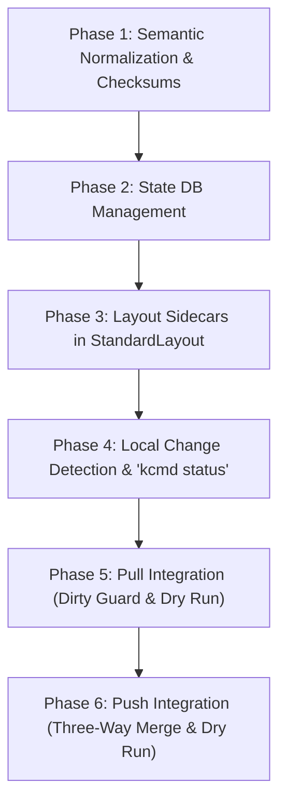

# Checksum & Conflict Resolution Implementation Plan

> [!NOTE]
> **Temporary Workspace File:** This implementation plan is temporary and will be deleted in the final phase of the checksum feature implementation.

This document details the step-by-step execution to implement local change detection, remote conflict resolution, and the local state database (`catalog-state.json`) as outlined in [checksum.md](checksum.md).

---

## High-Level Implementation Steps

We break down the overall implementation into 6 logical, incremental phases:

---

### Phase 1: Semantic Normalization & Checksum Utilities (Done)
**Goal:** Implement helpers to normalize and generate content-based hashes for aspects and entries.

- **Scope & Code Locations:**
  - Create [src/libts/checksum.ts](../../src/libts/checksum.ts) containing:
    - `normalizeAspectData(data: any): any`: recursively sorts object keys alphabetically (excluding array indices).
    - `calculateAspectChecksum(aspectData: any): string`: SHA-256 of normalized aspect JSON string.
    - `calculateEntryChecksum(entry: Entry): string`: unified checksum combining core metadata and aspect-level hashes.
  - Export utilities via [src/libts/index.ts](../../src/libts/index.ts).
  - Add tests in [tests/libts/checksum.test.ts](../../tests/libts/checksum.test.ts).

---

### Phase 2: State Database Management (`catalog-state.json`)
**Goal:** Implement the local ledger serialization, deserialization, concurrent file locking, and integrate initial state creation into `kcmd pull`.

- **Scope & Code Locations:**
  - Create a new file `src/libts/state.ts` containing the `CatalogState` manager class.
  - Read/write a flat `catalog-state.json` file in the root workspace.
  - Implement a lightweight `.lock` file concurrency check to prevent concurrent runs from corrupting the state database.
  - Provide CRUD methods:
    - `getEntryState(localName: string): EntryState`
    - `updateEntryState(localName: string, state: EntryState): void`
    - `deleteEntryState(localName: string): void`
  - Update `CatalogSync.pull()` in `src/libts/sync.ts` to compute entry/aspect checksums and write the initial state to `catalog-state.json` at the end of a pull.
  - Add unit/scenario tests verifying locking behavior, state CRUD, and automatic state database generation after pull.

---

### Phase 3: Layout Sidecars in `StandardLayout`
**Goal:** Add support for unstructured aspects stored in Markdown sidecars (e.g. `orders.overview.md`) alongside core entry YAML files.

- **Scope & Code Locations:**
  - Modify `StandardLayout` in `src/libts/layouts/standard.ts`:
    - **Load Entry:** Scan directory for sidecar markdown files matching `<name>.<aspectShortName>.md`. Populate these into the entry aspects map.
    - **Validation Checks:** Abort and error if orphaned aspect sidecar markdown files exist without a corresponding core YAML entry file.
    - **Aspect Deletion Rule:** Interpret empty sidecar files as aspect deletion requests.
    - **Save Entry:** Separate markdown/unstructured aspects from structured ones. Write structured ones to `.yaml` and unstructured ones to `.md` files. Clean up stale sidecar files.
    - **Delete Entry:** Delete core and all aspect files.

---

### Phase 4: Local Change Detection & `kcmd status`
**Goal:** Implement local change status tracking and introduce the `status` command in CLI.

- **Scope & Code Locations:**
  - Implement `CatalogSync.status()` in `src/libts/sync.ts`.
  - Compare current local files against the base state in `catalog-state.json` to categorize changes (`Modified`, `Created`, `Deleted`, `Unchanged`).
  - Wire up the new `kcmd status` CLI command in `src/tool/main.ts` and `src/tool/commands.ts`.
  - Write test scenarios verifying correct status output formats.

---

### Phase 5: Pull Integration (Dirty Guard, Conflict Resolution & Dry Run)
**Goal:** Implement pull-safety checks and remote-to-local synchronization flows.

- **Scope & Code Locations:**
  - Update `CatalogSync.pull()` in `src/libts/sync.ts`:
    - **Dirty Guard:** Verify if there are unpushed local changes before writing remote changes to disk (using base state comparison).
    - **Conflict Handling:** Integrate CLI flags:
      - `--force` / `--conflict-resolution=accept-remote` to overwrite local modifications.
      - `--allow-partial` to skip pulling conflicting entries while pulling clean ones.
      - Default strict (non-partial) mode to abort pull on dirty state.
    - **State Update:** Save/refresh base checksums to `catalog-state.json` for all successfully pulled aspects/entries.
    - **Dry Run:** Handle `--dry-run` to output changes without writing to disk.

---

### Phase 6: Push Integration (Three-Way Merge, Concurrency & Dry Run)
**Goal:** Implement conflict detection against remote catalog state and local-to-remote publishing flows.

- **Scope & Code Locations:**
  - Update `CatalogSync.push()` in `src/libts/sync.ts`:
    - **Optimized Lookup:** Lookup remote aspects with `view: 'CUSTOM'` matching only required aspect types.
    - **Conflict Check:** Check if `Remote Checksum !== Base Checksum` for modified aspects.
    - **Resolution Rules:** Handle flags:
      - `--force` / `--conflict-resolution=accept-local` to overwrite remote state.
      - Default strict: abort push on conflict.
      - `--allow-partial`: skip conflicting aspects and publish non-conflicting ones. Update base checksum of skipped aspect to the remote state to resolve conflict for subsequent runs.
    - **State Update:** Update `catalog-state.json` with the new local states.
    - **Dry Run:** Handle `--dry-run` to report mutations without invoking GCP.
