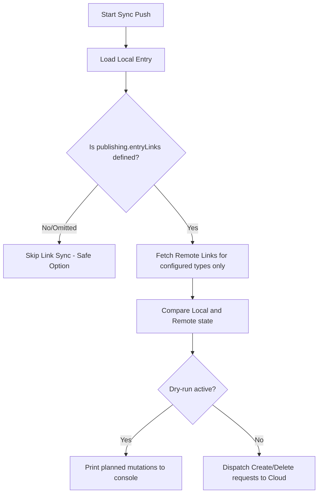

# Design & Implementation Specification: EntryLinks Support in `kcmd`

This document defines the authoritative design and step-by-step implementation specification for adding comprehensive bi-directional synchronization and local layout support for **EntryLinks** (both top-level and schema-inlined linkages) to the `kcmd` tool. 

To ensure complete data integrity, usability, and reliability, the architecture incorporates native **data loss prevention (safe push mutations)**, dynamic **project number vs. project ID normalization**, a robust **alias resolution system (supporting both system and custom user-defined aliases)**, **selective pull filtering**, and a safe **dry-run simulation mode**.

---

## Phase 1: Core Data Models & Manifest Extension

Update the base TypeScript definitions, the manifest configuration parser, and type validation logic to cleanly handle EntryLinks and aliases.

### 1.1. Manifest Schema & Alias Support ([src/libts/manifest.ts](file:///Users/eeshadutta/knowledge-catalog/toolbox/mdcode/src/libts/manifest.ts))

1. **Manifest Schema Parsing:**
   * Update `manifestSchema` (Zod object) to recognize optional `aliases` or `resourceAliases` and map them dynamically.
   * Add `entryLinks` as an optional array of strings to both `snapshot` and `publishing` schemas.
   * Update interfaces `SnapshotConfig` and `PublishingConfig` to include `entryLinks?: string[]`.

2. **System and Custom Alias Registration:**
   * Add a built-in map for global/system link aliases:
     ```typescript
     const SYSTEM_LINK_ALIASES: Record<string, string> = {
       'definition': 'dataplex-types.global.definition',
       'synonym': 'dataplex-types.global.synonym',
       'related': 'dataplex-types.global.related',
     };
     ```
   * Update the manifest class to store custom user-defined aliases loaded from `catalog.yaml`:
     ```typescript
     export class CatalogManifest {
       // ...
       readonly aliases?: Record<string, { aspect?: string; glossary?: string; entryLink?: string }>;
     }
     ```

3. **Alias Resolution and Validation:**
   * Implement an internal type resolver helper:
     ```typescript
     export function resolveEntryLinkType(typeRef: string, manifest?: CatalogManifest): string {
       // 1. Check system aliases
       if (SYSTEM_LINK_ALIASES[typeRef]) {
         return SYSTEM_LINK_ALIASES[typeRef];
       }
       // 2. Check custom manifest aliases
       if (manifest?.aliases?.[typeRef]?.entryLink) {
         return manifest.aliases[typeRef].entryLink!;
       }
       return typeRef;
     }
     ```
   * **Validation Logic:** Modify the `manifestSchema` validation loop for `snapshot.entryLinks` and `publishing.entryLinks`. Before splitting the reference string by `.` and validating that `parts.length === 3`, resolve it using `resolveEntryLinkType`. This prevents short references like `- definition` or custom user aliases from failing validation.

### 1.2. Metadata Type Definitions ([src/libts/metadata.ts](file:///Users/eeshadutta/knowledge-catalog/toolbox/mdcode/src/libts/metadata.ts))

Ensure that local files represent links cleanly at both the root level of the Entry and inlined inside schema field columns:
```typescript
export interface EntryLink {
  target: string;                      // Normalized target Entry name or custom alias
  id?: string;                         // The unique ID of the EntryLink resource
  [aspectKey: string]: any;            // Inlined aspect data blocks matching their type/alias
}

export interface Entry {
  // ... existing fields
  links?: Record<string, EntryLink[]>; // Maps entryLinkType -> EntryLink list
}
```
Ensure schema field types also support an optional `links?: Record<string, EntryLink[]>` structure.

---

## Phase 2: API Client Layer Integration & Normalization

Implement robust Dataplex API client interfaces and ensure complete normalization of project numbers to project IDs.

### 2.1. Data Interfaces & Normalization Helper ([src/libts/gcp/dataplex.ts](file:///Users/eeshadutta/knowledge-catalog/toolbox/mdcode/src/libts/gcp/dataplex.ts))

1. **Define Dataplex v1 REST API Interfaces:**
   ```typescript
   export interface EntryReference {
     name: string;      // Full resource name
     type: string;      // "SOURCE", "TARGET", or "UNSPECIFIED"
     path?: string;     // Optional schema field path, e.g., "schema.col_name"
   }

   export interface EntryLink {
     name: string;      // Resource identifier
     entryLinkType: string;
     entryReferences: EntryReference[];
     aspects?: Record<string, Aspect>;
   }

   export interface LookupEntryLinksResponse {
     entryLinks: EntryLink[];
     nextPageToken?: string;
   }
   ```

2. **Critical Project Identifier Normalization (`_fixEntryLink`):**
   Implement a mapping routine to convert raw project numbers to human-readable project IDs returned by the cloud:
   ```typescript
   export async function _fixEntryLink(link: EntryLink, ctx: context.ApiContext): Promise<void> {
     link.name = await crm.fixProject(link.name, ctx);
     link.entryLinkType = await crm.fixProject(link.entryLinkType, ctx);
     if (link.entryReferences) {
       for (const ref of link.entryReferences) {
         ref.name = await crm.fixProject(ref.name, ctx);
       }
     }
     if (link.aspects) {
       const fixedAspects: Record<string, Aspect> = {};
       for (const [aspectKey, aspectValue] of Object.entries(link.aspects)) {
         let aspectType = aspectValue.aspectType || _typeRefToName(aspectKey, 'aspect');
         aspectType = await crm.fixProject(aspectType, ctx);
         fixedAspects[_nameToTypeRef(aspectType)] = {
           aspectType,
           data: aspectValue.data ?? {}
         };
       }
       link.aspects = fixedAspects;
     }
   }
   ```

### 2.2. Client Request Methods ([src/libts/gcp/dataplex.ts](file:///Users/eeshadutta/knowledge-catalog/toolbox/mdcode/src/libts/gcp/dataplex.ts))

Update `CatalogClient` to call `_fixEntryLink` before returning responses:
* **`lookupEntryLinks(project, location, entryName, entryLinkTypes?)`**: Performs `GET` requests to `/locations/${location}:lookupEntryLinks`. Maps responses through `_fixEntryLink`.
* **`createEntryLink(project, location, entryGroup, entryLink)`**: Sends a `POST` payload to `/entryGroups/${entryGroup}/entryLinks`.
* **`deleteEntryLink(project, location, entryGroup, entryLinkName)`**: Dispatches a `DELETE` call.
* **`listEntryLinks(project, location, entryGroup, filter?)`**: Generator mapping results through `_fixEntryLink`.

---

## Phase 3: Snapshot Converters & Serialization Layouts

Integrate target translation, type-alias mappings, and file writing configurations.

### 3.1. Mapping and Alias Serialization ([src/libts/snapshot.ts](file:///usr/local/google/home/eeshadutta/knowledge-catalog/toolbox/mdcode/src/libts/snapshot.ts))

1. **Update `toLocalEntry` & Target Resolution (`toLocalTarget`):**
   * Extract and parse the `id` from the relative EntryLink resource name (the last segment of `link.name`).
   * Translate incoming fully-qualified `entryLinkType` names into human-readable system or custom aliases (e.g., rewrite `dataplex-types.global.definition` to `definition`).
   * Resolve project identifiers securely using the matched project IDs.
   * **Inlined Aspects:** Iterate over `link.aspects`. For each aspect, resolve its key to a human-readable alias (e.g., `dataplex-types.global.schema-join` becomes `schema-join`). Place the aspect data directly on the `EntryLink` object under this alias key, rather than wrapping it in an `aspects:` object.
   * Correctly associate schema-inlined links: when `sourceRef.path` is present, split the path and inline the linkage directly inside `schema.fields` of the corresponding column aspect.
   * **Handling Specific EntryLink Types:**
     * **`definition` (and synonym/related) links:** The remote target is a glossary term UID path (`projects/{project}/locations/{location}/glossaries/{glossaryId}/terms/{termId}`). During pull, `toLocalTarget` parses this path, calls the specific `getGlossary` and `getGlossaryTerm` endpoints on `CatalogClient` (using the target project and location), and retrieves their human-readable display names (caching them). The target is formatted as `targetProject.targetLocation.GlossaryDisplayName.TermDisplayName`. If lookup fails, it safely falls back to the original UIDs. The original UID path is preserved in the local `id` field (e.g. `projects/project/locations/location/glossaries/uid/terms/uid`) to support mapping back.
     * **`schema-join` links:** The target represents a BigQuery dataset or table. During pull, `toLocalTarget` parses the target path, resolves project numbers to project IDs via CRM context, and formats it as `projectId.dataset` or `projectId.dataset.table`. The join conditions and attributes are represented as inlined aspects (e.g., `schema-join: { ... }`) directly on the link object.
     * **Generic Fallback links:** If the link target is a general EntryGroup entry (4 parts: `projects/{project}/locations/{location}/entryGroups/{entryGroup}/entries/{entryId}`), `toLocalTarget` normalizes the project number to project ID and formats it as `projectId.location.entryGroup.entryId`. For any other formats, it attempts mapping using the manifest's `tryGetLocalName` (replacing slashes with dots) or falls back to the raw service name.

2. **Update `toServiceEntryLinks` & Mapping Back (`fromLocalTarget`):**
   * Extract top-level `.links` and column-level `.links`.
   * Translate short aliases back to fully-qualified type references (`resolveEntryLinkType`).
   * **Extract Inlined Aspects:** Scan for any keys on the local `EntryLink` object that are not `target` or `id`. Treat these keys as aspect aliases, resolve them to their fully-qualified aspect type names, and reconstruct the `aspects` record for the API payload.
   * Build outbound `EntryLink` objects with proper directional flags (`SOURCE` and `TARGET`) and schema path configurations.
   * **Mapping Targets Back to Service Names:**
     * **`definition` (and synonym/related) links:** When serializing a glossary link type, if `link.id` contains a fully qualified glossary path (retaining slashes `/`), the serializer uses it to reconstruct the target service name exactly: `projects/{catalogProject}/locations/{catalogLocation}/entryGroups/@dataplex/entries/${link.id}`. This ensures display names never leak into target names on push.
     * **`schema-join` links:** For 2-part (`project.dataset`) or 3-part (`project.dataset.table`) targets, `fromLocalTarget` maps them back to the system `@bigquery` entries path: `projects/{catalogProject}/locations/{catalogLocation}/entryGroups/@bigquery/entries/bigquery.googleapis.com/projects/{project}/datasets/{dataset}[/tables/{table}]`.
     * **Generic Fallback links:** For 4-part targets (`project.location.entryGroup.entryId`), it maps them back directly to the corresponding user-managed entry path: `projects/{project}/locations/{location}/entryGroups/{entryGroup}/entries/{entryId}`. If `manifest` is present, it uses `manifest.source.serviceName(localTarget)`; otherwise, it returns the raw `localTarget`.
   * Reconstruct the API `EntryLink` name: if `id` is present locally and does not contain a slash `/` (meaning it represents a link resource ID, not a target glossary path), append it to the EntryGroup's links path: `projects/{project}/locations/{location}/entryGroups/{entryGroupId}/entryLinks/{linkId}`.

### 3.2. Layout Parsers
* **Standard Layout ([src/libts/layouts/standard.ts](file:///Users/eeshadutta/knowledge-catalog/toolbox/mdcode/src/libts/layouts/standard.ts)):** Modify YAML reader/writer to preserve `.links` structure on load/save actions.
* **Documents Layout ([src/libts/layouts/documents.ts](file:///Users/eeshadutta/knowledge-catalog/toolbox/mdcode/src/libts/layouts/documents.ts)):** Ensure Markdown frontmatter serialization loads and saves `.links` blocks seamlessly.

---

## Phase 4: Sync Engine Orchestration

Integrate robust sync controls to manage scope, optimize network efficiency based on snapshot scope type, and prevent accidental data mutations.

### 4.1. Scoped & Optimized Pull Operations ([src/libts/sync.ts](file:///Users/eeshadutta/knowledge-catalog/toolbox/mdcode/src/libts/sync.ts))

Update `pull()` to align with standard aspect conventions and perform optimized, scoped retrieval:

1. **Scope Check:**
   * If `snapshot.entryLinks` is omitted or empty in `catalog.yaml`, **always pull all entry links** by default (do not filter them). Call the lookup/list entry links API without type filters.
   * If `snapshot.entryLinks` is specified, retrieve **only the configured entry link types** (compiled and resolved via `resolveEntryLinkType`).

2. **Differentiated Pull Strategy:**
   * **EntryGroup Scopes:**
     * For snapshots bound to an `entryGroup` scope (which maps to a single managed EntryGroup), avoid calling individual `lookupEntryLinks` for every entry.
     * Instead, perform **a single, paginated call to `listEntryLinks()`** at the start of `pull()` to fetch **all** remote links inside the entry group:
       ```typescript
       const allGroupLinks: dataplex.EntryLink[] = [];
       for await (const link of this._catalog.listEntryLinks(project, location, entryGroupId)) {
         allGroupLinks.push(link);
       }
       ```
     * Build a fast-lookup `Map<string, dataplex.EntryLink[]>` by iterating through all references in each link's `entryReferences` and registering the link under every referenced entry's name. This ensures that relationships (such as undirected `schema-join` links) are correctly populated and visible in the local files of both tables.
     * During the entry processing loop, retrieve the pre-cached links list matching the entry from this map. This reduces network API call overhead from $O(N)$ to $O(1)$!
   * **BigQuery Dataset Scopes:**
     * Since system `@bigquery` entry groups cannot be listed globally, perform **individual `lookupEntryLinks`** per dataset and table in scope. If `snapshot.entryLinks` is specified, query only the configured link types; otherwise, fetch all.

3. **Generic Link Type Parsing:**
   * Confirm that the generic parser in `toLocalEntry` gracefully handles both **directional reference linkages** (e.g., glossary `definition` links with explicit source and target paths in `entryReferences`) and **aspect-rich undirected linkages** (e.g., `schema-join` links whose source/target join conditions are stored within the EntryLink's aspect details rather than standard directional references). 
   * As long as references exist, the generic mapper correctly resolves them into top-level `.links` or schema-inlined `.links` with nested aspect data, eliminating any need to hardcode type-specific parsing structures.

### 4.2. Safe Push Operations ([src/libts/sync.ts](file:///Users/eeshadutta/knowledge-catalog/toolbox/mdcode/src/libts/sync.ts))

Modify the `push()` method to prevent accidental data loss:

1. **Exclusion Check:** If `publishing.entryLinks` is completely omitted or empty, do not perform any EntryLink updates or deletions. **Skip the link synchronization block completely**.
2. **Filter Management:**
   * Compile the resolved type filter from `publishing.entryLinks`.
   * Query remote links **only for those specified types**.
   * Compare only matching types using **Symmetrical Reference Matching**:
      * Instead of relying on rigid `SOURCE` vs `TARGET` order matching (which can swap arbitrarily for undirected connections like `schema-join`), locate the reference matching the current entry (`currentRef`) and the other reference (`otherRef`) in both local and remote links.
      * Treat them as a match if:
        1. The `entryLinkType` is identical.
        2. The other reference's entry name matches.
        3. The column-level paths (if any) match on both current and other references.
      * **Delete:** If a remote link exists for a configured type but no matching local link is found under this symmetrical matching logic, trigger `deleteEntryLink`.
      * **Create/Update:** If a local link has no matching remote link, execute `createEntryLink`. If a matching remote link is found but its aspect data (e.g. join keys or conditions) differs, delete and recreate it.
3. **Dry-Run Support:** If `options.dryRun` is active, log all modifications to `stdout` instead of executing mutations.



---

## Phase 5: CLI Surface & Verification

Expose safety features to users and test all scenarios.

### 5.1. CLI Integration ([src/tool/main.ts](file:///Users/eeshadutta/knowledge-catalog/toolbox/mdcode/src/tool/main.ts) & [src/tool/commands.ts](file:///Users/eeshadutta/knowledge-catalog/toolbox/mdcode/src/tool/commands.ts))

1. Add a `--dry-run` flag to `kcmd push` and `kcmd pull`:
   ```typescript
   cli.command('push', 'Push catalog entries')
      .option('--force', 'Force push changes')
      .option('--validate-only', 'Only validate changes without applying')
      .option('--dry-run', 'Review changes without writing to the cloud')
   ```
2. Update command handlers to feed `dryRun` status into the sync orchestration engine.

### 5.2. Verification Scenarios

Develop test suites under `tests/scenarios` verifying:
* **Omitted Snapshot pull:** Verifying that omitting `entryLinks` in `catalog.yaml` results in no local `.links` tags.
* **Predefined System Alias mapping:** Verifying that compiling snapshot/publishing configs with `definition` correctly maps to `dataplex-types.global.definition`.
* **Safe Push Operations:** Verifying that omitting `entryLinks` from publishing config does not delete any remote links, while listing standard link types selectively deletes and creates only the managed types.
* **Dry-run simulations:** Mocking push scenarios to confirm console reporting works perfectly without cloud dispatch.
