# Deploying a semantic model

A *semantic model* describes your entities (tables), the metrics computed over
them, and the relationships between them, authored as a single
[Apache Ossie](https://ossie.apache.org/) document. `kcmd push` deploys one
model to two destinations at once:

* **BigQuery** — a queryable `CREATE OR REPLACE PROPERTY GRAPH` over the model's
  tables, so the model can be traversed and its metrics computed in SQL.
* **Knowledge Catalog** — catalog entries and links that make the
  model discoverable as metadata.

Both are generated from the same source document — you never author them
separately, and a single `push` keeps them in sync.

This guide covers authoring, deploying, pulling back, and updating a model.
For the Ossie document format itself, see
[ossie.apache.org](https://ossie.apache.org/).

## Prerequisites

`kcmd` authenticates with your `gcloud` credentials. Log in once before pushing:

```bash
gcloud auth application-default login
```

You also need read/write access to whichever destinations you deploy to.

## 1. Author a model

Create the local layout. The scope is the Knowledge Catalog entry group the
model will be published to, written as `<projectId>.<locationId>.<entryGroupId>`:

```bash
kcmd init --semantic-model my-project.us-central1.my_model
```

`init` provisions that entry group (idempotent — an existing group is fine) and
creates its local directory. Author the model at
`catalog/EntryGroups/<entryGroupId>/<model>.yaml`:

```yaml
version: "0.2.0.dev0"

semantic_model:
  - name: sales                              # must match the <model>.yaml filename
    # Required: the deployment target, in a GOOGLE custom extension. `data` is a
    # JSON string whose deploymentTargets holds the target graph URI (for now,
    # exactly one).
    custom_extensions:
      - vendor_name: GOOGLE
        data: '{"deploymentTargets": ["//bigquery.googleapis.com/projects/my-project/datasets/sales/propertyGraphs/sales_graph"]}'
    datasets:                                # each dataset becomes an entity
      - name: orders
        source: my-project.sales.orders      # the backing BigQuery table
        primary_key: [o_orderkey]
        fields:
          - name: o_orderkey
            expression: {dialects: [{dialect: BIGQUERY, expression: o_orderkey}]}
          - name: o_totalprice
            expression: {dialects: [{dialect: BIGQUERY, expression: o_totalprice}]}
    metrics:
      - name: total_revenue
        expression: {dialects: [{dialect: BIGQUERY, expression: SUM(orders.o_totalprice)}]}
```

### Deployment targets (required)

Every model must declare exactly one **deployment target** — the BigQuery
property graph it deploys to — in a `GOOGLE` custom extension, as shown above. A
target is a URI of the form:

```
//bigquery.googleapis.com/projects/<project>/datasets/<dataset>/propertyGraphs/<graphName>
```

The target's project and dataset are where the property graph is created; the
same URIs are also recorded on the model's Knowledge Catalog entry. A model with
no deployment target — or with more than one — is rejected at push time (see
[Validation](#validation)).

### Table sources

Each entity's `source` is its backing BigQuery table. A `source` written as
`dataset.table` (two parts) is qualified with the scope's project — the
`<projectId>` from `init`. Write the full `project.dataset.table` when a table
lives in another project.

Sources are not limited to native BigQuery tables. A name with more than
three parts — for example a four-part `catalog.database.schema.table`
reference — points at a table in a **federated REST catalog**, such as an
Apache Iceberg table exposed through BigLake. Write it exactly as BigQuery
resolves the name, and validation resolves it the same way the deploy does (see
[Validation](#validation)).

## 2. Push

```bash
kcmd push
```

With no flags this deploys to **every** destination, BigQuery first. The flags
below select destinations, dry-run, and preview:

```bash
kcmd push --target bq          # BigQuery only
kcmd push --validate-only      # run all checks, write nothing
kcmd push --print              # also print the generated DDL / entry plan
```

| Flag | Effect |
|------|--------|
| `--target <bq\|kc\|all>` | Which destination(s) to deploy to; accepts a comma-separated list (`bq,kc`). Default `all`. |
| `--validate-only` | Run every validation check and report pass/fail, but write nothing. |
| `--print` | Print each destination's generated artifact (BigQuery DDL, Knowledge Catalog entry plan). Combine with `--validate-only` to preview without deploying. |
| `--force-remove` | Delete models in the entry group that this push no longer includes (see [Updating and removing models](#updating-and-removing-models)). |
| `--emit-expressions` | Also write the SQL-expression fields (per-field `schema.semantics` and `semantic-metric.expression`) to Knowledge Catalog. Off by default: the published system-type templates do not carry them yet. Knowledge Catalog push only. |

Destinations always deploy BigQuery-first and fail fast, so a rejected model
never half-deploys.

### What gets created in BigQuery

`push` executes a single `CREATE OR REPLACE PROPERTY GRAPH` per deployment
target, in the project and dataset the target names. Each part of your model
becomes one part of that graph:

| Model element | BigQuery construct | Notes |
|---|---|---|
| Model | `PROPERTY GRAPH` | named by the deployment-target URI |
| Entity | `NODE TABLE` | backed by the entity's `source` table, keyed by its primary key |
| Relationship | `EDGE TABLE` | connects the two entities' node tables |
| Metric | `MEASURE` on a node table | must resolve to a single entity (otherwise the push is rejected — see [Validation](#validation)) and reduce to one supported aggregate over one operand (otherwise that metric is skipped with a warning) |
| Entity `extends` | extra `LABEL` clauses on the subclass node table | the subclass also matches its supertypes; the supertypes' fields flatten down (see [Class hierarchies](#class-hierarchies-extends--labels)) |

`push` reads the target dataset's location (`bigquery.datasets.get`) so the
statement runs in the right region; without that permission it falls back to
BigQuery's own location inference and warns. Under `--validate-only` no graph
DDL is executed and nothing is written (the live source-table checks still run —
see [Validation](#validation)); add `--print` to see the generated DDL.

#### What carries over, and what doesn't

Push preserves both the queryable structure and the descriptive metadata
attached to it. The structure becomes the node tables, edge tables, and
measures; the descriptive metadata is written into each element's `OPTIONS(...)`
in the graph (visible with `--print`). BigQuery's graph `OPTIONS` give an element
a `description` string and a `synonyms` array, so synonyms are carried across
structurally, as their own array — not flattened into the description text.

**Carried over** — for every entity, relationship, metric, and field:

| Authored metadata | Where it lands in the generated DDL |
|---|---|
| `ai_context.synonyms` | the element's `OPTIONS(synonyms=[...])`, a structured array |
| `description` | the element's `OPTIONS(description=...)` |
| `ai_context.instructions` | added to the same `OPTIONS(description=...)` |
| `ai_context.examples` | added to it, as an `Examples: …` line |
| A field's `label` | added to the field's `OPTIONS(description=...)` |
| A field's time-dimension role | noted in the field's `OPTIONS(description=...)` |

**Not carried over:**

| Authored metadata | Why |
|---|---|
| The model's own `description` / `ai_context` | BigQuery silently drops statement-level graph `OPTIONS`, so model-level metadata has no home in the graph. The model's `description` and its `ai_context.instructions` are carried into [Knowledge Catalog](#what-gets-created-in-knowledge-catalog) instead (the model's `ai_context.synonyms`/`examples` are preserved in neither destination) |
| A field's `datatype` | BigQuery uses the source column's own type |
| Unique keys beyond the primary key | only the primary key is emitted |
| The imported vendor SQL and its dialect | only the canonical GoogleSQL expression is used |
| `custom_extensions` | not part of the graph (the model-level `GOOGLE` block only supplies the [deployment target](#deployment-targets-required)) |
| A metric that isn't a single aggregate (`SUM`/`AVG`/`COUNT`/`MIN`/`MAX`) over one operand | it can't become a `MEASURE`, so it is skipped with a warning |

One caveat on the metadata that carries over: `synonyms` is the only part with a
dedicated BigQuery option. The rest — `description`, `instructions`, `examples`,
and a field's `label` — share the single `description` string, so they are
combined into it (examples as an `Examples: …` line). Their content is
preserved; their separate structure is not.

#### Class hierarchies (`extends` → labels)

An entity that declares `extends: [Parent]` is a **subclass**. BigQuery Graph has
no inheritance keyword, so the push expresses the hierarchy with **labels**: a
subclass node table declares its own default label **plus one `LABEL <Ancestor>`
per supertype**, walking the full transitive chain. A node then matches its
supertype in a query — `MATCH (:Person)` returns `Person`, `Customer`,
`Employee`, and `Manager` nodes alike.

You author only each entity's **own** fields plus the one `extends` keyword; the
push does the rest:

```yaml
datasets:
  - name: Person
    source: proj.ds.person
    primary_key: [id]
    fields:
      - {name: id,        expression: {dialects: [{dialect: BIGQUERY, expression: id}]}}
      - {name: full_name, expression: {dialects: [{dialect: BIGQUERY, expression: full_name}]}}
      - {name: email,     expression: {dialects: [{dialect: BIGQUERY, expression: email}]}}
  - name: Customer
    source: proj.ds.customer
    primary_key: [id]          # each subclass keeps its OWN key; keys do not inherit
    extends: [Person]          # the one keyword you add
    fields:
      - {name: loyalty_tier, expression: {dialects: [{dialect: BIGQUERY, expression: loyalty_tier}]}}
```

For those shared labels to work, **the supertype's fields flatten down** onto the
subclass. BigQuery requires every table exposing a label to expose the **same
property signature**, so a subclass's `LABEL Person` block must list exactly what
`Person`'s own table lists. The push copies each ancestor's fields onto the
subclass (a nearer definition wins on a name clash) so those signatures line up,
and the subclass's default label carries the inherited fields too:

```sql
`proj.ds.customer` AS Customer
  KEY(id)
  DEFAULT LABEL
  PROPERTIES( id, loyalty_tier, full_name, email )   -- own + inherited (flattened)
  LABEL Person
  PROPERTIES( id, full_name, email )                 -- matches Person's own signature
```

```
GRAPH proj.ds.people
MATCH (p:Person) RETURN p.full_name   -- resolves on Customer/Employee/Manager too
```

Four boundaries:

- **Fields flow down; edges and keys do not.** A subclass gains its supertypes'
  fields but **not** their relationships or their key: an edge stays bound to the
  exact node table it was declared on, and each subclass keeps its own `KEY` (a
  node table is identified by its own grain, never its supertype's). If
  `Person —livesIn→ City`, a `Customer` node does not get a `livesIn` edge.
- **The subclass's `source` must physically expose the inherited columns.** The
  flattened `full_name`/`email` above are read from `proj.ds.customer`, so that
  table (or a view over it) must include those columns. Parent and child are
  separate physical tables, so the same real-world entity present in both
  `person` and `customer` appears as two nodes under `MATCH (:Person)` — a
  modeling choice for the binding step, not something the DDL enforces.
- **A shared supertype label carries no OPTIONS and no measures.** A supertype's
  label is bound by every subclass table, and BigQuery forbids a label carried by
  more than one element table from carrying an `OPTIONS` clause or a `MEASURE`. So
  a supertype's own `description`/synonyms are dropped from its label (with a
  warning), and a metric that targets a supertype is skipped (with a warning) —
  attach metrics to a leaf class instead. Subclass and leaf labels are
  unaffected.
- **An inherited field cannot be redefined.** A shared label requires one
  identical definition per property across every table that binds it, so if a
  subclass declares a field of the same name as an inherited one but with a
  different expression, the supertype's definition wins and the subclass's is
  dropped (with a warning). Redeclaring it identically is a harmless no-op.

An entity may also be marked **`abstract: true`** — a conceptual class with no
physical table (so it has no `source` and no key). It produces **no node table**;
it survives only as a `LABEL` on its concrete descendants (its fields still
flatten down so the label's signature is present). An abstract entity that no
concrete entity extends has nothing to attach to and is dropped with a warning.
`abstract` is an explicit marker: an entity left with an unbound `source`
placeholder is treated as a binding error and fails the push, never silently
dropped as if it were table-less. The Knowledge Catalog leg does not
model inheritance today, so an abstract entity has no physical resource to
catalog and is skipped there (with a warning); its concrete subtypes are
published normally.

### What gets created in Knowledge Catalog

Each element of your model maps to one catalog resource. Every resource type
below is a built-in system type under `dataplex-types/global` — push references
them, it never creates them.

| Model element | Catalog resource | Kind | Id |
|---|---|---|---|
| Model | `semantic-model` | entry — anchor / parent of the rest | `<model>` |
| Entity | `semantic-entity` (+ built-in `schema` aspect) | entry | `<model>.entities.<entity>` |
| Metric | `semantic-metric` | entry | `<model>.metrics.<metric>` |
| Relationship | `schema-join` | entry link between the two entity entries | derived from the model and relationship names |

An entity entry carries its columns in the `schema` aspect (name, data type,
description, and any `label` per field), plus the entity's keys and unique keys
(`primaryKey` / `uniqueConstraints`); a `schema-join` link carries the
relationship detail — the paired columns and foreign-key direction — in its
aspect. Any element with `ai_context.instructions` (the model, an entity, or a
metric) also gets a built-in `guidelines` aspect holding that text.

> **Note — push to Knowledge Catalog is lossy.** The catalog holds metadata,
> not a full copy of your model. It **stores** names, descriptions, data
> sources, field datatypes and roles, and 1:1 / 1:N relationships (as
> `schema-join` links). It also stores entity keys and unique keys (the built-in
> `schema` aspect's `primaryKey` / `uniqueConstraints`), field labels (the
> `schema` aspect's per-field `annotations`), and `ai_context.instructions` on
> the model, entities, and metrics (the built-in `guidelines` aspect). By
> default it does **not** store the SQL expressions: the published system-type
> templates do not yet carry a per-field `semantics` block or a
> `semantic-metric.expression` field, so the default push omits them (pass
> `--emit-expressions` to write the canonical GoogleSQL/ANSI expression once the
> templates gain the fields). It never stores `ai_context.synonyms`/`examples`,
> field-level `ai_context` (only model/entity/metric instructions have a home),
> or the original vendor SQL (`importedExpression` — e.g. the MAQL or Snowflake
> form a metric was imported from). Those stay in your authored document; the
> vendor SQL and expressions are still used when generating BigQuery SQL. Keep
> your model document as the source of truth.

## Validation

`push` and `--validate-only` run the same checks, **before either destination is
touched**, so a model that cannot deploy fails fast instead of half-deploying:

* **Exactly one deployment target per model, and it must be a valid BigQuery
  Graph URI.** A model with no target — or with more than one — is rejected, and
  so is a single target whose URI does not match
  `//bigquery.googleapis.com/projects/<p>/datasets/<d>/propertyGraphs/<g>` (for
  example a `propertyGraph`/`propertyGraphs` typo, or a
  `…/entryGroups/@bigquery/entries/…` entry form). The error names the offending
  URI and the expected form. This gate runs before any destination leg and for
  every `--target`, so a malformed target writes **nothing** — not to BigQuery
  and **not to Knowledge Catalog**; the push aborts with a non-zero exit and no
  entries are created. *(static)*
* **Every metric on a BigQuery Graph model resolves to exactly one entity** —
  otherwise it would be dropped from the BigQuery Graph. Set the metric's attach
  entity, or scope its expression to a single entity. *(static)*
* **Every entity's source table is reachable.** Each `source` is probed with a
  dry-run query, so BigQuery resolves it exactly as the deploy will — a
  three-part `project.dataset.table`, a four-part federated REST-catalog name
  (e.g. an Iceberg table via BigLake), or a quoted identifier all work. A table
  that does not exist or that you cannot access fails the push, naming the table
  and the entity; a `source` that is a query (not a table) is skipped. *(live —
  needs BigQuery access)*

The live table check runs for **every** `--target`, because the same tables back
both destinations — so even a Knowledge-Catalog-only push confirms the model
could deploy to BigQuery.

## Updating and removing models

Your model document is the source of truth. To change what is deployed, edit
the document and run `kcmd push` again — you never edit the catalog or the
BigQuery Graph by hand. Re-running is safe: each push makes the destinations
match the document as it stands now.

**When you edit an entity, metric, or relationship** — push overwrites the
existing one in place; you don't get duplicates.

**When you delete an entity or metric** — remove it from the document and
push. Push deletes the leftover catalog entry for you (the summary shows
`removed N orphaned entries`).

**When you rename or delete a relationship** — push removes the old
`schema-join` link after writing the new ones, so a rename never leaves the
two entities disconnected (the summary shows `unlinked N orphaned links`).
Relationships owned by other models that share the entry group are left
untouched.

**When you remove a whole model** — deleting its document does *not* remove it
from the catalog. As long as you still push at least one other model in the same
entry group, push stops and names the model the catalog still has that you no
longer push, so you can't wipe one out by accident or by pushing from the wrong
directory; run push again with `--force-remove` to delete its entries and links.
Deleting *every* document is the exception: with no models left to push, the run
reports `No semantic model documents found; nothing to deploy` and touches
nothing — so remove a model while other models in its group remain, or delete
its catalog entries directly.

Every push prints one line per destination summarizing what it did. For a
`--target all` push:

```
Deployed 1 BigQuery Graph(s).
Wrote 5 new and 2 updated Knowledge Catalog entries; removed 1 orphaned entry; linked 2 relationships; unlinked 1 orphaned link.
```

## Pull

`kcmd pull` is the inverse of push's Knowledge Catalog leg: it reads the
`semantic-*` entries back from the catalog and reconstructs local model
documents at `catalog/EntryGroups/<entryGroupId>/<model>.yaml`. Use it to
recover a workspace from a catalog someone else deployed, or to see what the
catalog actually holds.

```bash
kcmd pull
```

Pull reads only from Knowledge Catalog (never BigQuery). Its coordinates come
from the same scope you authored under (`<projectId>.<locationId>.<entryGroupId>`).

| Flag | Effect |
|------|--------|
| `--dry-run` | Reconstruct from the catalog and report what would be written, but write no files. |
| `--force-remove` | Replace a differently-named local model with the catalog's (see below); without it, a pull that would leave the entry group holding two models fails. |

An entry group holds **exactly one** semantic model. Pull reconstructs that one
model's document; a group with more than one `semantic-model` anchor is an
unexpected state, so pull stops and names the anchors rather than guess which to
keep.

Pull overwrites a model that already exists locally in place. If the catalog's
model has a **different name** than the one on disk, writing it would leave the
entry group holding two models — so by default pull stops and reports the
mismatch instead of deleting anything. Re-run with `--force-remove` to delete the
local model and replace it with the catalog's. Pull never touches BigQuery.

> **Note — pull reconstructs what the catalog holds, not your original file.**
> Pull can only recover what push wrote (see the note under [What gets created in
> Knowledge Catalog](#what-gets-created-in-knowledge-catalog)). What that means in
> practice:
>
> **Recovered exactly** — these come back as authored:
> - Model structure: the model, its entities, and each entity's fields.
> - Each field's data source (its data type round-trips with the two collapses
>   noted below).
> - Entity keys and unique keys (from the `schema` aspect's `primaryKey` /
>   `uniqueConstraints`).
> - Field labels (from the `schema` aspect's per-field `annotations`).
> - `ai_context.instructions` on the model, entities, and metrics (from the
>   `guidelines` aspect).
> - Metrics: name and attach entity (a concrete data type round-trips; see below).
> - 1:1 / 1:N relationships: endpoints, foreign-key direction, and join columns
>   (from the `schema-join` links).
> - Deployment targets.
>
> **Recovered only if pushed with `--emit-expressions`** — the per-field
> `semantics` block (expressions and the dimension role) and the metric
> expression are omitted from the catalog by default (see the note above), so
> pull returns them only when the push that wrote them used `--emit-expressions`:
> - Field expressions and metric expressions (the canonical GoogleSQL/ANSI form).
> - A field's dimension role, which comes back as a bare `dimension: {}` marker,
>   without its detail (`is_time`, and so on). A default push drops the marker
>   entirely.
>
> **Recovered, but normalized** — the content survives, the form changes:
> - Relationship *names* come back lowercased/hyphenated (the catalog stores the
>   name only in the link id, e.g. `Places Order` → `places-order`).
> - Field types round-trip except for two collapses: a field authored with no
>   type comes back as `Opaque`, and a field authored as `String` comes back
>   un-typed (`String` and un-typed both store as a plain catalog `STRING`).
> - A metric's data type round-trips only for a concrete type (e.g. `Decimal`);
>   an untyped, `String`, or `Opaque` metric comes back un-typed, because the
>   metric aspect stores a data type but no metadata type to mark it `Opaque`.
> - Ordering: field order within each entity is preserved, but the order of
>   entities and metrics is not — they come back in the catalog's own order, not
>   the authored one. Comments in the original YAML are not preserved.
>
> **Not recovered** — push never wrote these, so pull cannot return them:
> - `ai_context.synonyms` and `ai_context.examples` (only `instructions` has a
>   home, in the `guidelines` aspect).
> - Field-level `ai_context` (only the model, entities, and metrics get a
>   `guidelines` aspect).
> - The original vendor SQL (`importedExpression` / `importedDialect`).
> - M:N (`association`) relationships.
>
> **So: a push followed by a pull does not return your original file.** Treat a
> pulled document as a faithful copy of the catalog metadata, not of the authored
> model, and keep the authored document as the source of truth.

> **Note — writer-side follow-up (not inherent to pull).** One reduction above is
> a limit of what push currently *writes*, not of what pull can recover. It is
> recorded here as a write-side follow-up; the reader (pull) already returns
> everything the catalog holds.
>
> - **Relationship names.** The `schema-join` aspect type's `metadataTemplate` has
>   no field for the relationship name, so push cannot store it and pull recovers
>   it from the link id — which is lowercased and hyphenated (the entry-link id
>   format forbids the original casing/underscores). Returning the name verbatim
>   requires adding a name field to the built-in `schema-join` aspect type in
>   Knowledge Catalog (server-side), after which the client write/read is trivial;
>   it is the same class of gap as the `semantics` field that gates
>   `--emit-expressions`.
>
> (A non-canonical deployment target is **not** a pull gap: push rejects it at the
> validation gate before any leg runs, so it is never written — see
> [Validation](#validation).)

## Importing an OWL ontology

An OWL ontology and a semantic model share a backbone: **classes ≈ entities**,
**object properties ≈ relationships**, **datatype properties ≈ fields**. `kcmd`
does not learn a second format — it **converts OWL into a semantic model** once,
then the ontology rides the normal `kcmd push` / `kcmd pull` above. The semantic
model stays the single canonical form.

The converter maps the OWL constructs that have a clean BigQuery Graph shape to
**native** semantic-model fields — class → node, object property → edge,
datatype property → property, plus **class hierarchies** (`rdfs:subClassOf` →
entity `extends`, see [Class hierarchies](#class-hierarchies-rdfssubclassof)).
Constructs that have **no native home yet** — property inheritance
(`rdfs:subPropertyOf`), the inverse / equivalence / disjointness cross-references,
the property characteristics, and per-term annotations (`rdfs:seeAlso`,
`owl:deprecated`, …) — are not dropped: they **ride along verbatim** as custom
extensions, lossless and inert, until they earn a first-class concept (see
[Constructs carried as custom extensions](#constructs-carried-as-custom-extensions-not-yet-native)).
Richer OWL still not read at all (SHACL, cardinality restrictions, `owl:oneOf`,
individuals) is listed in [What is not covered yet](#what-is-not-covered-yet).

### 1. The OWL file

`sales.owl.ttl` — an ontology header, two classes with keys, datatype
properties across several `xsd` types, and one object property. Nothing here
needs an OWL reasoner:

```turtle
@prefix owl:  <http://www.w3.org/2002/07/owl#> .
@prefix rdfs: <http://www.w3.org/2000/01/rdf-schema#> .
@prefix skos: <http://www.w3.org/2004/02/skos/core#> .
@prefix xsd:  <http://www.w3.org/2001/XMLSchema#> .
@prefix ex:   <http://example.com/sales#> .

<http://example.com/sales> a owl:Ontology ;
    rdfs:label      "Sales domain" ;
    rdfs:comment    "A minimal sales domain: customers and the orders they place." ;
    skos:example    "How many orders did each customer place last month?" ;
    owl:versionInfo "1.0" .

ex:Customer a owl:Class ;
    rdfs:label    "Customer" ;
    rdfs:comment  "A person or organization that places orders." ;
    skos:altLabel "Buyer" ;
    owl:hasKey ( ex:customerId ) .

ex:Order a owl:Class ;
    rdfs:label   "Order" ;
    rdfs:comment "A purchase placed by a customer." ;
    owl:hasKey ( ex:orderId ) .

# customerId is the key; email uniquely identifies a customer
# (inverse-functional) so it becomes a unique-key constraint.
ex:customerId a owl:DatatypeProperty ;
    rdfs:domain ex:Customer ;
    rdfs:range xsd:string .
ex:email a owl:DatatypeProperty, owl:InverseFunctionalProperty ;
    rdfs:domain ex:Customer ;
    rdfs:range xsd:string ;
    rdfs:comment "The customer's unique email address." .
ex:customerName a owl:DatatypeProperty ;
    rdfs:domain ex:Customer ;
    rdfs:range xsd:string ;
    rdfs:label "name" .
ex:signupDate a owl:DatatypeProperty ;
    rdfs:domain ex:Customer ;
    rdfs:range xsd:date .
ex:isVip a owl:DatatypeProperty ;
    rdfs:domain ex:Customer ;
    rdfs:range xsd:boolean ;
    rdfs:comment "Whether the customer is in the loyalty program." .

ex:orderId a owl:DatatypeProperty ;
    rdfs:domain ex:Order ;
    rdfs:range xsd:string .
ex:orderAmount a owl:DatatypeProperty ;
    rdfs:domain ex:Order ;
    rdfs:range xsd:decimal ;
    skos:example "19.99" .
ex:quantity a owl:DatatypeProperty ;
    rdfs:domain ex:Order ;
    rdfs:range xsd:integer .
ex:orderDate a owl:DatatypeProperty ;
    rdfs:domain ex:Order ;
    rdfs:range xsd:date .

ex:placedBy a owl:ObjectProperty ;
    rdfs:domain ex:Order ;
    rdfs:range ex:Customer ;
    rdfs:label "placed by" ;
    rdfs:comment "Links an order to the customer who placed it." .
```

The same ontology as an RDF graph. Every arc is a triple: a class (the subject)
points through a property (the predicate) to its object. Each **datatype
property** points to its `xsd` range — a literal type, drawn as a plain box —
and becomes a field. The **object property** `ex:placedBy` points from one class
to another and becomes the relationship. The two classes become the datasets.

```mermaid
graph LR
    Customer(["ex:Customer"])
    Order(["ex:Order"])

    Order -- "ex:placedBy" --> Customer

    Customer -- "ex:customerId" --> cid["xsd:string"]
    Customer -- "ex:email (inverse-functional)" --> cem["xsd:string"]
    Customer -- "ex:customerName" --> cnm["xsd:string"]
    Customer -- "ex:signupDate" --> csd["xsd:date"]
    Customer -- "ex:isVip" --> civ["xsd:boolean"]

    Order -- "ex:orderId" --> oid["xsd:string"]
    Order -- "ex:orderAmount" --> oam["xsd:decimal"]
    Order -- "ex:quantity" --> oqt["xsd:integer"]
    Order -- "ex:orderDate" --> odt["xsd:date"]

    classDef cls fill:#dae8fc,stroke:#6c8ebf,color:#000;
    classDef lit fill:#f5f5f5,stroke:#999999,color:#000;
    class Customer,Order cls;
    class cid,cem,cnm,csd,civ,oid,oam,oqt,odt lit;
```



Classes (rounded) are the resources that become datasets; the `xsd` boxes are
literal types that become each field's `datatype`.

### 2. The command

```console
$ kcmd owl import sales.owl.ttl
converted 2 classes, 1 object property, 9 datatype properties
wrote catalog/EntryGroups/<entryGroup>/sales.yaml
note: this model is UNBOUND (no backing tables yet).
      -> `kcmd push --target kc` works now (publishes ontology metadata).
      -> `kcmd push --target bq` is skipped until you bind sources.
```

The model name comes from the file (`sales.owl.ttl` → `sales`). By default the
document is written into the semantic-model layout dir so the next `kcmd push`
picks it up; pass `--out <path>` to write it elsewhere.

### 3. The semantic model it produces — `sales.yaml`

The `Customer` dataset and the `placedBy` edge, verbatim (the `Order` dataset
follows the same shape):

```yaml
version: 0.2.0.dev0
semantic_model:
  - name: sales
    description: "A minimal sales domain: customers and the orders they place.
      (ontology version 1.0)"
    ai_context:
      synonyms:
        - Sales domain
      examples:
        - How many orders did each customer place last month?
    datasets:
      - name: Customer
        source: unbound:Customer        # placeholder — bind to a table for BigQuery Graph
        primary_key:
          - customerId                   # from owl:hasKey
        unique_keys:
          - - email                      # from the inverse-functional property
        description: A person or organization that places orders.
        ai_context:
          synonyms:
            - Buyer
        fields:
          - name: customerId
            expression:
              dialects:
                - dialect: BIGQUERY
                  expression: customerId
            datatype: String
          - name: email
            expression:
              dialects:
                - dialect: BIGQUERY
                  expression: email
            datatype: String
            description: The customer's unique email address.
          - name: customerName
            expression:
              dialects:
                - dialect: BIGQUERY
                  expression: customerName
            datatype: String
            label: name
          - name: signupDate
            expression:
              dialects:
                - dialect: BIGQUERY
                  expression: signupDate
            datatype: Date
            dimension:
              is_time: true              # a temporal field is a time dimension
          - name: isVip
            expression:
              dialects:
                - dialect: BIGQUERY
                  expression: isVip
            datatype: Boolean
            description: Whether the customer is in the loyalty program.
      # ... Order dataset: orderId, orderAmount, quantity, orderDate ...
    relationships:
      - name: placedBy
        from: Order
        to: Customer
        from_columns:
          - TODO_BIND                    # source FK — fill in when you bind sources
        to_columns:
          - customerId                   # already bound to Customer's key
        ai_context:
          instructions: Links an order to the customer who placed it.
```

Note what is **not** here: no IRIs and no `custom_extensions`. Every OWL term has
an IRI (`ex:Customer` = `http://example.com/sales#Customer`), but for the
constructs that map cleanly the IRI carries nothing the model doesn't already
have — the term's identity is its name, and the source namespace is recorded once
in the model `description` as provenance.

#### How each OWL construct maps

| OWL | Semantic model | Notes |
|---|---|---|
| `owl:Ontology` header | model `description`, `ai_context`, version | comment → `description`; labels → `ai_context.synonyms`; `skos:example` → `ai_context.examples`; `owl:versionInfo` → appended to `description` |
| `owl:Class` | `datasets[]` entry | `source` = `unbound:<Name>` placeholder until bound |
| `owl:DatatypeProperty` | `fields[]` on **each** domain's dataset | a property with several `rdfs:domain` values lands on each; `expression` defaults to the property's local name (a valid column ref once bound) |
| `owl:ObjectProperty` | `relationships[]` | `from` = domain, `to` = range; join columns bound to the destination key when it has one, else `TODO_BIND` (see [binding](#4-going-from-ontology-to-a-running-graph-binding)); with several `rdfs:domain`/`rdfs:range` values only the first of each is kept (a relationship is one source → one destination) and the rest are warned |
| `rdfs:subClassOf` (named superclass) | dataset `extends[]` | **entity-level inheritance only** — records the parent(s) in document order; not read on object properties (see [Class hierarchies](#class-hierarchies-rdfssubclassof)) |
| `rdfs:subPropertyOf`, `owl:inverseOf`, `owl:equivalentClass`, `owl:disjointWith`, `owl:equivalentProperty`, `owl:propertyDisjointWith`, the property characteristics, `rdfs:seeAlso`, `rdfs:isDefinedBy`, `owl:deprecated`, `owl:versionInfo` | `custom_extensions` (GOOGLE) | **no native home yet** — carried verbatim, inert on push (see [Constructs carried as custom extensions](#constructs-carried-as-custom-extensions-not-yet-native)) |
| `rdfs:range xsd:*` | field `datatype` | see [Datatypes](#datatypes-rdfsrange) |
| `owl:hasKey ( ... )` | dataset `primary_key` | single or composite, in list order |
| `owl:InverseFunctionalProperty` | dataset `unique_keys` | a uniquely-identifying property; omitted when it is already the `primary_key`; a lone one on a keyless class is promoted to `primary_key` instead |
| `rdfs:label` on a datatype property | field `label` | the field's display name (a `label` slot exists only on fields); dropped when it only respaces/recases the name |
| `rdfs:label` on a class / object property | `ai_context.synonyms` | no `label` slot there, so a distinct label becomes an alternate name; dropped when redundant with the name |
| extra `rdfs:label` / `skos:altLabel` / `prefLabel` / `hiddenLabel` | `ai_context.synonyms` | genuinely alternate names; feed NL search |
| `skos:example` | `ai_context.examples` | sample questions / values |
| `rdfs:comment`, `skos:definition`, `dcterms:`/`dc:description` | `description` | first present wins, in that order; on an object property (which has no `description` slot) the comment rides in `ai_context.instructions` |
| term IRIs, `@prefix` | a term's own IRI is dropped (base IRI kept as the model's `owl:baseIri` custom-extension key, and as prose in `description`) | reconstructable as `<base><name>`; a *carried cross-reference* to another namespace keeps its full IRI (see [Constructs carried as custom extensions](#constructs-carried-as-custom-extensions-not-yet-native)) |

A datatype property whose domain is not a class, or an object property missing an
endpoint, cannot be placed; it is **skipped with a warning** rather than failing
the whole import. An object property that declares *more than one* `rdfs:domain`
or `rdfs:range` is kept — a relationship maps one source to one destination, so
the first of each is used and the extra endpoints are dropped with a warning
(unlike a multi-domain *datatype* property, which lands on every domain).

#### Datatypes (`rdfs:range`)

`rdfs:range` sets a field's logical `datatype`. Physical width is not carried (it
belongs to the bound table, not the ontology), so several `xsd` types collapse
onto one logical type:

| `xsd` range | `datatype` |
|---|---|
| `string`, `normalizedString`, `token`, `anyURI`, `language`, `Name`, `NCName` | `String` |
| `integer`, `int`, `long`, `short`, `byte`, `nonNegativeInteger`, `positiveInteger`, `unsignedInt`, … (any width/sign) | `Integer` |
| `decimal` | `Decimal` |
| `float`, `double` | `Float` |
| `boolean` | `Boolean` |
| `date` | `Date` |
| `time` | `Time` |
| `dateTime` | `DateTime` |
| `dateTimeStamp` | `DateTimeTz` |
| anything else, or no `rdfs:range` | `Opaque` |

A temporal field (`Date` / `Time` / `DateTime` / `DateTimeTz`) is additionally
marked a **time dimension** (`dimension: { is_time: true }`), so downstream
BigQuery Graph / BI treats it as one.

#### Keys (`owl:hasKey`, `owl:InverseFunctionalProperty`)

- **`owl:hasKey ( ... )`** on a class becomes the dataset's `primary_key` (its
  grain), in list order — single or composite. If any key column names no
  datatype property on the class (undeclared, or declared only on another class)
  it has no field to back it; because keeping only the columns that do exist
  would silently narrow a composite key to a possibly non-unique one, the
  **entire `primary_key` is dropped** with a warning rather than left to fail
  later at graph generation.
- An **`owl:InverseFunctionalProperty`** (a datatype property that uniquely
  identifies its subject) becomes a `unique_keys` constraint — unless it is
  already the `primary_key`, in which case it is not repeated. If a class
  declares **no `owl:hasKey`** but has exactly **one** single-column
  inverse-functional property, that property is promoted to the `primary_key`
  (with a warning) so the dataset has a grain; ambiguous cases (several unique
  keys, or a composite one) are left without a `primary_key`.

Keys also make relationships half-bindable — see the next section.

#### Class hierarchies (`rdfs:subClassOf`)

`rdfs:subClassOf` maps to a dataset's `extends` — the one keyword borrowed from
[Ossie's ontology proposal](https://github.com/apache/ossie/blob/main/ontology/ontology.md)
onto our existing `datasets`. Given `Customer rdfs:subClassOf Person`:

```turtle
ex:Person a owl:Class ;
    rdfs:comment "A human being." .
ex:fullName a owl:DatatypeProperty ;
    rdfs:domain ex:Person ;
    rdfs:range xsd:string .

ex:Customer a owl:Class ;
    rdfs:subClassOf ex:Person ;
    rdfs:comment "A person who buys." .
ex:loyaltyTier a owl:DatatypeProperty ;
    rdfs:domain ex:Customer ;
    rdfs:range xsd:string .
```

the `Customer` dataset carries `extends: [Person]`:

```yaml
  - name: Customer
    source: unbound:Customer
    extends:
      - Person
    description: A person who buys.
    fields:
      - name: loyaltyTier          # Customer's OWN field only
        expression:
          dialects:
            - dialect: BIGQUERY
              expression: loyaltyTier
        datatype: String
```

Multiple superclasses are allowed (`extends: [Person, Employee]`, in document
order). A `subClassOf` whose object is a blank-node axiom (`owl:Restriction` and
similar) is not a named class, so it is ignored, as are the implicit universal
superclasses `owl:Thing` / `rdfs:Resource` (every class subclasses them, so they
carry no inheritance information).

Two boundaries to be clear about:

- **The import *records* the hierarchy; the BigQuery push *resolves* it.** The
  importer writes `Customer` with `extends: [Person]` and **only its own fields**.
  A **BigQuery** push then resolves that inheritance: it emits a `LABEL Person`
  clause on the `Customer` node table and flattens `Person`'s fields down (fields
  flow down; edges do not) — see [Class hierarchies (`extends` →
  labels)](#class-hierarchies-extends--labels). The **Knowledge Catalog** push is
  unchanged: it still publishes each entry with exactly the fields it declares
  (KC-side inheritance is a separate, later opt-in).
- **Native inheritance is entity-level only.** `extends` lives on `datasets`,
  never on relationships — the boundary is structural. `rdfs:subPropertyOf`
  (property / relationship inheritance) has no such native slot, so it is **not
  dropped but carried verbatim** as a custom extension on the field or
  relationship (see [Constructs carried as custom
  extensions](#constructs-carried-as-custom-extensions-not-yet-native)).

#### Constructs carried as custom extensions (not yet native)

Some OWL constructs have no native slot in the semantic model — a class is one
entity, so it has nowhere to record that it *equals* another class; an edge is
directed, so it has nowhere to record its *inverse*. Rather than drop these, the
converter **carries them verbatim** in a `GOOGLE` custom extension on the object
they describe. Carriage is a holding pattern with three deliberate properties:

- **Lossless in the document.** Nothing the converter reads is thrown away: the
  imported OSI document holds every carried fact exactly as imported, and it
  survives a local load → serialize round-trip verbatim. Carriage is **not** yet
  persisted to Knowledge Catalog, though, so a `kcmd pull` does not return these
  facts today (push writes no aspect for them — see the pull-fidelity notes
  above).
- **Inert.** A carried fact changes **nothing** downstream — the BigQuery Graph
  push and the Knowledge Catalog push read none of it, so it never alters a node,
  an edge, or a query. (Contrast `extends`, which *does* change the graph by
  adding node labels — that is why it earned a native slot and these have not.)
- **Promotable.** When a construct proves it needs to be first-class, it moves
  out of carriage into a native concept; the extension is the seam where that
  happens.

**The shape.** Each carried construct is one key in a flat JSON object under the
`GOOGLE` vendor. **The key *is* the source construct, prefixed with its
vocabulary** (`owl:` or `rdfs:`); the value mirrors the construct faithfully:

```yaml
custom_extensions:
  - vendor_name: GOOGLE
    data: '{"rdfs:subPropertyOf":["name"],"owl:FunctionalProperty":true}'
```

The prefix carries the namespace, which does two jobs: it keeps a carried fact
from colliding with Google's own keys in the same block (a deployment target is
`deploymentTargets`, unprefixed), and it disambiguates a short name that means
different things in different standards (`subPropertyOf` is RDFS; `inverseOf` is
OWL). A reader treats **any key containing a `:`** as a carried ontology fact.
Values are mirrored, not invented — a symmetric property is `"owl:SymmetricProperty":
true`, not a synthesized `characteristics` list — so no information about the
original construct is lost in translation.

**What is carried, and where it attaches:**

| OWL construct | Key | Attaches to | Value | Meaning |
|---|---|---|---|---|
| `rdfs:subPropertyOf` | `rdfs:subPropertyOf` | field / relationship | `string[]` (super-property refs) | this property refines a broader one |
| `owl:inverseOf` | `owl:inverseOf` | relationship | `string` (the inverse edge's ref) | the same edge read the other way |
| `owl:equivalentClass` | `owl:equivalentClass` | entity | `string[]` (equivalent class refs) | this class denotes the same set as another |
| `owl:disjointWith` | `owl:disjointWith` | entity | `string[]` (disjoint class refs) | no individual is in both classes |
| `owl:equivalentProperty` | `owl:equivalentProperty` | field / relationship | `string[]` (equivalent property refs) | this property means the same as another |
| `owl:propertyDisjointWith` | `owl:propertyDisjointWith` | field / relationship | `string[]` (disjoint property refs) | the two properties never both hold |
| `owl:SymmetricProperty` | `owl:SymmetricProperty` | relationship | `true` | the edge holds both ways (`a→b` ⇒ `b→a`) |
| `owl:TransitiveProperty` | `owl:TransitiveProperty` | relationship | `true` | the edge chains (`a→b`, `b→c` ⇒ `a→c`) |
| `owl:FunctionalProperty` | `owl:FunctionalProperty` | field / relationship | `true` | at most one value / destination per subject |
| `owl:ReflexiveProperty` | `owl:ReflexiveProperty` | relationship | `true` | every subject relates to itself (`a→a`) |
| `owl:IrreflexiveProperty` | `owl:IrreflexiveProperty` | relationship | `true` | no subject relates to itself |
| `owl:AsymmetricProperty` | `owl:AsymmetricProperty` | relationship | `true` | `a→b` rules out `b→a` |
| `rdfs:seeAlso` | `rdfs:seeAlso` | any | `string[]` of N-Triples terms — an IRI as `<iri>`, a literal as `"text"` (with any `@lang` / `^^<datatype>` preserved) | pointer to further information (kept distinguishable, see below) |
| `rdfs:isDefinedBy` | `rdfs:isDefinedBy` | any | `string[]` (IRIs, verbatim) | the resource that defines this term |
| `owl:deprecated` | `owl:deprecated` | any | `true` | the term is deprecated (carried only when true) |
| `owl:versionInfo` | `owl:versionInfo` | any | `string` | a term-level version string |

When more than one fact applies to the same object they share **one** block, in a
fixed key order (cross-references, then characteristics, then the per-term
annotations) so the output is stable.

**Names vs. full IRIs (namespace-aware).** A carried cross-reference points at
another OWL term, which has an IRI. When that IRI lives in **this ontology's own
namespace**, it is shortened to the plain local name (`"Human"`) — the same name
the referenced entity/property carries in the model, so a consumer can resolve it
by name. When it lives in **another namespace**, the **full IRI** is kept
(`"http://xmlns.com/foaf/0.1/Person"`) — a shortened name would be ambiguous and
resolve to nothing. Nothing is lost either way: whenever any reference is
shortened, the base IRI is carried as structured metadata on the model — an
`owl:baseIri` key in the model-level GOOGLE `custom_extensions` block — so an
in-namespace name reconstructs mechanically as `<base><name>`, and a
cross-namespace IRI is already complete. (The base also appears in the model
`description` for humans, but the structured key is what a consumer reads.)
`rdfs:seeAlso` / `rdfs:isDefinedBy` point *outside* the model by definition, so
they are **always** kept verbatim; `rdfs:seeAlso` additionally wraps each value
as an N-Triples term (`<iri>` vs `"text"`, with any language tag `@en` or
datatype `^^<iri>` preserved) so an IRI stays distinguishable from a literal — and
a tagged/typed literal from a plain one — on round-trip. A carried reference is
**not** validated against the model — it is a fact to carry, not a resolved link.

**Example.** Given this ontology:

```turtle
ex:Person a owl:Class ;
    owl:equivalentClass ex:Human ;
    owl:hasKey ( ex:personId ) .

ex:legalName a owl:DatatypeProperty, owl:FunctionalProperty ;
    rdfs:domain ex:Person ; rdfs:range xsd:string ;
    rdfs:subPropertyOf ex:name .

ex:ancestorOf a owl:ObjectProperty, owl:TransitiveProperty ;
    rdfs:domain ex:Person ; rdfs:range ex:Person ;
    rdfs:subPropertyOf ex:relatedTo ;
    owl:inverseOf ex:descendantOf .
```

the equivalence lands on the `Person` entity, the super-property and
single-valued flag on the `legalName` field, and the inverse / super-property /
transitivity together on the `ancestorOf` relationship:

```yaml
  - name: Person
    # ... fields ...
    custom_extensions:
      - vendor_name: GOOGLE
        data: '{"owl:equivalentClass":["Human"]}'
# ... on the legalName field ...
        custom_extensions:
          - vendor_name: GOOGLE
            data: '{"rdfs:subPropertyOf":["name"],"owl:FunctionalProperty":true}'
  relationships:
    - name: ancestorOf
      # ... endpoints ...
      custom_extensions:
        - vendor_name: GOOGLE
          data: '{"rdfs:subPropertyOf":["relatedTo"],"owl:inverseOf":"descendantOf","owl:TransitiveProperty":true}'
```

Because those references (`Human`, `name`, `relatedTo`, `descendantOf`) were
shortened, the **model header** also carries the base IRI so they can be
reconstructed:

```yaml
semantic_model:
  - name: <model>
    description: Imported from OWL ontology http://example.com/x#
    custom_extensions:
      - vendor_name: GOOGLE
        data: '{"owl:baseIri":"http://example.com/x#"}'
```

A reference to an **external** vocabulary keeps its full IRI. Given
`ex:Person owl:equivalentClass foaf:Person` (with `ex:` this ontology's namespace
and `foaf:` an external one):

```yaml
  - name: Person
    custom_extensions:
      - vendor_name: GOOGLE
        data: '{"owl:equivalentClass":["http://xmlns.com/foaf/0.1/Person"]}'
```

**Prefix → namespace** (the `owl:` / `rdfs:` on the *keys*; reconstruct an
in-namespace *value* as `<base><name>`, where `<base>` is the model's
`owl:baseIri` custom-extension key — a cross-namespace value is already a full
IRI):

| Prefix | Namespace IRI |
|---|---|
| `owl:` | `http://www.w3.org/2002/07/owl#` |
| `rdfs:` | `http://www.w3.org/2000/01/rdf-schema#` |

Blank-node forms are **not** carried: an `owl:equivalentClass` (or
`rdfs:subClassOf`) whose object is a class *expression* (`owl:intersectionOf`, an
`owl:Restriction`, …) is a definition rather than a plain cross-reference, so it
is out of scope (see [What is not covered yet](#what-is-not-covered-yet)).

### 4. Going from ontology to a running graph (binding)

The import gets you a **KC-ready, BQ-pending** model. Publish the ontology as
catalog metadata immediately:

```console
$ kcmd push --target kc      # Customer/Order entries + placedBy link appear in Knowledge Catalog
```

To make it queryable in **BigQuery Graph**, bind each class to a real table. A
declared key does half of this for you: an edge into a class that has a key
already has its **destination** columns bound to that key, so you only fill each
dataset's `source` table and the relationship's **source** foreign-key columns
(the `TODO_BIND` placeholders):

```yaml
  - name: Customer
    source: myproj.sales.customers       # was unbound:Customer
    primary_key:
      - customerId                        # already set from owl:hasKey
    # ... fields, with each expression bound to its real column ...
  # ... Order bound to myproj.sales.orders ...
  relationships:
    - name: placedBy
      from: Order
      to: Customer
      from_columns:
        - customer_id                     # fill in the source FK (was TODO_BIND)
      to_columns:
        - customerId                      # already bound to Customer's key
```

You also need a [deployment target](#deployment-targets-required) on the model
before a BigQuery push. Then:

```console
$ kcmd push                  # CREATE PROPERTY GRAPH sales (Customers, Orders, placedBy), then KC
```

Binding the `source` tables and the source foreign-key columns is a manual edit
in this first cut.

### What is not covered yet

- `rdfs:subClassOf` (class hierarchy) **is** read now — it maps to dataset
  `extends` (see [Class hierarchies](#class-hierarchies-rdfssubclassof)) — and a
  **BigQuery** push resolves it into node-table labels with inherited fields
  flattened down (see [Class hierarchies (`extends` →
  labels)](#class-hierarchies-extends--labels)). Resolving the same inheritance
  into **Knowledge Catalog** entries is still a follow-on; the KC push publishes
  each entry with only its own fields.
- Property inheritance (`rdfs:subPropertyOf`), the cross-references
  (`owl:inverseOf`, `owl:equivalentClass`, `owl:disjointWith`,
  `owl:equivalentProperty`, `owl:propertyDisjointWith`), every property
  characteristic (symmetric / transitive / functional / reflexive / irreflexive /
  asymmetric), and the per-term annotations (`rdfs:seeAlso`, `rdfs:isDefinedBy`,
  `owl:deprecated`, `owl:versionInfo`) **are** read now — they have no native
  slot, so they are **carried verbatim** as `custom_extensions` rather than
  dropped (see [Constructs carried as custom
  extensions](#constructs-carried-as-custom-extensions-not-yet-native)). They are
  inert on push; promoting any of them to a native concept is a later step.
- Cardinality / required (`owl:minCardinality` / `owl:maxCardinality`
  restrictions), enumerations (`owl:oneOf`), and the *set* disjointness/identity
  axioms (`owl:AllDisjointClasses` / `AllDisjointProperties` / `AllDifferent`,
  `owl:propertyChainAxiom`) — **not read yet.** All are stated as blank-node
  axioms (an RDF list or an anonymous node), which the parser does not walk today;
  they are the next carriage candidates. (Pairwise `owl:disjointWith` /
  `owl:propertyDisjointWith`, which name a term directly, *are* carried.)
- SHACL shapes, class expressions (`owl:unionOf` / `intersectionOf`, and any
  blank-node `owl:equivalentClass` / `rdfs:subClassOf`), individuals (A-box
  instances), and `owl:sameAs` / `owl:differentFrom` (which relate individuals) —
  not read.
- Semantic model → OWL export (reverse) — not built; import is one-way.
- OWL serializations other than Turtle (`.ttl`) — not read.

## Permissions

`push` needs access to whichever destinations you deploy to.

**BigQuery** — for `--target bq` or `all`, and for the validation pre-flight:

* `bigquery.jobs.create` in the deployment-target project — to run the deploy's
  `CREATE OR REPLACE PROPERTY GRAPH` and the validation dry-run query
* read access on each entity's source table, so the dry-run can resolve it
* `bigquery.datasets.get` on the target dataset (region detection; optional —
  push degrades gracefully without it)

**Knowledge Catalog / Dataplex** — for `--target kc` or `all`:

* `dataplex.entryGroups.useSemanticModelAspect`,
  `dataplex.entryGroups.useSemanticEntityAspect`, and
  `dataplex.entryGroups.useSemanticMetricAspect` on the destination entry group
* `dataplex.entryGroups.useSchemaAspect` on the destination entry group — every
  entity carries the built-in `schema` aspect (its fields, keys, unique keys,
  and labels)
* `dataplex.entryGroups.useGuidelinesAspect` when any element carries
  `ai_context.instructions` (the model, an entity, or a metric)
* `dataplex.entryGroups.useSchemaJoinEntryLink` and
  `dataplex.entryGroups.useSchemaJoinAspect` when the model has relationships

`kcmd pull` needs read access to the same entry group instead — to list its
entries and fetch each `semantic-*` entry with its aspects.
