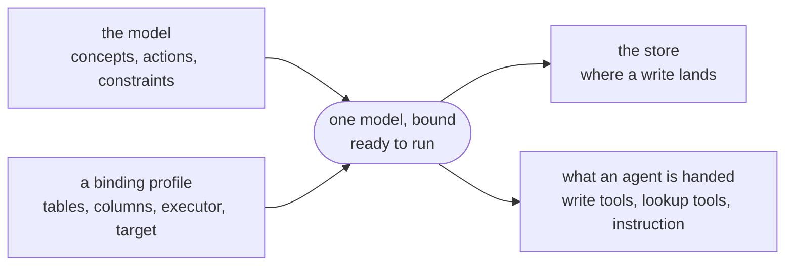

# Modeling write operations

Your semantic model already tells an agent what your data means and which
questions it can ask. Ask that agent to *do* something — refund an order, move
money between two accounts, close a dormant account — and the model has nothing
to say. The write exists somewhere, as a service call or an endpoint or a few
lines of DML, but it's visible only to whoever built the service around it. Your
agent either can't reach it, or reaches it through a hand-written tool that your
model never sees and can't govern.

An **action** closes that gap. It's a named write operation declared over the
same concepts as the rest of your model: you give it a name, type its inputs
against your ontology, and say which concepts a call changes. Publishing it puts
the operation in the same place as the data it acts on, so an agent that
discovers your model discovers what it can change there as well as what it can
ask.

One part of an action is physical — how the write actually happens. That part
lives in a field called the **executor**, which names an MCP tool, a REST
endpoint, a gRPC method, or DML. Keeping it separate lets a binding profile
supply it, so you write an action across two files. Your model names the
operation and its parameters; a binding profile names the tables, the columns,
and the executor. Whatever runs the action combines the two into one bound
model.



*Figure 1: your model and a binding profile combine into one bound model, which
both reaches your store and supplies the tools an agent is handed.*

The rest of this guide follows one action — moving money between two bank
accounts — from a name in your model through to an agent that can call it. A
second example, a customer-service credit, comes in once the rules get harder to
write.

The commands here are `kcmd`, which reads a model, pushes it, and runs an action
against the store a profile binds. It is how you exercise what you wrote and see
each step of a call, and it is deliberately a small tool: what the model states
holds for any runtime that reads it, and the library `kcmd` is built on is the
same one a service would embed.

## When to use an action

Declare an action when the write already exists. Somewhere in your organization
there's a service call, an endpoint, or some DML that moves this money or issues
this credit. Declaring it as an action doesn't reimplement any of that — it
tells everything that reads your model that the operation is there, what it
takes, and where it lives.

If the call should hand back an answer instead of changing something, you want a
[metric](README.md#1-author-the-logical-model) instead.

## 1. Declare the action

Start with the name and the parameters. They're the contract every later step
builds on, and they live in your model and nowhere else — no profile can change
them.

Actions sit at model level, beside your metrics. Each one carries a name, its
parameters, and an executor. Treat that executor as a default, because it's the
one part a binding profile can replace:

```yaml
version: "0.2.0.dev0/google"    # `actions` is a kcmd extension key
semantic_model:
  - name: payments
    entities:
      - name: Account
        description: A customer's money at this bank.
        primary_key: [accountId]
        source: my-project.bank.account
        fields:
          - { name: accountId,      datatype: Integer, expression: account_id }
          - { name: name,           datatype: String,  expression: name }
          - { name: balance,        datatype: Float,   expression: balance }
          - { name: minimumBalance, datatype: Float,   expression: minimum_balance }
          - { name: status,         datatype: String,  expression: status, description: "open, frozen or closed." }
      - name: Transfer
        description: One movement of money between two accounts.
        primary_key: [transferId]
        source: my-project.bank.transfer
        fields:
          - { name: transferId, datatype: String,  expression: transfer_id }
          - { name: amount,     datatype: Float,   expression: amount }
          - { name: debitedId,  datatype: Integer, expression: debited_account_id }
    relationships:
      - name: TransferDebits
        from: Transfer
        to: Account
        from_columns: [debitedId]
        to_columns: [accountId]
    actions:
      - name: TransferFunds
        description: Move money from one account to another.
        executor:                             # one kind only: mcp / rest / grpc / sql
          mcp:
            server: //agentregistry.googleapis.com/projects/acme-ops/locations/us-central1/mcpServers/payments
            tool: transfer_funds
        parameters:
          - name: source
            concept: Account                  # takes Account.accountId's type
            field: accountId
            description: The account the money leaves.
          - name: target
            concept: Account
            field: accountId
            description: The account the money goes to.
          - name: amount
            type: Float                       # no field carries this one
            description: How much money to move.
        ai_context:
          instructions: >-
            Resolve both accounts before calling.
    ai_context:                             # model level: true of every caller
      instructions: >-
        Never move money between two accounts held by the same customer
        without saying so in your answer.
```

You author the rest of the model — the deployment target, the entity bindings,
the relationships — the way you would for any model. See
[Deploying a semantic model](README.md).

The executor tells a consumer where the operation lives. Pick one of these four
kinds, and give any one executor a single kind only:

- **`mcp`** — `{server, tool}`. A tool you've already registered in Agent
  Registry, named by the server's resource name and the tool's name within it.
- **`rest`** — `{endpoint, method}`. An HTTP endpoint and the verb to call it
  with.
- **`grpc`** — `{service, method}`. A service and the method on it.
- **`sql`** — `{statements}`. The write itself, carried in your model instead
  of named as a pointer to whoever performs it, and the only kind kcmd runs.
  See [carrying the write as DML](#carrying-the-write-as-dml).

Both `description` and `ai_context.instructions` travel through to the catalog,
and a parameter's `description` is what tells a caller which argument is which.
Two parameters a caller could confuse must each carry one, or the push fails.
Write the instructions for the agent that's going to call the action, the way
the example does.

### Projecting a parameter from a field

Every parameter carries one scalar value — the same kind of value a column
holds. What differs is where its definition comes from, and there are two ways
to give it one: **project** it from a field of your ontology, or **declare** it
on the spot.

**A projected parameter** names a `concept` and a `field`, and takes that
field's datatype, description, label and AI context straight out of the model.
`source` above is an `Integer` because `Account.accountId` is one, so a caller
passes an account id and the write binds it as an integer. Change the field
later and every parameter projected from it follows, because there's no second
copy to keep in step. A `concept` is read the way `affects` reads one, so it can
name a relationship as well as an entity — but what you project from in practice
is an entity, because a relationship only has fields of its own when a junction
table backs it, and this format has no syntax for one yet.

Most projected parameters need no name of their own. Leave `name` out and the
parameter answers to the field's, so this one is called `accountId`:

```yaml
          - { concept: Account, field: accountId }
```

Name it yourself when one action takes the same field twice, the way
`TransferFunds` takes both a `source` and a `target`.

This shape holds however an entity is keyed. An `Account` identified by three
columns takes three projected parameters, one per key field, each typed from
the field it names — the same declaration a single-column key writes, three
times.

**A declared parameter** carries a value no field holds: the `amount` above, a
free-text memo, a reason code your store never keeps. Give it a `type` and a
description of your own. `type` takes a scalar datatype only, and naming an
entity there is an error telling you to project the field you meant.

A projected parameter can't restate its field's `type`. If the type is wrong,
fix the field. If a statement needs a different one, cast it in the DML, where
the conversion is visible to whoever reads the write instead of buried in
metadata.

Each parameter may also carry:

- **`description`** — what the parameter means for this call. A projected
  parameter inherits the field's, and overriding it is how `source` and
  `target` above say different things while projecting one field. Required when
  two parameters on the same action project the same field or share a declared
  type, because neither can tell an agent which argument is which on its own.
- **`label`** and **`ai_context`** — inherited the same way, overridden the
  same way.
- **`default`** — a fallback value substituted when the caller omits the
  argument. Giving a parameter a default makes it optional; setting
  `required: true` alongside `default` is rejected.
- **`required: false`** — marks a parameter optional with no fallback; an
  omitted call binds `NULL` in SQL.

`default` and `required` are always yours to set, projected or not. A field
says what a value *is*; the parameter says how this one call uses it.

### Where the executor comes from

Everything else your action declares is logical: what it takes, what gates it,
what it changes. None of that changes when you deploy the same model somewhere
else. The executor does, which is why it sits on the physical side with an
entity's `source`, and why a [binding profile](profiles.md) can supply one or
replace the one your model declares — for any of the four kinds. An action a
profile says nothing about keeps the executor the model gave it.

It changes for two different reasons. An `mcp`, `rest` or `grpc` executor is an
address: the operation lives at a different server, endpoint or service in
staging than it does in production, and where your rows sit never enters it. A
`sql` executor is the statement, written in the bound store's table and column
names and in its dialect, so until you know which store answers there's nothing
to write down. Only that last case turns on where the data lives.

### Actions declared but not performable

An action with no executor anywhere — none in the model, none in any profile —
is **declared but not performable**. It still says what it does, what it takes,
what gates it and what it changes; the only thing missing is who carries the
write out. Write one when nobody has wired the write up yet, or when another
team owns it and your model needs only to record that it exists.

Nothing declares this state: it follows from the executor being absent, so the
same action is performable under a profile that supplies one and not
performable under a profile that supplies none or withdraws the model's with
`executor: null`. A catalog-only push — `--no-profile`,
or a model with no deployment target — publishes it like any other action, and
`kcmd profiles` lists it under `cannot run:` for each binding that supplies no
executor for it.

## Carrying the write as DML

The first three kinds name a system that performs the write, which leaves the
write itself opaque to your model: an `mcp` tool name says where the operation
lives and nothing about what it touches. A `sql` executor carries the write
instead, so what your action does becomes readable — and checkable — from the
bound model, and kcmd can [run it](#7-run-it) rather than handing the write to
another system to perform.

Statements are written in one database's own table and column names, in its own
dialect, so a `sql` executor goes in that database's [binding
profile](profiles.md) — beside the bindings for those same tables and columns —
rather than in the model it binds. Here it replaces the `mcp` executor the model
declared for `TransferFunds`:

```yaml
# payments.profiles/operational.yaml — this store owns the rows, so it writes them
semantic_model:
  - name: payments
    deployment_target: //spanner.googleapis.com/projects/my-project/instances/my-instance/databases/bank/propertyGraphs/payments
    entities:
      - name: Account
        source: //spanner.googleapis.com/projects/my-project/instances/my-instance/databases/bank/tables/account
        fields:
          - { name: accountId, expression: account_id }
          - { name: balance,   expression: balance }
          # ... and the model's remaining entities and fields, bound the same way
    actions:
      - name: TransferFunds
        executor:
          sql:
            statements:
              - UPDATE account SET balance = balance - @amount WHERE account_id = @source
              - UPDATE account SET balance = balance + @amount WHERE account_id = @target
              - INSERT INTO transfer (transfer_id, amount, debited_account_id) VALUES (GENERATE_UUID(), @amount, @source)
```

Selecting a profile replaces the model's bindings with that profile's, so the
one you put a `sql` executor in has to carry the columns its statements name as
well — leave them out and the fields come back unbound and the action cannot
run. Of the action itself, only the executor is restated: what the call takes,
what gates it and what it changes stay in the model, exactly as
[declared](#1-declare-the-action).

`statements` is a list because one business action is often more than one write.
The transfer above debits one account, credits another, and records the
transfer row itself, and a transfer that did only the first would lose money.
kcmd opens one transaction, runs the statements in the order you wrote them,
and commits at the end, so writes that only make sense together never apply by
halves.

Carrying the write buys you two things:

- **Your blast radius is checkable.** A reader can compare `affects` against the
  statements instead of taking it on trust.
- **A guard becomes a real gate.** An MCP, REST or gRPC call commits inside a
  system kcmd doesn't control, so a write it performed can't be rolled back if
  the rest of the action fails. A `sql` action's guards settle before kcmd opens
  a transaction, and a call that doesn't clear them never reaches one, so a
  refusal leaves the store untouched.

### Statements use your database names

**An action's statements reach your store exactly as you wrote them**, so every
table and column in one has to be the name your database uses. In the `sql`
executor above, the model's `Account` and `accountId` appear as `account` and
`account_id`. Those are the table and the column that the entity's `source` key
and its fields' `expression` keys bind it to.

`@parameter` references are the exception: they name a value kcmd binds at call
time rather than anything in your database.

A statement that says `accountId` where the column is `account_id` still passes
push, because push never asks your store whether a table exists. The error comes
from the store when the action runs, and it can read like a fault in the
statement rather than a typo in a name. An entity named `Order` bound to a table
named `Orders` produces

```
Syntax error: Unexpected keyword ORDER [at 1:8]
```

instead of "no such table", because `ORDER` is a reserved word.

### Which file a `sql` executor belongs in

The placement is enforced: select a profile whose model declares a `sql`
executor and the command refuses, naming the action:

```
Error: [payments] profile 'operational': action 'TransferFunds' in model
'payments' declares a 'sql' executor. A statement names one database's own
tables and columns, so it belongs in the profile that binds them, not in the
model. Move the executor into each profile that performs this write as DML.
```

A single-file model is the exception: that one document is both the model and
its binding, so its statements already sit beside the columns they name. Add a
profile beside it later and they move into the profile.

## 2. Gate it with a constraint

The sections so far declared an action and gave it a write to perform. This
section is how you stop it running when it shouldn't. A **constraint** is a
named rule your model states over its ontology. Declaring one adds it to the
catalog and changes nothing by itself. A constraint takes effect where
something references it and nowhere else, so publishing a rule can't quietly
start refusing calls that succeeded yesterday.

```
  declared                referenced             checked            a breach
  ─────────────────       ─────────────────      ──────────────     ───────────
  constraints:            actions:               before the call,   reject
    - name: X       ──▶     - name: Y      ──▶   with the      ──▶  escalate
      judgment: …             guards: [X]        arguments bound    warn

  a rule in the           the only thing that    a language model   on_violation
  catalog, inert          gives it effect        reads the call     names one of
                                                 and settles it     the three
```

*Figure 2: a constraint moves from declared, to referenced by an action, to
checked before a call, to a breach routed by `on_violation`.*

A constraint has one body, `judgment`: the rule written as a sentence, settled
by a language model reading the attempted call.

### Naming a constraint as a guard

An action's `guards` list is what puts a constraint to work. Declare the rule,
then name it on the action — one line on the `TransferFunds` from section 1:

```yaml
    constraints:
      - name: TransferWithinAvailableBalance
        judgment: >-
          The amount argument of this call must not exceed Account.balance on
          the source account. That balance is on record rather than stated in
          the arguments, so read it before answering.
        on_violation: reject
        description: >-
          A transfer cannot move more than the source account holds. Lower the
          amount, or choose another account.
    actions:
      - name: TransferFunds
        guards: [TransferWithinAvailableBalance]
```

`guards` holds the names of constraints your model declares, and listing one
there is what makes it apply to that action. Put the reference on the action
rather than on the constraint, because the same rule may gate `TransferFunds`
and leave `CloseAccount` alone.

Whatever dispatches the call is what checks its guards, and it checks every one
of them before the call, with the arguments bound and before any transaction
opens. Nothing in your model binds a rule to the state a write leaves behind, so
a guard reports on the arguments it was handed and on the data the call starts
from, and on nothing else.

`guards` and `on_violation` are independent, the way the two right-hand columns
of figure 2 are: one says when the constraint gets checked, the other says what
a breach does. So guarding a constraint that declares `warn` is a real shape.
Your organization may not be ready to block on a rule; guarding it anyway still
gets the rule checked at the moment of the call and reported back.

When one call violates several guards, the strictest outcome applies. Any
`reject` refuses the call, failing that any `escalate` holds it, and failing
that any `warn` lets it through with the violations reported. The precedence is
fixed and nothing in your model states it, so an action can name any number of
guards without you writing down how they combine. It is also how `forbid`
overrides `permit` in Cedar and how a deny wins in Open Policy Agent, so a
policy written this way lowers into either.

A guard that names no constraint fails the push, so a typo can't leave you
believing a write is checked when nothing checks it. The reverse isn't an
error: a constraint no action names is declared, published and inert, which is
a reasonable thing to publish for a reader or for an action you haven't written
yet.

### What a judgment costs

A judgment is a whole constraint body. Here is one, with the two fields that
say what a breach does and how grave it is:

```yaml
    constraints:
      - name: CreditMemoNamesAServiceFailure
        judgment: >-
          LineItem.memo must name a specific, verifiable service failure on the
          order: a late delivery, a damaged item, a shipping charge applied in
          error. A memo that states only that the customer requested a credit
          does not satisfy this rule.
        description: >-
          Say what went wrong with the order in the credit memo.
        on_violation: warn
        severity: low
```

Settling that rule is a model call, and one goes out for every guard on every
attempted write. The verdict can also move: a ceiling of 25 dollars, stated as a
judgment, can answer two identical calls differently, where `amount <= 25` could
not.

So write a judgment for a rule that has to read stored data or weigh what a
caller wrote, where nothing shorter would settle it. A threshold over the call's
own arguments is the case to keep out: `amount <= 25` reads nothing but the
arguments, and a sentence buys you a model call and a verdict that can move.
Leave it in whatever dispatches the call — the model has no home for it today,
which is in [what is not modeled yet](#what-is-not-modeled-yet).

Every constraint must state `on_violation`, and any of the three words will do.
Omit it and the push fails, because an unmarked constraint would reject, and
that's too strong a consequence to inherit by silence.

### What a guard can see

A guard is checked before the call, with the arguments bound and before any
transaction opens. So it sees two things: the arguments it was handed, and the
data the call starts from. A rule about the arguments — whether the memo the
caller wrote names a real service failure, say — is settled completely, because
the arguments are the whole of what it reads. A rule about stored data is
settled against the state the call starts from, which is a weaker claim than it
looks: that the call isn't starting from a broken state.

Nothing settles a rule about the state a write *leaves behind*. "An order's
total equals the sum of its lines" has nothing to look at when the guard runs.
Put that rule inside the transaction, or in your schema, where the store
enforces it.

A judgment that reads stored data also needs a judge that has been given the
store to read. Whoever dispatches the call decides that — see
[when the judge needs a fact](#when-the-judge-needs-a-fact).

**Status: `judgment` is the only body a constraint has.** Whatever checks a
guard puts the sentence to a language model and routes the verdict by
`on_violation`.

### Writing a judgment

A language model reads your sentence at review time with the proposed write in
front of it. That reader is the judge. Five habits make that reading
consistent:

1. **State what must be true of the data.** Write the condition — *the memo
   must name a specific service failure*, and not the procedure, *check whether
   the memo is specific*. Your sentence describes a clean write, and everything
   about handling a breach lives elsewhere.
2. **Name fields model-qualified.** Write `LineItem.memo` rather than "the
   memo". A push resolves every `Entity.field` token in the text against your
   model and fails when the entity declares no such field, so a rename can't
   leave your sentence pointing at nothing. The qualified name also tells the
   judge which value to read.
3. **Say what doesn't count.** A rule with no negative example gets graded
   against whatever the model guesses you had in mind. The sentence "A memo
   that states only that the customer requested a credit does not satisfy this
   rule" buys you more consistency than any further description of what a good
   memo is.
4. **Leave the consequence out of the prose.** What happens on a breach is
   `on_violation`. A judgment ending "…otherwise escalate to a supervisor"
   states a routing nothing reads, and the engine routes by the field
   regardless.
5. **Keep it to one condition.** When your sentence needs "and also", the
   second half is a second constraint. One `on_violation` can't carry two
   consequences, so two conditions that end differently can't share a
   constraint.

All five are about wording. Claim no more in the wording than a judge can
settle.

A judge settles a guard from the call's arguments and whatever it could read, so
a sentence about stored data can turn out to be a rule it has no evidence for.
The instructions tell it to refuse in that case and say what's missing, but that
instruction binds a model rather than the runtime, so the rule can come back
held instead — a guard that never fires and never says why. Phrase the condition
around the arguments the call carries, and try every guard against a case it
ought to refuse.

A rule that does need a stored row — comparing a credit against the order total,
say — is settled only by a judge that can read your tables, which is something
an agent embedding the runtime gives it rather than something `kcmd` does. Word
the rule to say the value is on record and has to be read, because the judge
decides for itself whether to look. The same rule refuses every call when it
goes to a judge that can't read. See
[when the judge needs a fact](#when-the-judge-needs-a-fact).

## A credit policy, worked through

Real policies have several rules, and the rules rarely end the same way. A
support agent is about to issue a customer-service credit, and five separate
rules bear on whether they may:

```
  the business rule                        a breach   settled
  ──────────────────────────────────────   ────────   ────────────────────────
  1  no credit above the order's total     escalate   judgment, reading a row
  3  the memo names a service failure      warn       judgment
  4  not one credit split to evade review  reject     judgment
  ──────────────────────────────────────   ────────   ────────────────────────
  2  over 25 dollars needs a supervisor    —          your dispatch, not here
  5  the total equals the line items       —          your schema, not here
```

*Table 1: the three rules of the credit policy that a guard can carry, what a
breach of each one does, and the two rules that belong somewhere else.*

Rules 2 and 5 are in the table to be ruled out. Rule 5 is about the state a
write leaves behind, and a guard runs before the transaction opens, so no
constraint you write here reaches it; put it in your schema. Rule 2 compares one
argument against a literal: written as a judgment it would buy a model call to
perform a subtraction, and a verdict that can move at the boundary. Leave it in
whatever dispatches the call. The 25-dollar ceiling still governs the desk, and
rule 4 is written against it, but nothing in the model states it.

Writing the other three down needs an `Order` with a `total`, a `LineItem` with
an `amount` and a `memo`, and an `IssueCredit` action taking the order, the
amount and the memo. Each rule becomes one constraint, and each states its own
outcome in `on_violation`:

```yaml
    constraints:
      - name: CreditWithinOrderTotal              # rule 1
        judgment: >-
          The amount argument of this call must not exceed the total of the
          Order it is applied to. That total is on record rather than stated in
          the arguments, so read it before answering. Read both as dollars.
        description: >-
          A credit cannot exceed the total of the order it credits. Lower the
          amount, or split it across the orders it actually covers.
        on_violation: escalate
        severity: high

      - name: CreditMemoNamesAServiceFailure      # rule 3
        judgment: >-
          LineItem.memo must name a specific, verifiable service failure on the
          order: a late delivery, a damaged item, a shipping charge applied in
          error. A memo that states only that the customer requested a credit
          does not satisfy this rule.
        description: >-
          Say what went wrong with the order in the credit memo.
        on_violation: warn
        severity: low

      - name: CreditIsNotSplitToAvoidReview       # rule 4
        judgment: >-
          A credit must not appear to be one larger credit divided into parts
          that each stay under the 25-dollar self-service limit. Read the
          proposed amount together with the other credits already on the same
          Order: several near-limit credits raised close together for related
          reasons are one credit, whatever each memo says on its own.
        description: >-
          Raise this as a single credit for the full amount and send it for
          supervisor review.
        on_violation: reject
        severity: critical

    actions:
      - name: IssueCredit
        executor:
          mcp:
            server: //agentregistry.googleapis.com/projects/acme-ops/locations/us-central1/mcpServers/commerce
            tool: issue_credit
        parameters:
          - { name: order,  concept: Order, field: orderId }
          - { name: amount, type: Decimal }
          - { name: memo,   type: String }
        guards:
          - CreditWithinOrderTotal
          - CreditMemoNamesAServiceFailure
          - CreditIsNotSplitToAvoidReview
```

Each `on_violation` key carries one branch of what your policy describes in
prose, in a form a search can read.

**Rules 3 and 4 are the reason a constraint is written in words.** Neither
reduces to arithmetic over `Order` and `LineItem` at all, so there's nowhere
else to put them but a policy document nothing links to.

**Rule 1 is arithmetic, and is still written in words.** It compares the amount
argument against a number that lives in the database, so no form of it avoids
naming a store, and it goes to the judge like the other two. That's the price of
one body: a comparison a subtraction would have settled the same way every time
is settled by a model instead, which costs a call and can decide two similar
credits differently. Word an arithmetic rule tightly, and say what unit the
numbers are in, because the judge only has the words you gave it. Rule 2 is the
same comparison against a literal rather than a row, and that difference is the
whole reason it stays out of the model.

**Rule 4 is a judgment that declares `reject`.** Splitting a credit to evade
review is a rule the business means as unappealable, and the pairing carries a
real cost, because a model can decide two identical credits differently and
`reject` leaves nobody to appeal to. The model publishes such a rule instead of
forbidding it, and makes it findable: an auditor asking which unappealable rules
your model settles gets an answer from one query over the constraints.

### Two calls through the policy

Here are two calls against order 12345, which totals $165.85. One is a
200-dollar credit for a shipping charge billed in error, which is more than the
order was ever worth. The other is three 9-dollar credits raised within the
hour, each memo reading some version of "customer asked":

```
                                  amount=200.00,         amount=9.00 x3,
                                  "shipping charge       "customer asked"
                                   applied in error"
  ──────────────────────────────  ─────────────────────  ─────────────────────
  1  within the order's total     violated ─▶ escalate   holds
  3  memo names a failure         holds                  violated ─▶ warn
  4  not split to evade review    holds                  violated ─▶ reject
  ──────────────────────────────  ─────────────────────  ─────────────────────
  strictest outcome wins          held for a supervisor  refused, with the
                                                         memo warning reported
```

*Table 2: how each of the two calls fares against the three rules, and the
outcome that wins.*

The supervisor who gets the first call reviews a credit against an order rather
than a SQL diff. The second call is the case rule 4 was written for. Every
per-call gate lets it through, because each 9-dollar credit sits under the
order's total on its own, and under the desk's 25-dollar ceiling too, and only
reading the three together as one 27-dollar credit puts them over it.

The bottom row of table 2 applies the strictest-outcome rule from section 2 —
an `escalate` with nothing stricter beside it holds the first call, and rule 4's
`reject` decides the second.

**Status: a run doesn't compute the strictest outcome.** The runtime puts the
guards to the judge in the order your model declares them and stops at the
first one that fails without being advisory. What comes back is that guard's
outcome rather than the strictest of them, and a `warn` collected on the way
there doesn't travel with the refusal. And [`kcmd action-run`](#7-run-it)
settles no guard at all, so the two calls above are what the published policy
says should happen rather than what that command does with this action
today.

## 3. Say what it changes

`affects` names the concepts a call writes to. An executor like
`mcp: {server, tool}` says where the operation lives and nothing more, so no
reader of your model can see what that tool writes; the blast radius of a call
stays unknown until you declare it here.

`affects` is a list, and every entry in it takes one of two shapes: a bare
concept name, or a record that also says how the concept changes.

**A bare name** says the concept is touched, in a way your model doesn't spell
out:

```yaml
        affects: [Account, Transfer]
```

That's enough to answer *which actions can change an account at all*, which is
already more than an executor name answers.

**A record** adds the operation and the fields the call writes:

```yaml
        affects:
          - concept: Account
            operation: modify
            fields: [balance]
          - concept: Transfer
            operation: create
          - concept: TransferDebits
            operation: create
```

You'll usually have worked some concepts out further than others. The two
shapes go in one list together, so a coarse entry on the ones you haven't costs
you nothing on the ones you have:

```yaml
        affects:
          - { concept: Account, operation: modify, fields: [balance] }
          - Transfer
```

`affects` declares the blast radius rather than limiting it. Naming one field
doesn't stop a statement from writing others, and naming two concepts doesn't
stop a call from touching a third; the list records what you mean the call to
do.

### What an entry may say

`concept` takes an entity or a relationship, written the same way for either
kind — your model already records which one it is. `TransferDebits` above is
the edge from the example model, and it sits in the list beside the two
entities. Either way the name has to be one the same model declares.

`operation` is `create`, `modify` or `delete`, the same three whatever the
concept is, and a fourth word means your document doesn't parse. Leaving it out
gives you the coarse form one entry at a time, covering every operation on that
concept. Two entries on one concept with the same operation are a hard load
error, and a bare entry beside one with an operation warns, because the bare
one already covered what the second narrows.

`fields` names what a `create` or a `modify` writes, which makes *which actions
can change `Account.balance`* answerable. A `delete` takes the whole instance,
so a field named beside one is rejected rather than ignored.

On a relationship, `fields` means the junction table's own columns, so *modify
the grade on an Enrollment* is as ordinary a change as *modify an order's
total*. A plain foreign-key edge carries no columns of its own, and
`TransferDebits` is one, so naming a field on it is an error — the property you
meant belongs to an endpoint entity.

Name the concept now and refine it later. Writing `- concept: Account` on its
own says the same thing the bare `Account` does, and it's written back as the
bare form.

**Status: nothing compares `affects` to what your executor does.** kcmd parses
it, checks the concepts against your ontology, publishes it and reads it back,
and no component reconciles the declaration with the statements or the tool
call. Two things beyond those checks read it. Resolving your model through a
binding profile drops any action affecting a concept the profile can't bind, so
that action never reaches the catalog. Publishing an action whose affected
concept has no entry in the same push warns you that the catalog now records a
blast radius naming something it can't resolve.

## 4. Check it before pushing

`kcmd push --validate-only` runs the checks a push runs and deploys nothing. It
loads your model, checks each action against the ontology that same model
declares, and prints every error it finds. A push clears the same gate before
it writes anything, so whatever this reports would have stopped your deploy:

```bash
kcmd push --validate-only
```

Once your document parses, five checks run over every action, and a failure in
any of them stops the push:

- **Every parameter has a type the model can settle** — projected from a field,
  or a scalar datatype you named. A `concept` the model doesn't declare, a
  `field` that concept doesn't have, a `type` sitting on a projected parameter,
  and a `type` naming an entity are four different mistakes and report as four
  different errors.
- **Parameters a caller could confuse each carry a `description`.** Two
  parameters projecting `Account.accountId`, or two sharing a declared type,
  otherwise produce identical tool argument documentation, leaving an agent
  guessing which is `source` and which is `target`.
- **The executor has the fields its kind requires.** `server` and `tool` for
  `mcp`, `endpoint` and `method` for `rest`, `service` and `method` for `grpc`,
  at least one statement for `sql`. Leave one blank and whatever picks the
  action up has nothing to call.
- **Every name in `guards` is a constraint the model declares.** This is the
  one that costs you silently — a guard naming a constraint that doesn't exist
  gates nothing, so you believe the write is checked while nothing checks it.
- **Every `affects` concept is an entity or relationship the model declares.**
  The list exists to answer *which actions change `Account`*. A typo is
  invisible on the page and would drop the action out of that answer.

A model that breaks all five reports all five, one line each, and deploys
nothing:

```
Error: action 'TransferFunds' in model 'payments' (payments) has parameter
'amount' typed 'Currency', which is not a scalar datatype
(String/Integer/Decimal/Float/Boolean/Date/Time/DateTime/DateTimeTz/Opaque).
Error: action 'TransferFunds' in model 'payments' (payments) has multiple
parameters projected from 'Account.accountId', so parameters 'source' and
'target' must each have a 'description' of their own to distinguish them.
Error: action 'TransferFunds' in model 'payments' (payments) has an mcp
executor whose 'tool' is missing or blank.
Error: action 'TransferFunds' in model 'payments' (payments) is guarded by
'TransferWithinAvailableBalence', but model 'payments' declares no constraint
of that name.
Error: action 'TransferFunds' in model 'payments' (payments) affects 'Acount',
which is neither an entity nor a relationship this model declares.
```

`TransferWithinAvailableBalence` there misspells the
`TransferWithinAvailableBalance` the model declares, and `Acount` misspells
`Account` — the two typos a reader of the document would skim straight past.

kcmd checks the rest of an `affects` entry just as strictly. Fields beside a
`delete` are a hard error, and so is a field the concept doesn't declare. An
operation outside `create` / `modify` / `delete` never gets this far — the
vocabulary is closed, so your document doesn't parse at all.

The two checks that read your ontology stand down when a binding profile
resolves your model. Resolving drops entities and relationships the profile
can't bind, so holding `affects` to the ontology there would fail your deploy
over a concept the profile removed rather than one you mistyped. An undeclared
concept and an undeclared field fall back to the warning the loader already
gave. A catalog-only push and `kcmd action-run` read the author's model
whole, so both treat the same two as hard errors. Fields beside a `delete` read
only the entry, so that one fails everywhere.

### What push holds a statement to

kcmd checks a `sql` executor further than the other three kinds, because it
carries the write rather than a pointer to whoever performs it:

- Write each statement as a **single `INSERT`, `UPDATE` or `DELETE`**. A
  statement that reads is a query and belongs in a metric; one that reshapes the
  schema isn't an action. A `;` anywhere but the end is rejected, because each
  list entry runs on its own and anything after the separator would silently not
  run.
- **Every `@name` a statement binds has to resolve** to a parameter your
  action declares. Anything you write another way is left alone — a literal
  passes, and so does a SQL function. Nothing is interpolated into the
  statement text, so an argument can't become SQL.
- **You choose where a new row's key comes from.** Write `GENERATE_UUID()`
  into the `VALUES` list, pass the key in as an ordinary parameter, or, where
  the key column has a default, leave it out and let the store fill it. kcmd
  generates nothing on your behalf, and nothing in `affects` bears on the
  choice.
- **A key that arrives as an argument is a key the caller chooses.** An agent
  filling that parameter can name a row that already exists, and nothing in
  kcmd stops it, because the check on statement shape reads only the first
  word. An upsert therefore passes and overwrites. Spanner spells one
  `INSERT OR UPDATE` and AlloyDB spells one `INSERT ... ON CONFLICT`. A plain
  `INSERT` fails on the duplicate instead. Generate the key inside the
  statement unless something about the call needs the caller to pick it.
- Nothing else is available: no control flow, and no statement composed at call
  time. `statements` is a fixed list in your model, so an action whose body
  arrived with the call would declare nothing, and a gate can't check what was
  never declared.

## 5. Push it

```bash
kcmd push
```

Knowledge Catalog is the one system your action reaches. Each action becomes its
own entry there, parented to the model entry, the same way a metric does. The
entry carries one aspect holding the executor and the typed parameters:

```yaml
# .../entryGroups/<group>/entries/payments.actions.TransferFunds
entryType: projects/<project>/locations/global/entryTypes/semantic-action
parentEntry: .../entryGroups/<group>/entries/payments
entrySource:
  displayName: TransferFunds
  description: Move money from one account to another.
aspects:
  <project>.global.semantic-action:
    executorKind: mcp
    mcpServer: //agentregistry.googleapis.com/projects/acme-ops/locations/us-central1/mcpServers/payments
    mcpTool: transfer_funds
    parameters:
      - {name: source, type: Integer, concept: Account, field: accountId, description: The account the money leaves.}
      - {name: target, type: Integer, concept: Account, field: accountId, description: The account the money goes to.}
      - {name: amount, type: Float}
    affects:
      - {concept: Account, operation: modify, fields: [balance]}
      - {concept: Transfer, operation: create}
      - {concept: TransferDebits, operation: create}
    instructions: Resolve both accounts before calling.
```

A projected parameter publishes both halves: the `concept` and `field` it came
from, and the `type` that projection settled on. The reference is what you
wrote and what a pull reads back, so the link into your ontology survives the
round trip. The resolved type is there for a consumer reading the catalog
without your model in hand, which would otherwise have no way to know what to
pass.

`affects` is published exactly as you wrote it. The entry doesn't record
whether `TransferDebits` is an entity or an edge. A consumer that needs that
answer reads it off your model, the only place that still answers correctly
after a rename.

Every action in your model gets an entry, whether or not the binding you pushed
can perform it. When that binding gives an action no executor, the entry
publishes without the executor fields, so the catalog records an action that
nothing is yet wired up to run. A push reads the binding named by `--profile`,
or by `default_profile` in `catalog.yaml` when you don't name one.

Remove an action from your document and the next push deletes its entry, because
your model owns the `<model>.actions.` id prefix. A catalog search can list the
actions in a project by entry type, the way it lists entities or metrics.

`semantic-action` is a custom entry type, because Dataplex has no built-in type
for an action yet. Run `kcmd init --semantic-model` once before you push a model
that declares actions, and it provisions the entry type and its aspect type in
your own project.

Publishing an action needs the permission to attach its aspect, on top of the
permissions any push needs — see
[Reference → Permissions](reference.md#permissions).

## 6. Pull it back

```bash
kcmd pull
```

Pull collects the `semantic-action` entries under your model entry and rebuilds
each action. The name, the description, the executor, the typed parameters,
`guards`, `affects`, and `ai_context.instructions` all survive the round trip
unchanged. [What push and pull preserve](fidelity.md) lists which parts of a
model survive that trip and which don't.

## 7. Run it

The sections so far declared an action, checked it and published it, and none
of that has put it in front of the database the write lands on. This section is
how you run one there, with arguments you choose, and see what comes back.
Pasting the statements into a SQL console would tell you the DML is valid; a
run is what exercises everything wrapped around it.

Everything below happens at a command line, and that is a way of watching the
model work rather than the place it is meant to work. `kcmd action-run` performs
most of what any runtime dispatching these calls has to perform — bind the
arguments, open one transaction, apply the statements — and narrates each step.
What it leaves out is the guards: it settles none of them, names the ones it
passed over, and writes. Who settles a rule, and what that judge may read while
it does, are decided by whoever dispatches the call in earnest — and from the
same sentences, so a service running this action reaches verdicts this command
never asks for.

`kcmd action-list` prints the actions your model declares, each with its
parameters, executor, guards and blast radius, plus the command line that calls
it, filled in with the parameters that line has to carry:

```bash
kcmd action-list
```

```
Model 'payments' (payments_eg), profile 'operational':
  store: my-project/my-instance/semantic_skill_demo
  TransferFunds: Move money from one account to another.
    parameters: source (Integer from Account.accountId), target (Integer from Account.accountId), amount (Float)
    executor:   sql
    guards:     TransferWithinAvailableBalance
    affects:    Account (modify), Transfer (create), TransferDebits (create)
    run:        kcmd action-run TransferFunds --arg source=<Integer> --arg target=<Integer> --arg amount=<Float>
```

Where a run would be refused before it opened a transaction, that line says so
instead, in the runtime's own words. Misspell the guard — write
`TransferIsWithinLimit` where the model declares
`TransferWithinAvailableBalance` — and the same listing reads:

```
  TransferFunds: Move money from one account to another.
    parameters: source (Integer from Account.accountId), target (Integer from Account.accountId), amount (Float)
    executor:   sql
    guards:     TransferIsWithinLimit
    affects:    Account (modify), Transfer (create), TransferDebits (create)
    NOT RUNNABLE: Action 'TransferFunds' is guarded by 'TransferIsWithinLimit',
    which is not declared by model 'payments'. Running it would apply a write
    the model says must be checked first, so it is refused rather than run
    unchecked.
```

The executor is perfectly good, and nothing about it says the action cannot
run. The listing knows because it asks the runtime the same question a run
asks, rather than working it out again here — so the two cannot disagree about
what will happen. An action executed over MCP is marked the same way, since
this command holds no handler for one and could not roll it back.

`kcmd action-run` performs one of those actions, against the database your
model's deployment target names under the selected profile.

### What a run does

`kcmd action-run` binds every argument as a typed query parameter, then applies
the action's statements in one transaction. `TransferFunds` is guarded, and this
command settles no guard -- it names the ones it passed over and writes anyway.
[When the rule is a sentence](#when-the-rule-is-a-sentence) covers who does
settle them:

```
  kcmd action-run TransferFunds --arg source=7 --arg target=8 --arg amount=250
     │
     │ bind      @source = 7      as Integer, from Account.accountId
     │           @target = 8      as Integer, from Account.accountId
     │           @amount = 250    as Float, so 9 is less than 10
     │
     │ apply     BEGIN
     │             UPDATE account SET balance = balance - @amount
     │               WHERE account_id = @source
     │             every UPDATE and DELETE has to match a row
     │           COMMIT
     ▼
   committed      ·      nothing written      ·      unknown, do not retry
```

*Figure 3: the path of a run, from the argument the caller typed to the three
ways it can end.*

Nothing is interpolated into a statement. Every argument goes in as a query
parameter, and the argument's ontology type — the field's, where the parameter
projects one — decides the store type that parameter takes. Any failure before
the commit rolls back, so no partial write survives, and a refused commit wrote
nothing either. The commonest refusal is Spanner's `ABORTED` under lock
contention, and the answer is to run the action again.

An `UPDATE` or `DELETE` that matches no rows is one of those failures. A caller
who passes an account id that isn't in the table gets a statement that changes
nothing, and reporting that as a successful write would tell them money moved
when none did — so the run is refused and the transaction rolls back naming the
statement that matched nothing.

`INSERT` is the one exemption, because it creates rows rather than finding them,
so writing none is something an author can mean. Everything else your store
reports a zero count for is refused, including a statement kcmd can't read a
verb from at all — a procedure call wrapping the write, say. That direction is
deliberate: a statement wrongly refused is a failed run you go and look at,
while one wrongly allowed is a caller told its write landed when it didn't.

The rule applies per statement, and it has no opt-out, so there's one shape of
action you can't write today: a multi-statement action whose earlier statement
is legitimately conditional. An action that clears a cart and then writes an
order fails outright when the cart was already empty, because the `DELETE`
matched nothing. Write that case as two actions, or move the condition into the
statement that must write — a `DELETE` whose predicate you already know matches.
There's no way to mark one statement as allowed to write nothing.

The unknown outcome is a timeout or a 5xx, where your store may have applied the
write and lost the response. kcmd can't settle which, so it reports the run as
unknown rather than as a rollback, and a caller who retries on that report may
apply the write twice.

Only a `sql` executor runs. An `mcp`, `rest` or `grpc` executor names an
operation in another system, which kcmd can't call and couldn't roll back if the
commit failed, so the call is refused rather than half-performed:

```
Error: Action 'TransferFunds' is executed by MCP, which runs outside this
transaction and could not be rolled back if the commit failed. Supply a handler
that performs the write as DML, or declare the action with a 'sql' executor.
```

### When a rule stops the call

This is what a runtime does with a guard, and `kcmd action-run` is not that
runtime: it settles none of them, so none of the outcomes below come out of the
command line above. They come out of whatever dispatches the call in earnest.

Only a constraint the action names in `guards` has a say in a call, which is
[section 2](#2-gate-it-with-a-constraint)'s rule reaching the runtime. A
constraint your model declares and your action doesn't name has no bearing on
the write, and nothing goes looking for one.

A guard is a sentence, and settling a sentence needs something that reads one.
A run given nothing to read with refuses a call that a non-advisory guard covers
rather than running the write unchecked, which would leave anyone reading the
model believing it was checked. The refusal names the rule:

```
Error: Action 'TransferFunds' is guarded by 'TransferWithinAvailableBalance',
which is settled by reading the call, and this runtime was given no judge to
ask. Running it would apply a write the model says must be checked first, so it
is refused rather than run unchecked.
```

An advisory rule is one declaring `on_violation: warn`. It reports a violation
instead of rejecting one, so gating on it would permanently block every run of a
model that states advisory rules. An advisory guard stands down instead: the run
carries on, and a warning line records that nothing checked the rule.

A refusal is settled before a session opens, so a refused action leaves no
transaction behind. A guard whose `judgment` has no words in it is refused the
same way, before any judge is asked, because there is nothing to ask about.

### When the rule is a sentence

A guard stated as a `judgment` needs something that can read a sentence, and
whatever dispatches the call has to be holding one. In the runtime shipped here
that is Gemini on Vertex AI, hired by the application that embeds the runtime
and handed to it once, at construction:

```ts
const judge = new GeminiJudge(ctx, {model: 'gemini-2.5-flash'});
```

**No kcmd command line hires one.** `kcmd action-run` performs the write and
names the guards it did not check; it is for finding out whether your statements
do what you meant, not for finding out whether your rules hold. The two demands
pull apart: a judge costs a model call per guard and credentials to reach one,
and an author checking a `WHERE` clause should not have to stand either up. The
[commerce demo](../../demo/semantic-model/skill/README.md) is where what it
takes to settle them is shown, against the same model — in runs recorded while a
command line still hired a judge, because nothing in this repository hires one
today.

The rules below run against the commerce model under `demo/semantic-model/skill`
— the [credit policy worked through earlier](#a-credit-policy-worked-through),
rebuilt around what a runtime can settle today. A profile binds `IssueCredit` to
a `sql` executor, and the action names four rules in `guards`. One of the four
is the 25-dollar ceiling, written there as a judgment rather than left to the
desk; the demo keeps it to show what settling arithmetic with a model call
costs.

Each rule's own sentence goes to the model with the attempted call. A verdict
comes back with a reason, and `on_violation` decides what follows. The demo
declares `warn` on the memo rule; the three outputs below come from setting that
one field to each of its values in turn, so a single rule shows all three
branches.

> These three were recorded through `kcmd action run`, back when it took a judge
> and could give that judge the store to read — which is why each of them shows
> the judge reading `Orders`. Neither is a command-line flag any more, for the
> reason above. They are
> kept because what they show — one rule, all three values of `on_violation`,
> one run each — is not shown anywhere else.

With `reject`, the call stops:

```
Running 'IssueCredit' on projects/my-project/instances/my-instance/databases/semantic_skill_demo...
  rules stated in words go to gemini-2.5-flash (us-central1)
  it may read commerce's tables to settle them
  the judge reads: SELECT total FROM Orders WHERE order_id = 12347
Error: Action 'IssueCredit' is guarded by 'CreditMemoNamesAServiceFailure'
("The memo argument of this call must name a specific thing that went wrong on
the order: a late delivery, a damaged item, a shipping charge applied in error.
A memo saying only that the customer asked, or that the credit is goodwill, or
giving no reason at all, names no failure and does not satisfy this rule."), and
gemini-2.5-flash (us-central1) judged that it does not hold for this call: The
memo "customer asked for a credit" does not name a specific thing that went
wrong with the order, such as a late delivery, a damaged item, or a shipping
charge applied in error. Say in the credit memo what actually went wrong with
the order. No transaction was opened, so nothing was written.
```

Four things are in that message and kcmd wrote none of them: the constraint's
name, your own sentence, the judge's reason, and the constraint's `description`,
which is the line telling the caller what to do instead. A memo that names a
failure gets the write:

```
Running 'IssueCredit' on projects/my-project/instances/my-instance/databases/semantic_skill_demo...
  rules stated in words go to gemini-2.5-flash (us-central1)
  it may read commerce's tables to settle them
  the judge reads: SELECT total FROM Orders WHERE order_id = 12347
  order: '12347' -> Order 12347
Committed at 2026-09-19T15:01:29.694435Z.
```

A rule declaring `escalate` stops the call and adds one sentence: "The model
marks this rule 'escalate', so an approver may allow it; nothing here can." A
rule declaring `warn` lets the write through and reports the verdict:

```
Running 'IssueCredit' on projects/my-project/instances/my-instance/databases/semantic_skill_demo...
  rules stated in words go to gemini-2.5-flash (us-central1)
  it may read commerce's tables to settle them
  the judge reads: SELECT total FROM Orders WHERE order_id = 12347
  order: '12347' -> Order 12347
Warning: 'CreditMemoNamesAServiceFailure' ("The memo argument of this call must
name a specific thing that went wrong on the order: ...") is advisory, and
gemini-2.5-flash (us-central1) judged that it does not hold for this call: The
memo "customer asked for a credit" does not name a specific service failure. It
states that the customer asked for a credit, which is explicitly disallowed by
the rule.
Committed at 2026-09-19T15:02:02.059897Z.
```

**The rule is settled before the transaction opens.** A model call takes
seconds, and holding write locks across one costs more than it buys, so the
judge is asked first and the transaction opens only if the answer allows it. No
judge sees the state the write produces, and every judge reads committed state,
so two calls racing each other can each be allowed against a total that neither
will leave behind. A rule about the state a write leaves, or one that has to
hold under concurrency, belongs in your schema, where the store enforces it
inside the transaction.

**The judge gets the attempted call.** It receives the rule's text, the action's
name and description, and the arguments as the caller stated them —
`order=12347`, the value itself, and not the `Order` row it identifies. That's
the whole of what it has, unless it was also given the store to read.

**A rule that never reached a judge is reported as unchecked.** The runtime
holds no judge, or the model call failed. Either way `on_violation` routes that
like any other breach: an advisory guard lets the write through and warns, and a
guard declaring `reject` or `escalate` stops the call. Committing in silence
would tell you every rule passed when one was never put to anybody.

### When the judge needs a fact

Some rules can't be settled from the call alone. *The credit must not exceed the
total of the order it is applied to* compares an argument against a number in
your database, and the caller is under no obligation to state it correctly. A
judge that can read your tables goes and gets the number.

`kcmd action-run` hires no judge at all, so it certainly does not hire that one.
Letting a model compose and send queries against your data is a property of the
runtime an application embeds, decided by whoever builds the application; a
command line for curating a model is the wrong place to turn it on. The runtime
supplies it —
`modelJudgeStore()` in `src/libts/semantic/runtime/judge_store.ts` — and an
application that embeds the runtime is what calls it. Everything below describes
that judge; the transcripts are in
[the demo's README](../../demo/semantic-model/skill/README.md).

One thing has to be in place either way: your profile has to bind the entities
the rule talks about to tables, because that binding is the whole of what the
judge is told about your database. With nothing bound there is nothing to read.

Then write the rule so the judge goes and looks — it decides that for itself,
from the sentence you give it. This is the rule the demo under
`demo/semantic-model/skill` states at the head of `IssueCredit`:

```yaml
- name: CreditWithinOrderTotal
  judgment: >-
    The credit amount requested must not exceed the total of the order
    it is applied to. The `order` argument of this call identifies that
    order, and the order's total is on record rather than stated in the
    arguments, so read it before answering. Read both as dollars.
  on_violation: escalate
  description: >-
    A credit cannot exceed the total of the order it credits. Lower the
    credit amount, or split it across the orders it actually covers.
```

The judge composes its statement itself, from the rule's sentence and the tables
your profile binds — nobody writes that SQL. The runtime hands every statement
back to the caller as it is sent, because a read made on your behalf is yours to
check, and an application that embeds the runtime is expected to show them. A
credit against order 12345 sends one the caller never asked for: `SELECT total
FROM Orders WHERE order_id = 12345`. The rule named the order's total in words,
and the judge went and got it. Put the same call to a judge that cannot read and
it is refused for a different reason: the judge says it can't get the total.

**The judge sees what your model declares.** The entities, tables and columns in
its instructions come from your binding profile, so a column your model doesn't
bind is one the judge is never told exists. The dialect comes from there too:
the rule above produces GoogleSQL against `Orders.total` under a Spanner profile
and PostgreSQL against `purchase_order.order_total` under an AlloyDB one.

**Give the action's credentials no more reach than the tables your model
binds.** Your bindings tell the judge which tables exist rather than confining
it to them, so a read reaches whatever the credentials behind the action reach.
Every statement has to be a query, which stops a bare `UPDATE`, and a query that
calls a function that writes is still a query — PostgreSQL commits it, so a
write can land that way on an AlloyDB store.

**Keep the rule settleable from a few rows.** A judge gets a small budget of
reads for one guard, each capped in rows and in the size of a value, and it is
told when a cap applied. A rule needing a scan, a join across the history, or a
total of its own is past what a guard settles; compute it in the store and let
the guard read the answer. A judge that still can't tell is instructed to answer
that the rule doesn't hold.

**Reading costs model calls.** A guard with a store attached costs an extra call
even when it reads nothing, because asking and answering can't be the same
request, and each further round of reading adds one more.

Reading doesn't move the race described above: the judge reads committed state,
before the transaction opens.

### Which rows a call touches

Two things decide which rows a call touches, and they run at different moments:
you pass a value, and the statement's own `WHERE` clause picks the rows that
value lands on.

```
              the value you pass        the rows the write lands on
              ───────────────────────   ──────────────────────────────────
  what        --arg source=7            the statement's own WHERE clause
  who runs    kcmd, before the write    the store, in the transaction
  how many    one value, bound as       however many rows it matches;
              Account.accountId's type  kcmd does not constrain it
  checked     that the value fits       that an UPDATE or DELETE matched
              that type                 at least one row
```

*Table 3: what each step takes, who runs it, and how many rows it may reach.*

**Passing a value.** An argument names a value rather than a row. `--arg
source=7` doesn't mean *the account whose id is 7*; it means the number 7,
bound to `@source` wherever the statement puts it, as the type
`Account.accountId` declares.

So a caller holding a name rather than an id has to turn one into the other
first, with a query of its own, before the call. That's deliberate: finding the
right row can be a search with several plausible answers, and the place to
settle which one is in front of whoever is asking — not inside a write
transaction, which would have to pick one silently and commit to it.

**Targeting the write.** Your statement's `WHERE` clause decides how many rows
it lands on, and nothing would stop one that hits every dormant account. That is
what [section 3](#3-say-what-it-changes) means by `affects` declaring the blast
radius rather than limiting it.

The runtime checks one thing here: that an `UPDATE` or a `DELETE` matched
something. Zero rows fails the run and rolls the transaction back, which catches
an argument naming a row that isn't there. It can't catch an argument put in the
wrong place — `WHERE region = @source` will match some row, and that row is the
one your write lands on.

## 8. Hand it to an agent

You don't write the tools an agent calls. You point an agent at your model, and
what it can read, what it can change and what gates the change are all derived
from the model.

The **derivation** is the step that turns a bound model into the set an agent is
handed. The library runs it, and `kcmd` calls the library, so a service that
embeds the library hands its agents the same set. It produces a **write
tool** for every action, a **lookup tool** for every entity, and one
**instruction** from your model's `ai_context`.

Nothing else in your model becomes a tool of its own. A constraint reaches an
agent only through an action that guards on it. Relationships and metrics get no
tool at all, so an agent walks a relationship by looking up each end itself, and
nothing totals anything on its behalf.

### The set an agent is handed

`kcmd agent-tools` prints every tool the derivation produces, with the
instruction they arrive with. It reads your model under the profile you name and
needs the store that profile binds, because what an agent can call depends on
it. The command opens no connection and runs nothing:

```bash
kcmd agent-tools
```

For the model built up on this page, that set is:

```
Model 'payments' (payments_eg), profile 'operational':
  store: my-project/my-instance/semantic_skill_demo

  action  transfer_funds  (TransferFunds)
      Move money from one account to another.

      Resolve both accounts before calling.

      This call is gated by TransferWithinAvailableBalance:
      - TransferWithinAvailableBalance: The amount argument of this call must
        not exceed Account.balance on the source account. That balance is on
        record rather than stated in the arguments, so read it before
        answering. A transfer cannot move more than the source account holds.
        Lower the amount, or choose another account.
      source: integer -- The account the money leaves.
      target: integer -- The account the money goes to.
      amount: number -- How much money to move.

  lookup  find_account  (Account)
      A customer's money at this bank.

      Returns accountId, name, balance, minimumBalance, status. Every argument
      is an exact match and every one is optional; giving none returns the
      first rows. This tool cannot join, compare ranges, or total anything.
      accountId: integer
      name: string
      balance: number
      minimumBalance: number
      status: string -- open, frozen or closed.

  lookup  find_transfer  (Transfer)
      One movement of money between two accounts.

      Returns transferId, amount, debitedId. Every argument is an exact match
      and every one is optional; giving none returns the first rows. This tool
      cannot join, compare ranges, or total anything.
      transferId: string
      amount: number
      debitedId: integer

  instruction:
      Never move money between two accounts held by the same customer without
      saying so in your answer.

      Never invent an identifier. When you are given a name or a description
      instead of one, find it with the lookup tools rather than asking for it
      -- that is what they are for, and asking wastes the caller's time. Never
      compute a total or a balance yourself; the tools do that. When a tool
      reports that a write did not happen, read the reason it gives and repeat
      it plainly; if it says a person has to decide, say so and stop, because
      you cannot approve it yourself. When a write did happen and the tool
      returns warnings, the change landed and a rule still went unmet or
      unchecked: report both, because nobody else will. Finish by saying what
      you changed.
```

`transfer_funds` is offered, guard and all. The rule it is gated by is in the
tool's own description, wording and all, so the agent argues its call against
the rule before making it rather than learning it from a refusal.

A guard is not a reason to withhold a tool here. Who settles a rule belongs to
whoever dispatches the call, and this listing cannot know what that will be, so
marking the action unrunnable would describe a caller rather than your model.
What does get marked `[NOT RUNNABLE]` is what supplying a judge would not
repair: no executor under this binding, an executor this runtime holds no
handler for, a guard naming a rule your model never declares, or a guard naming
one that states no rule to put to a judge. Such a tool is **withheld**, and the
listing keeps it, printed named
and described, with what it's waiting on underneath, because an action your
model declares shouldn't vanish from the set your model offers.

Nothing in the listing was written for a particular agent. It reads the same
whether your caller is ADK, LangChain, or a person deciding whether the model
says enough yet.

### Where each line comes from

Most of the listing traces back to a key in your model or your profile, one
line of output per key:

```
  the model                              what the agent is handed
  ─────────────────────────────────      ───────────────────────────────────
  actions:
    - name: TransferFunds          ───▶  action  transfer_funds
      description: Move money…     ───▶      Move money from one account to
                                               another.
      ai_context:
        instructions: Resolve…     ───▶      Resolve both accounts before
                                               calling.
      guards:                      ───▶      This call is gated by
        - TransferWithinAvailable…             TransferWithinAvailableBalance:
                                             - TransferWithinAvailableBalance:
                                               The amount argument of this…
      parameters:
        - name: source
          concept: Account
          field: accountId         ───▶      source: integer -- The account the
          description: The account             money leaves.
            the money leaves.
        - name: amount
          type: Float              ───▶      amount: number -- How much money
          description: How much                to move.
            money to move.

  entities:
    - name: Account                ───▶  lookup  find_account
      description: A customer's…   ───▶      A customer's money at this bank.
      fields:
        - name: accountId
          datatype: Integer        ───▶      accountId: integer
        - name: status
          description: open,…      ───▶      status: string -- open, frozen
                                               or closed.

  ai_context:
    instructions: Never move…      ───▶  instruction:
                                             Never move money between two
                                             accounts held by the same…

  the binding profile                    what the agent is handed
  ─────────────────────────────────      ───────────────────────────────────
  deployment_target                ───▶  store: <project>/<instance>/<db>
  entities[].source                ───▶  the table a lookup reads
  fields[].expression              ───▶  the column it filters on
  actions[].executor               ───▶  what the write tool runs
```

*Table 4: which key in your model or your profile produces each line of the
agent listing.*

Two things come from neither file. The derivation appends a paragraph to the
instruction, its own text about using the tools, identical for every model. And
where a call could not succeed, the runtime adds `[NOT RUNNABLE]` and the
paragraph under it saying what stands in the way — absent above, because this
call can.

The instruction at the foot of the listing has two parts, because two different
people own them.

One part is your model's own `ai_context.instructions` — what this business asks
of anything that acts on it, including the agents nobody has written yet. It
belongs to the model because an agent carrying the same rule in its own source
is a place someone can change that rule without the people who own the model
finding out. Agents get replaced when frameworks change; your model doesn't.

The other part is about the tools rather than the business: what a lookup is
for, and what a refused write means. The derivation owes that part, because it
describes a contract this module defines and your model never stated. Write it
into each agent instead and you copy the same paragraph into every adapter,
where it drifts in each one.

So an agent that appends a persona of its own is saying something your model did
not. Put it in the model.

### What a write tool and a lookup tool do

A **write tool** runs the action. Calling `transfer_funds` does the same bind
and transact as [`kcmd action-run TransferFunds`](#7-run-it) — the same typed
parameters, the same single transaction, the same three outcomes. The guards are
where the two part: the tool puts each one to whatever judge the runtime behind
it holds, and the command line settles none.

A **lookup tool** reads one entity: exact match on any bound field, combined
with AND, capped at 50 rows. It can't join, compare ranges, aggregate or order.
That's enough to turn `"Alice Checking"` into the account id your write tool
needs, and it keeps the generated SQL checkable by eye. Table and column names
come from your binding and every filter value is a bound parameter, so no caller
text reaches the SQL.

A lookup is named for its entity, and an action keeps its own name when the two
collide. An entity named `Account` and an action named `FindAccount` both derive
`find_account`. The action takes that name, because you wrote it, and the lookup
becomes `lookup_account`. Deriving the write tools and the lookups together is
what makes the collision visible at all.

### What a withheld tool is waiting on

A **write tool** is withheld for one of three reasons:

- This binding supplies no executor, because the model declared none or a
  profile withdrew it with `executor: null`.
- The executor is `mcp`, `rest` or `grpc`, and the caller supplied no handler
  to perform the write.
- It names a guard this runtime cannot settle — a judgment with no judge to
  ask, or one with no words in it.

How an entity is keyed is not among them. Every parameter is a scalar, so an
action taking the three key fields of a three-part key is as callable as one
taking a single id.

A guard is not one of the reasons a tool is withheld. Who settles a rule belongs
to the application that embeds the runtime, and this command cannot know what
that will be, so marking a guarded action unrunnable here would describe a
caller rather than the model. What the listing does print, in the tool's own
description, is which rules the agent's calls will be held to:

```console
$ kcmd agent-tools
...
  action  issue_credit  (IssueCredit)
      ...
      This call is gated by CreditWithinOrderTotal, CreditUnderReviewThreshold
      and CreditIsNotSplitToAvoidReview:
```

No model is called. A judge settles a rule when an action runs, and printing
what an agent is offered runs no action, so this listing costs you nothing
however many guarded actions it names.

A **lookup** is withheld for reasons of its own:

- The entity is abstract, so it groups its subtypes and has no table to read.
- No field of it is bound to a plain column, so there is nothing to select.
- Its `source` is empty, or reads as a query rather than a table.

Either kind is withheld when the runtime has no store, because a call needs
somewhere to land. The derivation asks the runtime for every one of these
verdicts instead of working them out again, so the two can't drift: a tool
advertised as runnable that refuses each call spends your agent's turn, and one
withheld that would have worked is never tried.

### Calling it from code

`kcmd agent-tools` prints these tools; `modelTools` returns them. Both take a
**semantic runtime**: one model paired with the store your profile binds it to.
`createSemanticRuntimes` assembles them the way `kcmd action-list` and
`kcmd action-run` do, so your agent reads the model the CLI reads, under the
same profile, with the same merge and the same warnings:

```ts
import {createSemanticRuntimes} from './src/libts/semantic/runtime/runtime';
import {modelTools, callableTools} from './src/libts/semantic/runtime/agent_tools';

const runtimes = await createSemanticRuntimes({profile: 'operational'});
if ('error' in runtimes) throw new Error(runtimes.error);

const runtime = runtimes[0];
if (!runtime.store) throw new Error(runtime.storeError);

const {callable, withheld, instruction} = callableTools(modelTools({runtime}));
```

`modelTools` returns `{lookups, actions, instruction}` — the three things the
listing printed. `callableTools` then sorts the lookups and the actions into the
ones this binding can serve and the ones it can't, which is a split every
adapter has to make and the same split every time. Each tool carries a
`runnable` flag, and `unavailable` carries the reason. Offer `callable` to your
agent, and report `withheld` instead of hiding it. `actionTools` and
`entityTools` are exported for a caller that wants one kind.

Each tool is a name, a description, typed parameters and `invoke(args)`, so
binding one to ADK, to LangChain or to an MCP server is a short adapter over
that shape, and a second framework costs you nothing here. Nothing in this
module imports an agent framework.

`invoke` answers with three states: the write landed, the write didn't happen,
or the statements ran and the commit gave no answer either way. That last one
comes back as `unknown` alongside an explicit instruction not to retry, because
a caller reading it as "nothing happened" applies the write twice. A write that
landed carries `committedAt`; one that didn't carries `reason` and `whatToDo`.
Only a write that landed carries `warnings`, so dropping them tells your agent a
write met every rule the model states when it didn't.

`modelTools` also takes `judge`, and an action guarded by a judgment is callable
only when you pass one. `GeminiJudge` implements the seam over Vertex AI, and so
does anything carrying a name and a `decide` method. Omit it and such an action
is still derived and reported in `withheld`. The judge goes to the derivation
rather than to each call because one object has to answer `runnable` and answer
the call: a tool derived with a judge and then invoked without one would be
advertised as callable and refused mid-call.

Pass `handler` for an executor this runtime can't perform itself. An action with
a `sql` executor never receives it. Such an action promises that the catalog
published the statements it runs, and one handler serves the whole model, so
handing it through would break that promise for every `sql` action at once.

One call to `createSemanticRuntimes` returns a runtime for every model document
in your entry group. Each runtime carries the store that its deployment target
names, the profile it was built under, and the document it was authored in, so a
message about one model can say which file and which profile produced it.

`runtime.store.kind` is `'spanner'`, `'alloydb'` or `'bigquery'`, and only a
Spanner or AlloyDB store takes a write. Ask a BigQuery-backed runtime for a
client and you get an error naming the dataset instead, because an action's
statements need an operational database. A model whose profile binds no store at
all still gets a runtime, with `storeError` saying why. Its tools are still
derived, each marked unavailable for that reason, so your agent is told what the
model offers and why it can't reach it.

Go through `createSemanticRuntimes` instead of building a client yourself. It
also checks that every entity is bound to a table in the store your profile
targets. Without it, a model could be bound to some other system, and a lookup
derived from that model would read whatever table of that name your target store
happens to hold.

### The commerce demo, worked through

`demo/semantic-model/skill/` runs this against a live operational store, with no
agent code at all: a commerce model, a binding profile, and an
[Agent Skill](https://agentskills.io) generated from the pair by `kcmd
skills-generate`. The skill is a folder of Markdown — a router naming the
action, and a reference page carrying its arguments, its four rules verbatim and
what it changes. Installed into a coding agent and handed a support request in
English, that agent finds the order and attempts the write. Its README walks the
steps and reaches all three of `on_violation`'s outcomes against that store: a
$30 credit held because the model's $25 self-service ceiling is `escalate`, a
credit written with a warning because the memo names no service failure, and a
credit refused outright because the memo admits it's one piece of a larger
amount.

None of those three outcomes was decided by the agent reading the skill. The
ceiling, the memo rule and the split-credit rule came out of the model, and the
runtime settled each one on the way through the call — so an agent that ignores
what the skill says about them still cannot get past them. Regenerate against a
different model and profile and the skill describes a different business;
nothing is hand-written, so there is nothing to keep in step.

The README also states what that costs and what it can't do. The model guards on
four judgments and the judge it hires can query the store, so every guard on
every call is a model call, plus a read for the guard that needs one. That is
most of the latency in the runs it captures. Two of its rules fall short of what
they say:

- **An order's total matching its line items is declared and not enforced.**
  It's a statement about the state the write leaves behind, and guards settle
  before the write.
- **The split-credit rule catches only a disclosed split.** It fires because
  the model tells callers to disclose a split in the memo, which makes it a
  check on honest mistakes rather than a control. A version that held
  regardless would count the credits already on the order. A reading judge
  could do that; this model doesn't ask it to.

## What is not modeled yet

This is a prototype. Four things you might reasonably expect are absent.

- **Nothing checks a parameter against the column it's compared with.**
  Projecting `source` from `Account.accountId` says what the value is; it says
  nothing about where a statement puts it. `WHERE region = @source` is accepted
  and runs, because the parameter is logical, the column is physical, and no
  rule joins the two. Statements are sent to the store as written — see
  [statements use your database names](#statements-use-your-database-names) —
  so whoever writes one owns which column each argument lands in.
- **A deterministic check over the call's own arguments has no home.** A
  constraint is settled by a model reading it, so `amount <= 25` written as a
  guard costs a model call and can come back differently twice — see
  [what a judgment costs](#what-a-judgment-costs). The place for a check like
  that is likely the action itself; until there is one, keep it in whatever
  dispatches the call, and whoever wrote the statement owns the correctness of
  what it does.
- **kcmd calls no executor but its own.** A `sql` action runs; an `mcp`, `rest`
  or `grpc` one is published for whoever dispatches it, which is why those three
  name coordinates instead of a statement.
- **The store is Spanner or AlloyDB.** `kcmd action-run` binds and
  transacts against the database your profile's deployment target names, which
  may be either of those. A model bound to BigQuery publishes its actions and
  runs none of them.
