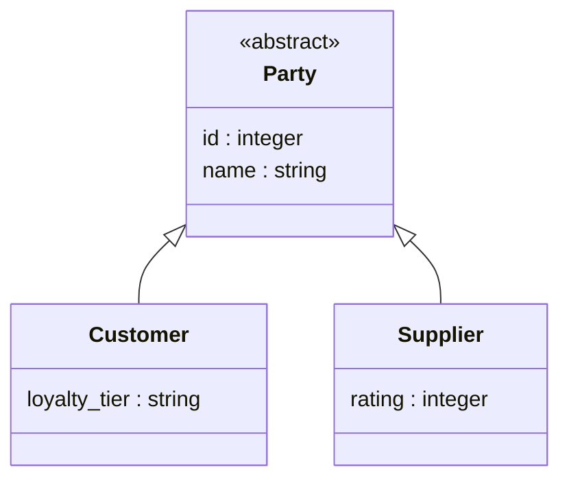
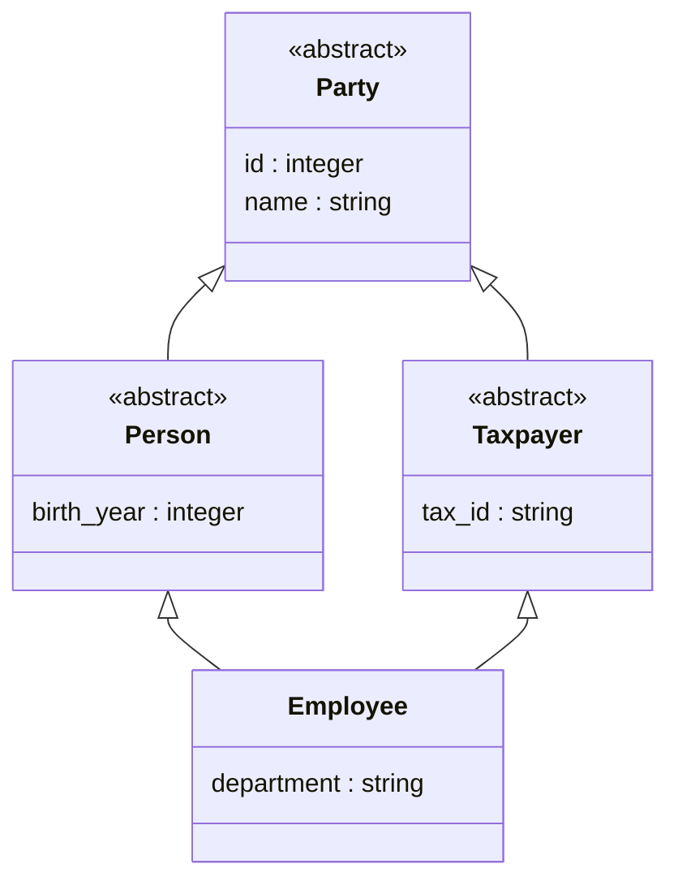
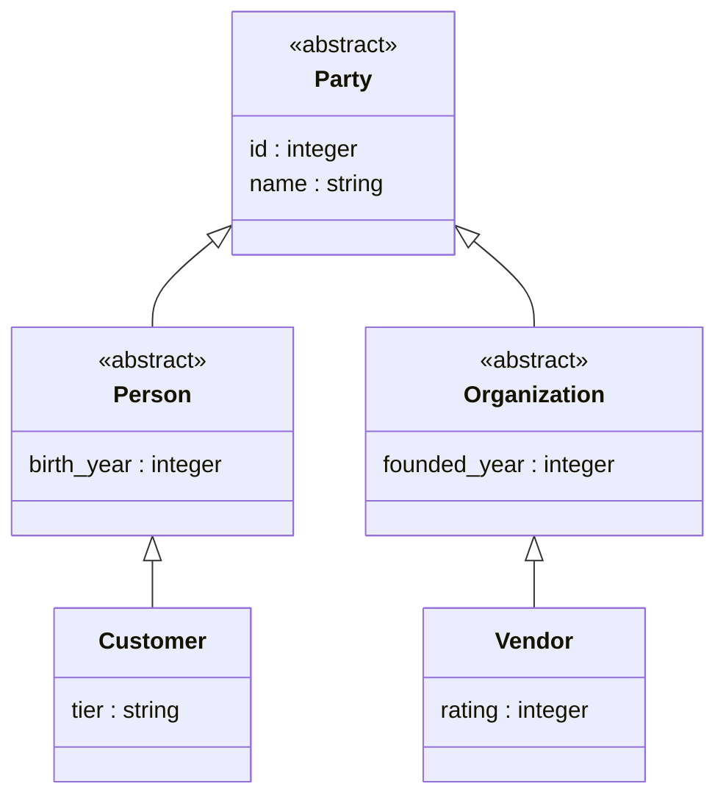

# Modeling class hierarchies

When several entities are kinds of one thing — a customer and a supplier are both
parties you deal with — you can declare the general kind once and say that each
specific kind `extends` it. A query written against the general kind then reaches
every specific kind. `extends` is the semantic model's *is-a*: a customer is a
party.

`kcmd push` expresses the hierarchy on the graph as **labels**. A subtype's node
table carries its own label plus one label per supertype, so `MATCH (:Party)`
matches every customer and every supplier. The exact generation rules — how
fields flatten down, what a label signature must contain — are in
[Reference → Class hierarchies](reference.md#class-hierarchies-extends--labels);
this page is the modeling guide.

## When to use it

Use `extends` when the shared fields reflect a real *is a kind of* relationship
and you want a supertype query to gather every subtype.

Do not use it when the shared fields are a coincidence of naming, or when you
have one entity whose columns happen to be split across two tables — that is a
[binding](profiles.md), and modeling it as inheritance produces the double-count
described below.

## The one rule

A supertype query gathers every subtype. Because it gathers subtypes, **each real
thing must live in exactly one place**, or it is gathered more than once and your
counts double. State it once and rely on it:

> **One real thing, one row, one node.**

Everything below is a way to honor this rule.

## 1. Declare the hierarchy

`Party` is the general kind. In this model no row is *just* a party — every party
is a customer or a supplier — so `Party` has no table of its own. Mark it
`abstract: true`: it has no `source` and no key, produces no node table, and
survives in the graph only as a label on its subtypes.

Each concrete kind declares its own fields and the one `extends` keyword. The
supertype's fields are inherited, so you do not repeat them:

```yaml
version: "0.2.0.dev0"
semantic_model:
  - name: parties
    entities:
      - name: Party
        abstract: true
        primary_key: [id]
        fields:
          - { name: id,   datatype: Integer }
          - { name: name, datatype: String }
      - name: Customer
        extends: [Party]
        primary_key: [id]          # each subtype keeps its OWN key; keys are not inherited
        fields:
          - { name: loyalty_tier, datatype: String }
      - name: Supplier
        extends: [Party]
        primary_key: [id]
        fields:
          - { name: rating, datatype: Integer }
```

The supertype's `id` and `name` flatten down onto both subtypes, so `Customer`
and `Supplier` each expose them, and each subtype node carries both its own label
and the `Party` label.



`Party` is abstract, so it has no table of its own; the arrows are `extends`. A
query against `Party` reaches every subtype below it.

## 2. Bind each subtype's table

Inheritance meets binding at one requirement: **each subtype's table must expose
the inherited columns**, because those fields are read from the subtype's own
table. `Party.name`, flattened onto `Customer`, is read from the customer table,
so that table must have a name column.

A binding gives each entity its `source` and each field its column. With one
store you can bind inline on the model as the `default` profile:

```yaml
      - name: Customer
        extends: [Party]
        primary_key: [id]
        source: my-project.sales.customer
        fields:
          - { name: id,           datatype: Integer, expression: c_custkey }
          - { name: name,         datatype: String,  expression: c_name }   # the inherited field, bound here
          - { name: loyalty_tier, datatype: String,  expression: c_tier }
```

To bind the same hierarchy to more than one store, put each binding in its own
[profile](profiles.md). A profile answers the supertype query only for the
subtypes it binds: bind `Customer` but leave `Supplier` unbound and
`MATCH (:Party)` returns customers alone.

## 3. Query the supertype

```
GRAPH my-project.sales.parties
MATCH (p:Party)
RETURN p.name
```

Every customer and every supplier comes back, each once, because each real party
lives in exactly one table.

## More hierarchy shapes

`extends` composes. A subtype can extend several supertypes, and a supertype can
extend another supertype above it. Two facts hold for every shape: the supertype
fields flatten down, and each concrete table binds every inherited field to its
own column. So the shapes below all deploy the same way, and each was verified to
deploy on BigQuery Graph.

### Extending more than one supertype, and diamonds

`extends` takes a list. Here an `Employee` is both a `Person` and a `Taxpayer`,
and each of those is a `Party`:

```yaml
      - name: Party
        abstract: true
        primary_key: [id]
        fields:
          - { name: id,   datatype: Integer }
          - { name: name, datatype: String }
      - name: Person
        abstract: true
        extends: [Party]
        fields:
          - { name: birth_year, datatype: Integer }
      - name: Taxpayer
        abstract: true
        extends: [Party]
        fields:
          - { name: tax_id, datatype: String }
      - name: Employee
        extends: [Person, Taxpayer]
        primary_key: [id]
        source: my-project.hr.employee
        fields:
          - { name: id,         datatype: Integer, expression: e_id }
          - { name: name,       datatype: String,  expression: e_name }
          - { name: birth_year, datatype: Integer, expression: e_birth }
          - { name: tax_id,     datatype: String,  expression: e_tax }
          - { name: department, datatype: String,  expression: e_dept }
```



`Party` sits at the top and is reached through two paths, so this is a diamond.
`Employee` carries the `Person`, `Taxpayer`, and `Party` labels, and `Party`
appears once. `MATCH (:Person)`, `MATCH (:Taxpayer)`, and `MATCH (:Party)` each
return every employee a single time. The number of supertypes a subtype has, and
the number of paths that reach a shared ancestor, do not change the count.

### Deeper hierarchies

A hierarchy can run several levels deep with a concrete table at each leaf. Here
`Party` divides into `Person` and `Organization`, and each has its own concrete
kind: a `Customer` is a person, a `Vendor` is an organization:

```yaml
      - name: Party
        abstract: true
        primary_key: [id]
        fields:
          - { name: id,   datatype: Integer }
          - { name: name, datatype: String }
      - name: Person
        abstract: true
        extends: [Party]
        fields:
          - { name: birth_year, datatype: Integer }
      - name: Organization
        abstract: true
        extends: [Party]
        fields:
          - { name: founded_year, datatype: Integer }
      - name: Customer
        extends: [Person]
        primary_key: [id]
        source: my-project.sales.customer
        fields:
          - { name: id,         datatype: Integer, expression: c_id }
          - { name: name,       datatype: String,  expression: c_name }
          - { name: birth_year, datatype: Integer, expression: c_birth }
          - { name: tier,       datatype: String,  expression: c_tier }
      - name: Vendor
        extends: [Organization]
        primary_key: [id]
        source: my-project.sales.vendor
        fields:
          - { name: id,           datatype: Integer, expression: v_id }
          - { name: name,         datatype: String,  expression: v_name }
          - { name: founded_year, datatype: Integer, expression: v_founded }
          - { name: rating,       datatype: Integer, expression: v_rating }
```



`Customer` and `Vendor` are the only tables. `MATCH (:Party)` returns every
customer and every vendor; `MATCH (:Person)` returns customers alone, and
`MATCH (:Organization)` vendors alone. Each real party lives in one table, so
every count is exact.

### What keeps every shape correct

These shapes deploy because their supertypes are abstract. Each concrete table
binds every inherited field to its own column, and BigQuery matches a shared
label by property name, so the subtype tables never have to agree on a physical
column. A supertype with its own table works too. Then every subtype table must
carry that supertype's columns under the same names, and a thing present in both
the supertype table and a subtype table is counted twice under the supertype
label. Keeping supertypes abstract keeps the one rule — one real thing, one node
— automatic.

## Match the shape to how your data is stored

How your subtypes are already stored decides how you model them. `extends` builds
one shape directly, and the other two common layouts are modeled without it:

- **One table per kind, the parent has none.** Each concrete kind has its own
  complete table; the supertype has no table and survives as a label; a supertype
  query is the union of the kind tables. This is the shape `extends` builds — the
  hierarchy above. It is correct as long as the kind tables hold disjoint things,
  which is why the parent is `abstract`.
- **One table for the whole family, with a kind column.** All parties in one
  table, a `type` column saying which kind each row is. Model this as one entity
  with a dimension field; it holds one row per thing, so it cannot double-count.
- **A base table plus an extension table.** A thing's general fields in one table
  and its specific fields in another, tied by a shared key. Model this as one
  entity whose binding joins the two tables, so the thing keeps one identity.

## When a supertype total looks too high

If a supertype count or sum comes back larger than the data warrants, the same
real thing lives in more than one table under the hierarchy. Every table carrying
the label contributes that thing as its own node. Take three people split across
a `person` table and a `customer` table that both carry the `Person` label, with
two of the three present in both. `MATCH (:Person)` returns **five** nodes,
because no identity link across the two tables tells the graph that the shared
rows are the same person.

The fix is the one rule. Make the parent `abstract` so no real thing lives in more
than one table under the hierarchy. When the two tables are instead the general
and specific halves of one thing, model them as one entity whose binding joins
them by key.

## The rules push enforces

Fields flow down to subtypes; relationships and keys do not. A subtype's table
must expose every inherited column, or the deploy fails. A metric cannot sit on a
shared supertype; attach it to a concrete subtype. An inherited field cannot be
redefined with a different meaning, and every table under a shared supertype must
expose the identical field set. Each rule and the error it raises is in
[Reference → Class hierarchies](reference.md#class-hierarchies-extends--labels).

Inheritance deploys the same way to BigQuery Graph and Spanner Graph — the extra
labels and the flattened fields are identical on both backends. On Spanner the
model carries no measures, as it does for any model.
