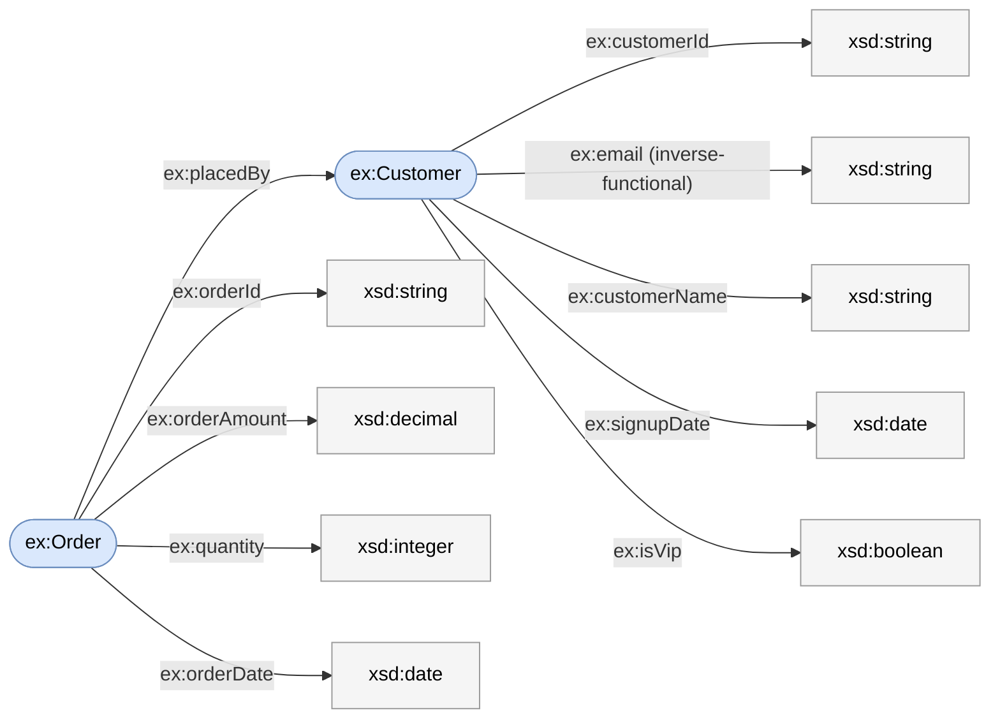

# Importing an OWL ontology

An OWL ontology and a semantic model share a backbone: **classes ≈ entities**,
**object properties ≈ relationships**, **datatype properties ≈ fields**. `kcmd`
does not learn a second format — it **converts OWL into a semantic model** once,
then the ontology rides the normal [`kcmd push` / `kcmd pull`](README.md)
workflow. The semantic model stays the single canonical form.

The converter maps the OWL constructs that have a clean BigQuery Graph shape to
**native** semantic-model fields — class → node, object property → edge,
datatype property → property, plus **class hierarchies** (`rdfs:subClassOf` →
entity `extends`, see [Class hierarchies](#class-hierarchies-rdfssubclassof)).
Constructs that have **no native home yet** — property inheritance
(`rdfs:subPropertyOf`), the inverse / equivalence / disjointness cross-references,
the property characteristics, and per-term annotations (`rdfs:seeAlso`,
`owl:deprecated`, …) — are not dropped: they **ride along verbatim** as custom
extensions, lossless and inert, until they earn a first-class concept (see
[Constructs carried as custom extensions](#constructs-carried-as-custom-extensions-not-yet-native)).
Richer OWL still not read at all (SHACL, cardinality restrictions, `owl:oneOf`,
individuals) is listed in [What is not covered yet](#what-is-not-covered-yet).

## 1. The OWL file

`sales.owl.ttl` — an ontology header, two classes with keys, datatype
properties across several `xsd` types, and one object property. Nothing here
needs an OWL reasoner:

```turtle
@prefix owl:  <http://www.w3.org/2002/07/owl#> .
@prefix rdfs: <http://www.w3.org/2000/01/rdf-schema#> .
@prefix skos: <http://www.w3.org/2004/02/skos/core#> .
@prefix xsd:  <http://www.w3.org/2001/XMLSchema#> .
@prefix ex:   <http://example.com/sales#> .

<http://example.com/sales> a owl:Ontology ;
    rdfs:label      "Sales domain" ;
    rdfs:comment    "A minimal sales domain: customers and the orders they place." ;
    skos:example    "How many orders did each customer place last month?" ;
    owl:versionInfo "1.0" .

ex:Customer a owl:Class ;
    rdfs:label    "Customer" ;
    rdfs:comment  "A person or organization that places orders." ;
    skos:altLabel "Buyer" ;
    owl:hasKey ( ex:customerId ) .

ex:Order a owl:Class ;
    rdfs:label   "Order" ;
    rdfs:comment "A purchase placed by a customer." ;
    owl:hasKey ( ex:orderId ) .

# customerId is the key; email uniquely identifies a customer
# (inverse-functional) so it becomes a unique-key constraint.
ex:customerId a owl:DatatypeProperty ;
    rdfs:domain ex:Customer ;
    rdfs:range xsd:string .
ex:email a owl:DatatypeProperty, owl:InverseFunctionalProperty ;
    rdfs:domain ex:Customer ;
    rdfs:range xsd:string ;
    rdfs:comment "The customer's unique email address." .
ex:customerName a owl:DatatypeProperty ;
    rdfs:domain ex:Customer ;
    rdfs:range xsd:string ;
    rdfs:label "name" .
ex:signupDate a owl:DatatypeProperty ;
    rdfs:domain ex:Customer ;
    rdfs:range xsd:date .
ex:isVip a owl:DatatypeProperty ;
    rdfs:domain ex:Customer ;
    rdfs:range xsd:boolean ;
    rdfs:comment "Whether the customer is in the loyalty program." .

ex:orderId a owl:DatatypeProperty ;
    rdfs:domain ex:Order ;
    rdfs:range xsd:string .
ex:orderAmount a owl:DatatypeProperty ;
    rdfs:domain ex:Order ;
    rdfs:range xsd:decimal ;
    skos:example "19.99" .
ex:quantity a owl:DatatypeProperty ;
    rdfs:domain ex:Order ;
    rdfs:range xsd:integer .
ex:orderDate a owl:DatatypeProperty ;
    rdfs:domain ex:Order ;
    rdfs:range xsd:date .

ex:placedBy a owl:ObjectProperty ;
    rdfs:domain ex:Order ;
    rdfs:range ex:Customer ;
    rdfs:label "placed by" ;
    rdfs:comment "Links an order to the customer who placed it." .
```

The same ontology as an RDF graph. Every arc is a triple: a class (the subject)
points through a property (the predicate) to its object. Each **datatype
property** points to its `xsd` range — a literal type, drawn as a plain box —
and becomes a field. The **object property** `ex:placedBy` points from one class
to another and becomes the relationship. The two classes become the datasets.



Classes (rounded) are the resources that become datasets; the `xsd` boxes are
literal types that become each field's `datatype`.

## 2. The command

```console
$ kcmd owl import sales.owl.ttl
converted 2 classes, 1 object property, 9 datatype properties
wrote catalog/EntryGroups/<entryGroup>/sales.yaml
note: this model is UNBOUND (placeholder `unbound:` sources, no deployment target).
      `kcmd push` is rejected until you bind each entity's source table and add
      a BigQuery deployment target -- validation needs both, for every --target.
```

The model name comes from the file (`sales.owl.ttl` → `sales`). By default the
document is written into the semantic-model layout dir so the next `kcmd push`
picks it up; pass `--out <path>` to write it elsewhere.

## 3. The semantic model it produces — `sales.yaml`

The `Customer` dataset and the `placedBy` edge (the `Order` dataset follows the
same shape). The structure, keys, and values are exactly what the converter
emits; the inline `#` comments are annotations added here for the walkthrough —
the real output has none:

```yaml
version: 0.2.0.dev0
semantic_model:
  - name: sales
    description: "A minimal sales domain: customers and the orders they place.
      (ontology version 1.0)"
    ai_context:
      synonyms:
        - Sales domain
      examples:
        - How many orders did each customer place last month?
    datasets:
      - name: Customer
        source: unbound:Customer        # placeholder — bind to a table for BigQuery Graph
        primary_key:
          - customerId                   # from owl:hasKey
        unique_keys:
          - - email                      # from the inverse-functional property
        description: A person or organization that places orders.
        ai_context:
          synonyms:
            - Buyer
        fields:
          - name: customerId
            expression:
              dialects:
                - dialect: BIGQUERY
                  expression: customerId
            datatype: String
          - name: email
            expression:
              dialects:
                - dialect: BIGQUERY
                  expression: email
            datatype: String
            description: The customer's unique email address.
          - name: customerName
            expression:
              dialects:
                - dialect: BIGQUERY
                  expression: customerName
            datatype: String
            label: name
          - name: signupDate
            expression:
              dialects:
                - dialect: BIGQUERY
                  expression: signupDate
            datatype: Date
            dimension:
              is_time: true              # a temporal field is a time dimension
          - name: isVip
            expression:
              dialects:
                - dialect: BIGQUERY
                  expression: isVip
            datatype: Boolean
            description: Whether the customer is in the loyalty program.
      # ... Order dataset: orderId, orderAmount, quantity, orderDate ...
    relationships:
      - name: placedBy
        from: Order
        to: Customer
        from_columns:
          - TODO_BIND                    # source FK — fill in when you bind sources
        to_columns:
          - customerId                   # already bound to Customer's key
        ai_context:
          instructions: Links an order to the customer who placed it.
```

This is the **clean mapping**: every construct here has a native semantic-model
home, so the output carries no term IRIs and no `custom_extensions`. Two kinds of
ontology go further — a **class hierarchy** (`rdfs:subClassOf`) and constructs
with **no native home yet** (inverses, equivalences, property characteristics,
…). Both are supported; the rest of this page shows them as extensions of *this
same sales domain* — see [Class hierarchies](#class-hierarchies-rdfssubclassof)
and [Constructs carried as custom
extensions](#constructs-carried-as-custom-extensions-not-yet-native).

Why nothing extra appears here: for a cleanly-mapped term its IRI carries nothing
the model doesn't already have — the term's identity is its name — and the source
namespace is recorded only when needed: in the model `description` as a fallback
when the ontology header has no comment of its own, or in an `owl:baseIri`
extension when an in-namespace reference has to be shortened (both shown in the
advanced example below). This ontology has a header comment and makes no such
references, so the namespace appears nowhere above.

### How each OWL construct maps

| OWL | Semantic model | Notes |
|---|---|---|
| `owl:Ontology` header | model `description`, `ai_context`, version | comment → `description`; labels → `ai_context.synonyms`; `skos:example` → `ai_context.examples`; `owl:versionInfo` → appended to `description` |
| `owl:Class` | `datasets[]` entry | `source` = `unbound:<Name>` placeholder until bound |
| `owl:DatatypeProperty` | `fields[]` on **each** domain's dataset | a property with several `rdfs:domain` values lands on each; `expression` defaults to the property's local name (a valid column ref once bound) |
| `owl:ObjectProperty` | `relationships[]` | `from` = domain, `to` = range; join columns bound to the destination key when it has one, else `TODO_BIND` (see [binding](#4-going-from-ontology-to-a-running-graph-binding)); with several `rdfs:domain`/`rdfs:range` values only the first of each is kept (a relationship is one source → one destination) and the rest are warned |
| `rdfs:subClassOf` (named superclass) | dataset `extends[]` | **entity-level inheritance only** — records the parent(s) in document order; not read on object properties (see [Class hierarchies](#class-hierarchies-rdfssubclassof)) |
| `rdfs:subPropertyOf`, `owl:inverseOf`, `owl:equivalentClass`, `owl:disjointWith`, `owl:equivalentProperty`, `owl:propertyDisjointWith`, the property characteristics, `rdfs:seeAlso`, `rdfs:isDefinedBy`, `owl:deprecated`, `owl:versionInfo` | `custom_extensions` (GOOGLE) | **no native home yet** — carried verbatim, inert on push (see [Constructs carried as custom extensions](#constructs-carried-as-custom-extensions-not-yet-native)) |
| `rdfs:range xsd:*` | field `datatype` | see [Datatypes](#datatypes-rdfsrange) |
| `owl:hasKey ( ... )` | dataset `primary_key` | single or composite, in list order |
| `owl:InverseFunctionalProperty` | dataset `unique_keys` | a uniquely-identifying property; omitted when it is already the `primary_key`; a lone one on a keyless class is promoted to `primary_key` instead |
| `rdfs:label` on a datatype property | field `label` | the field's display name (a `label` slot exists only on fields); dropped when it only respaces/recases the name |
| `rdfs:label` on a class / object property | `ai_context.synonyms` | no `label` slot there, so a distinct label becomes an alternate name; dropped when redundant with the name |
| extra `rdfs:label` / `skos:altLabel` / `prefLabel` / `hiddenLabel` | `ai_context.synonyms` | genuinely alternate names; feed NL search |
| `skos:example` | `ai_context.examples` | sample questions / values |
| `rdfs:comment`, `skos:definition`, `dcterms:`/`dc:description` | `description` | first present wins, in that order; on an object property (which has no `description` slot) the comment rides in `ai_context.instructions` |
| term IRIs, `@prefix` | a term's own IRI is dropped (base IRI kept as the model's `owl:baseIri` custom-extension key **when any reference was shortened**, and in `description` **only when the header has no comment of its own**) | reconstructable as `<base><name>`; a *carried cross-reference* to another namespace keeps its full IRI (see [Constructs carried as custom extensions](#constructs-carried-as-custom-extensions-not-yet-native)) |

A datatype property whose domain is not a class, or an object property missing an
endpoint, cannot be placed; it is **skipped with a warning** rather than failing
the whole import. An object property that declares *more than one* `rdfs:domain`
or `rdfs:range` is kept — a relationship maps one source to one destination, so
the first of each is used and the extra endpoints are dropped with a warning
(unlike a multi-domain *datatype* property, which lands on every domain).

### Datatypes (`rdfs:range`)

`rdfs:range` sets a field's logical `datatype`. Physical width is not carried (it
belongs to the bound table, not the ontology), so several `xsd` types collapse
onto one logical type:

| `xsd` range | `datatype` |
|---|---|
| `string`, `normalizedString`, `token`, `anyURI`, `language`, `Name`, `NCName` | `String` |
| `integer`, `int`, `long`, `short`, `byte`, `nonNegativeInteger`, `positiveInteger`, `unsignedInt`, … (any width/sign) | `Integer` |
| `decimal` | `Decimal` |
| `float`, `double` | `Float` |
| `boolean` | `Boolean` |
| `date` | `Date` |
| `time` | `Time` |
| `dateTime` | `DateTime` |
| `dateTimeStamp` | `DateTimeTz` |
| anything else, or no `rdfs:range` | `Opaque` |

A temporal field (`Date` / `Time` / `DateTime` / `DateTimeTz`) is additionally
marked a **time dimension** (`dimension: { is_time: true }`), so downstream
BigQuery Graph / BI treats it as one.

### Keys (`owl:hasKey`, `owl:InverseFunctionalProperty`)

- **`owl:hasKey ( ... )`** on a class becomes the dataset's `primary_key` (its
  grain), in list order — single or composite. If any key column names no
  datatype property on the class (undeclared, or declared only on another class)
  it has no field to back it; because keeping only the columns that do exist
  would silently narrow a composite key to a possibly non-unique one, the
  **entire `primary_key` is dropped** with a warning rather than left to fail
  later at graph generation.
- An **`owl:InverseFunctionalProperty`** (a datatype property that uniquely
  identifies its subject) becomes a `unique_keys` constraint — unless it is
  already the `primary_key`, in which case it is not repeated. If a class
  declares **no `owl:hasKey`** but has exactly **one** single-column
  inverse-functional property, that property is promoted to the `primary_key`
  (with a warning) so the dataset has a grain; ambiguous cases (several unique
  keys, or a composite one) are left without a `primary_key`.

Keys also make relationships half-bindable — see the next section.

### Class hierarchies (`rdfs:subClassOf`)

`rdfs:subClassOf` maps to a dataset's `extends` — the one keyword borrowed from
[Ossie's ontology proposal](https://github.com/apache/ossie/blob/main/ontology/ontology.md)
onto our existing `datasets`. Extend the sales domain with a `Person` base class
that `Customer` refines (`Customer rdfs:subClassOf Person`):

```turtle
ex:Person a owl:Class ;
    rdfs:comment "A human being." .
ex:fullName a owl:DatatypeProperty ;
    rdfs:domain ex:Person ; rdfs:range xsd:string .

ex:Customer a owl:Class ;
    rdfs:subClassOf ex:Person ;
    rdfs:comment "A person or organization that places orders." ;
    owl:hasKey ( ex:customerId ) .
# ... Customer's own datatype properties: customerId, email, customerName, … ...
```

the `Person` and `Customer` datasets come out as (`Customer` carrying
`extends: [Person]`):

```yaml
  # Person is its own dataset. (It also carries an owl:equivalentClass
  # extension — see Constructs carried as custom extensions below.)
  - name: Person
    source: unbound:Person
    description: A human being.
    fields:
      - name: fullName
        expression:
          dialects:
            - dialect: BIGQUERY
              expression: fullName
        datatype: String
  # Customer records that it extends Person and keeps ONLY its own fields;
  # Person's fullName is NOT flattened down.
  - name: Customer
    source: unbound:Customer
    extends:
      - Person
    primary_key:
      - customerId
    fields:
      - name: customerId
        expression:
          dialects:
            - dialect: BIGQUERY
              expression: customerId
        datatype: String
      # ... email, customerName, signupDate, isVip (Customer's own) ...
```

Multiple superclasses are allowed (`extends: [Person, Employee]`, in document
order). A `subClassOf` whose object is a blank-node axiom (`owl:Restriction` and
similar) is not a named class, so it is ignored, as are the implicit universal
superclasses `owl:Thing` / `rdfs:Resource` (every class subclasses them, so they
carry no inheritance information).

Two boundaries to be clear about:

- **The import *records* the hierarchy; the BigQuery push *resolves* it.** The
  importer writes `Customer` with `extends: [Person]` and **only its own fields**.
  A **BigQuery** push then resolves that inheritance: it emits a `LABEL Person`
  clause on the `Customer` node table and flattens `Person`'s fields down (fields
  flow down; edges do not) — see [Class hierarchies (`extends` →
  labels)](reference.md#class-hierarchies-extends--labels). The **Knowledge Catalog** push is
  unchanged: it still publishes each entry with exactly the fields it declares
  (KC-side inheritance is a separate, later opt-in).
- **Native inheritance is entity-level only.** `extends` lives on `datasets`,
  never on relationships — the boundary is structural. `rdfs:subPropertyOf`
  (property / relationship inheritance) has no such native slot, so it is **not
  dropped but carried verbatim** as a custom extension on the field or
  relationship (see [Constructs carried as custom
  extensions](#constructs-carried-as-custom-extensions-not-yet-native)).

### Constructs carried as custom extensions (not yet native)

Some OWL constructs have no native slot in the semantic model — a class is one
entity, so it has nowhere to record that it *equals* another class; an edge is
directed, so it has nowhere to record its *inverse*. Rather than drop these, the
converter **carries them verbatim** in a `GOOGLE` custom extension on the object
they describe. Carriage is a holding pattern with three deliberate properties:

- **Lossless for carried facts.** Every fact the converter *carries* is preserved
  exactly: the imported OSI document holds each carried construct as imported, and
  it survives a local load → serialize round-trip verbatim. (This is not a blanket
  guarantee that nothing the converter reads is ever dropped — some constructs are
  reduced with a warning, e.g. an object property's extra domains/ranges or a
  duplicate declaration; see [How each OWL construct
  maps](#how-each-owl-construct-maps).) Carriage is **not** yet persisted to
  Knowledge Catalog, though, so a `kcmd pull` does not return these facts today
  (push writes no aspect for them — see
  [What push and pull preserve](fidelity.md)).
- **Inert.** A carried fact changes **nothing** downstream — the BigQuery Graph
  push and the Knowledge Catalog push read none of it, so it never alters a node,
  an edge, or a query. (Contrast `extends`, which *does* change the graph by
  adding node labels — that is why it earned a native slot and these have not.)
- **Promotable.** When a construct proves it needs to be first-class, it moves
  out of carriage into a native concept; the extension is the seam where that
  happens.

**The shape.** Each carried construct is one key in a flat JSON object under the
`GOOGLE` vendor. **The key *is* the source construct, prefixed with its
vocabulary** (`owl:` or `rdfs:`); the value mirrors the construct faithfully.
`data` is a pretty-printed (2-space) JSON string, so it appears as a YAML block
scalar (`data: |-`). This is the block the `customerName` field gets from its
`rdfs:subPropertyOf` and `owl:equivalentProperty` (real output, verbatim):

```yaml
custom_extensions:
  - vendor_name: GOOGLE
    data: |-
      {
        "rdfs:subPropertyOf": [
          "fullName"
        ],
        "owl:equivalentProperty": [
          "http://xmlns.com/foaf/0.1/name"
        ]
      }
```

The prefix carries the namespace, which does two jobs: it keeps a carried fact
from colliding with Google's own keys in the same block (a deployment target is
`deploymentTargets`, unprefixed), and it disambiguates a short name that means
different things in different standards (`subPropertyOf` is RDFS; `inverseOf` is
OWL). A reader treats **any key containing a `:`** as a carried ontology fact (a convention for future consumers — nothing reads these keys back today).
Values are mirrored, not invented — a symmetric property is `"owl:SymmetricProperty":
true`, not a synthesized `characteristics` list — so no information about the
original construct is lost in translation.

**What is carried, and where it attaches:**

| OWL construct | Key | Attaches to | Value | Meaning |
|---|---|---|---|---|
| `rdfs:subPropertyOf` | `rdfs:subPropertyOf` | field / relationship | `string[]` (super-property refs) | this property refines a broader one |
| `owl:inverseOf` | `owl:inverseOf` | relationship | `string` (the inverse edge's ref) | the same edge read the other way |
| `owl:equivalentClass` | `owl:equivalentClass` | entity | `string[]` (equivalent class refs) | this class denotes the same set as another |
| `owl:disjointWith` | `owl:disjointWith` | entity | `string[]` (disjoint class refs) | no individual is in both classes |
| `owl:equivalentProperty` | `owl:equivalentProperty` | field / relationship | `string[]` (equivalent property refs) | this property means the same as another |
| `owl:propertyDisjointWith` | `owl:propertyDisjointWith` | field / relationship | `string[]` (disjoint property refs) | the two properties never both hold |
| `owl:SymmetricProperty` | `owl:SymmetricProperty` | relationship | `true` | the edge holds both ways (`a→b` ⇒ `b→a`) |
| `owl:TransitiveProperty` | `owl:TransitiveProperty` | relationship | `true` | the edge chains (`a→b`, `b→c` ⇒ `a→c`) |
| `owl:FunctionalProperty` | `owl:FunctionalProperty` | field / relationship | `true` | at most one value / destination per subject |
| `owl:ReflexiveProperty` | `owl:ReflexiveProperty` | relationship | `true` | every subject relates to itself (`a→a`) |
| `owl:IrreflexiveProperty` | `owl:IrreflexiveProperty` | relationship | `true` | no subject relates to itself |
| `owl:AsymmetricProperty` | `owl:AsymmetricProperty` | relationship | `true` | `a→b` rules out `b→a` |
| `rdfs:seeAlso` | `rdfs:seeAlso` | any | `string[]` of N-Triples terms — an IRI as `<iri>`, a literal as `"text"` (with any `@lang` / `^^<datatype>` preserved) | pointer to further information (kept distinguishable, see below) |
| `rdfs:isDefinedBy` | `rdfs:isDefinedBy` | any | `string[]` (IRIs, verbatim) | the resource that defines this term |
| `owl:deprecated` | `owl:deprecated` | any | `true` | the term is deprecated (carried only when true) |
| `owl:versionInfo` | `owl:versionInfo` | any | `string` | a term-level version string |

When more than one fact applies to the same object they share **one** block, in a
fixed key order (cross-references, then characteristics, then the per-term
annotations) so the output is stable.

**Names vs. full IRIs (namespace-aware).** A carried cross-reference points at
another OWL term, which has an IRI. When that IRI lives in **this ontology's own
namespace**, it is shortened to the plain local name (`"fullName"`, `"places"`) —
the same name the referenced entity/property carries in the model, so a consumer
can resolve it by name. When it lives in **another namespace**, the **full IRI**
is kept (`"http://xmlns.com/foaf/0.1/Person"`) — a shortened name would be
ambiguous and resolve to nothing. Nothing is lost either way: whenever any reference is
shortened, the base IRI is carried as structured metadata on the model — an
`owl:baseIri` key in the model-level GOOGLE `custom_extensions` block — so an
in-namespace name reconstructs mechanically as `<base><name>`, and a
cross-namespace IRI is already complete. (The base also appears in the model
`description` for humans, but the structured key is what a consumer reads.)
`rdfs:seeAlso` / `rdfs:isDefinedBy` point *outside* the model by definition, so
they are **always** kept verbatim; `rdfs:seeAlso` additionally wraps each value
as an N-Triples term (`<iri>` vs `"text"`, with any language tag `@en` or
datatype `^^<iri>` preserved) so an IRI stays distinguishable from a literal — and
a tagged/typed literal from a plain one — on round-trip. A carried reference is
**not** validated against the model — it is a fact to carry, not a resolved link.

**Example.** A slice of the sales domain that exercises every kind of carried
construct at once — a cross-namespace equivalence, a native-and-carried duality,
in-namespace and external references side by side, an inverse, and property
characteristics. Each `#` comment names where the construct lands:

```turtle
ex:Person a owl:Class ;
    owl:equivalentClass foaf:Person .             # external -> full IRI

ex:email a owl:DatatypeProperty,
           owl:InverseFunctionalProperty,         # -> unique_keys (native)
           owl:FunctionalProperty ;               # -> carried
    rdfs:domain ex:Customer ; rdfs:range xsd:string .
ex:customerName a owl:DatatypeProperty ;
    rdfs:domain ex:Customer ; rdfs:range xsd:string ;
    rdfs:subPropertyOf ex:fullName ;              # in-namespace -> "fullName"
    owl:equivalentProperty foaf:name .            # external -> full IRI

ex:placedBy a owl:ObjectProperty ;
    rdfs:domain ex:Order ; rdfs:range ex:Customer ;
    owl:inverseOf ex:places .                     # in-namespace -> "places"
ex:referredBy a owl:ObjectProperty,
                owl:AsymmetricProperty, owl:IrreflexiveProperty ;
    rdfs:domain ex:Customer ; rdfs:range ex:Customer .
```

The blocks below are the real emitted `data`, verbatim; the `# ...` lines omit
the surrounding fields (`customerName`'s block is the one under **The shape**
above; `placedBy` carries `{"owl:inverseOf": "places"}`):

```yaml
      # equivalence on the Person entity:
      - name: Person
        # ... fields ...
        custom_extensions:
          - vendor_name: GOOGLE
            data: |-
              {
                "owl:equivalentClass": [
                  "http://xmlns.com/foaf/0.1/Person"
                ]
              }
      # single-valued flag on Customer's email field -- which is ALSO a native
      # unique key, because email is inverse-functional:
          - name: email
            # ...
            custom_extensions:
              - vendor_name: GOOGLE
                data: |-
                  {
                    "owl:FunctionalProperty": true
                  }
    relationships:
      # characteristics on the referredBy relationship:
      - name: referredBy
        # ... endpoints ...
        custom_extensions:
          - vendor_name: GOOGLE
            data: |-
              {
                "owl:IrreflexiveProperty": true,
                "owl:AsymmetricProperty": true
              }
```

Because the in-namespace references (`fullName`, `places`) were shortened, the
**model header** also carries the base IRI so they can be reconstructed
(`<base><name>` → `http://example.com/sales#fullName`):

```yaml
semantic_model:
  - name: sales
    # ... description, ai_context ...
    custom_extensions:
      - vendor_name: GOOGLE
        data: |-
          {
            "owl:baseIri": "http://example.com/sales#"
          }
```

A reference to an **external** vocabulary keeps its full IRI instead — as
`Person`'s `owl:equivalentClass foaf:Person` and `customerName`'s
`owl:equivalentProperty foaf:name` both show above
(`"http://xmlns.com/foaf/0.1/Person"`, `"http://xmlns.com/foaf/0.1/name"`); no
base IRI is needed to rebuild them.

**Prefix → namespace** (the `owl:` / `rdfs:` on the *keys*; reconstruct an
in-namespace *value* as `<base><name>`, where `<base>` is the model's
`owl:baseIri` custom-extension key — a cross-namespace value is already a full
IRI):

| Prefix | Namespace IRI |
|---|---|
| `owl:` | `http://www.w3.org/2002/07/owl#` |
| `rdfs:` | `http://www.w3.org/2000/01/rdf-schema#` |

Blank-node forms are **not** carried: an `owl:equivalentClass` (or
`rdfs:subClassOf`) whose object is a class *expression* (`owl:intersectionOf`, an
`owl:Restriction`, …) is a definition rather than a plain cross-reference, so it
is out of scope (see [What is not covered yet](#what-is-not-covered-yet)).

## 4. Going from ontology to a running graph (binding)

The import gets you an **unbound** model — placeholder `unbound:<Name>` sources,
`TODO_BIND` join columns, and no deployment target — so it is **not deployable
yet**. `kcmd push` is rejected for *any* `--target` (including `kc`) until the
model passes [validation](reference.md#validation): every entity `source` must
resolve to a real BigQuery table, and the model must declare exactly one BigQuery
deployment target. Both checks run before either destination leg, so there is no
Knowledge-Catalog-only shortcut around them today.

> **Known limitation — no KC-only publish before binding.** Even
> `kcmd push --target kc` runs the BigQuery deployment-target and live-source
> checks first, so you cannot publish the ontology as catalog metadata while the
> model is still unbound. Letting `--target kc` publish an unbound model is a
> possible follow-up (see [What is not covered yet](#what-is-not-covered-yet)).

To make the model deployable, bind each class to a real table. A
declared key does half of this for you: an edge into a class that has a key
already has its **destination** columns bound to that key, so you only fill each
dataset's `source` table and the relationship's **source** foreign-key columns
(the `TODO_BIND` placeholders):

```yaml
  - name: Customer
    source: myproj.sales.customers       # was unbound:Customer
    primary_key:
      - customerId                        # already set from owl:hasKey
    # ... fields, with each expression bound to its real column ...
  # ... Order bound to myproj.sales.orders ...
  relationships:
    - name: placedBy
      from: Order
      to: Customer
      from_columns:
        - customer_id                     # fill in the source FK (was TODO_BIND)
      to_columns:
        - customerId                      # already bound to Customer's key
```

Add a [deployment target](README.md#deployment-targets-required) on the model as
well. With every `source` bound and one deployment target set, the model passes
validation, and a single `kcmd push` deploys both destinations:

```console
$ kcmd push                  # CREATE OR REPLACE PROPERTY GRAPH (Customer/Order nodes, placedBy edge), then KC entries
```

Binding the `source` tables and the source foreign-key columns is a manual edit
in this first cut.

## What is not covered yet

- `rdfs:subClassOf` (class hierarchy) **is** read now — it maps to dataset
  `extends` (see [Class hierarchies](#class-hierarchies-rdfssubclassof)) — and a
  **BigQuery** push resolves it into node-table labels with inherited fields
  flattened down (see [Class hierarchies (`extends` →
  labels)](reference.md#class-hierarchies-extends--labels)). Resolving the same inheritance
  into **Knowledge Catalog** entries is still a follow-on; the KC push publishes
  each entry with only its own fields.
- Property inheritance (`rdfs:subPropertyOf`), the cross-references
  (`owl:inverseOf`, `owl:equivalentClass`, `owl:disjointWith`,
  `owl:equivalentProperty`, `owl:propertyDisjointWith`), every property
  characteristic (symmetric / transitive / functional / reflexive / irreflexive /
  asymmetric), and the per-term annotations (`rdfs:seeAlso`, `rdfs:isDefinedBy`,
  `owl:deprecated`, `owl:versionInfo`) **are** read now — they have no native
  slot, so they are **carried verbatim** as `custom_extensions` rather than
  dropped (see [Constructs carried as custom
  extensions](#constructs-carried-as-custom-extensions-not-yet-native)). They are
  inert on push; promoting any of them to a native concept is a later step.
- Cardinality / required (`owl:minCardinality` / `owl:maxCardinality`
  restrictions), enumerations (`owl:oneOf`), and the *set* disjointness/identity
  axioms (`owl:AllDisjointClasses` / `AllDisjointProperties` / `AllDifferent`,
  `owl:propertyChainAxiom`) — **not read yet.** All are stated as blank-node
  axioms (an RDF list or an anonymous node) whose predicates the converter does
  not recognize today — the RDF-list walker itself exists (it reads `owl:hasKey`),
  these predicates just aren't handled; they are the next carriage candidates. (Pairwise `owl:disjointWith` /
  `owl:propertyDisjointWith`, which name a term directly, *are* carried.)
- SHACL shapes, class expressions (`owl:unionOf` / `intersectionOf`, and any
  blank-node `owl:equivalentClass` / `rdfs:subClassOf`), individuals (A-box
  instances), and `owl:sameAs` / `owl:differentFrom` (which relate individuals) —
  not read.
- Semantic model → OWL export (reverse) — not built; import is one-way.
- OWL serializations other than Turtle (`.ttl`) — not read.
- **Knowledge-Catalog-only publish of an unbound model** — not supported. A
  freshly imported model cannot `kcmd push --target kc` until its sources are
  bound and a deployment target is set: push validates the BigQuery deployment
  target and probes every source table before any leg runs (for every
  `--target`), so there is no KC-only path around those checks. Decoupling the
  KC leg from the BigQuery checks is a possible follow-up.
