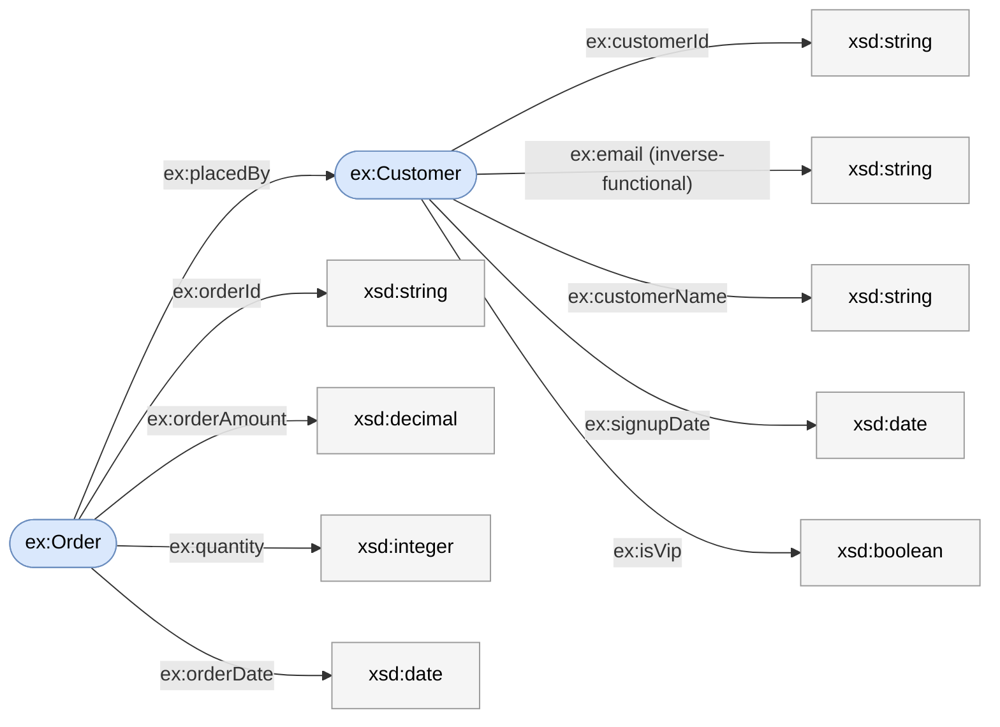

# Importing an OWL ontology

An OWL ontology and a semantic model share a backbone: **classes ≈ entities**,
**object properties ≈ relationships**, **datatype properties ≈ fields**. `kcmd`
does not learn a second format — it **converts OWL into a semantic model** once,
then the ontology rides the normal [`kcmd push` / `kcmd pull`](README.md)
workflow. The semantic model stays the single canonical form.

The converter maps the OWL constructs that have a clean BigQuery Graph shape to
**native** semantic-model fields — class → node, object property → edge,
datatype property → property, plus **class hierarchies** (`rdfs:subClassOf` →
entity `extends`, see [Class hierarchies](#class-hierarchies-rdfssubclassof))
and **property hierarchies** (`rdfs:subPropertyOf` between object properties →
relationship `extends`, see [Property
hierarchies](#property-hierarchies-rdfssubpropertyof)).
Import is **one-way and lossy by design**: constructs with no native
semantic-model home — the inverse /
equivalence / disjointness cross-references, the property characteristics, the
set-level axioms, and per-term annotations (`rdfs:seeAlso`, `owl:deprecated`, …)
— are **not imported**. The result is a clean semantic model, never an OWL
document wrapped in opaque metadata. What maps and what drops is listed in [How
each OWL construct maps](#how-each-owl-construct-maps) and
[Limitations](#limitations).

## 1. The OWL file

`sales.owl.ttl` — an ontology header, two classes with keys, datatype
properties across several `xsd` types, and one object property. Nothing here
needs an OWL reasoner:

```turtle
@prefix owl:  <http://www.w3.org/2002/07/owl#> .
@prefix rdfs: <http://www.w3.org/2000/01/rdf-schema#> .
@prefix skos: <http://www.w3.org/2004/02/skos/core#> .
@prefix xsd:  <http://www.w3.org/2001/XMLSchema#> .
@prefix ex:   <http://example.com/sales#> .

<http://example.com/sales> a owl:Ontology ;
    rdfs:label      "Sales domain" ;
    rdfs:comment    "A minimal sales domain: customers and the orders they place." ;
    skos:example    "How many orders did each customer place last month?" ;
    owl:versionInfo "1.0" .

ex:Customer a owl:Class ;
    rdfs:label    "Customer" ;
    rdfs:comment  "A person or organization that places orders." ;
    skos:altLabel "Buyer" ;
    owl:hasKey ( ex:customerId ) .

ex:Order a owl:Class ;
    rdfs:label   "Order" ;
    rdfs:comment "A purchase placed by a customer." ;
    owl:hasKey ( ex:orderId ) .

# customerId is the key; email uniquely identifies a customer
# (inverse-functional) so it becomes a unique-key constraint.
ex:customerId a owl:DatatypeProperty ;
    rdfs:domain ex:Customer ;
    rdfs:range xsd:string .
ex:email a owl:DatatypeProperty,
        owl:InverseFunctionalProperty ;
    rdfs:domain ex:Customer ;
    rdfs:range xsd:string ;
    rdfs:comment "The customer's unique email address." .
ex:customerName a owl:DatatypeProperty ;
    rdfs:domain ex:Customer ;
    rdfs:range xsd:string ;
    rdfs:label "name" .
ex:signupDate a owl:DatatypeProperty ;
    rdfs:domain ex:Customer ;
    rdfs:range xsd:date .
ex:isVip a owl:DatatypeProperty ;
    rdfs:domain ex:Customer ;
    rdfs:range xsd:boolean ;
    rdfs:comment "Whether the customer is in the loyalty program." .

ex:orderId a owl:DatatypeProperty ;
    rdfs:domain ex:Order ;
    rdfs:range xsd:string .
ex:orderAmount a owl:DatatypeProperty ;
    rdfs:domain ex:Order ;
    rdfs:range xsd:decimal ;
    skos:example "19.99" .
ex:quantity a owl:DatatypeProperty ;
    rdfs:domain ex:Order ;
    rdfs:range xsd:integer .
ex:orderDate a owl:DatatypeProperty ;
    rdfs:domain ex:Order ;
    rdfs:range xsd:date .

ex:placedBy a owl:ObjectProperty ;
    rdfs:domain ex:Order ;
    rdfs:range ex:Customer ;
    rdfs:label "placed by" ;
    rdfs:comment "Links an order to the customer who placed it." .
```

The same ontology as an RDF graph. Every arc is a triple: a class (the subject)
points through a property (the predicate) to its object. Each **datatype
property** points to its `xsd` range — a literal type, drawn as a plain box —
and becomes a field. The **object property** `ex:placedBy` points from one class
to another and becomes the relationship. The two classes become the datasets.


```mermaid
graph LR
    Customer(["ex:Customer"])
    Order(["ex:Order"])

    Order -- "ex:placedBy" --> Customer

    Customer -- "ex:customerId" --> cid["xsd:string"]
    Customer -- "ex:email (inverse-functional)" --> cem["xsd:string"]
    Customer -- "ex:customerName" --> cnm["xsd:string"]
    Customer -- "ex:signupDate" --> csd["xsd:date"]
    Customer -- "ex:isVip" --> civ["xsd:boolean"]

    Order -- "ex:orderId" --> oid["xsd:string"]
    Order -- "ex:orderAmount" --> oam["xsd:decimal"]
    Order -- "ex:quantity" --> oqt["xsd:integer"]
    Order -- "ex:orderDate" --> odt["xsd:date"]

    classDef cls fill:#dae8fc,stroke:#6c8ebf,color:#000;
    classDef lit fill:#f5f5f5,stroke:#999999,color:#000;
    class Customer,Order cls;
    class cid,cem,cnm,csd,civ,oid,oam,oqt,odt lit;
```

Classes (rounded) are the resources that become datasets; the `xsd` boxes are
literal types that become each field's `datatype`.

## 2. The command

```console
$ kcmd owl import sales.owl.ttl
converted 2 classes, 1 object property, 9 datatype properties
wrote catalog/EntryGroups/<entryGroup>/sales.yaml
```

The model name comes from the file (`sales.owl.ttl` → `sales`); pass `--name
<model>` to choose another. By default the
document is written into the semantic-model layout dir so the next `kcmd push`
picks it up; pass `--out <path>` to write it elsewhere. The output uses the
block layout shown below; pass `--compact` for the compact flow layout
(`primary_key: [id]`, inline `{ name, datatype }` field and relationship maps)
instead. Either way it is a purely **logical** model — `kcmd push` publishes it
to Knowledge Catalog as-is, while a BigQuery or Spanner Graph deploy needs each
relationship's join columns added to the model plus a [binding
profile](profiles.md) (see [§4](#4-going-from-ontology-to-a-running-graph-binding)).

### Importing a modular ontology (several files)

A larger ontology is usually split into modules — a shared upper module plus one
module per domain — that refer to each other's terms. Give them all to one
import and they become **one** model:

```console
$ kcmd owl import core.ttl commercial.ttl finance.ttl --name ps_commercial
converted 24 classes, 18 object properties, 61 datatype properties
wrote catalog/EntryGroups/<entryGroup>/ps_commercial.yaml
```

The files are merged before anything is mapped (an RDF merge: each file keeps
its own `@prefix` scope, and blank nodes never collide across files), so every
rule on this page applies to the union:

- **Cross-file references resolve.** `com:ClientAccount rdfs:subClassOf
  core:Party`, a datatype property in one module whose `rdfs:domain` is a class
  in another, an edge whose `rdfs:range` lives elsewhere — all map as if they
  were in one file.
- **Order is the argument order.** Entities and fields appear in declaration
  order across the files as given, so a stable command line gives a stable
  document.
- **The first file's `owl:Ontology` header describes the model** (its
  description, labels, examples, version). A later module's header describes a
  dependency, not the model.
- **The model name** is `--name`, else the first file's stem.
- **The base namespace** (named in the description only when the header has
  none) is the one shared by most terms across all the files.

**`owl:imports`.** A module that imports another by IRI can be imported alone —
the dependency is followed to a **local file only**, never fetched:

```turtle
<https://example.org/ontology/commercial> a owl:Ontology ;
    owl:imports <https://example.org/ontology/core> .
```

```console
$ kcmd owl import commercial.ttl
following owl:imports: core.ttl
converted ...
```

An import is satisfied by a file already on the command line whose
`owl:Ontology` IRI is the imported one, or else by a file **beside the importing
file** named after the IRI's last segment (`core`, `core.ttl`, `core.owl.ttl`;
a `file:` IRI names its file directly) — accepted only when that file's own
`owl:Ontology` IRI matches (ignoring a trailing `#`/`/`). Imports are followed
transitively. An import that resolves to no such file is **warned and
skipped**; pass the file on the command line to include it.

## 3. The semantic model it produces — `sales.yaml`

The `Customer` dataset and the `placedBy` edge (the `Order` dataset follows the
same shape). The structure, keys, and values are exactly what the converter
emits; the inline `#` comments are annotations added here for the walkthrough —
the real output has none:

```yaml
version: 0.2.0.dev0/google
semantic_model:
  - name: sales
    description: "A minimal sales domain: customers and the orders they place.
      (ontology version 1.0)"
    ai_context:
      synonyms:
        - Sales domain
      examples:
        - How many orders did each customer place last month?
    entities:
      - name: Customer                   # no source: a logical entity
        primary_key:
          - customerId                   # from owl:hasKey
        unique_keys:
          - - email                      # from the inverse-functional property
        description: A person or organization that places orders.
        ai_context:
          synonyms:
            - Buyer
        fields:
          - name: customerId             # no expression: a logical field
            datatype: String
          - name: email
            datatype: String
            description: The customer's unique email address.
          - name: customerName
            datatype: String
            label: name
          - name: signupDate
            datatype: Date
            dimension:
              is_time: true              # a temporal field is a time dimension
          - name: isVip
            datatype: Boolean
            description: Whether the customer is in the loyalty program.
      # ... Order dataset: orderId, orderAmount, quantity, orderDate ...
    relationships:
      - name: placedBy
        from: Order                      # logical edge: direction only, no columns
        to: Customer
        ai_context:
          instructions: Links an order to the customer who placed it.
```

This is a purely **logical model**: an ontology declares meaning, not physical
tables, so entities carry no `source`, fields no `expression`, and relationships
no join columns. Before a graph deploy a [binding profile](profiles.md) supplies
the sources and field expressions, and you add each edge's join columns to the
model (they are logical, not a binding). The output carries no term IRIs and no
`custom_extensions`: a term's identity is its name, so a cleanly-mapped construct
needs nothing more. One kind of ontology goes further — a **class hierarchy**
(`rdfs:subClassOf`), shown next as an extension of *this same sales domain* (see
[Class hierarchies](#class-hierarchies-rdfssubclassof)). Everything OWL can say
that the semantic model cannot is **dropped on import**, not carried.

The source namespace is recorded only as a human-readable fallback: when the
ontology header has no comment of its own, the model `description` names the base
IRI it was imported from. This ontology has a header comment, so the namespace
appears nowhere above.

### How each OWL construct maps

| OWL | Semantic model | Notes |
|---|---|---|
| `owl:Ontology` header | model `description`, `ai_context`, version | comment → `description`; labels → `ai_context.synonyms`; `skos:example` → `ai_context.examples`; `owl:versionInfo` → appended to `description` |
| `owl:Class` | `datasets[]` entry | a logical entity — **no `source`** (a binding profile adds one before a graph deploy) |
| `owl:DatatypeProperty` | `fields[]` on **each** domain's dataset | a property with several `rdfs:domain` values lands on each; a logical field — **no `expression`** (a binding profile maps it to a column) |
| `owl:ObjectProperty` | `relationships[]` | `from` = domain, `to` = range; a **logical edge with no join columns** (you add `from_columns`/`to_columns` to the model before a graph deploy, see [binding](#4-going-from-ontology-to-a-running-graph-binding)); with several `rdfs:domain`/`rdfs:range` values only the first of each is kept (a relationship is one source → one destination) and the rest are warned |
| `owl:inverseOf` | relationship `inverse` | the pair becomes **one** relationship whose `inverse:` names the reverse reading — never two edges (see [Inverse properties](#inverse-properties-owlinverseof)); a graph deploy emits it as a second edge label over the same backing table |
| `rdfs:subClassOf` (named superclass) | dataset `extends[]` | records the parent(s) in document order (see [Class hierarchies](#class-hierarchies-rdfssubclassof)) |
| `rdfs:subPropertyOf` (object property → object property) | relationship `extends[]`; the parent gets `abstract: true` | the super-property becomes an **abstract relationship** (a shared edge label, no edge table); a super-property missing `rdfs:domain`/`rdfs:range` takes the nearest common superclass of its sub-properties' ends (see [Property hierarchies](#property-hierarchies-rdfssubpropertyof)) |
| `owl:Restriction` via `rdfs:subClassOf` / `owl:equivalentClass` (cardinality, `someValuesFrom`, `allValuesFrom`, `hasValue`) | model `constraints[]` | a judged rule about the class's relationship (or a relationship's inverse name, read backwards) or field, e.g. `Opportunity_hasBuyer_exactly_1`, `Opportunity_governedBy_max_1`; see [Rules (restrictions, functional properties, disjointness)](#rules-restrictions-functional-properties-disjointness) |
| `owl:intersectionOf` on a class's `owl:equivalentClass` / `rdfs:subClassOf` | `extends[]` + model `constraints[]` | `C ≡ D ⊓ ∃p.X`: named conjunct `D` → `extends`, restriction conjunct → a constraint on `C`; union / complement conjuncts dropped |
| `owl:FunctionalProperty` on an object property | model `constraints[]` | `<Domain>_<prop>_functional` — at most one edge per source; on a datatype property it is dropped (a field already holds one value) |
| `owl:disjointWith`, `owl:AllDisjointClasses` | model `constraints[]` | `A_disjoint_B`, `A_B_C_disjoint` — no instance is more than one of the classes |
| `owl:equivalentClass` / `owl:equivalentProperty` (named term) | `ai_context.synonyms` | the equivalent term's local name and its in-document `rdfs:label`, so NL search resolves either vocabulary to this term; not added when equal to the term's own name (or a field's `label`). See [Semantic annotations](#semantic-annotations-equivalence-deprecation-transitivity) |
| `owl:deprecated true` (+ `rdfs:seeAlso` replacement) | `description` prefix `DEPRECATED:` + `ai_context.instructions` | on an entity/field the description is prefixed; every deprecated term gets an instruction "do not use it in new queries or writes", naming the replacement when an `rdfs:seeAlso` points at an in-model term of the same kind |
| `owl:TransitiveProperty` / `owl:SymmetricProperty` (object property) | relationship `ai_context.instructions` | a query hint: transitive → a bounded quantified path `-[:rel]->{1,10}`; symmetric → an undirected match `-[:rel]-` |
| `owl:oneOf`, `owl:propertyDisjointWith`, `owl:propertyChainAxiom`, `owl:AllDisjointProperties`, `owl:AllDifferent`, the other property characteristics, `rdfs:subPropertyOf` between datatype properties, `rdfs:isDefinedBy`, `owl:versionInfo` on a term, `rdfs:seeAlso` other than a deprecation replacement | *(dropped)* | **no native home** — not imported (see [Limitations](#limitations)) |
| `rdfs:range xsd:*` | field `datatype` | see [Datatypes](#datatypes-rdfsrange) |
| `owl:hasKey ( ... )` | dataset `primary_key` | single or composite, in list order |
| `owl:InverseFunctionalProperty` | dataset `unique_keys` | a uniquely-identifying property; omitted when it is already the `primary_key`; a lone one on a keyless class is promoted to `primary_key` instead |
| `rdfs:label` on a datatype property | field `label` | the field's display name (a `label` slot exists only on fields); dropped when it only respaces/recases the name |
| `rdfs:label` on a class / object property | `ai_context.synonyms` | no `label` slot there, so a distinct label becomes an alternate name; dropped when redundant with the name |
| extra `rdfs:label` / `skos:altLabel` / `prefLabel` / `hiddenLabel` | `ai_context.synonyms` | genuinely alternate names; feed NL search |
| `skos:example` | `ai_context.examples` | sample questions / values |
| `rdfs:comment`, `skos:definition`, `dcterms:`/`dc:description` | `description` | first present wins, in that order; on an object property (which has no `description` slot) the comment rides in `ai_context.instructions` |
| term IRIs, `@prefix` | dropped (base IRI named in `description` **only when the header has no comment of its own**) | a term's identity is its local name; the source namespace is not otherwise carried |

A datatype property whose domain is not a class, or an object property missing an
endpoint, cannot be placed; it is **skipped with a warning** rather than failing
the whole import. An object property that declares *more than one* `rdfs:domain`
or `rdfs:range` is kept — a relationship maps one source to one destination, so
the first of each is used and the extra endpoints are dropped with a warning
(unlike a multi-domain *datatype* property, which lands on every domain).

### Datatypes (`rdfs:range`)

`rdfs:range` sets a field's logical `datatype`. Physical width is not carried (it
belongs to the bound table, not the ontology), so several `xsd` types collapse
onto one logical type:

| `xsd` range | `datatype` |
|---|---|
| `string`, `normalizedString`, `token`, `anyURI`, `language`, `Name`, `NCName` | `String` |
| `integer`, `int`, `long`, `short`, `byte`, `nonNegativeInteger`, `positiveInteger`, `unsignedInt`, … (any width/sign) | `Integer` |
| `decimal` | `Decimal` |
| `float`, `double` | `Float` |
| `boolean` | `Boolean` |
| `date` | `Date` |
| `time` | `Time` |
| `dateTime` | `DateTime` |
| `dateTimeStamp` | `DateTimeTz` |
| anything else, or no `rdfs:range` | `Opaque` |

A temporal field (`Date` / `Time` / `DateTime` / `DateTimeTz`) is additionally
marked a **time dimension** (`dimension: { is_time: true }`), so downstream
BigQuery Graph / BI treats it as one.

### Keys (`owl:hasKey`, `owl:InverseFunctionalProperty`)

- **`owl:hasKey ( ... )`** on a class becomes the dataset's `primary_key` (its
  grain), in list order — single or composite. If any key column names no
  datatype property on the class (undeclared, or declared only on another class)
  it has no field to back it; because keeping only the columns that do exist
  would silently narrow a composite key to a possibly non-unique one, the
  **entire `primary_key` is dropped** with a warning rather than left to fail
  later at graph generation.
- An **`owl:InverseFunctionalProperty`** (a datatype property that uniquely
  identifies its subject) becomes a `unique_keys` constraint — unless it is
  already the `primary_key`, in which case it is not repeated. If a class
  declares **no `owl:hasKey`** but has exactly **one** single-column
  inverse-functional property, that property is promoted to the `primary_key`
  (with a warning) so the dataset has a grain; ambiguous cases (several unique
  keys, or a composite one) are left without a `primary_key`.

Keys are **logical grain**, not a binding — they are the entity's identity, so
they come across even though the model has no physical binding. They also tell
you which columns an edge's `to_columns` must reference when you add join columns
to the model; see [binding](#4-going-from-ontology-to-a-running-graph-binding).

### Class hierarchies (`rdfs:subClassOf`)

`rdfs:subClassOf` maps to a dataset's `extends` — the one keyword borrowed from
[Ossie's ontology proposal](https://github.com/apache/ossie/blob/main/ontology/ontology.md)
onto our existing `datasets`. Extend the sales domain with a `Person` base class
that `Customer` refines (`Customer rdfs:subClassOf Person`):

```turtle
ex:Person a owl:Class ;
    rdfs:comment "A human being." .
ex:fullName a owl:DatatypeProperty ;
    rdfs:domain ex:Person ;
    rdfs:range xsd:string .

ex:Customer a owl:Class ;
    rdfs:subClassOf ex:Person ;
    rdfs:comment "A person or organization that places orders." ;
    owl:hasKey ( ex:customerId ) .
# ... Customer's own datatype properties: customerId, email, customerName, … ...
```

the `Person` and `Customer` entities come out as (`Customer` carrying
`extends: [Person]`):

```yaml
  # Person is its own entity:
  - name: Person
    description: A human being.
    fields:
      - name: fullName
        datatype: String
  # Customer records that it extends Person and keeps ONLY its own fields;
  # Person's fullName is NOT flattened down.
  - name: Customer
    extends:
      - Person
    primary_key:
      - customerId
    description: A person or organization that places orders.
    fields:
      - name: customerId
        datatype: String
      # ... email, customerName, signupDate, isVip (Customer's own) ...
```

Multiple superclasses are allowed (`extends: [Person, Employee]`, in document
order). A `subClassOf` whose object is a blank-node axiom is not a named class, so
it never becomes `extends` by itself: an `owl:Restriction` there becomes a
[constraint](#rules-restrictions-functional-properties-disjointness) instead,
and an `owl:intersectionOf` is read conjunct by conjunct — its named classes
join `extends` (as do those of an intersection given as `owl:equivalentClass`:
every `C ≡ D ⊓ …` is a `D`) and its restrictions become constraints. Any other
class expression is ignored. The implicit universal superclasses
`owl:Thing` / `rdfs:Resource` are ignored too (every class subclasses them, so
they carry no inheritance information).

Two boundaries to be clear about:

- **The import *records* the hierarchy; the BigQuery push *resolves* it.** The
  importer writes `Customer` with `extends: [Person]` and **only its own fields**.
  A **BigQuery** push then resolves that inheritance: it emits a `LABEL Person`
  clause on the `Customer` node table and flattens `Person`'s fields down (fields
  flow down; edges do not) — see [Class hierarchies (`extends` →
  labels)](reference.md#class-hierarchies-extends--labels). The **Knowledge Catalog** push
  publishes each entry with exactly the fields it declares and records the
  hierarchy as a `Specializes: Person.` paragraph on the subtype's entry (see
  [Class hierarchies on the catalog](reference.md#class-hierarchies-on-the-catalog)).
- **Relationships have their own hierarchy.** Entity `extends` never makes an
  edge inherit anything; property inheritance is a separate mapping, below.

### Property hierarchies (`rdfs:subPropertyOf`)

`rdfs:subPropertyOf` between two object properties maps to relationship
`extends` (a `/google` extension, see [Relationship
inheritance](inheritance.md#relationship-inheritance)). The super-property
becomes an **abstract relationship**: it keeps its `from`/`to` (so it still says
what it connects) but binds no join columns and deploys no edge table. Each
sub-property is an ordinary relationship that names it:

```turtle
ex:hasCounterparty a owl:ObjectProperty ;
    rdfs:domain ex:CommercialDocument ; rdfs:range ex:Organization .
ex:hasBuyer a owl:ObjectProperty ; rdfs:subPropertyOf ex:hasCounterparty ;
    rdfs:domain ex:Opportunity ; rdfs:range ex:Client .
ex:hasPayer a owl:ObjectProperty ; rdfs:subPropertyOf ex:hasCounterparty ;
    rdfs:domain ex:Invoice ; rdfs:range ex:Organization .
```

```yaml
relationships:
  - name: hasCounterparty
    from: CommercialDocument
    to: Organization
    abstract: true            # a shared edge label, no edge table
  - name: hasBuyer
    from: Opportunity
    to: Client
    extends: [hasCounterparty]
  - name: hasPayer
    from: Invoice
    to: Organization
    extends: [hasCounterparty]
```

On a graph push each concrete edge table carries `LABEL hasCounterparty NO
PROPERTIES`, so `MATCH (d)-[:hasCounterparty]->(o)` spans both edge tables —
the downstream effect `rdfs:subPropertyOf` means.

- **Inferred ends.** Super-properties are often declared with only a range (or
  nothing): `belongsToTerritory` in the fixture has `rdfs:range OrgUnit` and no
  domain. A relationship needs both ends, so the importer takes the **nearest
  common superclass** of the missing end across the super-property's
  sub-properties (direct and transitive), and says so in a warning. When the
  sub-properties' ends share no superclass the super-property cannot be placed:
  it is skipped with a warning, and its sub-properties keep their edge without
  the dangling `extends`. With a single sub-property the inferred end is that
  sub-property's own end.
- **Only object properties.** `rdfs:subPropertyOf` between datatype properties
  has no native home (fields do not inherit from fields) and is dropped.
- **Endpoints should narrow.** A sub-relationship's `from`/`to` should be its
  parent's or a subtype of them (per entity `extends`); the loader warns when
  they are not, since a match on the parent label would then return edges
  outside its declared ends.

### Rules (restrictions, functional properties, disjointness)

Some OWL axioms state a **rule** rather than a shape: *every opportunity has
exactly one buyer*, *a contract is governed by at most one MSA*, *no
opportunity is both won and lost*. Each becomes a native model-level
[constraint](actions.md#2-gate-it-with-a-constraint). Knowledge Catalog publishes it as a
governed entry that an agent can read, and an action that lists it in `guards`
is refused when its write would break the rule.

```turtle
ex:Opportunity rdfs:subClassOf [ a owl:Restriction ;
    owl:onProperty ex:hasBuyer ;
    owl:qualifiedCardinality "1"^^xsd:nonNegativeInteger ;
    owl:onClass ex:ClientAccount ;
    kcmd:onViolation "reject" ; kcmd:severity "high" ] .
ex:WonOpportunity owl:disjointWith ex:LostOpportunity .
```

imports as:

```yaml
    constraints:
      - name: Opportunity_hasBuyer_exactly_1
        judgment: Each Opportunity has exactly one hasBuyer relationship to a
          ClientAccount. An Opportunity with no hasBuyer relationship to a
          ClientAccount, or with more than one, does not satisfy this rule.
        description: "Link each Opportunity to exactly one ClientAccount through
          hasBuyer. (From OWL: Opportunity SubClassOf hasBuyer exactly 1
          ClientAccount.)"
        on_violation: reject
        severity: high
      - name: WonOpportunity_disjoint_LostOpportunity
        judgment: No WonOpportunity is also a LostOpportunity. An instance that is both
          a WonOpportunity and a LostOpportunity does not satisfy this rule.
        description: "Classify it as a WonOpportunity or a LostOpportunity, not both.
          (From OWL: WonOpportunity DisjointWith LostOpportunity.)"
        on_violation: warn
```

| OWL axiom on class `C`, property `p` | Constraint name | Rule |
|---|---|---|
| `owl:cardinality` / `owl:qualifiedCardinality N` on a relationship | `C_p_exactly_N` | exactly N `p` edges (to the `owl:onClass` filler, or to `p`'s range) |
| `owl:minCardinality` / `owl:minQualifiedCardinality N` | `C_p_min_N` | at least N edges |
| `owl:maxCardinality` / `owl:maxQualifiedCardinality N` | `C_p_max_N` | at most N edges |
| `owl:someValuesFrom X` | `C_p_some_X` | at least one edge to an `X` |
| `owl:allValuesFrom X` (`X` narrower than `p`'s range) | `C_p_only_X` | every `p` edge ends at an `X` |
| `owl:hasValue v` | `C_p_value_v` | an edge to `v` (relationship) or `C.p` equals `v` (field) |
| min/exact 1 or `someValuesFrom` on a **field** | `C_p_required` | `C.p` is never null |
| max/exact 0 on a field | `C_p_empty` | `C.p` is always null |
| `p a owl:FunctionalProperty` (object property) | `D_p_functional` | at most one `p` edge per source `D` |
| `A owl:disjointWith B` | `A_disjoint_B` | nothing is both an `A` and a `B` |
| `[] a owl:AllDisjointClasses ; owl:members (A B C)` | `A_B_C_disjoint` | nothing is more than one of them |

Details:

- **Where the restriction can sit.** As a blank-node `rdfs:subClassOf` object,
  as a lone `owl:Restriction` given as `owl:equivalentClass`, or as a conjunct
  of an `owl:intersectionOf` in either position (see *Intersections* below).
- **Resolving `p`.** `p` must be a relationship that starts at `C` or at one of
  its supertypes, a relationship's **inverse name** (see *Through an inverse*
  below), or a field of `C` or of one of its supertypes. The judgment names a
  field model-qualified (`Opportunity.opportunityId`), so constraint validation
  checks the reference.
- **Through an inverse.** An `X owl:inverseOf Y` property with no domain or
  range of its own is folded into `inverse: X` on relationship `Y` (see
  [Inverse properties](#inverse-properties-owlinverseof)), and a restriction on
  `X` is a rule about that same `Y` edge read backwards. `C` must be `Y`'s
  destination (or a subtype of it); the filler narrows `Y`'s **source**. The
  constraint keeps the axiom's name and its text names the forward edge:

  ```turtle
  ex:contractFor rdfs:domain ex:ContractAgreement ; rdfs:range ex:Opportunity ;
      owl:inverseOf ex:governedBy .
  ex:Opportunity rdfs:subClassOf [ a owl:Restriction ;
      owl:onProperty ex:governedBy ;
      owl:maxQualifiedCardinality "1"^^xsd:nonNegativeInteger ;
      owl:onClass ex:ContractAgreement ] .
  ```

  ```yaml
      - name: Opportunity_governedBy_max_1
        judgment: Each Opportunity is linked from at most one ContractAgreement
          via contractFor (governedBy is contractFor read backwards). An
          Opportunity linked from more than one does not satisfy this rule.
        description: "Link each Opportunity from at most one ContractAgreement
          through contractFor. (From OWL: Opportunity SubClassOf governedBy max
          1 ContractAgreement.)"
        on_violation: warn
  ```

  Every kind in the table maps the same way (`C_p_exactly_N`, `C_p_min_N`,
  `C_p_some_X`, `C_p_only_X`, `C_p_value_v`); an `allValuesFrom` naming `Y`'s
  own source is dropped, and a `FunctionalProperty` on `Y` is not treated as
  covering an inverse max 1 (it bounds the other direction).
- **Intersections.** A defined class `C ≡ D ⊓ ∃p.X` (`owl:equivalentClass [ a
  owl:Class ; owl:intersectionOf ( ex:D [ a owl:Restriction ; … ] ) ]`) is read
  conjunct by conjunct: each restriction conjunct becomes a constraint on `C`
  exactly as if stated alone, and each named conjunct `D` is added to `C`'s
  `extends` (deduped against its `rdfs:subClassOf`), since every `C` is a `D`.
  Nested intersections are flattened; a `unionOf` / `complementOf` conjunct
  is dropped silently (it states no rule every `C` must satisfy on its own).
  The provenance shows the whole axiom: `(From OWL: QAAssuredEngagement
  EquivalentTo Engagement and (hasHealthCheck some QAHealthCheck).)`. The
  constraint states the necessary direction only (every `C` satisfies the
  restriction); the "and conversely" half of `≡` — classifying any such `D`
  as a `C` — has no native construct and is not imported.
- **What is dropped silently.** Anything the semantic model already guarantees
  by construction:
  - a field's max N ≥ 1, `allValuesFrom`, and `FunctionalProperty` (a field
    holds one value);
  - an `allValuesFrom` naming `p`'s own range (an edge always ends at its
    declared destination);
  - `min 0`;
  - a pairwise `disjointWith` already covered by an `owl:AllDisjointClasses`
    set;
  - a `FunctionalProperty` already bounded by a max/exact 1 restriction on the
    same edge.
- **What is warned and skipped.**
  - an anonymous filler (e.g. `someValuesFrom [ owl:intersectionOf … ]`);
  - a `p` that resolves to neither a relationship (or a relationship's
    inverse) nor a field of `C`;
  - an edge that does not start at `C`, or — for an inverse name — does not
    end at `C`;
  - a field minimum above one;
  - a class not in the model.
- **Enforcement.** OWL says what must hold, but not what a violation does or
  how grave it is. Two optional annotation properties in the kcmd namespace
  (`@prefix kcmd: <https://kcmd.dev/ns#>`) supply both:
  - `kcmd:onViolation` takes `"reject"`, `"escalate"` or `"warn"`;
  - `kcmd:severity` takes `"critical"`, `"high"`, `"medium"` or `"low"`.

  Put them on the restriction node, the class, the property, or the
  `owl:AllDisjointClasses` node. For each of the two annotations, the most
  specific one wins: restriction, then class, then property. Without an
  annotation, `on_violation` is `warn` (an imported rule informs until someone
  decides it should block) and there is no `severity`. An invalid value is
  warned and ignored.
- **Description.** It is the violation message: an `rdfs:comment` on the
  restriction node if there is one, otherwise a generated instruction. Either
  way it ends with the source axiom in Manchester-like syntax.
- **Order and names.** Constraints come out in a fixed order:
  1. each class's restrictions, in class order;
  2. functional properties;
  3. disjoint pairs;
  4. disjoint sets.

  Names are sanitized to letters, digits and `_`, and made unique with a `_2`
  suffix when needed.

### Semantic annotations (equivalence, deprecation, transitivity)

Some OWL facts have no structural slot but real value for a consumer — an NL
agent choosing which term to query, or a person writing GQL. They map onto the
model's native `ai_context` (and, for deprecation, `description`), which the
Knowledge Catalog push publishes and agents read:

```turtle
ex:Client a owl:Class ;
    owl:equivalentClass ex:Customer ;           # a named, in-model class
    owl:deprecated true ;
    rdfs:seeAlso ex:Customer .                  # the replacement
ex:Customer a owl:Class ; rdfs:label "Customer" .
ex:reportsTo a owl:ObjectProperty, owl:TransitiveProperty ;
    rdfs:domain ex:Employee ; rdfs:range ex:Employee .
```

```yaml
  - name: Client
    description: DEPRECATED.
    ai_context:
      instructions: "Client is deprecated: do not use it in new queries or writes. Use Customer instead."
      synonyms: [Customer]
  # ...
relationships:
  - name: reportsTo
    from: Employee
    to: Employee
    ai_context:
      instructions: "reportsTo is transitive: if a reportsTo b and b reportsTo c, then a reportsTo c, but only the direct edges are stored. To follow it, match a quantified path, e.g. MATCH (a:Employee)-[:reportsTo]->{1,10}(b:Employee) (raise the upper bound for deeper chains)."
```

- **Equivalence** (`owl:equivalentClass` / `owl:equivalentProperty` naming a
  term, in or out of the model) adds that term's local name — and its
  `rdfs:label`, when it is declared in the imported document — to the term's
  `ai_context.synonyms`. A synonym equal to the term's own name (e.g. `ex:Person
  owl:equivalentClass foaf:Person`) or to a field's `label` is not repeated. An
  anonymous class expression is not a named term and adds nothing.
- **Deprecation** (`owl:deprecated true`) prefixes an entity's or field's
  `description` with `DEPRECATED:` (just `DEPRECATED.` when it has none) and
  adds an instruction telling an agent not to use the term in new queries or
  writes. A relationship has no `description`, so it gets the instruction only.
  When the term's `rdfs:seeAlso` names an in-model term of the same kind (class
  → entity, property → field/relationship) the instruction names it as the
  replacement (`Use Customer instead.`, or `Use Person.fullName instead.` for a
  field); any other `seeAlso` is dropped.
- **Transitive / symmetric** object properties get a query hint on the
  relationship: a bounded quantified path (`-[:rel]->{1,10}`) for a transitive
  one, since only direct edges are stored, and an undirected match (`-[:rel]-`)
  for a symmetric one, since each pair may be stored in one direction only.

Instructions from several sources (an object property's `rdfs:comment`,
deprecation, a characteristic) are joined with a blank line, comment first.

### Inverse properties (`owl:inverseOf`)

`X owl:inverseOf Y` says X is Y **read backwards** — the same links, traversed
from the other end. The semantic model says exactly that with the
relationship's `inverse:` key, so the pair becomes **one** relationship, never
two (two relationships would deploy as two unrelated edges that a query could
see disagree):

```turtle
ex:placedBy a owl:ObjectProperty ;
    rdfs:domain ex:Order ; rdfs:range ex:Customer .
ex:places a owl:ObjectProperty ;
    owl:inverseOf ex:placedBy .          # no domain / range of its own
```

```yaml
relationships:
  - name: placedBy
    from: Order
    to: Customer
    inverse: places                      # Customer -[places]-> Order
```

Which side becomes the relationship:

- A side with **no `rdfs:domain` / `rdfs:range` of its own** folds into the
  side that has them — the common pattern where an ontology declares only
  `X owl:inverseOf Y` and lets the ends follow from Y.
- When **both** declare ends, they must mirror (X's domain is Y's range and
  vice versa); then the side stating `owl:inverseOf` folds into its referent.
  Ends that do **not** mirror are not one edge read two ways: both are kept as
  separate relationships, with a warning.
- A referent the ontology never declares as a property but that lies in its
  own namespace (`ex:placedBy owl:inverseOf ex:places`, no `ex:places`
  declaration) is still the name of the reverse reading, so it becomes
  `inverse: places` as-is. An external referent is warned and ignored.
- A relationship carries one inverse: an extra `owl:inverseOf` is warned and
  ignored (first wins), and an inverse name that collides with an entity or
  relationship name is dropped with a warning (graph labels share one
  namespace).

On a **BigQuery / Spanner Graph** deploy the inverse becomes a second edge table
over the **same** backing table with `SOURCE` / `DESTINATION` swapped, so both
`MATCH (o:Order)-[:placedBy]->(c:Customer)` and
`MATCH (c:Customer)-[:places]->(o:Order)` work with no data duplicated. On a
**Knowledge Catalog** push the inverse rides in the link's description as an
`Inverse: places.` trailer, which pull reads back (see [Relationship
inverses](reference.md#relationship-inverses-inverse)).

## 4. Going from ontology to a running graph (binding)

The import gives you a **logical model**: what the domain means, with no physical
binding. That is directly useful — `kcmd push` publishes it to
Knowledge Catalog as-is, so the ontology becomes catalog metadata (entities,
fields, and keys) with nothing more to fill in:

```console
$ kcmd push                  # publishes the logical model to Knowledge Catalog
```

A relationship publishes as a catalog link only once it has join columns (added
to the model, below); a column-less edge is skipped with a warning, so the
entities and fields still publish while the edge waits.

A **BigQuery or Spanner Graph** deploy needs two things the import leaves open,
and they belong in different places:

1. **The join columns on each edge — in the model.** The import gives every
   relationship its endpoints (`from`/`to`) but no join columns; which columns an
   edge joins on is a *logical* fact the model owns, not a physical binding, so
   you add it to the imported model itself. The keys the import already recovered
   (`primary_key`, `unique_keys`) tell you which columns an edge's `to_columns`
   must reference:

   ```yaml
   # sales.yaml — add the join columns to the imported relationship
   relationships:
     - name: placedBy
       from: Order
       to: Customer
       from_columns: [o_custkey]   # the Order-side foreign key
       to_columns: [customerId]    # Customer's key column
   ```

2. **The physical binding — in a profile.** Which table each entity reads, which
   column each field reads, and the deployment target go in a
   [binding profile](profiles.md): a document in the same schema, kept beside the
   model as `<model>.profiles/<name>.yaml`, that adds *only* the binding and
   leaves the logical model untouched. A profile may set `source`, field
   `expression`, and `deployment_target` — nothing logical (a `relationships`
   block in a profile is rejected). A field the profile does not bind is left
   unbound; there is no separate flag. The model and the profile merge by name at
   push time:

   ```yaml
   # sales.profiles/warehouse.yaml — physical binding for the sales model
   version: 0.2.0.dev0/google
   semantic_model:
     - name: sales
       deployment_target: //bigquery.googleapis.com/projects/myproj/datasets/sales/propertyGraphs/sales
       datasets:
         - name: Customer
           source: //bigquery.googleapis.com/projects/myproj/datasets/sales/tables/customers
           fields:
             - { name: customerId, expression: c_custkey }
             - { name: email,      expression: c_email }
             # ... the remaining Customer fields ...
         - name: Order
           source: //bigquery.googleapis.com/projects/myproj/datasets/sales/tables/orders
           fields:
             - { name: orderId, expression: o_orderkey }
             # ... the remaining Order fields ...
   ```

   **Binding an imported hierarchy.** The import writes a subclass with only its
   own fields plus `extends`, so a field declared on a superclass lives only on
   the superclass. Bind it on each concrete subclass anyway, by the subclass's
   name — the profile accepts a field the entity inherits through `extends`
   (transitively) exactly like one it declares. A superclass with no table of
   its own is marked `abstract: true` in the model (a concrete entity must have a
   `source`), and the profile binds nothing on it:

   ```yaml
   # model: Person is abstract and declares fullName; Customer extends [Person]
   datasets:
     - name: Customer
       source: //bigquery.googleapis.com/projects/myproj/datasets/sales/tables/customers
       fields:
         - { name: customerId, expression: c_custkey }
         - { name: fullName,   expression: c_name }   # inherited from Person
   ```

   The graph then reads `c_name` both for `Customer`'s own label and for the
   `LABEL Person` clause on the `customers` node table. An inherited field left
   out of the profile is unbound, like any other.

With the join columns in the model and the profile in place, a single push
deploys the graph:

```console
$ kcmd push --profile warehouse   # merges the binding, then CREATE OR REPLACE PROPERTY GRAPH + KC entries
```

See [One logical model, many physical bindings](profiles.md) for the full profile
contract — what a profile may and may not set, how merge and prune work, and how
one logical model binds to several stores.

## Limitations

Three different situations hide in "not covered": constructs already read but not
yet resolved all the way downstream, constructs not read but reachable next, and
constructs out of scope.

**Read now — only downstream resolution is pending.** The **class hierarchy**
(`rdfs:subClassOf`) maps to entity `extends` (see [Class
hierarchies](#class-hierarchies-rdfssubclassof)); the importer handles it today
and the remaining work is downstream, not in the import:

- **BigQuery** push resolves it into node-table labels, inherited fields
  flattened down (see [Class hierarchies (`extends` →
  labels)](reference.md#class-hierarchies-extends--labels)).
- **Knowledge Catalog** records it as a `Specializes:` paragraph on each
  subtype entry, restored on pull; each entry still lists only its own fields.

**Not imported — dropped.** OWL can state things the semantic model has no native
slot for. The importer reads them but does **not** carry them (an earlier version
rode them along as `custom_extensions`; that was removed so an imported model is a
clean semantic model). To keep any of these, model them natively after import.
Dropped:

- **Datatype-property inheritance** — `rdfs:subPropertyOf` between datatype
  properties (between object properties it maps to relationship `extends`).
- **Cross-references** — `owl:propertyDisjointWith`.
  (`owl:equivalentClass` / `owl:equivalentProperty` to a named term are
  imported as synonyms — see [Semantic
  annotations](#semantic-annotations-equivalence-deprecation-transitivity);
  `owl:disjointWith` becomes a constraint; `owl:inverseOf` becomes a
  relationship `inverse` — only the inverse property's own label / comment is
  not carried, since the inverse is a name, not a second relationship.)
- **Property characteristics** — reflexive / irreflexive / asymmetric, and
  functional on a *datatype* property (functional on an object property becomes
  a constraint; transitive and symmetric become relationship query hints).
- **Enumerations** (`owl:oneOf`) and **property chains**
  (`owl:propertyChainAxiom`).
- **Set-level axioms** — `owl:AllDisjointProperties`, `owl:AllDifferent`
  (`owl:AllDisjointClasses` becomes a constraint).
- **Per-term annotations** — `rdfs:isDefinedBy`, `owl:versionInfo`, and
  `rdfs:seeAlso` except as a deprecation replacement. (`owl:deprecated` is
  imported as a description prefix and instruction.)

**Not read — out of scope.** Richer OWL/RDF beyond the schema-shaped subset this
converter targets:

- SHACL shapes in the ontology files (import them separately with
  [`kcmd shacl import`](shacl-import.md)), class expressions (`owl:unionOf` /
  `owl:complementOf` / `owl:oneOf`, and a restriction whose filler is itself
  anonymous), individuals (A-box instances), and `owl:sameAs` /
  `owl:differentFrom` (which relate individuals). Only **named** (IRI) classes
  and properties become entities, fields, and relationships: an anonymous class
  expression is never an entity and does not count in the import summary. The
  one class expression that IS read is `owl:intersectionOf` on a class's
  `owl:equivalentClass` / `rdfs:subClassOf` — the form Protégé emits for a
  defined class — and only its conjuncts: a restriction conjunct becomes a
  constraint and a named conjunct becomes `extends` (see
  [Intersections](#rules-restrictions-functional-properties-disjointness)). A
  union / complement conjunct inside it is dropped, as are typed
  `[ a rdfs:Datatype ; ... ]` ranges.
- OWL serializations other than Turtle (`.ttl`), and the reverse direction —
  semantic model → OWL export. Import is one-way.
- Remote `owl:imports`. An import is followed only to a local file (see
  [Importing a modular ontology](#importing-a-modular-ontology-several-files));
  nothing is fetched over the network, so an import with no local file is
  warned and its terms are absent.
